# API Reference

<cite>
**Referenced Files in This Document**   
- [service_access.go](file://plugin/apiserver/httpserver/discover/service_access.go)
- [service_contract_access.go](file://plugin/apiserver/httpserver/discover/service_contract_access.go)
- [client_access.go](file://plugin/apiserver/httpserver/discover/client_access.go)
- [admin_access.go](file://plugin/apiserver/httpserver/admin_access.go)
- [api.go](file://pkg/service/api.go)
- [const.go](file://apis/pkg/types/auth/const.go)
- [server.go](file://plugin/apiserver/grpcserver/discover/server.go)
- [nacosserver/v1/server.go](file://plugin/apiserver/nacosserver/v1/server.go)
- [nacosserver/v2/server.go](file://plugin/apiserver/nacosserver/v2/server.go)
- [xdsserverv3/server.go](file://plugin/apiserver/xdsserverv3/server.go)
- [auth.go](file://plugin/apiserver/httpserver/auth/user_access.go)
- [config_file.go](file://plugin/apiserver/nacosserver/v1/config/config_file.go)
- [config_file.go](file://plugin/apiserver/nacosserver/v2/config/config_file.go)
</cite>

## Table of Contents
1. [Introduction](#introduction)
2. [HTTP API](#http-api)
   - [/naming Endpoints](#naming-endpoints)
   - [/config Endpoints](#config-endpoints)
   - [/auth Endpoints](#auth-endpoints)
   - [/admin Endpoints](#admin-endpoints)
3. [gRPC API](#grpc-api)
4. [Eureka-Compatible API](#eureka-compatible-api)
5. [Nacos API](#nacos-api)
   - [Nacos v1 API](#nacos-v1-api)
   - [Nacos v2 API](#nacos-v2-api)
6. [XDS v3 API](#xds-v3-api)
7. [Authentication Methods](#authentication-methods)
8. [Rate Limiting](#rate-limiting)
9. [Error Codes](#error-codes)
10. [Versioning Information](#versioning-information)
11. [Client Implementation Examples](#client-implementation-examples)
12. [Compatibility and Migration](#compatibility-and-migration)

## Introduction
This document provides comprehensive API reference documentation for pole-server, covering all exposed interfaces including HTTP, gRPC, Eureka-compatible, Nacos, and XDS v3 APIs. The server implements service discovery, configuration management, governance rules, and observability features with multiple protocol compatibility layers.

## HTTP API

### /naming Endpoints
The /naming endpoints provide service discovery and registration functionality through RESTful interfaces.

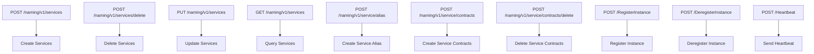

**Diagram sources**
- [service_access.go](file://plugin/apiserver/httpserver/discover/service_access.go)
- [client_access.go](file://plugin/apiserver/httpserver/discover/client_access.go)

**Section sources**
- [service_access.go](file://plugin/apiserver/httpserver/discover/service_access.go#L33-L45)
- [client_access.go](file://plugin/apiserver/httpserver/discover/client_access.go#L37-L75)
- [service_contract_access.go](file://plugin/apiserver/httpserver/discover/service_contract_access.go#L37-L77)

### /config Endpoints
The /config endpoints handle configuration file operations for distributed configuration management.

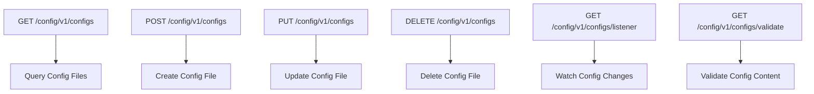

**Diagram sources**
- [config_file.go](file://plugin/apiserver/nacosserver/v1/config/config_file.go)
- [config_file.go](file://plugin/apiserver/nacosserver/v2/config/config_file.go)

**Section sources**
- [config_file.go](file://plugin/apiserver/nacosserver/v1/config/config_file.go#L25-L45)
- [config_file.go](file://plugin/apiserver/nacosserver/v2/config/config_file.go#L30-L50)

### /auth Endpoints
The /auth endpoints manage authentication and authorization for API access.

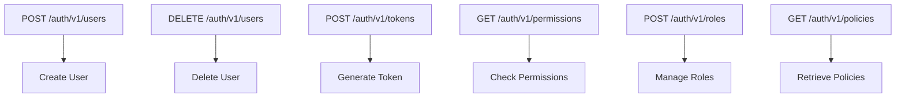

**Diagram sources**
- [user_access.go](file://plugin/apiserver/httpserver/auth/user_access.go)
- [role_access.go](file://plugin/apiserver/httpserver/auth/role_access.go)

**Section sources**
- [user_access.go](file://plugin/apiserver/httpserver/auth/user_access.go#L25-L60)
- [policy_access.go](file://plugin/apiserver/httpserver/auth/policy_access.go#L15-L45)

### /admin Endpoints
The /admin endpoints provide administrative and operational capabilities for system management.

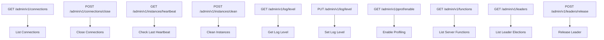

**Diagram sources**
- [admin_access.go](file://plugin/apiserver/httpserver/admin_access.go)

**Section sources**
- [admin_access.go](file://plugin/apiserver/httpserver/admin_access.go#L59-L77)

## gRPC API
The gRPC API provides high-performance service discovery and configuration management interfaces using Protocol Buffers.

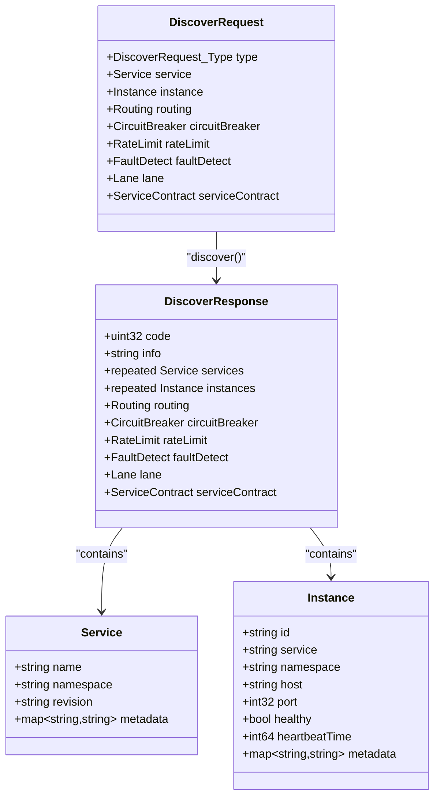

**Diagram sources**
- [server.go](file://plugin/apiserver/grpcserver/discover/server.go)
- [api.go](file://pkg/service/api.go)

**Section sources**
- [server.go](file://plugin/apiserver/grpcserver/discover/server.go#L35-L81)
- [api.go](file://pkg/service/api.go#L116-L140)

## Eureka-Compatible API
The Eureka-compatible API provides Netflix Eureka protocol support for service registration and discovery.

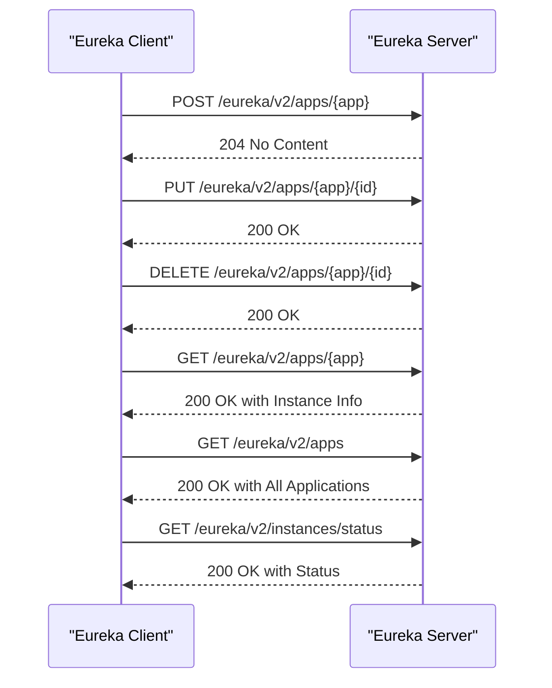

**Diagram sources**
- [applications.go](file://plugin/apiserver/eurekaserver/applications.go)
- [write.go](file://plugin/apiserver/eurekaserver/write.go)

**Section sources**
- [applications.go](file://plugin/apiserver/eurekaserver/applications.go#L25-L60)
- [write.go](file://plugin/apiserver/eurekaserver/write.go#L30-L75)

## Nacos API

### Nacos v1 API
The Nacos v1 API implements RESTful interfaces compatible with Nacos 1.x configuration and naming services.

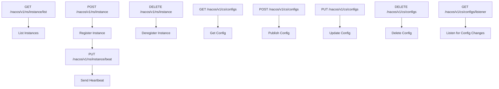

**Diagram sources**
- [server.go](file://plugin/apiserver/nacosserver/v1/server.go)
- [instance.go](file://plugin/apiserver/nacosserver/v1/discover/instance.go)

**Section sources**
- [server.go](file://plugin/apiserver/nacosserver/v1/server.go#L45-L75)
- [instance.go](file://plugin/apiserver/nacosserver/v1/discover/instance.go#L30-L60)

### Nacos v2 API
The Nacos v2 API implements gRPC streaming interfaces compatible with Nacos 2.x services.

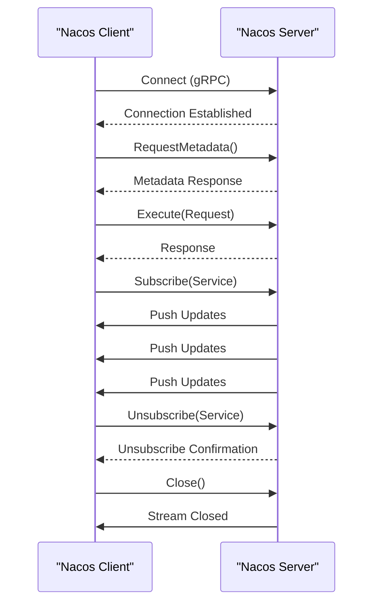

**Diagram sources**
- [server.go](file://plugin/apiserver/nacosserver/v2/server.go)
- [client_conn.go](file://plugin/apiserver/nacosserver/v2/remote/client_conn.go)

**Section sources**
- [server.go](file://plugin/apiserver/nacosserver/v2/server.go#L50-L85)
- [client_conn.go](file://plugin/apiserver/nacosserver/v2/remote/client_conn.go#L20-L55)

## XDS v3 API
The XDS v3 API implements Envoy's xDS APIs for service discovery and configuration.

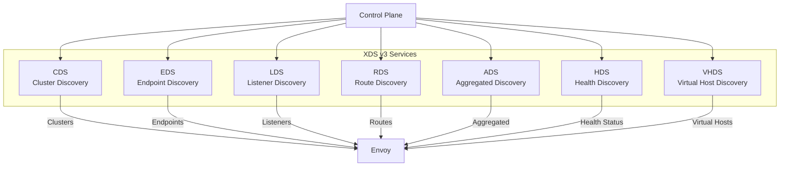

**Diagram sources**
- [server.go](file://plugin/apiserver/xdsserverv3/server.go)
- [cds.go](file://plugin/apiserver/xdsserverv3/cds.go)

**Section sources**
- [server.go](file://plugin/apiserver/xdsserverv3/server.go#L25-L60)
- [cds.go](file://plugin/apiserver/xdsserverv3/cds.go#L15-L45)

## Authentication Methods
pole-server supports multiple authentication methods for API access control.

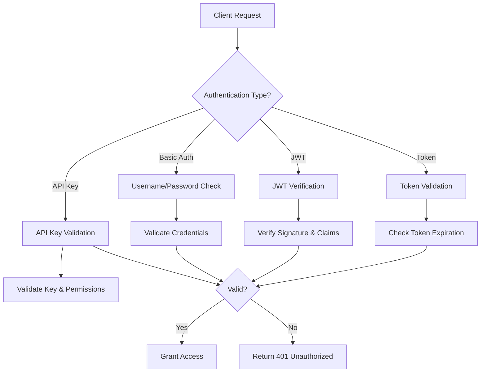

**Diagram sources**
- [auth.go](file://apis/access_control/auth/auth.go)
- [user_access.go](file://plugin/apiserver/httpserver/auth/user_access.go)

**Section sources**
- [auth.go](file://apis/access_control/auth/auth.go#L15-L50)
- [const.go](file://apis/pkg/types/auth/const.go#L280-L340)

## Rate Limiting
The rate limiting system controls API request frequency to prevent abuse and ensure system stability.

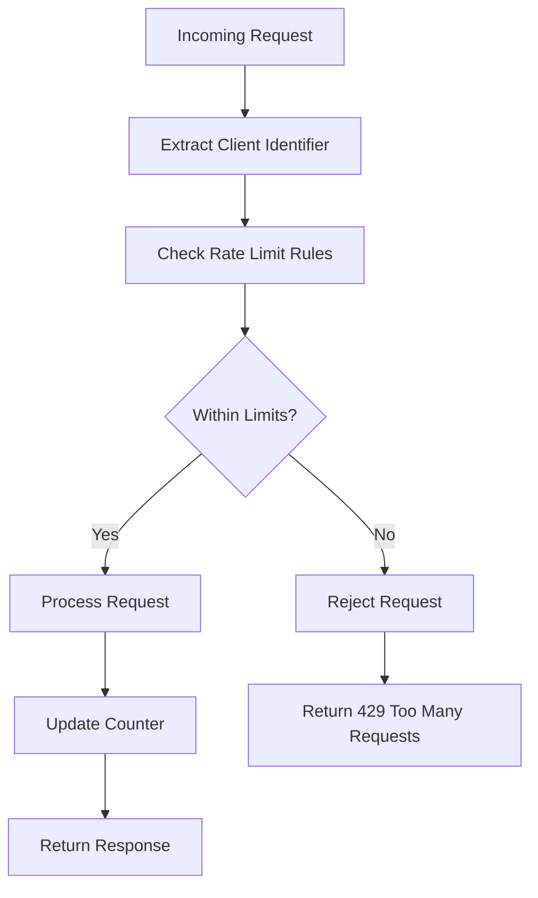

**Diagram sources**
- [ratelimit.go](file://plugin/access_control/ratelimit/token/limiter.go)
- [api_limit.go](file://plugin/access_control/ratelimit/token/api_limit.go)

**Section sources**
- [limiter.go](file://plugin/access_control/ratelimit/token/limiter.go#L25-L60)
- [api_limit.go](file://plugin/access_control/ratelimit/token/api_limit.go#L30-L75)

## Error Codes
Standardized error codes are used across all API types for consistent error handling.

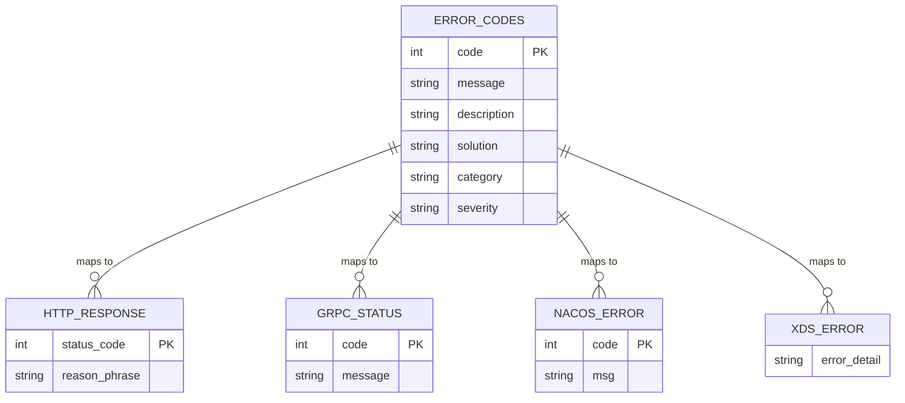

**Diagram sources**
- [codeinfo.go](file://pkg/common/api/v1/codeinfo.go)
- [error.go](file://plugin/apiserver/nacosserver/model/error.go)

**Section sources**
- [codeinfo.go](file://pkg/common/api/v1/codeinfo.go#L10-L100)
- [error.go](file://plugin/apiserver/nacosserver/model/error.go#L15-L50)

## Versioning Information
API versioning is implemented to ensure backward compatibility and smooth upgrades.

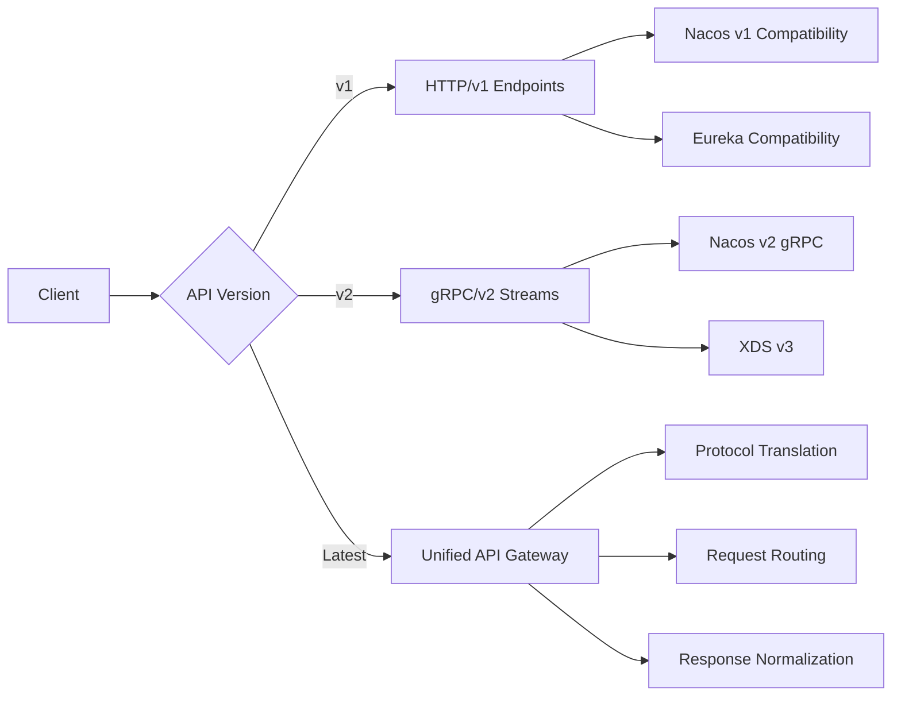

**Diagram sources**
- [server.go](file://plugin/apiserver/httpserver/server.go)
- [default.go](file://plugin/apiserver/httpserver/default.go)

**Section sources**
- [server.go](file://plugin/apiserver/httpserver/server.go#L40-L80)
- [default.go](file://plugin/apiserver/httpserver/default.go#L25-L60)

## Client Implementation Examples

### Go Client Example
```go
// Create gRPC client connection
client, err := grpc.NewClient("localhost:8080")
if err != nil {
    log.Fatal(err)
}
defer client.Close()

// Register service instance
instance := &apiservice.Instance{
    Id:        &wrapperspb.StringValue{Value: "instance-001"},
    Service:   &wrapperspb.StringValue{Value: "my-service"},
    Namespace: &wrapperspb.StringValue{Value: "default"},
    Host:      &wrapperspb.StringValue{Value: "192.168.1.100"},
    Port:      &wrapperspb.UInt32Value{Value: 8080},
}

resp := client.RegisterInstance(instance)
if resp.GetCode().GetValue() != uint32(apimodel.Code_ExecuteSuccess) {
    log.Printf("register failed: %s", resp.GetInfo().GetValue())
}
```

### curl Command Examples
```bash
# Register service instance
curl -X POST http://localhost:8080/naming/v1/services \
  -H "Content-Type: application/json" \
  -d '{
    "name": "my-service",
    "namespace": "default",
    "metadata": {
      "version": "1.0.0"
    }
  }'

# Register service instance
curl -X POST http://localhost:8080/RegisterInstance \
  -H "Content-Type: application/json" \
  -d '{
    "id": "instance-001",
    "service": "my-service",
    "namespace": "default",
    "host": "192.168.1.100",
    "port": 8080
  }'

# Discover service instances
curl -X POST http://localhost:8080/Discover \
  -H "Content-Type: application/json" \
  -d '{
    "type": "INSTANCE",
    "service": {
      "name": "my-service",
      "namespace": "default"
    }
  }'

# Get all services
curl -X GET "http://localhost:8080/naming/v1/services?namespace=default"
```

**Section sources**
- [client_v1.go](file://pkg/service/client_v1.go#L25-L100)
- [client_grpc_test.go](file://test/integrate/client_grpc_test.go#L149-L188)

## Compatibility and Migration

### Protocol Compatibility Matrix
| Protocol | Version | Supported | Notes |
|---------|--------|-----------|-------|
| Nacos | v1 REST | Yes | Full compatibility |
| Nacos | v2 gRPC | Yes | Streaming support |
| Eureka | 1.x | Yes | Basic operations |
| XDS | v3 | Yes | CDS, EDS, LDS, RDS, ADS |
| Kubernetes | Service API | Limited | Discovery only |

### Migration Considerations
When migrating from other service discovery systems to pole-server, consider the following:

1. **Data Migration**: Export existing service and configuration data from the source system and import into pole-server using bulk APIs.

2. **Client Updates**: Update client SDKs to use pole-server compatible libraries or implement protocol translation layers.

3. **DNS Integration**: Configure DNS forwarding rules to redirect queries to pole-server's DNS interface.

4. **Health Check Adaptation**: Map existing health check configurations to pole-server's health check models.

5. **Security Model**: Align authentication and authorization policies between systems.

6. **Monitoring Integration**: Update monitoring dashboards to collect metrics from pole-server's observability endpoints.

7. **Traffic Routing**: Gradually shift traffic from old system to pole-server using canary deployment strategies.

**Section sources**
- [const.go](file://apis/pkg/types/auth/const.go#L280-L340)
- [server.go](file://plugin/apiserver/httpserver/server.go#L35-L81)
- [naming_response.go](file://pkg/common/api/v1/naming_response.go#L10-L50)