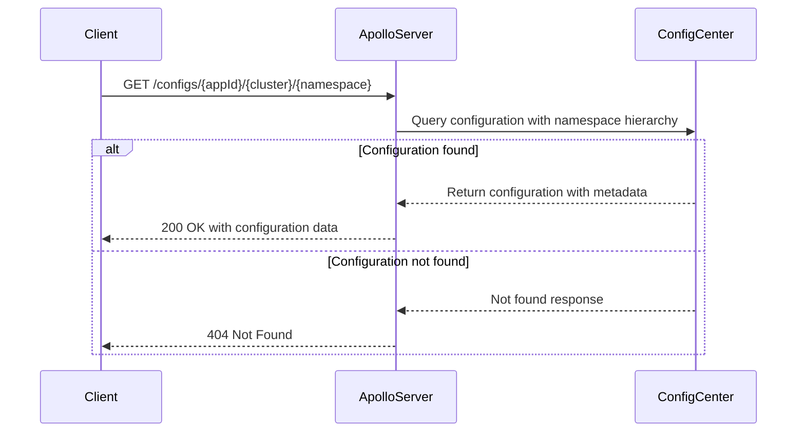
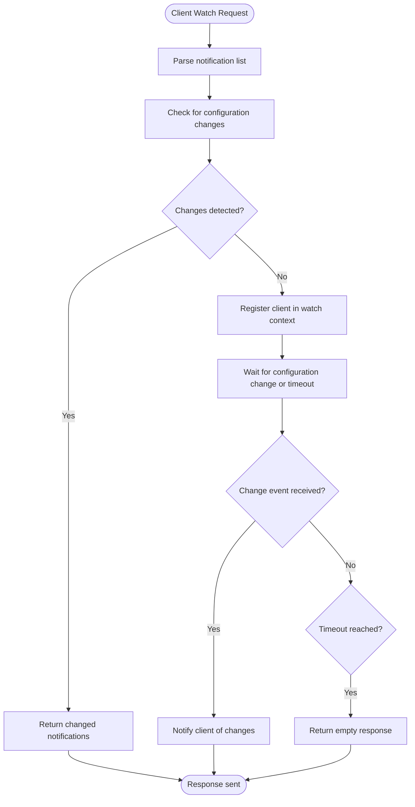
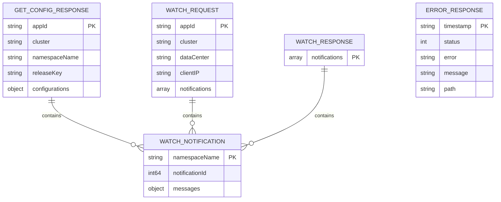
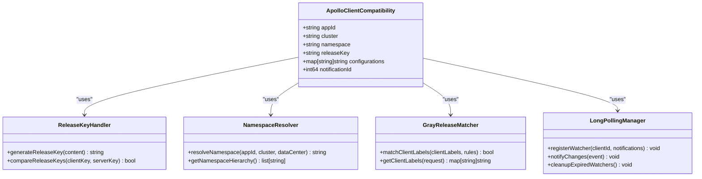
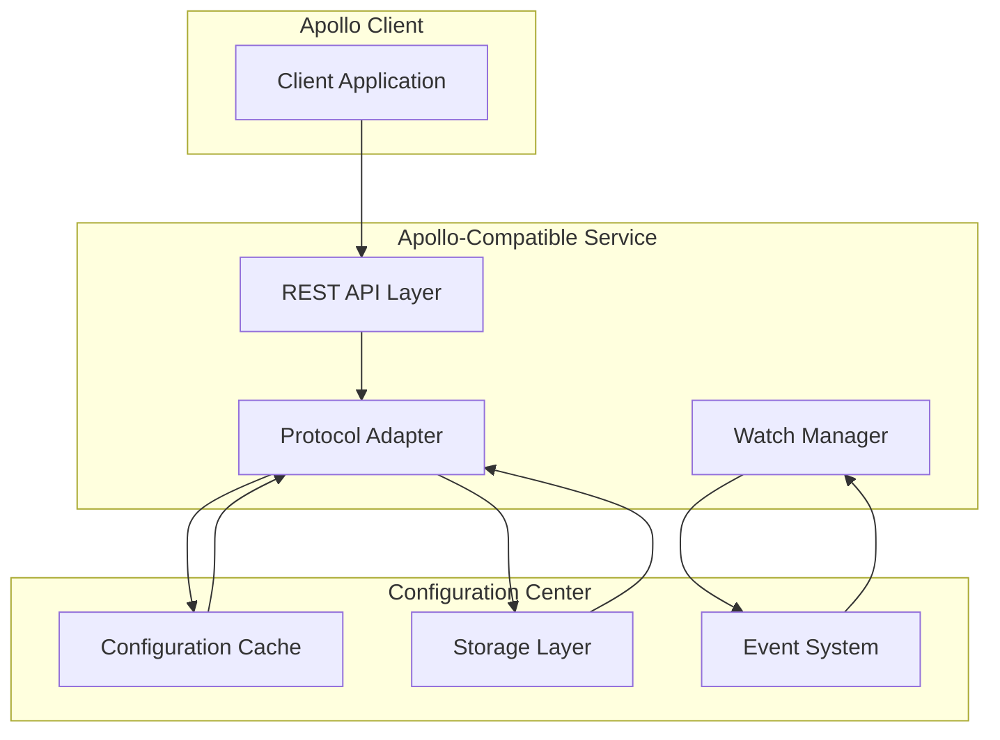

# Apollo API Reference

<cite>
**Referenced Files in This Document**   
- [plugin/apiserver/apolloserver/access.go](file://plugin/apiserver/apolloserver/access.go)
- [plugin/apiserver/apolloserver/handle.go](file://plugin/apiserver/apolloserver/handle.go)
- [plugin/apiserver/apolloserver/types.go](file://plugin/apiserver/apolloserver/types.go)
- [plugin/apiserver/apolloserver/watch.go](file://plugin/apiserver/apolloserver/watch.go)
- [plugin/apiserver/apolloserver/server.go](file://plugin/apiserver/apolloserver/server.go)
- [pkg/config/server.go](file://pkg/config/server.go)
</cite>

## Table of Contents
1. [Introduction](#introduction)
2. [Configuration Retrieval](#configuration-retrieval)
3. [Long-Polling Watch Mechanism](#long-polling-watch-mechanism)
4. [Namespace Management](#namespace-management)
5. [Request/Response Formats](#requestresponse-formats)
6. [Apollo Client Compatibility](#apollo-client-compatibility)
7. [Integration with Configuration Center](#integration-with-configuration-center)
8. [Troubleshooting Guide](#troubleshooting-guide)
9. [Performance Considerations](#performance-considerations)

## Introduction
The Apollo-compatible configuration service in pole-server provides a RESTful API interface for dynamic configuration management, enabling applications to retrieve and monitor configuration changes in real-time. This service maintains compatibility with the Apollo client SDK while extending functionality through integration with pole-server's configuration center. The API supports configuration retrieval, long-polling watch mechanisms, and namespace-based configuration organization. The service is implemented as a plugin within the pole-server architecture, exposing endpoints that follow Apollo's URL conventions and response formats.

**Section sources**
- [plugin/apiserver/apolloserver/server.go](file://plugin/apiserver/apolloserver/server.go#L1-L50)
- [plugin/apiserver/apolloserver/access.go](file://plugin/apiserver/apolloserver/access.go#L1-L20)

## Configuration Retrieval
The configuration retrieval endpoints allow clients to fetch configuration data based on application ID, cluster, namespace, and optional data center parameters. The service implements a hierarchical namespace resolution strategy, searching for configurations in the order of custom cluster, data center, and default cluster. When retrieving configuration, clients can specify a release key (version) to enable conditional retrieval, where unchanged configurations return HTTP 304 Not Modified. The service supports multiple configuration formats including properties, JSON, and XML, with automatic content type negotiation. Configuration files without extensions are treated as properties files by default, with fallback to properties format when the requested file extension is not specified.

**Diagram sources**
- [plugin/apiserver/apolloserver/access.go](file://plugin/apiserver/apolloserver/access.go#L50-L100)
- [plugin/apiserver/apolloserver/handle.go](file://plugin/apiserver/apolloserver/handle.go#L10-L50)

**Section sources**
- [plugin/apiserver/apolloserver/access.go](file://plugin/apiserver/apolloserver/access.go#L50-L215)
- [plugin/apiserver/apolloserver/handle.go](file://plugin/apiserver/apolloserver/handle.go#L10-L100)

## Long-Polling Watch Mechanism
The long-polling watch mechanism enables clients to receive real-time notifications when configuration changes occur. Clients initiate a watch request by providing a list of namespaces and their corresponding notification IDs (version numbers). The server maintains a watch context for each client, which includes the client's subscription list and labels for gray release matching. When a configuration change is detected, the server compares the client's current version with the active release version and notifies the client if a change is detected. The watch context has a configurable timeout, after which the server returns an empty response if no changes have occurred. The implementation uses a channel-based notification system, where configuration change events trigger the sending of responses to waiting clients.

**Diagram sources**
- [plugin/apiserver/apolloserver/watch.go](file://plugin/apiserver/apolloserver/watch.go#L1-L203)
- [plugin/apiserver/apolloserver/handle.go](file://plugin/apiserver/apolloserver/handle.go#L100-L150)

**Section sources**
- [plugin/apiserver/apolloserver/watch.go](file://plugin/apiserver/apolloserver/watch.go#L1-L203)
- [plugin/apiserver/apolloserver/handle.go](file://plugin/apiserver/apolloserver/handle.go#L100-L150)

## Namespace Management
Namespace management in the Apollo-compatible service follows a hierarchical structure based on application ID, cluster, and data center. Each namespace corresponds to a configuration file that can be accessed by clients. The service supports three levels of namespace resolution: custom cluster, data center, and default cluster, searched in that order. When a client requests a configuration without specifying a cluster, the service defaults to the "default" cluster. The namespace system integrates with pole-server's configuration center, allowing namespaces to be managed through the central configuration interface. Each namespace can have multiple versions represented by release keys, which are MD5 hashes of the configuration content, enabling efficient change detection.

**Section sources**
- [plugin/apiserver/apolloserver/handle.go](file://plugin/apiserver/apolloserver/handle.go#L10-L50)
- [plugin/apiserver/apolloserver/types.go](file://plugin/apiserver/apolloserver/types.go#L50-L60)

## Request/Response Formats
The API uses JSON for request and response payloads, with specific structures for different operations. Configuration retrieval responses include the application ID, cluster, namespace name, release key, and configurations as a key-value map. Watch requests require a list of namespace names and notification IDs, while watch responses return only the namespaces that have changed. Error responses follow a standardized format with timestamp, status code, error message, and request path. The service supports both full configuration retrieval and format-specific endpoints that return raw content with appropriate content types. For properties files, the service can return either JSON objects or plain text in Java properties format.

**Diagram sources**
- [plugin/apiserver/apolloserver/types.go](file://plugin/apiserver/apolloserver/types.go#L30-L107)
- [plugin/apiserver/apolloserver/handle.go](file://plugin/apiserver/apolloserver/handle.go#L10-L50)

**Section sources**
- [plugin/apiserver/apolloserver/types.go](file://plugin/apiserver/apolloserver/types.go#L30-L107)

## Apollo Client Compatibility
The service maintains compatibility with Apollo clients through several mechanisms. It implements the same URL patterns and HTTP methods used by the Apollo configuration service, allowing existing Apollo SDKs to connect without modification. The release key system uses MD5 hashes of configuration content, matching Apollo's versioning approach. The long-polling mechanism follows Apollo's notification model, where clients send their current version numbers and receive updates only when changes occur. The service also supports Apollo's hierarchical namespace resolution, searching configurations in the order of custom cluster, data center, and default cluster. For gray release scenarios, the service uses client labels (such as IP address) to determine which clients should receive updated configurations, mirroring Apollo's canary release capabilities.

**Diagram sources**
- [plugin/apiserver/apolloserver/handle.go](file://plugin/apiserver/apolloserver/handle.go#L1-L229)
- [plugin/apiserver/apolloserver/watch.go](file://plugin/apiserver/apolloserver/watch.go#L1-L203)

**Section sources**
- [plugin/apiserver/apolloserver/handle.go](file://plugin/apiserver/apolloserver/handle.go#L1-L229)
- [plugin/apiserver/apolloserver/watch.go](file://plugin/apiserver/apolloserver/watch.go#L1-L203)

## Integration with Configuration Center
The Apollo-compatible service integrates with pole-server's configuration center through a layered architecture. The service acts as an adapter, translating Apollo API requests into calls to the underlying configuration center's native API. The integration leverages the configuration center's caching system for improved performance, with configuration data stored in memory for fast retrieval. The watch mechanism is built on top of the configuration center's event system, where configuration changes trigger notifications that are propagated to waiting clients. The service also inherits security features from the configuration center, including authentication and rate limiting. Configuration storage and retrieval operations are delegated to the configuration center's persistence layer, ensuring data consistency across different API interfaces.

**Diagram sources**
- [plugin/apiserver/apolloserver/server.go](file://plugin/apiserver/apolloserver/server.go#L1-L351)
- [pkg/config/server.go](file://pkg/config/server.go#L1-L327)

**Section sources**
- [plugin/apiserver/apolloserver/server.go](file://plugin/apiserver/apolloserver/server.go#L1-L351)
- [pkg/config/server.go](file://pkg/config/server.go#L1-L327)

## Troubleshooting Guide
Common issues with the Apollo-compatible configuration service typically involve configuration retrieval failures, watch mechanism timeouts, or compatibility problems with clients. For configuration retrieval issues, verify that the application ID, cluster, and namespace exist in the configuration center and that the client has appropriate permissions. If watch requests are not receiving updates, check that the notification IDs are correctly formatted and that the configuration change events are being properly propagated through the system. Network timeouts can occur if the watch timeout is too short for the network conditions; adjust the timeout settings accordingly. For clients not receiving expected configurations, verify that release keys are being properly compared and that gray release rules are correctly configured. Monitoring logs for the apolloserver component can provide additional insights into request processing and error conditions.

**Section sources**
- [plugin/apiserver/apolloserver/access.go](file://plugin/apiserver/apolloserver/access.go#L1-L215)
- [plugin/apiserver/apolloserver/handle.go](file://plugin/apiserver/apolloserver/handle.go#L1-L229)

## Performance Considerations
The long-polling watch mechanism can create significant server load when many clients are simultaneously connected, especially in high-frequency polling scenarios. To mitigate this, the service implements connection limiting and rate limiting at both the IP and API levels. The watch context timeout should be configured appropriately based on expected change frequency and network conditions, with longer timeouts reducing server load but increasing notification latency. Configuration data is cached in memory to minimize database queries, but cache invalidation must be carefully managed to ensure clients receive timely updates. For high-traffic deployments, consider implementing additional caching layers or scaling the service horizontally. The service also supports conditional requests using release keys, which can significantly reduce bandwidth usage when configurations are stable.

**Section sources**
- [plugin/apiserver/apolloserver/server.go](file://plugin/apiserver/apolloserver/server.go#L1-L351)
- [plugin/apiserver/apolloserver/watch.go](file://plugin/apiserver/apolloserver/watch.go#L1-L203)