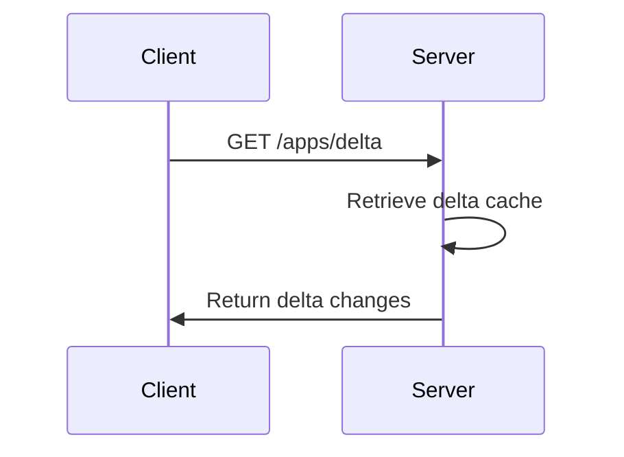
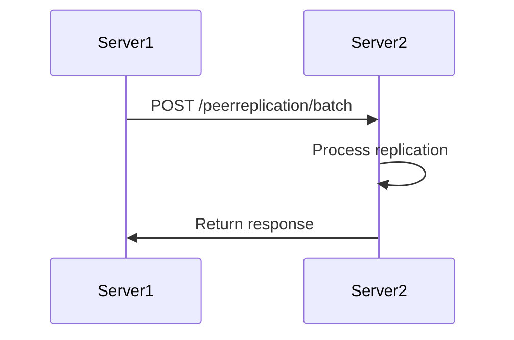

# Eureka API Reference

<cite>
**Referenced Files in This Document**   
- [plugin/apiserver/eurekaserver/access.go](file://plugin/apiserver/eurekaserver/access.go)
- [plugin/apiserver/eurekaserver/model.go](file://plugin/apiserver/eurekaserver/model.go)
- [plugin/apiserver/eurekaserver/replicate.go](file://plugin/apiserver/eurekaserver/replicate.go)
- [plugin/apiserver/eurekaserver/delta_worker.go](file://plugin/apiserver/eurekaserver/delta_worker.go)
- [plugin/apiserver/eurekaserver/vip.go](file://plugin/apiserver/eurekaserver/vip.go)
- [plugin/apiserver/eurekaserver/xml.go](file://plugin/apiserver/eurekaserver/xml.go)
- [plugin/apiserver/eurekaserver/applications.go](file://plugin/apiserver/eurekaserver/applications.go)
- [plugin/apiserver/eurekaserver/tool.go](file://plugin/apiserver/eurekaserver/tool.go)
</cite>

## Table of Contents
1. [Introduction](#introduction)
2. [RESTful Endpoints](#restful-endpoints)
3. [Request/Response Formats](#requestresponse-formats)
4. [Eureka Client Compatibility](#eureka-client-compatibility)
5. [Service Registration and Status Updates](#service-registration-and-status-updates)
6. [Deviations from Standard Eureka Behavior](#deviations-from-standard-eureka-behavior)
7. [Troubleshooting Guide](#troubleshooting-guide)
8. [Migration Considerations](#migration-considerations)

## Introduction
The pole-server provides Eureka-compatible REST endpoints to support service registration, instance operations, heartbeat, and query interfaces as defined by Eureka v1/v2 specifications. This document details the implementation of these endpoints, their request/response formats, and how Eureka client compatibility is maintained. The system supports delta propagation, VIP/SecureVIP handling, and replication mechanisms to ensure seamless integration with Eureka clients.

**Section sources**
- [plugin/apiserver/eurekaserver/access.go](file://plugin/apiserver/eurekaserver/access.go#L41-L92)

## RESTful Endpoints
The Eureka-compatible REST endpoints are exposed under three base paths: `/eureka`, `/eureka/v1`, and `/eureka/v2`. Each path supports the same set of operations for backward compatibility with different Eureka client versions.

### Application Registration
Registers a new application instance with the service registry.

- **URL Pattern**: `/apps/{appId}`
- **HTTP Method**: POST
- **Description**: Registers a new instance for the specified application ID.

### Instance Deregistration
Removes an application instance from the service registry.

- **URL Pattern**: `/apps/{appId}/{instId}`
- **HTTP Method**: DELETE
- **Description**: De-registers the specified instance from the application.

### Heartbeat
Sends a heartbeat to renew the lease for an application instance.

- **URL Pattern**: `/apps/{appId}/{instId}`
- **HTTP Method**: PUT
- **Description**: Renews the lease for the specified instance, indicating it is still active.

### Query All Instances
Retrieves all registered instances.

- **URL Pattern**: `/apps`
- **HTTP Method**: GET
- **Description**: Returns a list of all registered applications and their instances.

### Query Delta
Retrieves incremental changes to registered instances.

- **URL Pattern**: `/apps/delta`
- **HTTP Method**: GET
- **Description**: Returns only the changes (delta) since the last query, improving efficiency for clients.

### Query by Application ID
Retrieves instances for a specific application.

- **URL Pattern**: `/apps/{appId}`
- **HTTP Method**: GET
- **Description**: Returns all instances registered under the specified application ID.

### Query by Instance ID
Retrieves a specific instance by its ID.

- **URL Pattern**: `/instances/{instId}`
- **HTTP Method**: GET
- **Description**: Returns the details of the specified instance.

### Update Status
Updates the status of an application instance.

- **URL Pattern**: `/apps/{appId}/{instId}/status`
- **HTTP Method**: PUT
- **Description**: Updates the status of the specified instance.

### Delete Status Override
Removes a status override for an application instance.

- **URL Pattern**: `/apps/{appId}/{instId}/status`
- **HTTP Method**: DELETE
- **Description**: Removes any overridden status, returning the instance to its normal status.

### Query by VIP Address
Retrieves instances associated with a specific VIP address.

- **URL Pattern**: `/vips/{vipAddress}`
- **HTTP Method**: GET
- **Description**: Returns all instances registered under the specified VIP address.

### Query by Secure VIP Address
Retrieves instances associated with a specific secure VIP address.

- **URL Pattern**: `/svips/{svipAddress}`
- **HTTP Method**: GET
- **Description**: Returns all instances registered under the specified secure VIP address.

### Batch Replication
Handles batch replication requests between Eureka servers.

- **URL Pattern**: `/peerreplication/batch`
- **HTTP Method**: POST
- **Description**: Processes batch replication of instance changes between Eureka server instances.

**Section sources**
- [plugin/apiserver/eurekaserver/access.go](file://plugin/apiserver/eurekaserver/access.go#L71-L92)

## Request/Response Formats
The Eureka-compatible endpoints support both JSON and XML formats for requests and responses. The format is determined by the `Content-Type` and `Accept` headers in the HTTP request.

### JSON Format
The JSON format is used when the `Content-Type` or `Accept` header is set to `application/json`. The structure of the JSON requests and responses follows the Eureka v1/v2 specifications.

### XML Format
The XML format is used when the `Content-Type` or `Accept` header is set to `application/xml`. The structure of the XML requests and responses follows the Eureka v1/v2 specifications.

### Instance Registration Request
The instance registration request includes details about the instance being registered.

```json
{
  "instance": {
    "instanceId": "string",
    "app": "string",
    "appGroupName": "string",
    "ipAddr": "string",
    "sid": "string",
    "port": {
      "$": 0,
      "@enabled": "string"
    },
    "securePort": {
      "$": 0,
      "@enabled": "string"
    },
    "homePageUrl": "string",
    "statusPageUrl": "string",
    "healthCheckUrl": "string",
    "secureHealthCheckUrl": "string",
    "vipAddress": "string",
    "secureVipAddress": "string",
    "countryId": 0,
    "dataCenterInfo": {
      "@class": "string",
      "name": "string"
    },
    "hostName": "string",
    "status": "string",
    "overriddenStatus": "string",
    "leaseInfo": {
      "renewalIntervalInSecs": 0,
      "durationInSecs": 0,
      "registrationTimestamp": 0,
      "lastRenewalTimestamp": 0,
      "evictionTimestamp": 0,
      "serviceUpTimestamp": 0
    },
    "isCoordinatingDiscoveryServer": false,
    "metadata": {
      "meta": {}
    },
    "lastUpdatedTimestamp": 0,
    "lastDirtyTimestamp": 0,
    "actionType": "string"
  }
}
```

### Applications Response
The applications response includes a list of registered applications and their instances.

```json
{
  "applications": {
    "versions__delta": "string",
    "apps__hashcode": "string",
    "application": [
      {
        "name": "string",
        "instance": [
          {
            "instanceId": "string",
            "app": "string",
            "appGroupName": "string",
            "ipAddr": "string",
            "sid": "string",
            "port": {
              "$": 0,
              "@enabled": "string"
            },
            "securePort": {
              "$": 0,
              "@enabled": "string"
            },
            "homePageUrl": "string",
            "statusPageUrl": "string",
            "healthCheckUrl": "string",
            "secureHealthCheckUrl": "string",
            "vipAddress": "string",
            "secureVipAddress": "string",
            "countryId": 0,
            "dataCenterInfo": {
              "@class": "string",
              "name": "string"
            },
            "hostName": "string",
            "status": "string",
            "overriddenStatus": "string",
            "leaseInfo": {
              "renewalIntervalInSecs": 0,
              "durationInSecs": 0,
              "registrationTimestamp": 0,
              "lastRenewalTimestamp": 0,
              "evictionTimestamp": 0,
              "serviceUpTimestamp": 0
            },
            "isCoordinatingDiscoveryServer": false,
            "metadata": {
              "meta": {}
            },
            "lastUpdatedTimestamp": 0,
            "lastDirtyTimestamp": 0,
            "actionType": "string"
          }
        ]
      }
    ]
  }
}
```

**Section sources**
- [plugin/apiserver/eurekaserver/model.go](file://plugin/apiserver/eurekaserver/model.go#L150-L424)

## Eureka Client Compatibility
The pole-server maintains compatibility with Eureka clients by implementing key Eureka features such as delta propagation, VIP/SecureVIP handling, and replication mechanisms.

### Delta Propagation
Delta propagation is used to efficiently transmit changes to clients. The server maintains a cache of recent changes and responds to `/apps/delta` requests with only the changes since the last query. This reduces network traffic and improves client performance.



**Diagram sources **
- [plugin/apiserver/eurekaserver/delta_worker.go](file://plugin/apiserver/eurekaserver/delta_worker.go#L400-L445)
- [plugin/apiserver/eurekaserver/access.go](file://plugin/apiserver/eurekaserver/access.go#L180-L190)

### VIP/SecureVIP Handling
The server supports querying instances by VIP and SecureVIP addresses. This allows clients to discover services based on logical addresses rather than physical ones.

```mermaid
flowchart TD
A[Client] --> B{Query by VIP/SecureVIP}
B --> C[/vips/{vipAddress}/]
B --> D[/svips/{svipAddress}/]
C --> E[Server]
D --> E[Server]
E --> F[Return instances]
F --> A[Client]
```

**Diagram sources **
- [plugin/apiserver/eurekaserver/vip.go](file://plugin/apiserver/eurekaserver/vip.go#L50-L87)
- [plugin/apiserver/eurekaserver/access.go](file://plugin/apiserver/eurekaserver/access.go#L130-L140)

### Replication Mechanisms
The server supports replication between Eureka server instances to ensure high availability and consistency. Batch replication requests are processed to synchronize instance changes across the cluster.



**Diagram sources **
- [plugin/apiserver/eurekaserver/replicate.go](file://plugin/apiserver/eurekaserver/replicate.go#L50-L286)
- [plugin/apiserver/eurekaserver/access.go](file://plugin/apiserver/eurekaserver/access.go#L140-L150)

## Service Registration and Status Updates
The pole-server supports service registration and status updates through the Eureka-compatible endpoints. These operations are critical for maintaining an accurate view of the service registry.

### Service Registration
When a service registers with the server, the instance details are validated and stored in the registry. The server responds with a `204 No Content` status if the registration is successful.

### Status Updates
Clients can update the status of their instances using the `/apps/{appId}/{instId}/status` endpoint. This allows services to indicate when they are temporarily unavailable or undergoing maintenance.

**Section sources**
- [plugin/apiserver/eurekaserver/access.go](file://plugin/apiserver/eurekaserver/access.go#L190-L250)

## Deviations from Standard Eureka Behavior
While the pole-server aims to be compatible with Eureka, there are some deviations from standard Eureka behavior to support additional features and improve performance.

### Namespace Support
The server supports namespaces to isolate services. The namespace is specified in the `x-namespace` header of the request. This allows multiple tenants to use the same service names without conflict.

### Custom Metadata
The server supports custom metadata in instance registrations. This metadata is stored and returned to clients, allowing for additional service discovery capabilities.

### Health Check Integration
The server integrates with a health check system to automatically update the status of instances based on health check results. This reduces the need for clients to manually update their status.

**Section sources**
- [plugin/apiserver/eurekaserver/tool.go](file://plugin/apiserver/eurekaserver/tool.go#L80-L94)
- [plugin/apiserver/eurekaserver/applications.go](file://plugin/apiserver/eurekaserver/applications.go#L100-L200)

## Troubleshooting Guide
This section provides guidance for troubleshooting common issues when integrating Eureka clients with the pole-server.

### Connection Issues
If clients are unable to connect to the server, verify the following:
- The server is running and accessible on the specified port.
- The client is using the correct base URL for the Eureka endpoints.
- Network firewalls are not blocking the connection.

### Registration Failures
If service registration fails, check the following:
- The instance registration request is properly formatted.
- Required fields such as `instanceId`, `app`, and `ipAddr` are present.
- The `Content-Type` header is set correctly for the request format.

### Heartbeat Failures
If heartbeats are failing, ensure that:
- The instance ID and application ID in the request are correct.
- The server is not overloaded and can process the heartbeat requests.
- The client is sending heartbeats at the correct interval.

### Delta Query Issues
If delta queries are not returning expected results:
- Verify that the server is maintaining the delta cache correctly.
- Check that the client is processing the delta responses properly.
- Ensure that the server is not under heavy load, which could affect delta cache updates.

**Section sources**
- [plugin/apiserver/eurekaserver/access.go](file://plugin/apiserver/eurekaserver/access.go#L250-L350)
- [plugin/apiserver/eurekaserver/delta_worker.go](file://plugin/apiserver/eurekaserver/delta_worker.go#L300-L400)

## Migration Considerations
When migrating from a native Eureka server to the pole-server, consider the following:

### Configuration Changes
Update the client configuration to point to the pole-server endpoints. The base URL should be updated to include the `/eureka` path.

### Namespace Configuration
If using namespaces, ensure that clients are configured to include the `x-namespace` header in their requests. This is required for proper service isolation.

### Health Check Configuration
Review the health check configuration to ensure it is compatible with the pole-server's health check system. Adjust intervals and thresholds as needed.

### Testing
Thoroughly test the migration in a staging environment before moving to production. Verify that all services can register, send heartbeats, and discover other services correctly.

**Section sources**
- [plugin/apiserver/eurekaserver/tool.go](file://plugin/apiserver/eurekaserver/tool.go#L70-L80)
- [plugin/apiserver/eurekaserver/access.go](file://plugin/apiserver/eurekaserver/access.go#L350-L400)