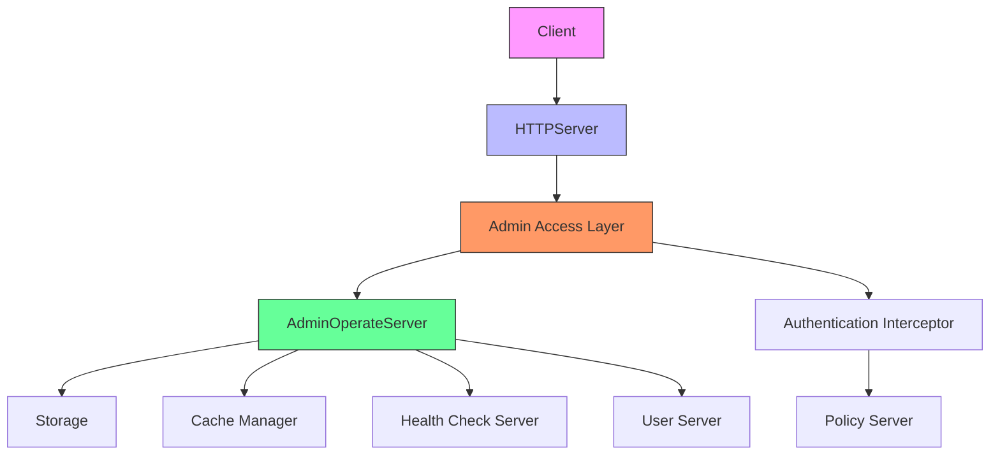
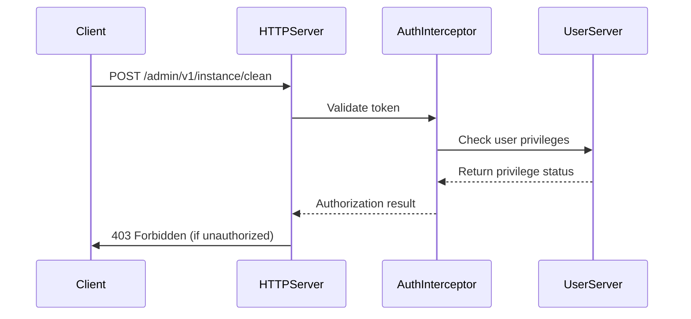
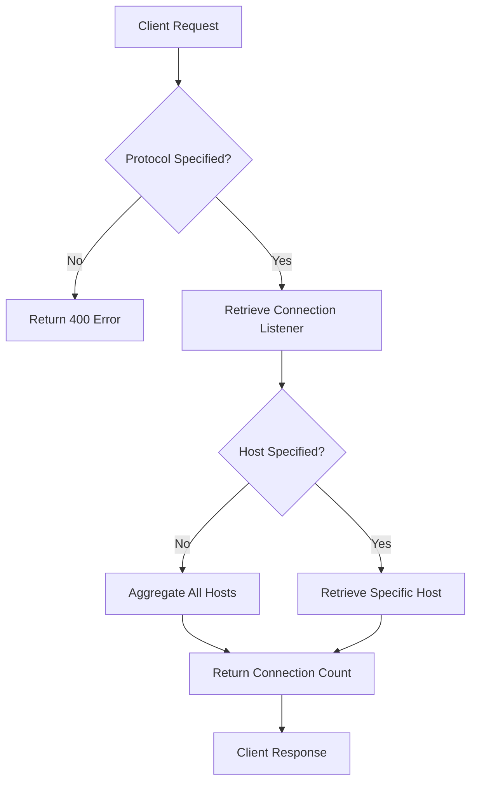
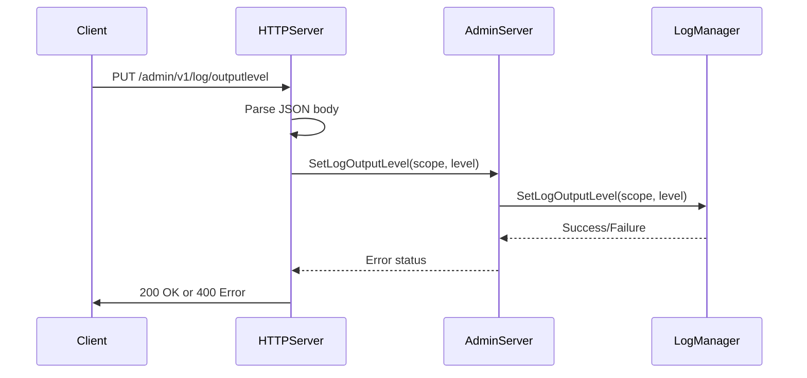
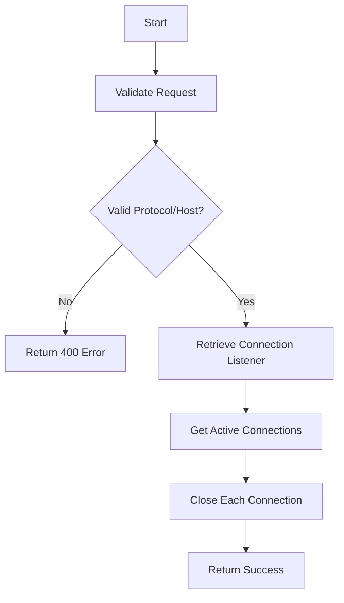
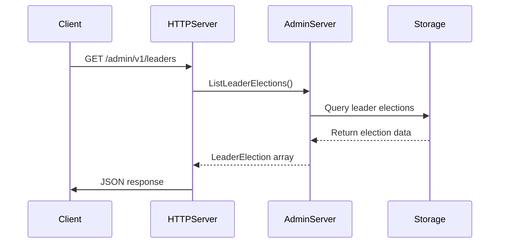
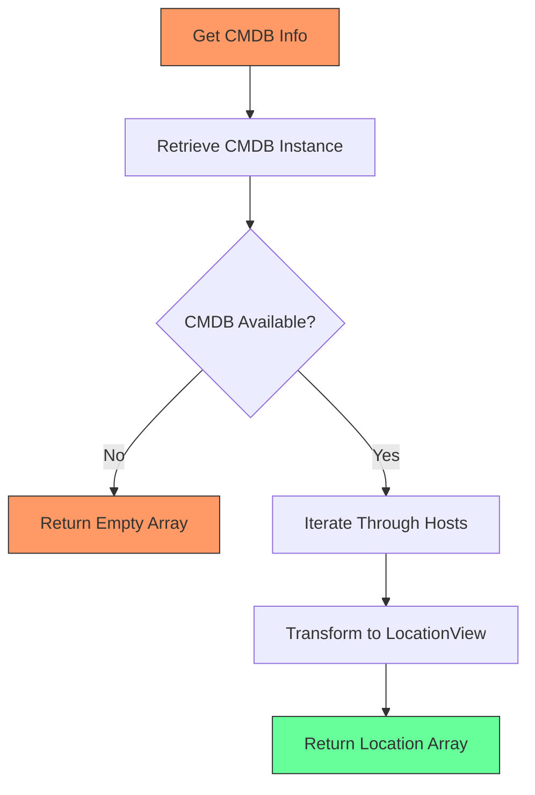
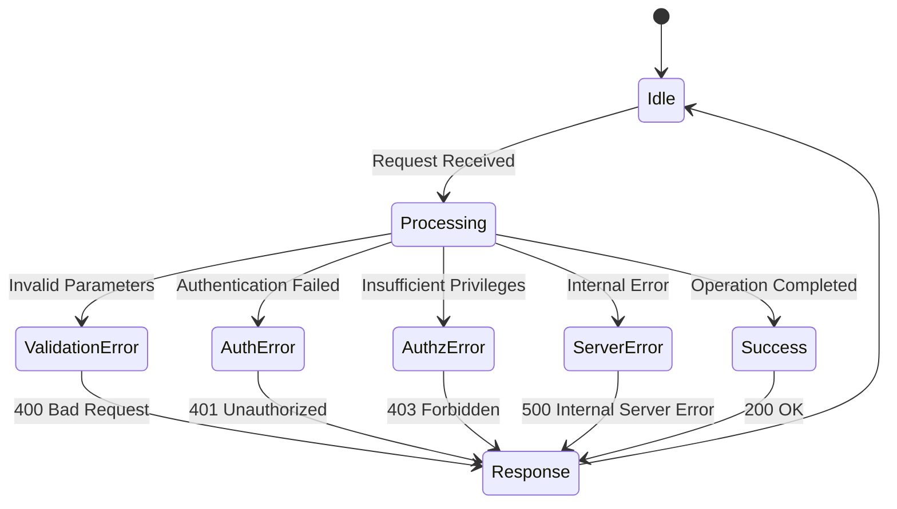

# Administration HTTP API

<cite>
**Referenced Files in This Document**   
- [admin_access.go](file://plugin/apiserver/httpserver/admin_access.go)
- [api.go](file://pkg/admin/api.go)
- [maintain.go](file://pkg/admin/maintain.go)
- [server.go](file://pkg/admin/server.go)
- [admin.go](file://apis/pkg/types/admin/admin.go)
</cite>

## Table of Contents
1. [Introduction](#introduction)
2. [Authentication and Authorization](#authentication-and-authorization)
3. [Health and System Status](#health-and-system-status)
4. [Log Level Management](#log-level-management)
5. [Maintenance and Cleanup Operations](#maintenance-and-cleanup-operations)
6. [Leader Election Management](#leader-election-management)
7. [Server Metadata and Configuration](#server-metadata-and-configuration)
8. [Error Handling](#error-handling)
9. [Operational Best Practices](#operational-best-practices)
10. [Troubleshooting Guide](#troubleshooting-guide)

## Introduction

The Administration HTTP API provides a set of endpoints for managing and monitoring the pole-server instance. These endpoints, accessible under the `/admin` path, enable system administrators to perform critical maintenance tasks, monitor system health, adjust runtime configurations, and retrieve server metadata. All admin endpoints are designed for operational control and require elevated privileges.

The API is implemented through the HTTPServer's admin access layer, which routes requests to the underlying AdminOperateServer implementation. These operations directly impact server behavior and should be used with caution, especially in production environments.



**Diagram sources**
- [admin_access.go](file://plugin/apiserver/httpserver/admin_access.go#L100-L150)
- [server.go](file://pkg/admin/server.go#L15-L30)

**Section sources**
- [admin_access.go](file://plugin/apiserver/httpserver/admin_access.go#L1-L50)
- [api.go](file://pkg/admin/api.go#L1-L10)

## Authentication and Authorization

All administration endpoints require administrative privileges for access. The system implements a role-based access control (RBAC) model where users must possess the appropriate administrative roles to invoke these endpoints. Authentication is performed through token-based credentials provided in the request headers.

The following headers are accepted for authentication:
- `Authorization`: Contains the authentication token
- `X-Polaris-Token`: Alternative header for token transmission

The authorization system validates that the authenticated user has the necessary permissions to perform the requested administrative operation. Users without proper privileges will receive a 403 Forbidden response. The system also supports initialization of the main administrative user through the `/admin/v1/mainuser/create` endpoint, which can only be called when no main user exists in the system.



**Diagram sources**
- [admin_access.go](file://plugin/apiserver/httpserver/admin_access.go#L350-L360)
- [server.go](file://pkg/admin/server.go#L20-L25)

**Section sources**
- [admin_access.go](file://plugin/apiserver/httpserver/admin_access.go#L350-L360)
- [server.go](file://pkg/admin/server.go#L20-L30)

## Health and System Status

### Get Server Connections
Retrieves connection statistics for the server by protocol and host.

- **Endpoint**: `GET /admin/v1/apiserver/conn`
- **Method**: GET
- **Parameters**:
  - `protocol` (required): Protocol type (e.g., "grpc", "http")
  - `host` (optional): Specific host to query
- **Response**: `ConnCountResp` with total connections and per-host counts
- **Success Code**: 200 OK
- **Error Codes**: 400 Bad Request (missing protocol)

### Get Server Connection Statistics
Retrieves detailed connection statistics including active connections and their distribution.

- **Endpoint**: `GET /admin/v1/apiserver/conn/stats`
- **Method**: GET
- **Parameters**:
  - `protocol` (required): Protocol type
  - `host` (optional): Filter by host
  - `amount` (optional): Filter connections by minimum count
- **Response**: `ConnStatsResp` with detailed connection statistics
- **Success Code**: 200 OK
- **Error Codes**: 400 Bad Request (missing protocol)

### Get Last Heartbeat
Retrieves the timestamp of the last heartbeat from a service instance.

- **Endpoint**: `GET /admin/v1/instance/heartbeat`
- **Method**: GET
- **Parameters**:
  - `id` (optional): Instance ID
  - Or service, namespace, vpc_id, host, port (for instance identification)
- **Response**: Protobuf response with heartbeat timestamp
- **Success Code**: 200 OK



**Diagram sources**
- [maintain.go](file://pkg/admin/maintain.go#L100-L150)
- [admin_access.go](file://plugin/apiserver/httpserver/admin_access.go#L150-L180)

**Section sources**
- [api.go](file://pkg/admin/api.go#L35-L40)
- [maintain.go](file://pkg/admin/maintain.go#L100-L150)
- [admin.go](file://apis/pkg/types/admin/admin.go#L20-L30)

## Log Level Management

### Get Log Output Level
Retrieves the current log output levels for all logging scopes.

- **Endpoint**: `GET /admin/v1/log/outputlevel`
- **Method**: GET
- **Response**: Array of `ScopeLevel` objects containing scope names and their current log levels
- **Success Code**: 200 OK
- **Example Response**:
```json
[
  {
    "name": "default",
    "level": "INFO"
  },
  {
    "name": "auth",
    "level": "DEBUG"
  }
]
```

### Set Log Output Level
Dynamically changes the log output level for a specific logging scope at runtime.

- **Endpoint**: `PUT /admin/v1/log/outputlevel`
- **Method**: PUT
- **Request Body**:
```json
{
  "scope": "string",
  "level": "string"
}
```
- **Parameters**:
  - `scope`: Logging scope to modify
  - `level`: New log level (e.g., "DEBUG", "INFO", "WARN", "ERROR")
- **Response**: "ok" on success
- **Success Code**: 200 OK
- **Error Codes**: 400 Bad Request (invalid level)

#### Example: Changing Log Level
```bash
curl -X PUT http://localhost:8080/admin/v1/log/outputlevel \
  -H "Content-Type: application/json" \
  -d '{
    "scope": "default",
    "level": "DEBUG"
  }'
```



**Diagram sources**
- [maintain.go](file://pkg/admin/maintain.go#L200-L210)
- [admin_access.go](file://plugin/apiserver/httpserver/admin_access.go#L280-L300)

**Section sources**
- [api.go](file://pkg/admin/api.go#L55-L60)
- [maintain.go](file://pkg/admin/maintain.go#L200-L210)
- [admin.go](file://apis/pkg/types/admin/admin.go#L50-L55)

## Maintenance and Cleanup Operations

### Clean Instance
Permanently removes a deleted service instance from storage.

- **Endpoint**: `POST /admin/v1/instance/clean`
- **Method**: POST
- **Request Body**: Instance protobuf message
- **Response**: Protobuf response indicating success or failure
- **Success Code**: 200 OK
- **Error Codes**: 400 Bad Request (invalid instance ID)

### Batch Clean Instances
Performs batch cleanup of deleted instances with a specified batch size.

- **Endpoint**: `POST /admin/v1/instance/batchclean`
- **Method**: POST
- **Request Body**:
```json
{
  "batch_size": 100
}
```
- **Response**:
```json
{
  "rows_affected": 50
}
```
- **Success Code**: 200 OK
- **Error Codes**: 500 Internal Server Error

### Free OS Memory
Triggers garbage collection to free up system memory.

- **Endpoint**: `POST /admin/v1/memory/free`
- **Method**: POST
- **Response**: "ok" on success
- **Success Code**: 200 OK
- **Note**: This operation is thread-safe and prevents concurrent execution

### Close Connections
Closes active connections for specified protocols and hosts.

- **Endpoint**: `POST /admin/v1/apiserver/conn/close`
- **Method**: POST
- **Request Body**: Array of `ConnReq` objects
```json
[
  {
    "protocol": "grpc",
    "host": "192.168.1.100"
  }
]
```
- **Response**: "ok" on success
- **Success Code**: 200 OK
- **Error Codes**: 400 Bad Request (missing protocol or host)



**Diagram sources**
- [maintain.go](file://pkg/admin/maintain.go#L150-L190)
- [admin_access.go](file://plugin/apiserver/httpserver/admin_access.go#L200-L250)

**Section sources**
- [api.go](file://pkg/admin/api.go#L40-L50)
- [maintain.go](file://pkg/admin/maintain.go#L150-L190)

## Leader Election Management

### List Leader Elections
Retrieves information about current leader elections in the cluster.

- **Endpoint**: `GET /admin/v1/leaders`
- **Method**: GET
- **Response**: Array of `LeaderElection` objects containing election key, host, timestamps, and validity
- **Success Code**: 200 OK
- **Example Response**:
```json
[
  {
    "electKey": "healthcheck",
    "host": "node-1",
    "ctime": 1634567890,
    "createTime": "2021-10-18T12:38:10Z",
    "mtime": 1634567890,
    "modifyTime": "2021-10-18T12:38:10Z",
    "valid": true
  }
]
```

### Release Leader Election
Releases a specific leader election, allowing other nodes to acquire leadership.

- **Endpoint**: `POST /admin/v1/leaders/release`
- **Method**: POST
- **Request Body**:
```json
{
  "electKey": "string"
}
```
- **Response**: "ok" on success
- **Success Code**: 200 OK
- **Error Codes**: 400 Bad Request (invalid election key)

This operation is useful for gracefully transferring leadership during maintenance or troubleshooting leader-related issues.



**Diagram sources**
- [maintain.go](file://pkg/admin/maintain.go#L210-L230)
- [admin_access.go](file://plugin/apiserver/httpserver/admin_access.go#L260-L280)

**Section sources**
- [api.go](file://pkg/admin/api.go#L60-L65)
- [maintain.go](file://pkg/admin/maintain.go#L210-L230)

## Server Metadata and Configuration

### Get CMDB Info
Retrieves configuration management database (CMDB) information for all registered hosts.

- **Endpoint**: `GET /admin/v1/cmdb/info`
- **Method**: GET
- **Response**: Array of `LocationView` objects containing IP, region, zone, and campus information
- **Success Code**: 200 OK

### Get Server Functions
Retrieves the list of server functions and capabilities supported by the instance.

- **Endpoint**: `GET /admin/v1/server/functions`
- **Method**: GET
- **Response**: Array of server function groups with their capabilities
- **Success Code**: 200 OK

### Main User Management
Provides endpoints for checking the existence of and creating the main administrative user.

- **Check Main User**: `GET /admin/v1/mainuser/exist`
- **Create Main User**: `POST /admin/v1/mainuser/create`
- **Request Body**: User protobuf message
- **Response**: User response with authentication status

These endpoints are critical for initial system setup and security configuration.



**Diagram sources**
- [maintain.go](file://pkg/admin/maintain.go#L230-L260)
- [admin_access.go](file://plugin/apiserver/httpserver/admin_access.go#L320-L340)

**Section sources**
- [api.go](file://pkg/admin/api.go#L65-L75)
- [maintain.go](file://pkg/admin/maintain.go#L230-L260)

## Error Handling

The administration API follows standard HTTP error codes for indicating failure conditions:

- **400 Bad Request**: Invalid request parameters, missing required fields, or malformed JSON
- **401 Unauthorized**: Authentication token missing or invalid
- **403 Forbidden**: User lacks required administrative privileges
- **500 Internal Server Error**: Unexpected server error during operation execution

Each error response includes a descriptive message explaining the failure reason. For example, when attempting to set an invalid log level, the server returns a 400 response with a message indicating the valid log level values.

The API also returns specific error messages for operational constraints, such as attempting to create a main user when one already exists, or trying to release a non-existent leader election.



**Diagram sources**
- [admin_access.go](file://plugin/apiserver/httpserver/admin_access.go#L180-L200)
- [maintain.go](file://pkg/admin/maintain.go#L100-L260)

**Section sources**
- [admin_access.go](file://plugin/apiserver/httpserver/admin_access.go#L180-L200)
- [maintain.go](file://pkg/admin/maintain.go#L100-L260)

## Operational Best Practices

When performing administrative operations on production systems, follow these best practices:

1. **Authentication Security**: Always use secure channels (HTTPS) when transmitting authentication tokens to prevent credential interception.

2. **Log Level Changes**: When increasing log verbosity (e.g., to DEBUG level), monitor system performance as excessive logging can impact server throughput and increase disk I/O.

3. **Memory Management**: The Free OS Memory operation should be used judiciously, as frequent garbage collection can impact application performance. It's typically most useful after identifying memory pressure issues.

4. **Connection Management**: When closing connections, ensure that the targeted connections are not actively serving critical client requests to avoid service disruption.

5. **Batch Operations**: For cleanup operations, use appropriate batch sizes to balance between cleanup efficiency and system load. Extremely large batch sizes may cause temporary performance degradation.

6. **Leader Election**: Exercise caution when releasing leader elections, as this may trigger leadership re-election and temporary unavailability of leader-dependent services.

7. **Change Documentation**: Maintain a log of all administrative changes, including log level modifications and configuration reloads, to aid in troubleshooting and auditing.

8. **Testing**: Test administrative operations in staging environments before applying them to production systems.

## Troubleshooting Guide

### Unresponsive Admin Endpoints
If admin endpoints are unresponsive:
1. Check server resource utilization (CPU, memory, disk)
2. Verify the authentication service is operational
3. Examine server logs for errors in the admin access layer
4. Confirm network connectivity to the admin port

### Permission Denied Errors (403)
When encountering 403 Forbidden errors:
1. Verify the user has administrative privileges
2. Check that the authentication token is valid and not expired
3. Confirm the user's role has the required permissions for the operation
4. Validate that the authentication headers are properly formatted

### Unexpected System Behavior After Configuration Reload
If the system behaves unexpectedly after administrative operations:
1. Check the server logs for error messages or warnings
2. Verify the operation completed successfully (check response codes)
3. Review recent changes to identify potential conflicts
4. Consider rolling back changes if critical functionality is affected

### Connection Issues
For problems with the Close Connections endpoint:
1. Ensure the protocol parameter matches an active server protocol
2. Verify the host parameter is correctly specified
3. Check that the server is actively accepting connections on the specified protocol
4. Review connection listener configuration

When in doubt, consult the server logs for detailed error information and consider reaching out to the support team with relevant log excerpts and operation details.

**Section sources**
- [admin_access.go](file://plugin/apiserver/httpserver/admin_access.go#L1-L360)
- [maintain.go](file://pkg/admin/maintain.go#L1-L260)
- [api.go](file://pkg/admin/api.go#L1-L62)
- [server.go](file://pkg/admin/server.go#L1-L46)
- [admin.go](file://apis/pkg/types/admin/admin.go#L1-L61)