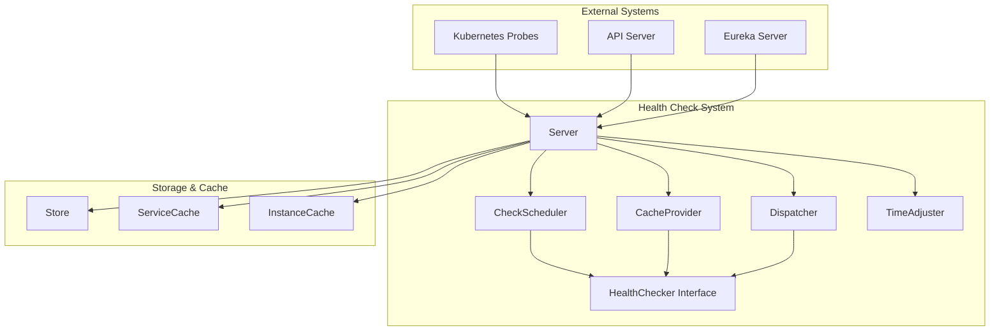
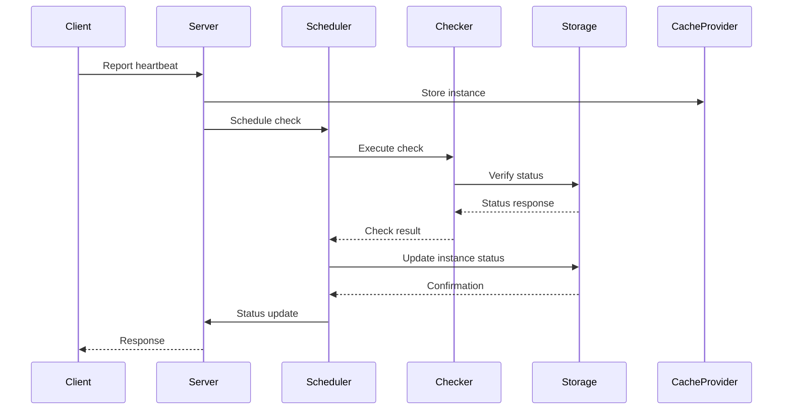
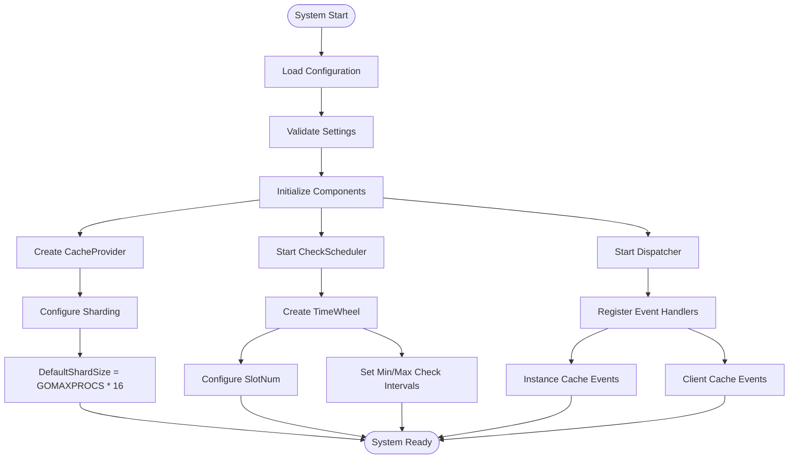

# Health & Status

<cite>
**Referenced Files in This Document**   
- [healthchecker.go](file://apis/service/healthcheck/healthchecker.go)
- [server.go](file://pkg/service/healthcheck/server.go)
- [check.go](file://pkg/service/healthcheck/check.go)
- [config.go](file://pkg/service/healthcheck/config.go)
- [cache.go](file://pkg/service/healthcheck/cache.go)
</cite>

## Table of Contents
1. [Introduction](#introduction)
2. [Health Check Architecture](#health-check-architecture)
3. [Core Components](#core-components)
4. [Health Check Configuration](#health-check-configuration)
5. [Health Check Workflow](#health-check-workflow)
6. [Health Check Types](#health-check-types)
7. [Performance and Scalability](#performance-and-scalability)
8. [Troubleshooting Guide](#troubleshooting-guide)
9. [Conclusion](#conclusion)

## Introduction
The Health & Status endpoints in the Administration HTTP API provide comprehensive system health monitoring capabilities. This documentation details the implementation and usage of the health check system, which is responsible for monitoring service readiness and liveness across the platform. The system integrates with Kubernetes liveness and readiness probes to ensure reliable service orchestration and automatic recovery from failure states. The health check mechanism supports multiple protocols including heartbeat, TCP, UDP, HTTP, gRPC, and MySQL, allowing for flexible health monitoring strategies across diverse service types.

## Health Check Architecture



**Diagram sources**
- [server.go](file://pkg/service/healthcheck/server.go#L20-L50)
- [check.go](file://pkg/service/healthcheck/check.go#L20-L50)

**Section sources**
- [server.go](file://pkg/service/healthcheck/server.go#L1-L100)
- [healthchecker.go](file://apis/service/healthcheck/healthchecker.go#L1-L50)

## Core Components

The health check system consists of several core components that work together to provide reliable service monitoring. The Server component serves as the main orchestrator, managing the lifecycle of health check operations. The CheckScheduler is responsible for scheduling and executing health checks at appropriate intervals. The CacheProvider maintains in-memory caches of service instances and clients that require health monitoring. The Dispatcher handles event-driven updates to the health check system, while the TimeAdjuster ensures consistent time calculations across distributed nodes.

**Section sources**
- [server.go](file://pkg/service/healthcheck/server.go#L20-L100)
- [check.go](file://pkg/service/healthcheck/check.go#L20-L100)
- [cache.go](file://pkg/service/healthcheck/cache.go#L20-L100)

## Health Check Configuration

```mermaid
classDiagram
class Config {
+*bool Open
+string Service
+int SlotNum
+string LocalHost
+time.Duration MinCheckInterval
+time.Duration MaxCheckInterval
+time.Duration ClientCheckInterval
+time.Duration ClientCheckTtl
+[]ConfigEntry Checkers
+map[string]interface{} Batch
+IsOpen() bool
+SetDefault()
}
class HealthChecker {
<<interface>>
+CheckType() HealthCheckType
+Report(ctx context.Context, request *ReportRequest) error
+Check(request *CheckRequest) (*CheckResponse, error)
+Query(ctx context.Context, request *QueryRequest) (*QueryResponse, error)
+BatchQuery(ctx context.Context, request *BatchQueryRequest) (*BatchQueryResponse, error)
+Suspend()
+SuspendTimeSec() int64
+Delete(ctx context.Context, id string) error
+DebugHandlers() []DebugHandler
}
Config --> HealthChecker : "uses"
```

**Diagram sources**
- [config.go](file://pkg/service/healthcheck/config.go#L10-L50)
- [healthchecker.go](file://apis/service/healthcheck/healthchecker.go#L50-L100)

**Section sources**
- [config.go](file://pkg/service/healthcheck/config.go#L1-L84)
- [healthchecker.go](file://apis/service/healthcheck/healthchecker.go#L50-L100)

## Health Check Workflow



**Diagram sources**
- [server.go](file://pkg/service/healthcheck/server.go#L150-L200)
- [check.go](file://pkg/service/healthcheck/check.go#L300-L400)
- [cache.go](file://pkg/service/healthcheck/cache.go#L200-L300)

**Section sources**
- [server.go](file://pkg/service/healthcheck/server.go#L100-L200)
- [check.go](file://pkg/service/healthcheck/check.go#L100-L500)
- [cache.go](file://pkg/service/healthcheck/cache.go#L100-L400)

## Health Check Types

The system supports multiple health check types through a plugin interface:

- **HealthCheckerHeartbeat**: Monitors service instances through periodic heartbeat reporting
- **HealthCheckerDetectTCP**: Performs TCP connection checks to verify service availability
- **HealthCheckerDetectUDP**: Conducts UDP connectivity tests for UDP-based services
- **HealthCheckerDetectHTTP**: Executes HTTP requests to validate web service health
- **HealthCheckerDetectGRPC**: Performs gRPC health checks using the standard health protocol
- **HealthCheckerDetectMYSQL**: Validates MySQL database connectivity and responsiveness

Each health check type implements the HealthChecker interface, allowing for consistent integration with the core health check system while providing protocol-specific verification logic.

**Section sources**
- [healthchecker.go](file://apis/service/healthcheck/healthchecker.go#L30-L50)

## Performance and Scalability



**Diagram sources**
- [config.go](file://pkg/service/healthcheck/config.go#L60-L80)
- [cache.go](file://pkg/service/healthcheck/cache.go#L10-L30)
- [check.go](file://pkg/service/healthcheck/check.go#L50-L80)

**Section sources**
- [config.go](file://pkg/service/healthcheck/config.go#L50-L84)
- [cache.go](file://pkg/service/healthcheck/cache.go#L1-L50)
- [check.go](file://pkg/service/healthcheck/check.go#L1-L50)

## Troubleshooting Guide

Common issues and their solutions:

1. **False negatives during startup**: Ensure health check intervals are appropriately configured for service startup times. The default minimum check interval is 1 second, but services with longer startup times may require adjustment.

2. **Database connectivity problems**: Verify database connection settings in the configuration. The system uses the Store interface for persistence, and connectivity issues will prevent status updates.

3. **Network partition scenarios**: The system includes time adjustment mechanisms to handle clock drift between nodes. The TimeAdjuster component synchronizes time across the cluster to ensure consistent health check scheduling.

4. **High memory usage**: The CacheProvider uses segmented maps with configurable shard sizes. Adjust the DefaultShardSize based on the number of monitored instances.

5. **Missed health checks**: Ensure the CheckScheduler's time wheel is properly configured with an appropriate slot number. The default is 30 slots, which should be adjusted based on the expected check frequency.

Configuration recommendations for production:
- Set appropriate min and max check intervals based on service requirements
- Configure client check TTL to match expected reporting frequency
- Monitor scheduler performance and adjust slot numbers if necessary
- Ensure sufficient resources for the time wheel and cache components

**Section sources**
- [config.go](file://pkg/service/healthcheck/config.go#L50-L84)
- [check.go](file://pkg/service/healthcheck/check.go#L100-L200)
- [cache.go](file://pkg/service/healthcheck/cache.go#L100-L200)

## Conclusion
The Health & Status system provides a robust foundation for monitoring service health in the Administration HTTP API. By implementing a modular architecture with pluggable health check types, the system offers flexibility in monitoring diverse service types. The integration with Kubernetes liveness and readiness probes enables automatic service recovery, while the configurable check intervals and thresholds allow for optimization based on specific operational requirements. The system's performance characteristics, including sharded caching and efficient scheduling, ensure scalability to large service deployments.