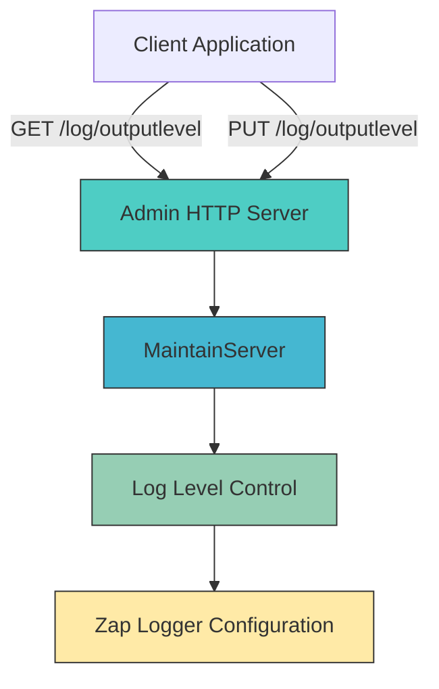
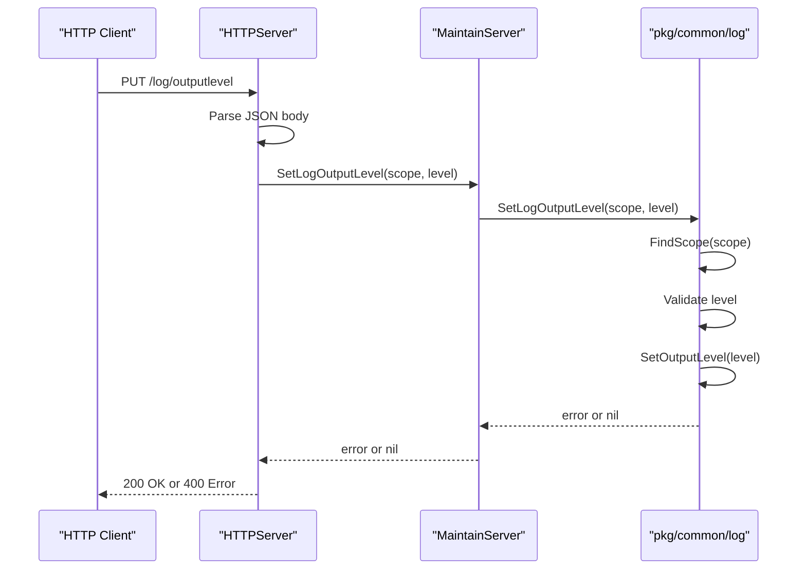

# Logging Control

<cite>
**Referenced Files in This Document**   
- [log.go](file://pkg/admin/log.go)
- [logger.go](file://pkg/common/log/logger.go)
- [config.go](file://pkg/common/log/config.go)
- [admin.go](file://apis/pkg/types/admin/admin.go)
- [admin_access.go](file://plugin/apiserver/httpserver/admin_access.go)
</cite>

## Table of Contents
1. [Introduction](#introduction)
2. [API Endpoint Specification](#api-endpoint-specification)
3. [Authentication and Authorization](#authentication-and-authorization)
4. [Request and Response Schema](#request-and-response-schema)
5. [Usage Examples with curl](#usage-examples-with-curl)
6. [Internal Implementation](#internal-implementation)
7. [Integration with Logging System](#integration-with-logging-system)
8. [Common Issues and Troubleshooting](#common-issues-and-troubleshooting)
9. [Performance and Stability Guidance](#performance-and-stability-guidance)
10. [Conclusion](#conclusion)

## Introduction
The Logging Control API provides runtime control over log verbosity through the `/admin/loglevel` endpoint. This allows administrators to dynamically adjust logging levels for debugging and monitoring purposes without restarting the service. The system integrates with the zap-based logging framework in `pkg/common/log` to provide fine-grained control over different logging scopes within the application.

**Section sources**
- [log.go](file://pkg/admin/log.go#L1-L25)
- [config.go](file://pkg/common/log/config.go#L1-L40)

## API Endpoint Specification
The Logging Control API exposes endpoints for viewing and modifying log levels at runtime:

- `GET /log/outputlevel` - Retrieves current log levels for all scopes
- `PUT /log/outputlevel` - Sets log level for a specific scope

These endpoints are registered in the administration HTTP server and provide programmatic access to the underlying logging configuration system.



**Diagram sources**
- [admin_access.go](file://plugin/apiserver/httpserver/admin_access.go#L59-L77)
- [log.go](file://pkg/admin/log.go#L1-L25)

## Authentication and Authorization
Access to the log level control endpoints requires administrative privileges. The system implements role-based access control through the authentication interceptor chain:

1. Requests are intercepted by the auth middleware in `pkg/admin/interceptor/auth/server.go`
2. The `SetLogOutputLevel` operation requires `Modify` permission with `UpdateLogOutputLevel` action
3. The `GetLogOutputLevel` operation requires `Read` permission with `DescribeGetLogOutputLevel` action
4. Permission checks are performed by the policy server's `CheckConsolePermission` method

Unauthorized access results in a 403 Forbidden response, ensuring only authorized administrators can modify logging configuration.

**Section sources**
- [server.go](file://pkg/admin/interceptor/auth/server.go#L147-L184)
- [admin_access.go](file://plugin/apiserver/httpserver/admin_access.go#L244-L293)

## Request and Response Schema
### Set Log Level Request
```json
{
  "scope": "string",
  "level": "DEBUG|INFO|WARN|ERROR|FATAL|NONE"
}
```

### Get Log Levels Response
```json
[
  {
    "name": "string",
    "level": "string"
  }
]
```

The `ScopeLevel` struct defined in `apis/pkg/types/admin/admin.go` represents the log level configuration for a specific logging scope. The `scope` parameter refers to logical components of the system such as "naming", "config", "cache", etc., while the `level` parameter accepts standard log levels.

**Section sources**
- [admin.go](file://apis/pkg/types/admin/admin.go#L1-L62)
- [admin_access.go](file://plugin/apiserver/httpserver/admin_access.go#L244-L293)

## Usage Examples with curl
### Increase Log Verbosity for Troubleshooting
```bash
curl -X PUT http://localhost:8080/log/outputlevel \
  -H "Authorization: Bearer <admin-token>" \
  -H "Content-Type: application/json" \
  -d '{
    "scope": "naming",
    "level": "DEBUG"
  }'
```

### Reduce Log Volume After Troubleshooting
```bash
curl -X PUT http://localhost:8080/log/outputlevel \
  -H "Authorization: Bearer <admin-token>" \
  -H "Content-Type: application/json" \
  -d '{
    "scope": "naming",
    "level": "INFO"
  }'
```

### View Current Log Levels
```bash
curl -X GET http://localhost:8080/log/outputlevel \
  -H "Authorization: Bearer <admin-token>"
```

These commands allow administrators to temporarily increase logging detail during issue investigation and then restore normal logging levels to minimize disk usage and performance impact.

**Section sources**
- [admin_access.go](file://plugin/apiserver/httpserver/admin_access.go#L244-L293)
- [logger.go](file://pkg/common/log/logger.go#L43-L70)

## Internal Implementation
The dynamic log level functionality is implemented through a layered architecture:



**Diagram sources**
- [admin_access.go](file://plugin/apiserver/httpserver/admin_access.go#L244-L293)
- [logger.go](file://pkg/common/log/logger.go#L43-L70)

The implementation follows this flow:
1. HTTP request is received and JSON payload is parsed
2. Authentication and authorization are verified
3. Request is forwarded to the maintain server
4. The logging system locates the appropriate scope
5. Log level is validated against allowed values
6. Output level is updated atomically with locking

## Integration with Logging System
The logging control functionality integrates with the centralized logging system in `pkg/common/log`, which provides:

- Multi-scope logging with named loggers
- Configurable output paths and rotation
- Stack trace level control
- Global zap logger interception
- Standard library "log" package redirection

The `Configure` function in `config.go` initializes the logging system with default options, while `SetLogOutputLevel` allows runtime modification of individual scope levels. The system uses zap's atomic levels to ensure thread-safe log level changes without requiring restart.

**Section sources**
- [config.go](file://pkg/common/log/config.go#L1-L423)
- [logger.go](file://pkg/common/log/logger.go#L1-L72)

## Common Issues and Troubleshooting
### Log Level Changes Not Taking Effect
**Cause**: Invalid scope name or level value
**Solution**: Verify the scope exists using GET /log/outputlevel and ensure the level is one of: DEBUG, INFO, WARN, ERROR, FATAL, NONE

### Permission Denied Errors
**Cause**: Insufficient administrative privileges
**Solution**: Ensure the authentication token has admin privileges with UpdateLogOutputLevel permission

### Invalid JSON Payload
**Cause**: Malformed request body
**Solution**: Ensure proper JSON format with "scope" and "level" fields

### Unknown Scope Error
**Cause**: Typo in scope name
**Solution**: Check available scopes from GET /log/outputlevel response

The system returns descriptive error messages to help diagnose these issues, with appropriate HTTP status codes (400 for bad requests, 403 for permission issues).

**Section sources**
- [logger.go](file://pkg/common/log/logger.go#L43-L70)
- [server.go](file://pkg/admin/interceptor/auth/server.go#L147-L184)

## Performance and Stability Guidance
### Safe Usage Practices
- Use DEBUG level only temporarily during troubleshooting
- Target specific scopes rather than setting global DEBUG
- Restore to INFO level after issue resolution
- Monitor disk usage when increasing log verbosity

### Performance Impact
- DEBUG logging can increase I/O and CPU usage significantly
- Excessive logging may impact service responsiveness
- Large log volumes can fill disk space quickly

### Best Practices
1. Always pair increased logging with a plan to reduce it
2. Use specific scopes (e.g., "naming") rather than system-wide changes
3. Consider log rotation settings in production
4. Monitor system performance after log level changes
5. Document log level changes for audit purposes

The logging system is designed to be safe for runtime modifications, but should be used judiciously in production environments.

**Section sources**
- [config.go](file://pkg/common/log/config.go#L1-L423)
- [logger.go](file://pkg/common/log/logger.go#L1-L72)

## Conclusion
The Logging Control API provides essential runtime diagnostics capabilities through secure, authenticated endpoints. By leveraging the zap logging framework and role-based access control, it enables administrators to safely adjust log verbosity for troubleshooting while maintaining system stability. The implementation allows granular control over different system components, making it a valuable tool for operational visibility and issue resolution.