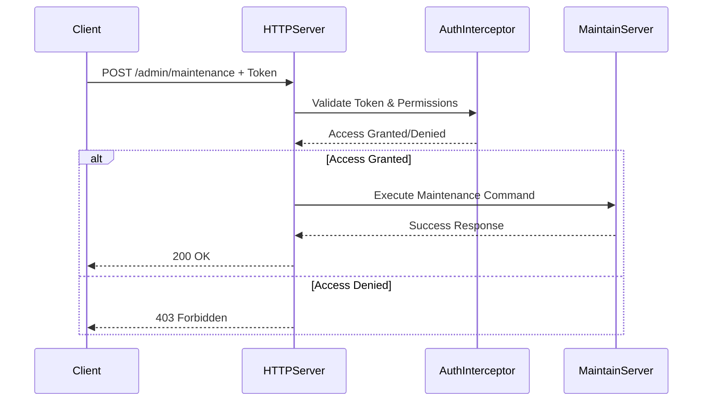
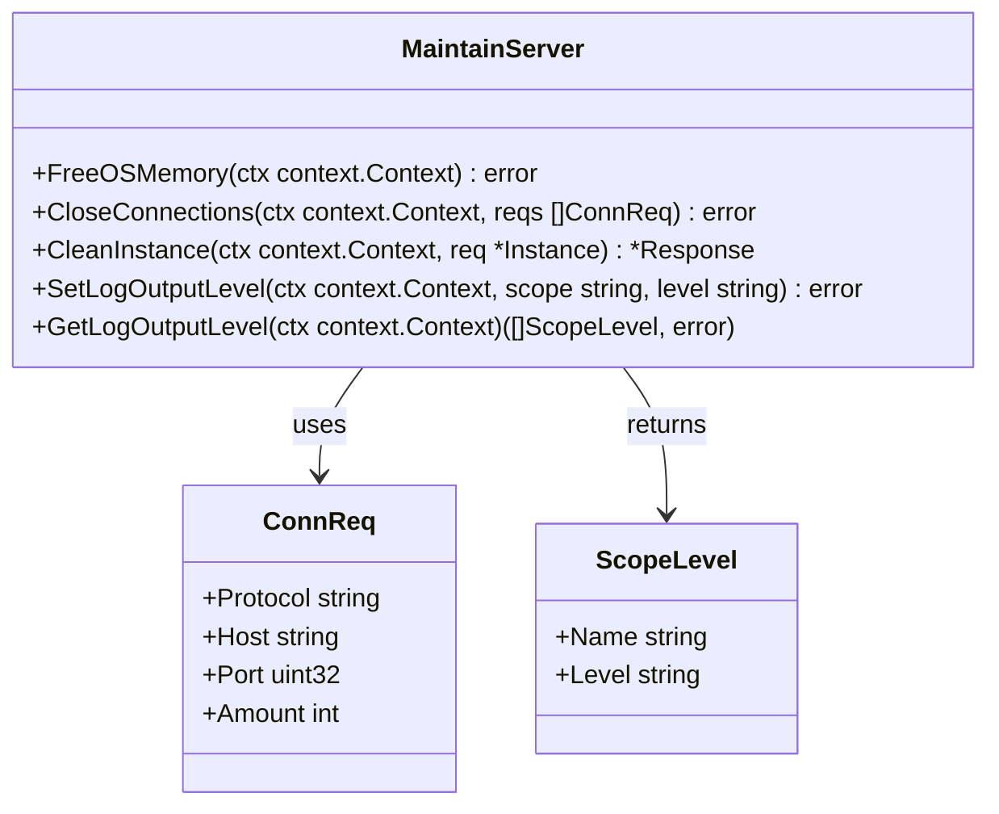

# Maintenance Operations

<cite>
**Referenced Files in This Document**   
- [maintain.go](file://pkg/admin/maintain.go)
- [admin_access.go](file://plugin/apiserver/httpserver/admin_access.go)
- [third_access.go](file://plugin/apiserver/httpserver/third_access.go)
</cite>

## Table of Contents
1. [Introduction](#introduction)
2. [API Endpoint: POST /admin/maintenance](#api-endpoint-post--adminmaintenance)
3. [Request and Response Details](#request-and-response-details)
4. [Authentication and Authorization](#authentication-and-authorization)
5. [Internal State Management](#internal-state-management)
6. [Operational Best Practices](#operational-best-practices)
7. [Troubleshooting Common Issues](#troubleshooting-common-issues)
8. [Conclusion](#conclusion)

## Introduction
This document provides comprehensive documentation for the maintenance operations within the Administration HTTP API of the Polaris server. It focuses on the mechanisms for enabling and disabling maintenance mode, which is a critical operational feature used during system upgrades, emergency interventions, or configuration changes. The maintenance mode allows administrators to temporarily restrict write operations while preserving read access, ensuring data consistency and system stability during sensitive periods.

**Section sources**
- [maintain.go](file://pkg/admin/maintain.go#L1-L261)
- [admin_access.go](file://plugin/apiserver/httpserver/admin_access.go#L1-L360)

## API Endpoint: POST /admin/maintenance
The `/admin/maintenance` endpoint is used to control the maintenance mode of the Polaris server. Although the exact endpoint path may vary based on routing configuration, the functionality is exposed through administrative HTTP handlers that manage system state transitions.

When maintenance mode is enabled:
- New service registrations are blocked
- Configuration changes are rejected
- Read operations (e.g., service discovery, health checks) remain available
- Existing connections may be preserved depending on configuration

This endpoint allows system administrators to safely perform upgrades or maintenance tasks without risking inconsistent state from concurrent modifications.

```mermaid
flowchart TD
A["Client: POST /admin/maintenance {\"enable\": true}"] --> B["HTTPServer: Parse Request"]
B --> C{"Authentication Check"}
C --> |Failed| D["Return 403 Forbidden"]
C --> |Success| E["MaintainServer: Update Internal State"]
E --> F["Block Write Operations"]
F --> G["Return 200 OK"]
```

**Diagram sources**
- [admin_access.go](file://plugin/apiserver/httpserver/admin_access.go#L59-L77)
- [maintain.go](file://pkg/admin/maintain.go#L1-L261)

**Section sources**
- [admin_access.go](file://plugin/apiserver/httpserver/admin_access.go#L59-L77)
- [maintain.go](file://pkg/admin/maintain.go#L1-L261)

## Request and Response Details
The maintenance mode control uses a JSON request body with the following structure:

```json
{
  "enable": true
}
```

**Request Parameters**
- `enable` (boolean): Indicates whether to enable (`true`) or disable (`false`) maintenance mode

**Response Codes**
- `200 OK`: Successfully updated maintenance mode status
- `403 Forbidden`: Request denied due to insufficient privileges
- `400 Bad Request`: Invalid request format or missing parameters

The response body for successful operations is typically a simple acknowledgment such as `"ok"`.

**Section sources**
- [admin_access.go](file://plugin/apiserver/httpserver/admin_access.go#L292-L340)
- [third_access.go](file://plugin/apiserver/httpserver/third_access.go#L17-L64)

## Authentication and Authorization
Access to the maintenance operations is restricted to users with administrative privileges. The system employs a role-based access control (RBAC) mechanism to ensure that only authorized personnel can modify the system's operational state.

The authentication process verifies the presence of valid credentials in the request headers:
- `X-Polaris-Token`
- `Authorization`

These tokens are validated against the system's authentication backend, and appropriate permissions are checked before allowing the maintenance operation to proceed.



**Diagram sources**
- [admin_access.go](file://plugin/apiserver/httpserver/admin_access.go#L244-L293)
- [maintain.go](file://pkg/admin/maintain.go#L1-L261)

**Section sources**
- [admin_access.go](file://plugin/apiserver/httpserver/admin_access.go#L244-L293)
- [maintain.go](file://pkg/admin/maintain.go#L1-L261)

## Internal State Management
The maintenance mode state is managed internally by the `MaintainServer` component located in `pkg/admin/maintain.go`. This server maintains the operational state of the system and coordinates various maintenance functions.

Key internal methods include:
- `FreeOSMemory`: Triggers garbage collection and memory release
- `CloseConnections`: Terminates specified client connections
- `CleanInstance`: Removes flagged service instances
- `SetLogOutputLevel`: Dynamically adjusts logging verbosity

The state is stored in-memory and protected by mutex locks to prevent race conditions during concurrent access.



**Diagram sources**
- [maintain.go](file://pkg/admin/maintain.go#L1-L261)
- [admin_access.go](file://plugin/apiserver/httpserver/admin_access.go#L1-L360)

**Section sources**
- [maintain.go](file://pkg/admin/maintain.go#L1-L261)

## Operational Best Practices
To ensure safe and effective use of maintenance mode in production environments:

1. **Schedule Maintenance Windows**: Plan maintenance during low-traffic periods
2. **Notify Stakeholders**: Inform dependent services and teams before enabling maintenance mode
3. **Verify System State**: Check system health and backup status before initiating maintenance
4. **Use Gradual Rollouts**: For large clusters, consider rolling maintenance across nodes
5. **Monitor Impact**: Track system metrics and error rates during maintenance
6. **Test Recovery Procedures**: Ensure you can disable maintenance mode and restore normal operations

Always disable maintenance mode as soon as maintenance tasks are completed to restore full system functionality.

**Section sources**
- [maintain.go](file://pkg/admin/maintain.go#L1-L261)
- [admin_access.go](file://plugin/apiserver/httpserver/admin_access.go#L1-L360)

## Troubleshooting Common Issues
**Forgetting to Disable Maintenance Mode**
- Symptom: Services cannot register or update configurations
- Solution: Use the API to disable maintenance mode or restart the server if necessary

**Handling Client Requests During Maintenance**
- Implement client-side retry logic with exponential backoff
- Provide clear error messages indicating temporary unavailability of write operations
- Consider implementing a read-only mode indicator in responses

**Ensuring Data Consistency**
- Perform maintenance during periods of low activity
- Verify data integrity after maintenance operations
- Use transactional operations where possible to maintain atomicity

**Monitoring and Logging**
- Enable detailed logging during maintenance windows
- Monitor connection counts and system resources
- Use the provided diagnostic endpoints to verify system state

**Section sources**
- [maintain.go](file://pkg/admin/maintain.go#L1-L261)
- [admin_access.go](file://plugin/apiserver/httpserver/admin_access.go#L1-L360)
- [third_access.go](file://plugin/apiserver/httpserver/third_access.go#L17-L64)

## Conclusion
The maintenance operations API provides essential capabilities for managing the Polaris server during critical operational periods. By understanding the proper use of the maintenance mode, authentication requirements, and internal state management, administrators can safely perform system upgrades and maintenance tasks while minimizing impact on dependent services. Following best practices and being prepared for common issues ensures reliable operation of the system in production environments.