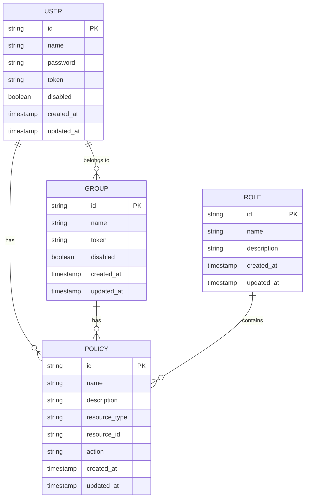
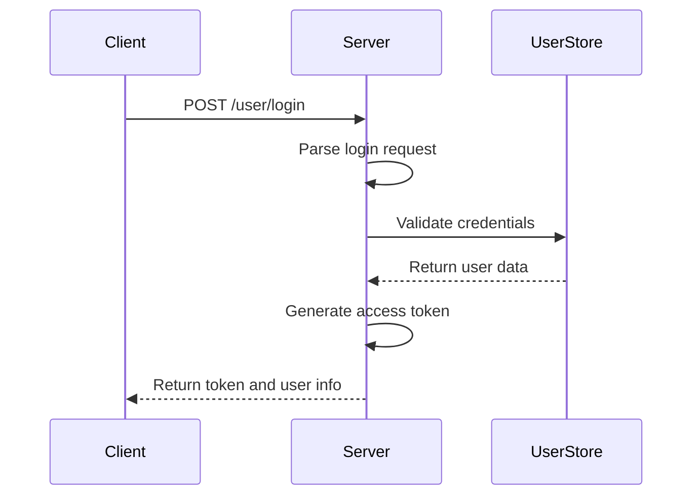
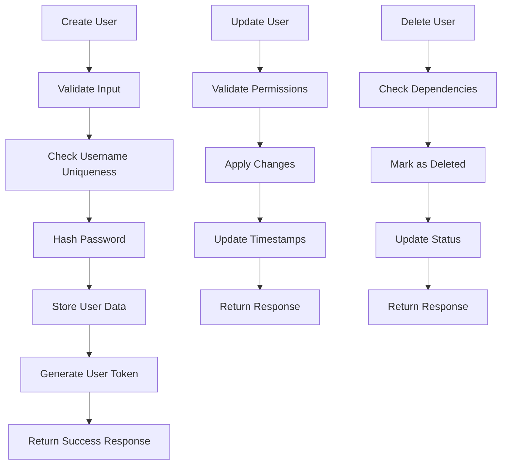
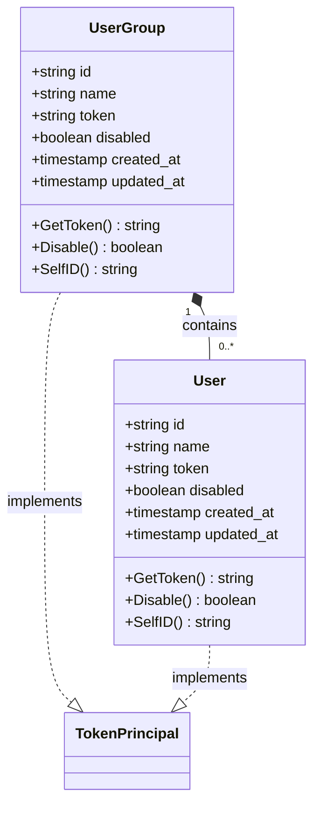
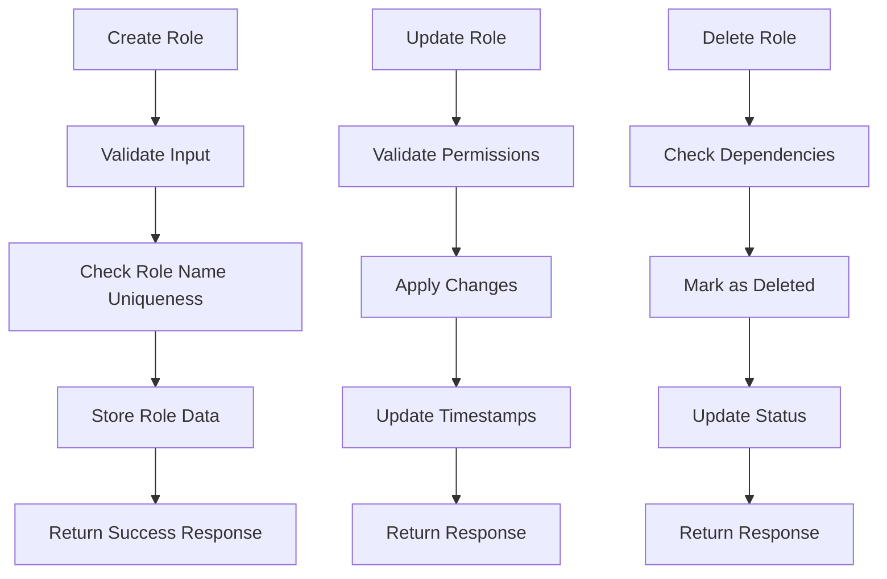
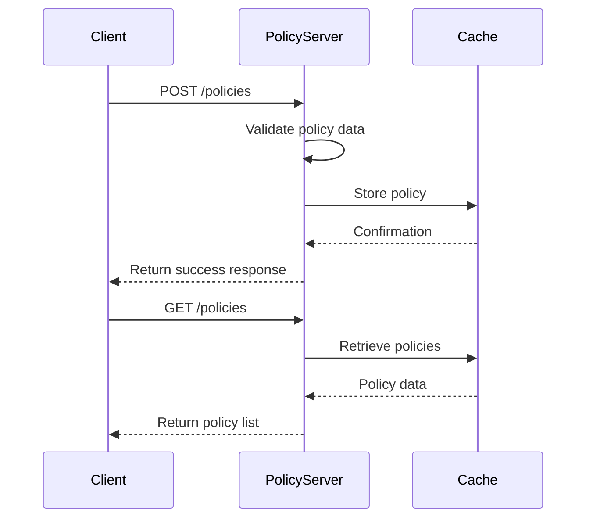
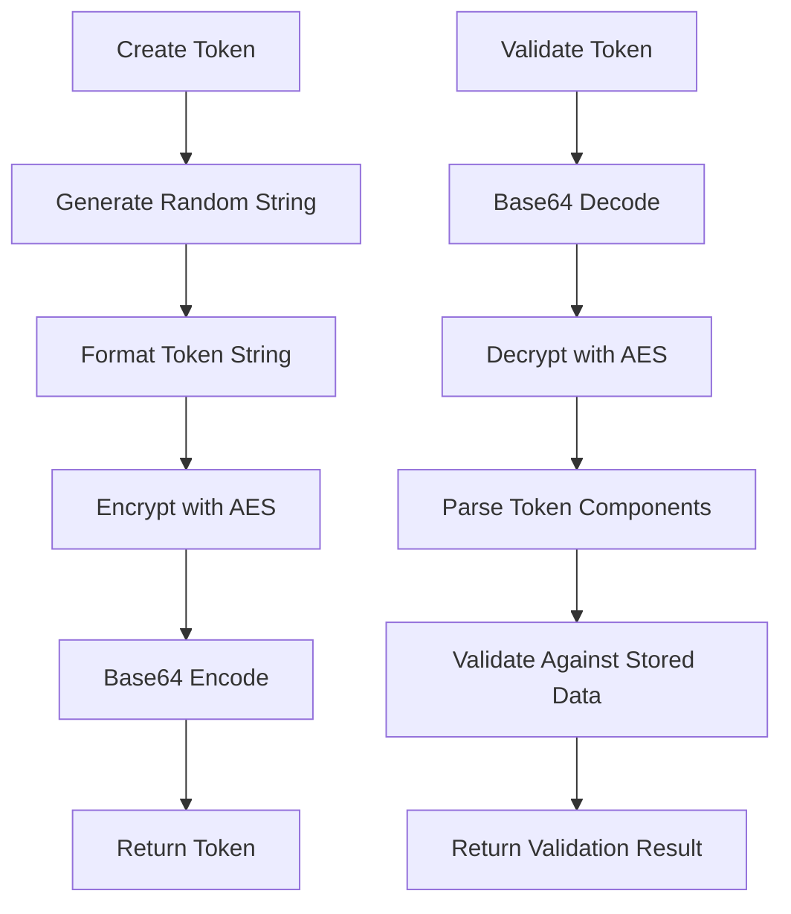
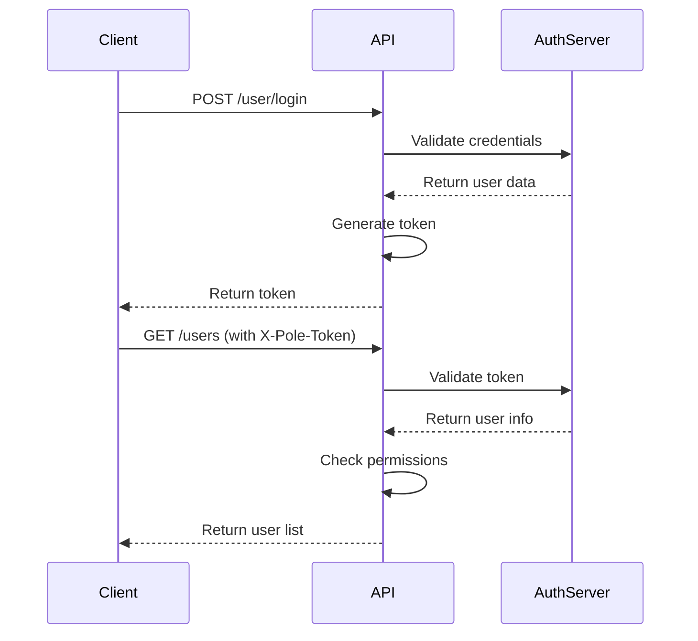
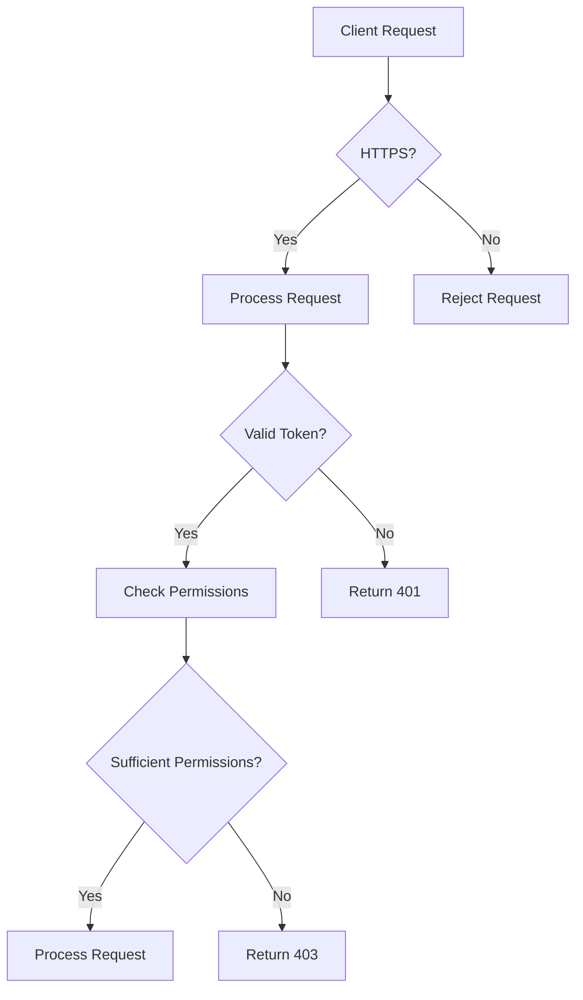

# Authentication HTTP API

<cite>
**Referenced Files in This Document**   
- [user_access.go](file://plugin/apiserver/httpserver/auth/user_access.go)
- [group_access.go](file://plugin/apiserver/httpserver/auth/group_access.go)
- [role_access.go](file://plugin/apiserver/httpserver/auth/role_access.go)
- [policy_access.go](file://plugin/apiserver/httpserver/auth/policy_access.go)
- [auth_apidoc.go](file://plugin/apiserver/httpserver/docs/auth_apidoc.go)
- [token.go](file://plugin/access_control/auth/user/token.go)
- [const.go](file://apis/pkg/types/auth/const.go)
</cite>

## Table of Contents
1. [Introduction](#introduction)
2. [RBAC Model Overview](#rbac-model-overview)
3. [Authentication Endpoints](#authentication-endpoints)
4. [User Management](#user-management)
5. [Group Management](#group-management)
6. [Role Management](#role-management)
7. [Policy Management](#policy-management)
8. [Token Management](#token-management)
9. [Request/Response Schemas](#requestresponse-schemas)
10. [Authentication Headers](#authentication-headers)
11. [Error Handling](#error-handling)
12. [Security Best Practices](#security-best-practices)
13. [Rate Limiting](#rate-limiting)
14. [Troubleshooting Guide](#troubleshooting-guide)

## Introduction
The Authentication and Authorization HTTP API in pole-server provides comprehensive access control functionality for managing users, groups, roles, and policies. This API implements a Role-Based Access Control (RBAC) model that enables fine-grained permission management for both client-facing and admin console operations. The endpoints are organized under the `/auth` path and provide RESTful interfaces for all authentication and authorization operations.

**Section sources**
- [user_access.go](file://plugin/apiserver/httpserver/auth/user_access.go#L0-L207)
- [auth_apidoc.go](file://plugin/apiserver/httpserver/docs/auth_apidoc.go#L0-L395)

## RBAC Model Overview
The system implements a comprehensive RBAC model consisting of four core components: Users, Groups, Roles, and Policies. Users can be organized into Groups, which can be assigned Roles. Roles contain Policies that define specific permissions for accessing resources such as namespaces, services, and configuration groups. This hierarchical structure enables flexible and scalable access control management.



**Diagram sources**
- [const.go](file://apis/pkg/types/auth/const.go#L450-L505)
- [auth_apidoc.go](file://plugin/apiserver/httpserver/docs/auth_apidoc.go#L0-L395)

## Authentication Endpoints
The authentication system provides endpoints for user login and token-based authentication. The primary authentication endpoint allows users to authenticate with their credentials and receive an access token for subsequent API requests.

### Login Endpoint
- **URL**: `/user/login`
- **Method**: POST
- **Description**: Authenticates a user with their credentials and returns an access token
- **Authentication Required**: None (public endpoint)



**Diagram sources**
- [user_access.go](file://plugin/apiserver/httpserver/auth/user_access.go#L35-L53)
- [auth_apidoc.go](file://plugin/apiserver/httpserver/docs/auth_apidoc.go#L150-L160)

## User Management
The user management endpoints provide CRUD operations for user accounts, including creation, updating, deletion, and querying of user information.

### User Management Endpoints
| Endpoint | Method | Description | Authentication Required |
|---------|--------|-------------|------------------------|
| `/users` | POST | Create users | X-Pole-Token |
| `/users` | GET | Query users | X-Pole-Token |
| `/users` | PUT | Update users | X-Pole-Token |
| `/users/delete` | POST | Delete users | X-Pole-Token |
| `/user/password` | PUT | Update user password | X-Pole-Token |



**Diagram sources**
- [user_access.go](file://plugin/apiserver/httpserver/auth/user_access.go#L55-L155)
- [const.go](file://apis/pkg/types/auth/const.go#L450-L470)

**Section sources**
- [user_access.go](file://plugin/apiserver/httpserver/auth/user_access.go#L55-L155)

## Group Management
User groups provide a way to organize users and assign permissions to multiple users simultaneously. The group management endpoints allow for the creation, updating, deletion, and querying of user groups.

### Group Management Endpoints
| Endpoint | Method | Description | Authentication Required |
|---------|--------|-------------|------------------------|
| `/usergroups` | POST | Create user groups | X-Pole-Token |
| `/usergroups` | PUT | Update user groups | X-Pole-Token |
| `/usergroups` | GET | Query user groups | X-Pole-Token |
| `/usergroups/delete` | POST | Delete user groups | X-Pole-Token |
| `/usergroup/detail` | GET | Get group details | X-Pole-Token |
| `/usergroup/token` | GET | Get group token | X-Pole-Token |
| `/usergroup/token/enable` | PUT | Enable group token | X-Pole-Token |
| `/usergroup/token/refresh` | PUT | Refresh group token | X-Pole-Token |



**Diagram sources**
- [group_access.go](file://plugin/apiserver/httpserver/auth/group_access.go#L0-L191)
- [token.go](file://plugin/access_control/auth/user/token.go#L88-L132)

**Section sources**
- [group_access.go](file://plugin/apiserver/httpserver/auth/group_access.go#L0-L191)

## Role Management
Roles represent collections of permissions that can be assigned to users or groups. The role management endpoints provide operations for creating, updating, deleting, and querying roles.

### Role Management Endpoints
| Endpoint | Method | Description | Authentication Required |
|---------|--------|-------------|------------------------|
| `/roles` | POST | Create roles | X-Pole-Token |
| `/roles` | PUT | Update roles | X-Pole-Token |
| `/roles` | GET | Query roles | X-Pole-Token |
| `/roles/delete` | POST | Delete roles | X-Pole-Token |



**Diagram sources**
- [role_access.go](file://plugin/apiserver/httpserver/auth/role_access.go#L0-L114)
- [const.go](file://apis/pkg/types/auth/const.go#L485-L490)

**Section sources**
- [role_access.go](file://plugin/apiserver/httpserver/auth/role_access.go#L0-L114)

## Policy Management
Policies define the specific permissions that users, groups, or roles have on system resources. The policy management endpoints allow for the creation, updating, deletion, and querying of authorization policies.

### Policy Management Endpoints
| Endpoint | Method | Description | Authentication Required |
|---------|--------|-------------|------------------------|
| `/policies` | POST | Create policies | X-Pole-Token |
| `/policies` | PUT | Update policies | X-Pole-Token |
| `/policies` | GET | Query policies | X-Pole-Token |
| `/policies/delete` | POST | Delete policies | X-Pole-Token |
| `/policies/detail` | GET | Get policy details | X-Pole-Token |
| `/principal/resources` | GET | Get resources for principal | X-Pole-Token |
| `/resources/principals` | GET | Get principals for resource | X-Pole-Token |
| `/resources/authorize` | POST | Check resource authorization | X-Pole-Token |



**Diagram sources**
- [policy_access.go](file://plugin/apiserver/httpserver/auth/policy_access.go#L0-L183)
- [auth_apidoc.go](file://plugin/apiserver/httpserver/docs/auth_apidoc.go#L70-L143)

**Section sources**
- [policy_access.go](file://plugin/apiserver/httpserver/auth/policy_access.go#L0-L183)

## Token Management
The system uses encrypted tokens for authentication and authorization. Tokens are generated for both users and groups and follow a specific format and encryption scheme.

### Token Structure
Tokens follow the pattern: `{random_string}::{uid/user_id}` or `{random_string}::{groupid/group_id}`. The tokens are encrypted using AES encryption with a server-defined salt.



**Diagram sources**
- [token.go](file://plugin/access_control/auth/user/token.go#L88-L132)
- [token.go](file://plugin/access_control/auth/user/token.go#L134-L195)

**Section sources**
- [token.go](file://plugin/access_control/auth/user/token.go#L88-L195)

## Request/Response Schemas
This section details the JSON schemas for requests and responses across the authentication API.

### Login Request Schema
```json
{
  "username": "string",
  "password": "string"
}
```

### Login Response Schema
```json
{
  "code": 0,
  "message": "string",
  "loginResponse": {
    "user": {
      "id": "string",
      "name": "string",
      "token": "string"
    }
  }
}
```

### User Creation Schema
```json
[
  {
    "name": "string",
    "password": "string",
    "source": "string"
  }
]
```

### Policy Schema
```json
[
  {
    "name": "string",
    "description": "string",
    "principal": {
      "id": "string",
      "type": "user|group"
    },
    "resources": [
      {
        "type": "namespace|service|config_group",
        "id": "string",
        "readonly": false
      }
    ],
    "action": "read|write|delete|owner"
  }
]
```

**Section sources**
- [auth_apidoc.go](file://plugin/apiserver/httpserver/docs/auth_apidoc.go#L150-L395)
- [user_access.go](file://plugin/apiserver/httpserver/auth/user_access.go#L35-L53)

## Authentication Headers
The API requires specific headers for authentication and authorization of requests.

### Required Headers
- **X-Pole-Token**: The access token obtained from the login endpoint, required for all authenticated endpoints except login
- **Content-Type**: Must be set to `application/json` for all requests with a request body

### Authentication Flow


**Diagram sources**
- [user_access.go](file://plugin/apiserver/httpserver/auth/user_access.go#L35-L53)
- [token.go](file://plugin/access_control/auth/user/token.go#L0-L195)

## Error Handling
The API returns standardized error responses with appropriate HTTP status codes and error codes in the response body.

### Common Error Codes
| HTTP Status | Error Code | Description |
|-----------|-----------|-------------|
| 401 | 10001 | Unauthorized - Invalid or missing token |
| 403 | 10003 | Forbidden - Insufficient permissions |
| 400 | 10002 | Bad Request - Invalid request parameters |
| 429 | 10005 | Too Many Requests - Rate limit exceeded |
| 500 | 20001 | Internal Server Error - Server-side error |

### Error Response Schema
```json
{
  "code": 10001,
  "message": "Unauthorized: Invalid token"
}
```

**Section sources**
- [user_access.go](file://plugin/apiserver/httpserver/auth/user_access.go#L50-L52)
- [auth_apidoc.go](file://plugin/apiserver/httpserver/docs/auth_apidoc.go#L0-L395)

## Security Best Practices
To ensure the security of the authentication system, follow these best practices:

1. **Use HTTPS**: Always use HTTPS to encrypt communication between clients and the server
2. **Secure Token Storage**: Store tokens securely on the client side using secure storage mechanisms
3. **Token Expiration**: Implement token expiration and refresh mechanisms
4. **Password Policies**: Enforce strong password policies including minimum length and complexity requirements
5. **Input Validation**: Validate all inputs to prevent injection attacks
6. **Rate Limiting**: Implement rate limiting to prevent brute force attacks



**Section sources**
- [token.go](file://plugin/access_control/auth/user/token.go#L134-L195)
- [user_access.go](file://plugin/apiserver/httpserver/auth/user_access.go#L35-L53)

## Rate Limiting
The authentication system implements rate limiting on login attempts to prevent brute force attacks.

### Rate Limiting Rules
- Maximum of 5 login attempts per minute per IP address
- Temporary lockout after 10 failed attempts within 15 minutes
- Gradual increase in lockout duration for repeated violations

The rate limiting is implemented at the access control layer and applies specifically to the login endpoint.

**Section sources**
- [resource_limiter_test.go](file://plugin/access_control/ratelimit/token/resource_limiter_test.go#L0-L27)

## Troubleshooting Guide
This section provides guidance for resolving common authentication and authorization issues.

### Common Issues and Solutions
1. **401 Unauthorized Errors**
   - Verify the X-Pole-Token header is present and correctly formatted
   - Check that the token has not expired
   - Ensure the token is being sent in every authenticated request

2. **403 Forbidden Errors**
   - Verify the user has the required role or policy for the requested operation
   - Check that the user is not disabled
   - Ensure the resource exists and is accessible

3. **Login Failures**
   - Verify username and password are correct
   - Check if the account is locked due to too many failed attempts
   - Ensure the user account is not disabled

4. **Token Generation Issues**
   - Verify the server's salt configuration is correct
   - Check that the encryption libraries are properly installed
   - Ensure sufficient entropy for random string generation

**Section sources**
- [user_access.go](file://plugin/apiserver/httpserver/auth/user_access.go#L35-L155)
- [token.go](file://plugin/access_control/auth/user/token.go#L0-L195)
- [auth_apidoc.go](file://plugin/apiserver/httpserver/docs/auth_apidoc.go#L0-L395)