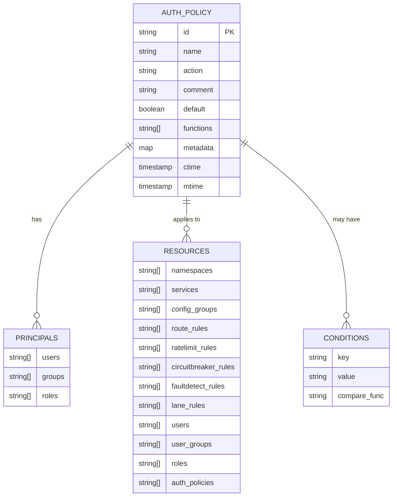
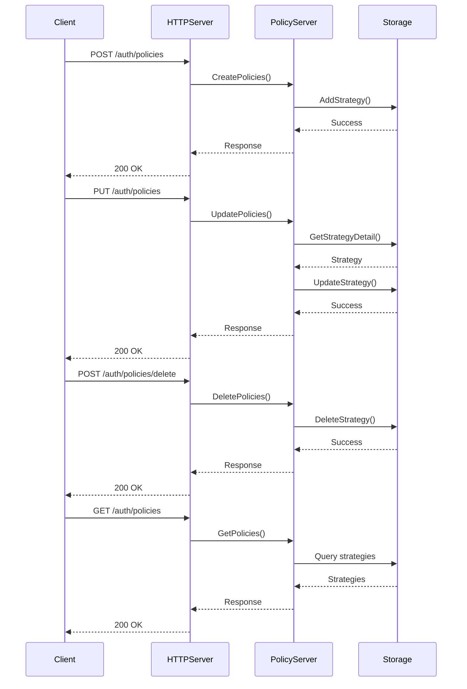
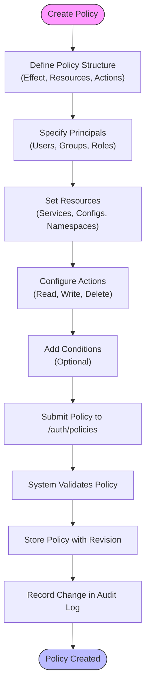
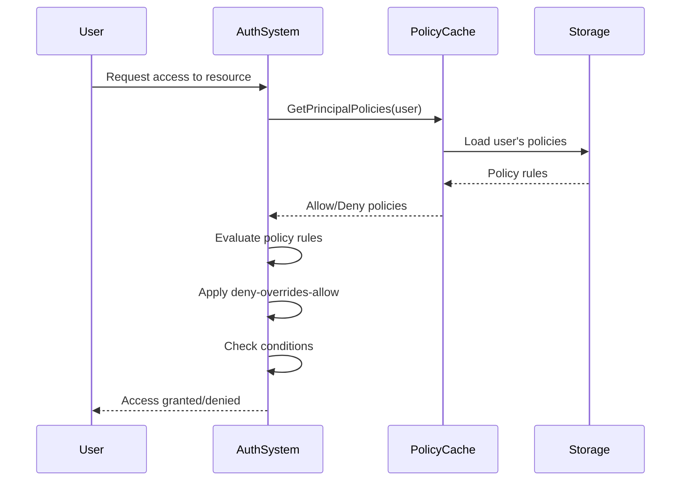
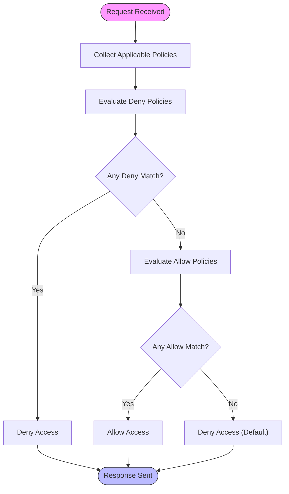

# Policies & Permissions HTTP API

<cite>
**Referenced Files in This Document**   
- [policy_access.go](file://plugin/apiserver/httpserver/auth/policy_access.go)
- [policy.go](file://plugin/access_control/auth/policy/policy.go)
- [policy.go](file://pkg/cache/auth/policy.go)
- [auth.go](file://apis/pkg/types/auth/auth.go)
- [const.go](file://apis/pkg/types/auth/const.go)
- [funcs.go](file://apis/pkg/types/auth/funcs.go)
</cite>

## Table of Contents
1. [Introduction](#introduction)
2. [Policy Structure](#policy-structure)
3. [Policies Endpoints](#policies-endpoints)
4. [Policy Management](#policy-management)
5. [Effective Permissions](#effective-permissions)
6. [Policy Evaluation](#policy-evaluation)
7. [Policy Versioning](#policy-versioning)
8. [Built-in Templates](#built-in-templates)
9. [Troubleshooting](#troubleshooting)
10. [Appendices](#appendices)

## Introduction

The Policies and Permissions system provides a comprehensive authorization framework for managing access rights to resources within the platform. This documentation details the HTTP API endpoints available at `/auth/policies` for creating and managing authorization policies that define access rights to various resources including services, configurations, and namespaces.

The authorization system implements a flexible policy-based approach where access decisions are made based on policy rules attached to roles, users, or user groups. Each policy consists of an effect (allow/deny), resources (with glob patterns), actions (read, write, delete), and optional conditions that can be evaluated during authorization.

This system enables fine-grained access control, allowing administrators to define precise permissions for different principals (users, groups, roles) across various resource types in the system.

**Section sources**
- [policy_access.go](file://plugin/apiserver/httpserver/auth/policy_access.go#L1-L50)

## Policy Structure

Authorization policies are structured as JSON objects with several key components that define the scope and conditions of access. The policy structure includes the following elements:

- **Effect**: Specifies whether the policy allows or denies access (ALLOW/DENY)
- **Resources**: Defines the resources to which the policy applies, supporting glob patterns
- **Actions**: Specifies the operations permitted on the resources (read, write, delete)
- **Principals**: Identifies the entities (users, groups, roles) to which the policy applies
- **Conditions**: Optional conditions that must be met for the policy to take effect

The system supports various resource types including namespaces, services, configuration groups, routing rules, rate limiting rules, circuit breaker rules, fault detection rules, lane rules, users, user groups, roles, and authentication policies.



**Diagram sources**
- [auth.go](file://apis/pkg/types/auth/auth.go#L300-L350)
- [const.go](file://apis/pkg/types/auth/const.go#L200-L250)

### JSON Schema Examples

**Example 1: Read access to all services in a namespace**

```json
{
  "name": "Read Services Policy",
  "action": "ALLOW",
  "resources": {
    "services": [
      {
        "id": "*",
        "namespace": "production"
      }
    ]
  },
  "principals": {
    "users": [
      {
        "id": "user-123"
      }
    ]
  },
  "functions": [
    "DescribeServices",
    "DiscoverInstances"
  ],
  "comment": "Allow read access to all services in production namespace"
}
```

**Example 2: Write access to configuration files matching a pattern**

```json
{
  "name": "Config Write Policy",
  "action": "ALLOW",
  "resources": {
    "config_groups": [
      {
        "id": "config-group-*",
        "namespace": "development"
      }
    ]
  },
  "principals": {
    "groups": [
      {
        "id": "dev-team"
      }
    ]
  },
  "functions": [
    "CreateConfigFile",
    "UpdateConfigFile",
    "DeleteConfigFile"
  ],
  "conditions": [
    {
      "key": "environment",
      "value": "dev",
      "compare_func": "string_equal"
    }
  ],
  "comment": "Allow write access to configuration files in development namespace"
}
```

**Section sources**
- [auth.go](file://apis/pkg/types/auth/auth.go#L300-L350)
- [const.go](file://apis/pkg/types/auth/const.go#L200-L250)

## Policies Endpoints

The `/auth/policies` endpoint provides a comprehensive set of operations for managing authorization policies. These endpoints enable the creation, modification, deletion, and retrieval of policies.



**Diagram sources**
- [policy_access.go](file://plugin/apiserver/httpserver/auth/policy_access.go#L20-L180)
- [policy.go](file://plugin/access_control/auth/policy/policy.go#L50-L200)

### Endpoint Details

#### Create Policies
- **Endpoint**: `POST /auth/policies`
- **Description**: Creates one or more authorization policies
- **Request Body**: Array of policy objects
- **Response**: Batch write response with creation status for each policy
- **Authorization**: Requires `CreateAuthPolicy` permission

#### Update Policies
- **Endpoint**: `PUT /auth/policies`
- **Description**: Updates existing authorization policies
- **Request Body**: Array of policy objects with updated fields
- **Response**: Batch write response with update status for each policy
- **Authorization**: Requires `UpdateAuthPolicies` permission
- **Restrictions**: Default policies can only be modified by their owners

#### Delete Policies
- **Endpoint**: `POST /auth/policies/delete`
- **Description**: Deletes one or more authorization policies
- **Request Body**: Array of policy objects to delete
- **Response**: Batch write response with deletion status for each policy
- **Authorization**: Requires `DeleteAuthPolicies` permission
- **Restrictions**: Default policies cannot be deleted

#### List Policies
- **Endpoint**: `GET /auth/policies`
- **Description**: Retrieves a list of authorization policies with filtering options
- **Query Parameters**:
  - `id`: Filter by policy ID
  - `name`: Filter by policy name (supports wildcards)
  - `res_type`: Filter by resource type (0=namespace, 1=service, 2=config_group)
  - `res_id`: Filter by resource ID
  - `principal_id`: Filter by principal ID
  - `principal_type`: Filter by principal type (user, group)
  - `default`: Filter by default status
  - `offset`: Pagination offset
  - `limit`: Pagination limit
- **Response**: Batch query response with list of policies

#### Get Policy Details
- **Endpoint**: `GET /auth/policies/detail`
- **Description**: Retrieves detailed information about a specific policy
- **Query Parameters**:
  - `id`: Policy ID to retrieve
- **Response**: Policy details including principals, resources, and metadata
- **Access Control**: Users can view policies if they are the owner, a member of the policy, or have admin privileges

**Section sources**
- [policy_access.go](file://plugin/apiserver/httpserver/auth/policy_access.go#L20-L180)
- [policy.go](file://plugin/access_control/auth/policy/policy.go#L50-L200)

## Policy Management

The policy management system provides comprehensive functionality for creating, modifying, and organizing authorization policies. Policies can be attached to roles, users, or user groups to define their access rights to various resources.

### Policy Creation Workflow

1. **Define Policy Structure**: Create a policy object with the desired effect, resources, actions, and conditions
2. **Specify Principals**: Identify the users, groups, or roles to which the policy applies
3. **Set Resources**: Define the resources (services, configurations, namespaces) that the policy governs
4. **Configure Actions**: Specify the operations (read, write, delete) permitted on the resources
5. **Add Conditions** (Optional): Include conditions that must be met for the policy to take effect
6. **Submit Policy**: Send the policy to the `/auth/policies` endpoint for creation

### Policy Attachment to Roles

Policies are attached to roles through the role management system. When a policy is associated with a role, all users assigned to that role inherit the permissions defined in the policy.

The system supports three principal types for policy attachment:
- **User**: Individual user accounts
- **Group**: Collections of users
- **Role**: Predefined sets of permissions

When a policy is created, it can specify one or more principals of these types. The system validates that the specified principals exist before creating the policy.

### Policy Versioning

The system implements policy versioning to track changes to policies over time. Each policy modification creates a new revision of the policy, allowing administrators to:
- View the history of policy changes
- Revert to previous policy versions
- Audit policy modifications

Policy revisions are automatically generated using UUIDs and stored with the policy metadata. The system maintains a record of all policy changes, including the operator, timestamp, and details of the modification.



**Diagram sources**
- [policy.go](file://plugin/access_control/auth/policy/policy.go#L50-L200)
- [auth.go](file://apis/pkg/types/auth/auth.go#L300-L350)

**Section sources**
- [policy.go](file://plugin/access_control/auth/policy/policy.go#L50-L200)
- [auth.go](file://apis/pkg/types/auth/auth.go#L300-L350)

## Effective Permissions

The system provides endpoints for determining the effective permissions for a user or role, allowing administrators to understand what resources a principal can access and what actions they can perform.

### List Effective Permissions

The `/principal/resources` endpoint returns all resources that a principal (user or group) can access based on their assigned policies.

- **Endpoint**: `GET /principal/resources`
- **Query Parameters**:
  - `principal_id`: ID of the principal
  - `principal_type`: Type of principal (user, group)
- **Response**: List of resources accessible to the principal, categorized by resource type

### Resource Principals

The `/resources/principals` endpoint returns all principals that have access to a specific resource.

- **Endpoint**: `GET /resources/principals`
- **Query Parameters**:
  - `res_id`: Resource ID
  - `res_type`: Resource type
  - `action`: Optional action filter (read, write, delete)
- **Response**: List of principals (users, groups, roles) that have access to the resource

### Permission Evaluation Flow



**Diagram sources**
- [policy.go](file://pkg/cache/auth/policy.go#L300-L400)
- [policy_access.go](file://plugin/apiserver/httpserver/auth/policy_access.go#L150-L180)

**Section sources**
- [policy.go](file://pkg/cache/auth/policy.go#L300-L400)
- [policy_access.go](file://plugin/apiserver/httpserver/auth/policy_access.go#L150-L180)

## Policy Evaluation

The policy evaluation system determines whether a request should be allowed or denied based on the applicable policies. The evaluation follows a specific order and set of rules to ensure consistent and predictable access decisions.

### Evaluation Order

The system follows a strict evaluation order where **deny overrides allow**. This means that if any policy denies access to a resource, the request is denied regardless of any allow policies that might apply.

The evaluation process follows these steps:
1. Collect all policies applicable to the principal (user, group, or role)
2. Evaluate deny policies first
3. If any deny policy matches, reject the request
4. If no deny policies match, evaluate allow policies
5. If any allow policy matches, accept the request
6. If no policies match, reject the request (default deny)

### Inheritance Rules

Policies support inheritance through the following mechanisms:

- **User Groups**: Users inherit policies assigned to groups they belong to
- **Roles**: Users inherit policies assigned to roles they are assigned to
- **Namespace Inheritance**: Policies at the namespace level apply to all resources within that namespace unless overridden

### Conflict Resolution

When multiple policies apply to the same resource and action, the system resolves conflicts using the following rules:

1. **Deny Overrides Allow**: Any deny policy takes precedence over allow policies
2. **Specificity**: More specific resource patterns take precedence over wildcard patterns
3. **Explicit Assignment**: Directly assigned policies take precedence over inherited policies

The system also supports conditions that can be used to further refine policy application. Conditions are evaluated using comparison functions such as:
- `string_equal`
- `string_not_equal`
- `string_equal_ignore_case`
- `string_not_equal_ignore_case`
- `string_like`
- `string_not_like`



**Diagram sources**
- [policy.go](file://pkg/cache/auth/policy.go#L400-L500)
- [auth.go](file://apis/pkg/types/auth/auth.go#L500-L550)

**Section sources**
- [policy.go](file://pkg/cache/auth/policy.go#L400-L500)
- [auth.go](file://apis/pkg/types/auth/auth.go#L500-L550)

## Policy Versioning

The system implements comprehensive policy versioning to track changes and maintain audit trails. Each policy modification creates a new revision, allowing for historical analysis and rollback capabilities.

### Versioning Mechanism

- **Automatic Revision Generation**: Each policy modification generates a new UUID-based revision
- **Immutable Revisions**: Once created, policy revisions cannot be modified
- **Complete History**: All policy changes are preserved for audit purposes
- **Timestamp Tracking**: Each revision includes creation and modification timestamps

### Audit Logging

The system records detailed audit logs for all policy operations, including:
- Policy creation
- Policy updates
- Policy deletions
- Policy assignments

Audit records include:
- Resource type and name
- Operation type
- Operator identifier
- Timestamp
- Detailed change information in JSON format

### Historical Analysis

Administrators can analyze policy history to:
- Understand how access controls have evolved
- Identify when specific permissions were granted or revoked
- Investigate security incidents
- Comply with regulatory requirements

The audit system supports querying policy history by date range, operator, or specific policy changes.

**Section sources**
- [policy.go](file://plugin/access_control/auth/policy/policy.go#L250-L300)
- [auth.go](file://apis/pkg/types/auth/auth.go#L250-L300)

## Built-in Templates

The system provides built-in policy templates to simplify common authorization scenarios. These templates serve as starting points for creating custom policies and ensure consistency in policy creation.

### Template Categories

The system includes templates for common use cases:

- **Read-Only Access**: Grants read permissions to resources
- **Full Access**: Grants complete control over resources
- **Configuration Management**: Grants permissions for configuration operations
- **Service Management**: Grants permissions for service operations
- **Namespace Administration**: Grants administrative permissions for namespaces

### Custom Policy Creation

While built-in templates provide a foundation, administrators can create custom policies tailored to specific requirements. The custom policy creation workflow includes:

1. Select a template as a starting point (optional)
2. Modify the policy structure as needed
3. Adjust resources, actions, and conditions
4. Assign to appropriate principals
5. Validate and deploy

The system validates custom policies to ensure they follow security best practices and do not create overly permissive access controls.

**Section sources**
- [const.go](file://apis/pkg/types/auth/const.go#L100-L200)
- [auth.go](file://apis/pkg/types/auth/auth.go#L100-L150)

## Troubleshooting

This section provides guidance for diagnosing and resolving common issues related to policy management and permission evaluation.

### Permission Denied Errors

When encountering "permission denied" errors, follow this diagnostic process:

1. **Verify Policy Existence**: Confirm that appropriate policies exist for the principal
2. **Check Policy Scope**: Ensure the policy covers the requested resource and action
3. **Validate Principal Assignment**: Verify the principal is correctly assigned to the policy
4. **Examine Deny Policies**: Check for any deny policies that might override allow policies
5. **Review Conditions**: Ensure any policy conditions are met by the request

### Common Issues and Solutions

| Issue | Symptoms | Solution |
|------|---------|----------|
| Missing Permissions | User cannot access resources they should have access to | Verify policy assignment and check for conflicting deny policies |
| Overly Permissive Access | Users have access to resources they shouldn't | Review policy scope and ensure proper resource scoping with specific IDs rather than wildcards |
| Policy Not Taking Effect | Recent policy changes not reflected in access decisions | Clear policy cache or wait for cache refresh interval |
| Conflicting Policies | Unpredictable access behavior | Review policy evaluation order and simplify policy structure |

### Audit and Debugging Tools

The system provides several tools for auditing and debugging policy effectiveness:

- **Effective Permissions API**: Determine what resources a principal can access
- **Policy Evaluation Tracing**: Trace the policy evaluation process for specific requests
- **Audit Logs**: Review historical policy changes and access decisions
- **Policy Simulation**: Test policy effectiveness without applying changes

Administrators can use these tools to verify policy behavior, diagnose issues, and ensure compliance with security requirements.

**Section sources**
- [policy.go](file://pkg/cache/auth/policy.go#L400-L500)
- [policy_access.go](file://plugin/apiserver/httpserver/auth/policy_access.go#L150-L180)

## Conclusion

The Policies and Permissions system provides a robust framework for managing access control in the platform. By implementing a flexible policy-based approach with comprehensive endpoints, the system enables fine-grained authorization for various resources including services, configurations, and namespaces.

Key features of the system include:
- Comprehensive policy structure with support for resources, actions, and conditions
- Multiple endpoints for policy creation, modification, and retrieval
- Effective permission evaluation with deny-overrides-allow semantics
- Built-in templates and custom policy creation workflows
- Comprehensive audit logging and versioning
- Tools for troubleshooting and policy effectiveness analysis

This documentation provides a complete reference for the `/auth/policies` endpoints and the underlying policy management system, enabling administrators to effectively manage authorization policies and ensure secure access to platform resources.