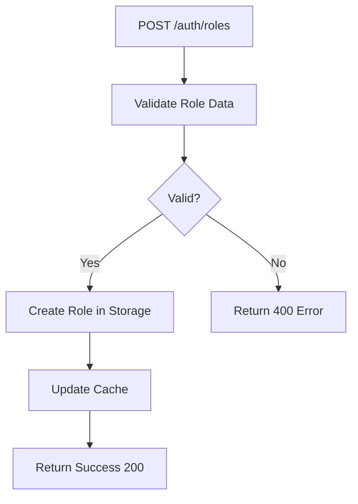
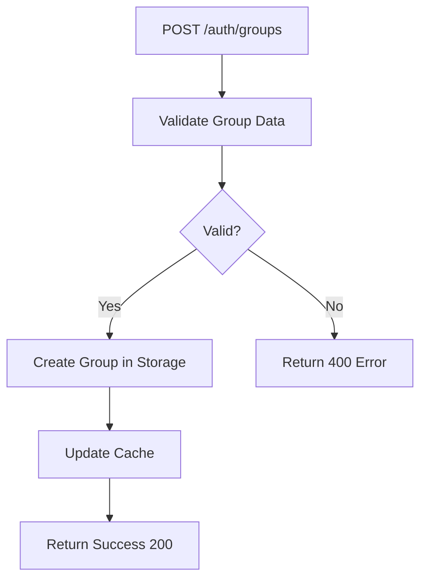
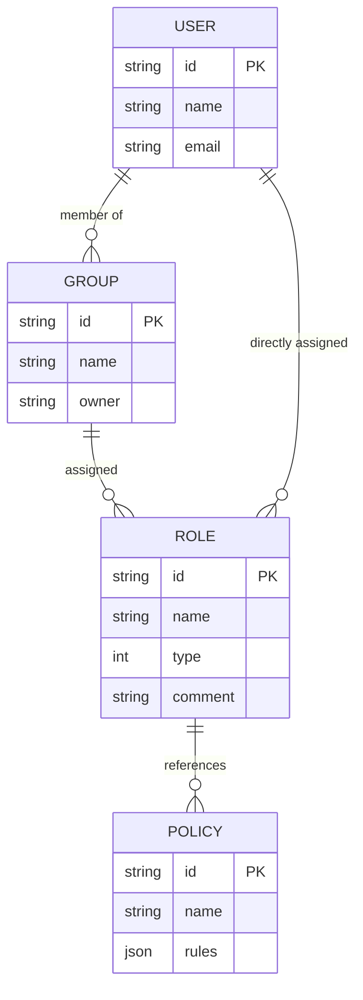
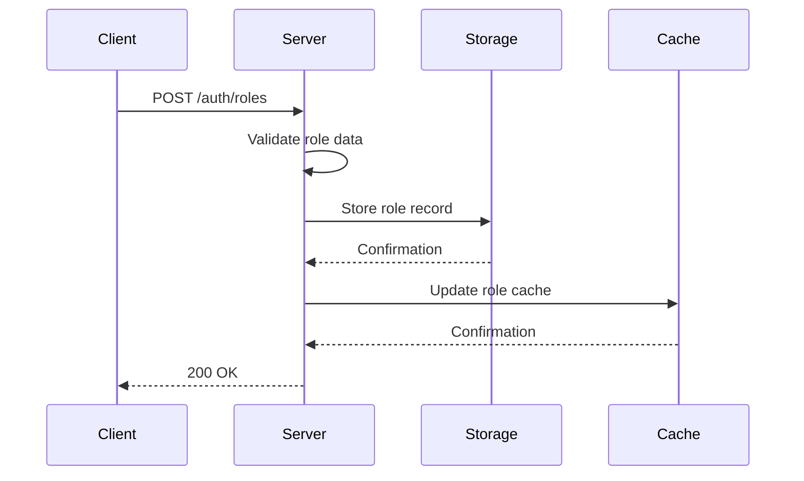
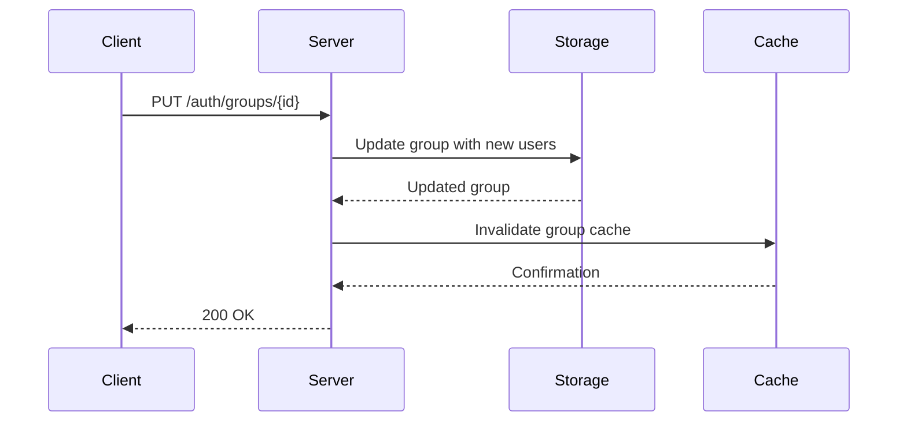
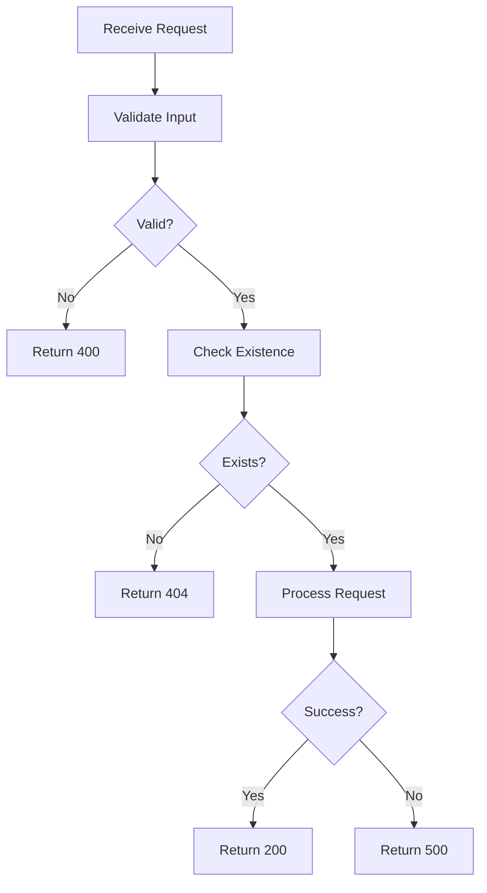

# Role-Based Access Control (RBAC) HTTP API

<cite>
**Referenced Files in This Document**   
- [role_access.go](file://plugin/apiserver/httpserver/auth/role_access.go)
- [group_access.go](file://plugin/apiserver/httpserver/auth/group_access.go)
- [policy.go](file://plugin/access_control/auth/policy/policy.go)
- [role.go](file://plugin/access_control/auth/policy/role.go)
- [user.go](file://plugin/access_control/auth/user/user.go)
- [group.go](file://plugin/access_control/auth/user/group.go)
- [auth_apidoc.go](file://plugin/apiserver/httpserver/docs/auth_apidoc.go)
- [auth.go](file://apis/access_control/auth/auth.go)
- [const.go](file://apis/pkg/types/auth/const.go)
- [cache/role.go](file://pkg/cache/auth/role.go)
</cite>

## Table of Contents
1. [Introduction](#introduction)
2. [Core Components](#core-components)
3. [Role Management](#role-management)
4. [Group Management](#group-management)
5. [Hierarchical Security Model](#hierarchical-security-model)
6. [Request and Response Formats](#request-and-response-formats)
7. [Examples](#examples)
8. [Validation and Error Handling](#validation-and-error-handling)
9. [Use Cases](#use-cases)
10. [Conclusion](#conclusion)

## Introduction
The Role-Based Access Control (RBAC) system in pole-server provides a robust mechanism for managing access permissions through roles and groups. This document details the HTTP API endpoints `/auth/roles` and `/auth/groups`, focusing on CRUD operations, hierarchical relationships, request/response formats, validation rules, and practical use cases. The system supports both built-in system roles and custom roles, enabling fine-grained access control and delegation of administrative responsibilities.

**Section sources**
- [auth.go](file://apis/access_control/auth/auth.go#L1-L50)

## Core Components

The RBAC system is composed of several key components that work together to manage access control:

- **Roles**: Define sets of permissions that can be assigned to users or groups.
- **Groups**: Collections of users that can be assigned roles, enabling bulk permission management.
- **Policies**: Underlying permission definitions that roles reference.
- **Users**: Individual accounts that can be members of groups or directly assigned roles.

These components are managed through HTTP endpoints and backed by a persistent store.

**Section sources**
- [role.go](file://plugin/access_control/auth/policy/role.go#L33-L69)
- [group.go](file://plugin/access_control/auth/user/group.go#L1-L50)
- [policy.go](file://plugin/access_control/auth/policy/policy.go#L1-L40)

## Role Management

The `/auth/roles` endpoint supports full CRUD operations for managing roles in the system.

### Create Roles
Roles can be created in bulk via POST request to `/auth/roles`. Each role includes a name, description, owner, metadata, and associated policies.

### Update Roles
Existing roles can be updated via PUT request to `/auth/roles`. Updates can modify role name, description, policies, and assignments.

### Delete Roles
Roles can be deleted in bulk via POST request to `/auth/roles/delete`. Deletion is subject to validation rules.

### List Roles
Roles can be queried via GET request to `/auth/roles` with optional query parameters for filtering.



**Diagram sources**
- [role_access.go](file://plugin/apiserver/httpserver/auth/role_access.go#L31-L79)
- [role.go](file://plugin/access_control/auth/policy/role.go#L33-L69)

**Section sources**
- [role_access.go](file://plugin/apiserver/httpserver/auth/role_access.go#L31-L113)
- [role.go](file://plugin/access_control/auth/policy/role.go#L33-L69)

## Group Management

The `/auth/groups` endpoint provides CRUD operations for managing user groups.

### Create Groups
Groups are created with a name, owner, and optional metadata. Users can be added during creation or later.

### Update Groups
Existing groups can be modified to add or remove users, update metadata, or change group properties.

### Delete Groups
Groups can be deleted, which removes the group but does not delete the users within it.

### List Groups
Groups can be queried with filtering options to retrieve specific subsets.



**Diagram sources**
- [group_access.go](file://plugin/apiserver/httpserver/auth/group_access.go#L1-L30)
- [group.go](file://plugin/access_control/auth/user/group.go#L1-L50)

**Section sources**
- [group_access.go](file://plugin/apiserver/httpserver/auth/group_access.go#L1-L30)
- [group.go](file://plugin/access_control/auth/user/group.go#L1-L50)

## Hierarchical Security Model

The pole-server security model implements a hierarchical relationship between users, groups, and roles.



**Diagram sources**
- [auth.go](file://apis/pkg/types/auth/auth.go#L532-L591)
- [role.go](file://plugin/access_control/auth/policy/role.go#L33-L69)
- [group.go](file://plugin/access_control/auth/user/group.go#L1-L50)

**Section sources**
- [auth.go](file://apis/pkg/types/auth/auth.go#L532-L591)

## Request and Response Formats

### Role Definition Format
```json
{
  "id": "string",
  "name": "string",
  "owner": "string",
  "source": "string",
  "type": 1|2,
  "metadata": {"key": "value"},
  "comment": "string",
  "users": [{"id": "string"}],
  "userGroups": [{"id": "string"}],
  "defaultRole": true|false,
  "ctime": "timestamp",
  "mtime": "timestamp"
}
```

### Group Definition Format
```json
{
  "id": "string",
  "name": "string",
  "owner": "string",
  "metadata": {"key": "value"},
  "comment": "string",
  "users": [{"id": "string"}],
  "ctime": "timestamp",
  "mtime": "timestamp"
}
```

**Section sources**
- [auth.go](file://apis/pkg/types/auth/auth.go#L532-L591)
- [const.go](file://apis/pkg/types/auth/const.go#L450-L505)

## Examples

### Creating a 'developer' Role
To create a role with specific service access policies:



**Diagram sources**
- [role_access.go](file://plugin/apiserver/httpserver/auth/role_access.go#L31-L79)
- [role.go](file://plugin/access_control/auth/policy/role.go#L33-L69)

### Adding Users to 'finance-team' Group
To add users to an existing group:



**Diagram sources**
- [group_access.go](file://plugin/apiserver/httpserver/auth/group_access.go#L1-L30)
- [group.go](file://plugin/access_control/auth/user/group.go#L1-L50)

**Section sources**
- [role_access.go](file://plugin/apiserver/httpserver/auth/role_access.go#L31-L79)
- [group_access.go](file://plugin/apiserver/httpserver/auth/group_access.go#L1-L30)

## Validation and Error Handling

### Validation Rules
- Role names must be unique within the system
- Policy lists cannot be empty for custom roles
- Group names must be unique
- Circular group references are prohibited

### Error Responses
- **400 Bad Request**: Invalid input data, empty policy lists, or circular references
- **404 Not Found**: Requested role or group does not exist
- **409 Conflict**: Attempt to create a role with a duplicate name
- **500 Internal Server Error**: Storage or system failures



**Diagram sources**
- [role.go](file://plugin/access_control/auth/policy/role.go#L33-L69)
- [group.go](file://plugin/access_control/auth/user/group.go#L1-L50)

**Section sources**
- [role.go](file://plugin/access_control/auth/policy/role.go#L33-L69)
- [group.go](file://plugin/access_control/auth/user/group.go#L1-L50)

## Use Cases

### Organizing Large Teams
Groups provide an efficient way to manage permissions for large teams. By assigning roles to groups rather than individual users, administrators can manage access at scale. When team members change, only group membership needs to be updated, not individual permissions.

### Delegating Administrative Responsibilities
Administrators can delegate management of specific groups to team leads by assigning them appropriate roles. This enables decentralized management while maintaining overall control through the RBAC system.

### Role Propagation
When a role is assigned to a group, all members of that group inherit the role's permissions. This propagation happens automatically and is maintained consistently across the system.

**Section sources**
- [role.go](file://plugin/access_control/auth/policy/role.go#L33-L69)
- [group.go](file://plugin/access_control/auth/user/group.go#L1-L50)

## Conclusion
The RBAC system in pole-server provides a comprehensive solution for managing access control through roles and groups. The HTTP API endpoints `/auth/roles` and `/auth/groups` support full CRUD operations with robust validation and error handling. The hierarchical model of users, groups, and roles enables efficient permission management at scale, supporting both centralized and decentralized administration patterns. Built-in system roles and customizable roles provide flexibility for various security requirements.