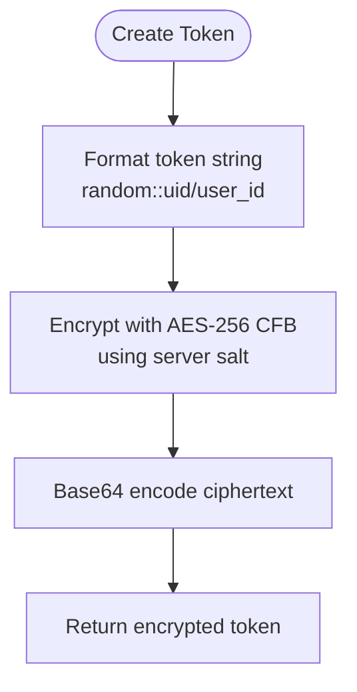
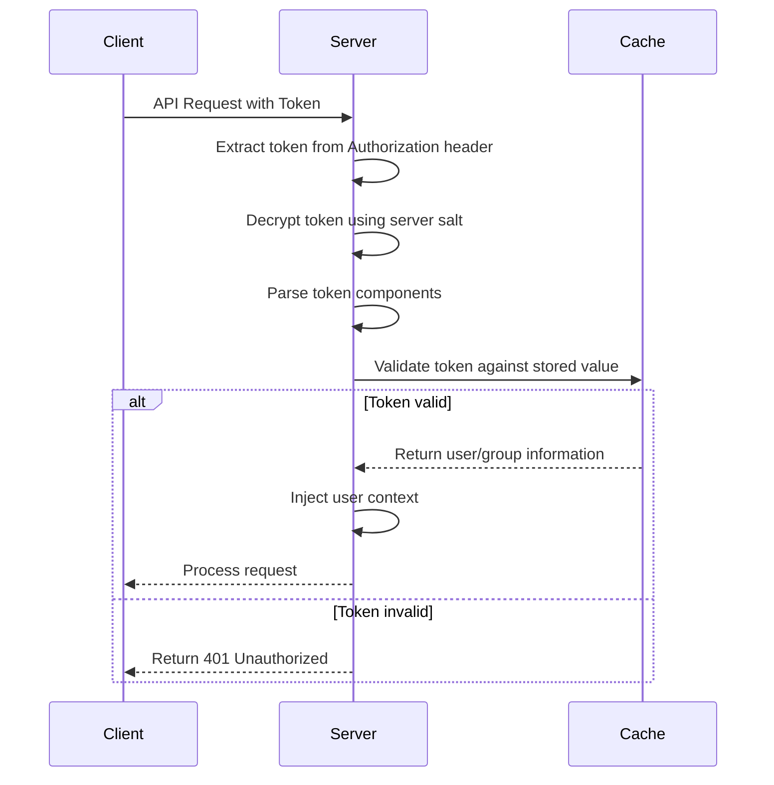
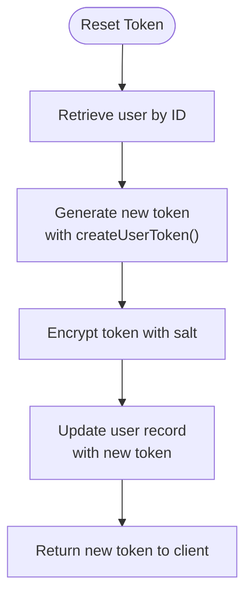

# Token Authentication HTTP API

<cite>
**Referenced Files in This Document**   
- [token.go](file://plugin/access_control/auth/user/token.go)
- [user.go](file://plugin/access_control/auth/user/user.go)
- [user_access.go](file://plugin/apiserver/httpserver/auth/user_access.go)
- [config.go](file://bootstrap/config/config.go)
- [default_boot.go](file://bootstrap/config/default_boot.go)
</cite>

## Table of Contents
1. [Introduction](#introduction)
2. [Authentication Endpoints](#authentication-endpoints)
3. [Token Structure and Claims](#token-structure-and-claims)
4. [Token Validation Process](#token-validation-process)
5. [Token Management Operations](#token-management-operations)
6. [Security Configuration](#security-configuration)
7. [Error Responses](#error-responses)
8. [API Usage Examples](#api-usage-examples)

## Introduction
The Token Authentication system provides a secure mechanism for user authentication and authorization through encrypted tokens. The system implements a token-based authentication flow that allows users to authenticate with their credentials and obtain encrypted tokens for subsequent API requests. This document details the authentication endpoints, token structure, validation process, and security aspects of the implementation.

**Section sources**
- [user_access.go](file://plugin/apiserver/httpserver/auth/user_access.go#L0-L30)
- [config.go](file://bootstrap/config/config.go#L0-L126)

## Authentication Endpoints
The authentication system provides endpoints for user login and token retrieval. The primary authentication endpoint allows users to authenticate with their username and password credentials.

### Login Endpoint
The `/user/login` endpoint authenticates users and returns their associated token information.

**Request**
- Method: POST
- Path: `/user/login`
- Content-Type: application/json

**Request Body**
```json
{
  "name": "string",
  "password": "string"
}
```

**Response**
Upon successful authentication, the response contains the user's token information including the authentication token and token enable status.

```json
{
  "code": 200,
  "user": {
    "id": "string",
    "name": "string",
    "authToken": "string",
    "tokenEnable": boolean
  }
}
```

The login process verifies the user's credentials against stored password hashes and returns the existing token if authentication succeeds.

**Section sources**
- [user_access.go](file://plugin/apiserver/httpserver/auth/user_access.go#L32-L50)
- [user.go](file://plugin/access_control/auth/user/user.go#L0-L650)

## Token Structure and Claims
Authentication tokens in this system are encrypted strings that contain user identification information and are protected against tampering.

### Token Format
Tokens follow the format: `random_string::[uid/user_id | groupid/group_id]`

The token structure consists of:
- A random string prefix (8 characters from UUID)
- Separator "::"
- Type identifier ("uid" for users, "groupid" for groups)
- Actual user or group ID

### Token Encryption
All tokens are encrypted using AES-256 in CFB mode with a server-configured salt value. The encryption process ensures that token contents cannot be easily decoded or tampered with.



**Diagram sources**
- [token.go](file://plugin/access_control/auth/user/token.go#L129-L169)
- [token.go](file://plugin/access_control/auth/user/token.go#L171-L195)

**Section sources**
- [token.go](file://plugin/access_control/auth/user/token.go#L0-L195)

## Token Validation Process
The token validation process verifies the authenticity and validity of provided tokens before granting access to protected resources.

### Validation Flow


**Diagram sources**
- [user.go](file://plugin/access_control/auth/user/user.go#L396-L415)
- [token.go](file://plugin/access_control/auth/user/token.go#L41-L86)

**Section sources**
- [user.go](file://plugin/access_control/auth/user/user.go#L396-L415)
- [token.go](file://plugin/access_control/auth/user/token.go#L41-L86)

## Token Management Operations
The system provides several operations for managing user tokens, including retrieval, enabling/disabling, and resetting.

### Get User Token
Retrieves the authentication token for a specified user.

**Endpoint**: `GET /user/token?id={user_id}`

Returns the user's current authentication token and its enabled status.

### Enable/Disable Token
Enables or disables a user's token authentication capability.

**Endpoint**: `PUT /user/token/enable`

**Request Body**:
```json
{
  "id": "user_id",
  "tokenEnable": true|false
}
```

### Reset User Token
Generates a new authentication token for a user, invalidating the previous token.

**Endpoint**: `PUT /user/token/refresh`

This operation creates a new token using the user's ID and the server salt, then updates the user record with the new token value.



**Diagram sources**
- [user.go](file://plugin/access_control/auth/user/user.go#L366-L399)
- [user_access.go](file://plugin/apiserver/httpserver/auth/user_access.go#L170-L206)

**Section sources**
- [user.go](file://plugin/access_control/auth/user/user.go#L341-L399)
- [user_access.go](file://plugin/apiserver/httpserver/auth/user_access.go#L170-L206)

## Security Configuration
The authentication system includes configurable security parameters that control token behavior and system-wide authentication settings.

### Configuration Parameters
The system configuration is defined in the bootstrap configuration files, which include security-related settings.

**Key Configuration Files**:
- `bootstrap/config/config.go` - Main configuration structure
- `bootstrap/config/default_boot.go` - Default configuration values

The authentication configuration includes parameters for:
- Token encryption salt
- Authentication enforcement policies
- Logging configuration for authentication events

**Section sources**
- [config.go](file://bootstrap/config/config.go#L0-L126)
- [default_boot.go](file://bootstrap/config/default_boot.go#L0-L89)

## Error Responses
The authentication system returns specific error codes for various failure conditions during the authentication process.

### Authentication Errors
| Status Code | Error Code | Description |
|-----------|-----------|-------------|
| 401 | 40101 | Invalid token format or decryption failure |
| 401 | 40102 | Token does not exist or has been revoked |
| 401 | 40103 | Token has been disabled |
| 400 | 10001 | Invalid parameters in request |
| 404 | 30001 | User not found |

### Error Handling Process
When token validation fails, the system follows a strict error handling process that prevents information leakage while providing appropriate feedback to clients.

**Section sources**
- [user.go](file://plugin/access_control/auth/user/user.go#L396-L415)
- [token.go](file://plugin/access_control/auth/user/token.go#L0-L39)

## API Usage Examples
This section provides practical examples of using the authentication API endpoints.

### Login Example
```bash
curl -X POST http://localhost:8080/user/login \
  -H "Content-Type: application/json" \
  -d '{
    "name": "admin",
    "password": "admin"
  }'
```

### Retrieve User Token
```bash
curl -X GET "http://localhost:8080/user/token?id=123e4567-e89b-12d3-a456-426614174000" \
  -H "Authorization: Bearer {admin_token}"
```

### Enable User Token
```bash
curl -X PUT http://localhost:8080/user/token/enable \
  -H "Content-Type: application/json" \
  -H "Authorization: Bearer {admin_token}" \
  -d '{
    "id": "123e4567-e89b-12d3-a456-426614174000",
    "tokenEnable": true
  }'
```

### Make Authenticated API Call
```bash
curl -X GET http://localhost:8080/some/protected/endpoint \
  -H "Authorization: Bearer {user_token}"
```

**Section sources**
- [user_access.go](file://plugin/apiserver/httpserver/auth/user_access.go#L0-L207)
- [user.go](file://plugin/access_control/auth/user/user.go#L0-L650)