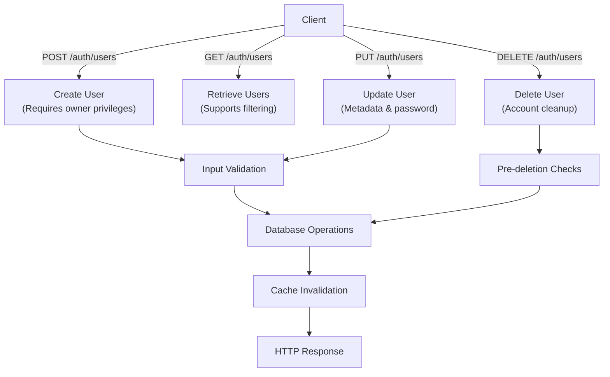
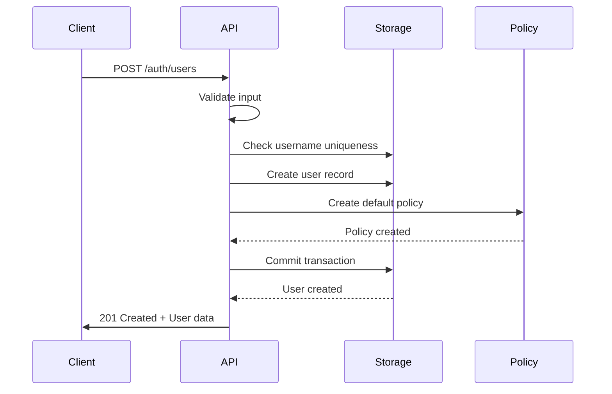
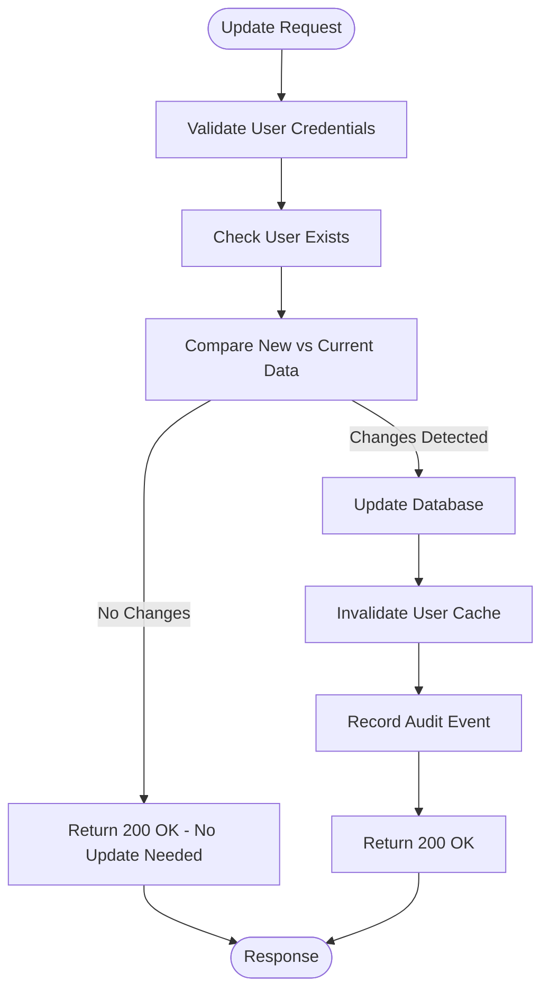
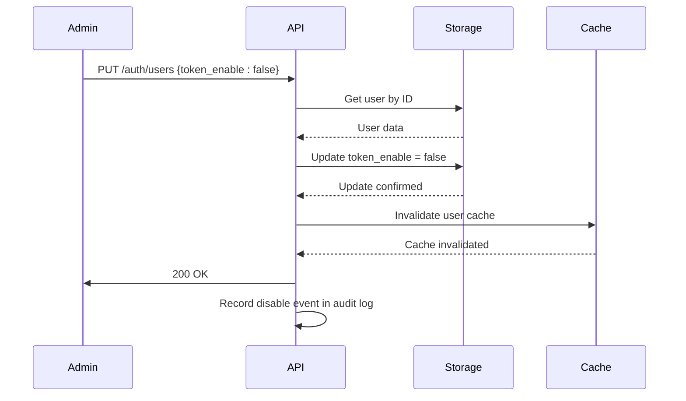
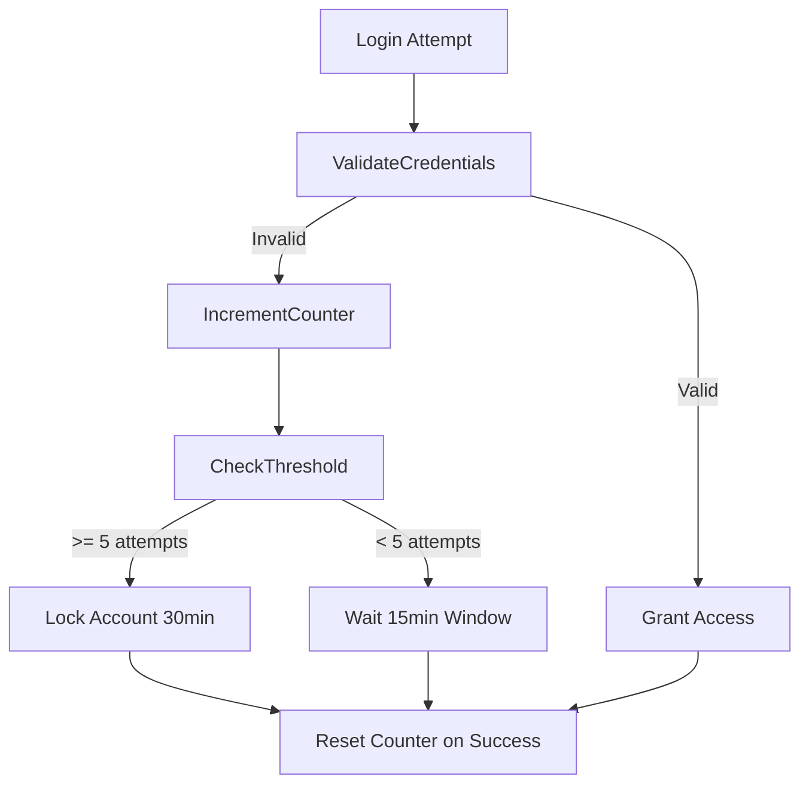
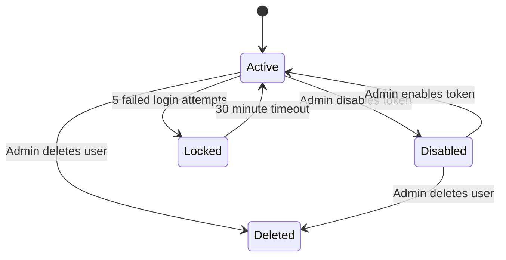

# User Management HTTP API

<cite>
**Referenced Files in This Document**   
- [api.go](file://apis/access_control/auth/api.go)
- [auth.go](file://apis/access_control/auth/auth.go)
- [user.go](file://pkg/cache/auth/user.go)
- [user.go](file://plugin/access_control/auth/user/user.go)
- [auth.go](file://pkg/common/api/v1/auth.go)
</cite>

## Table of Contents
1. [Introduction](#introduction)
2. [User Management Endpoints](#user-management-endpoints)
3. [Request/Response Schemas](#requestresponse-schemas)
4. [User Creation with Role Assignment](#user-creation-with-role-assignment)
5. [User Metadata Updates](#user-metadata-updates)
6. [Account Disabling](#account-disabling)
7. [Password and Security Policies](#password-and-security-policies)
8. [User Filtering and Query Parameters](#user-filtering-and-query-parameters)
9. [User Lifecycle States](#user-lifecycle-states)
10. [Error Handling](#error-handling)
11. [Security Considerations](#security-considerations)
12. [Related APIs](#related-apis)

## Introduction
This document provides comprehensive documentation for the User Management HTTP API endpoints under the `/auth/users` path. The API enables CRUD operations for user accounts with robust security features including role-based access control, password complexity requirements, and account lockout policies. The system implements a hierarchical user model with owner and sub-account roles, supporting enterprise-grade identity and access management requirements.

**Section sources**
- [api.go](file://apis/access_control/auth/api.go#L1-L50)

## User Management Endpoints
The User Management API provides standard HTTP methods for user operations at the `/auth/users` endpoint:

- **POST /auth/users**: Create new user accounts
- **GET /auth/users**: Retrieve user listings with filtering capabilities
- **PUT /auth/users**: Update user metadata and attributes
- **DELETE /auth/users**: Delete user accounts

Each endpoint enforces strict authentication and authorization controls, requiring valid credentials with appropriate permissions to perform operations. The API follows RESTful principles with predictable resource paths and standard HTTP status codes for responses.



**Diagram sources**
- [api.go](file://apis/access_control/auth/api.go#L50-L100)
- [user.go](file://plugin/access_control/auth/user/user.go#L20-L50)

**Section sources**
- [api.go](file://apis/access_control/auth/api.go#L50-L150)

## Request/Response Schemas
The User Management API uses standardized request and response schemas for all operations.

### User Request Schema
```json
{
  "id": "string",
  "name": "string",
  "password": "string",
  "source": "string",
  "comment": "string",
  "metadata": {
    "key": "string"
  },
  "user_type": "string"
}
```

### User Response Schema
```json
{
  "id": "string",
  "name": "string",
  "source": "string",
  "token_enable": "boolean",
  "comment": "string",
  "ctime": "string",
  "mtime": "string",
  "user_type": "string",
  "metadata": {
    "key": "string"
  }
}
```

The response schema excludes the password field for security reasons, returning only the hashed password reference. The `user_type` field indicates the user's role (owner or sub-account), while `token_enable` shows whether the user's authentication token is active.

**Section sources**
- [user.go](file://plugin/access_control/auth/user/user.go#L500-L550)
- [auth.go](file://pkg/common/api/v1/auth.go#L1-L20)

## User Creation with Role Assignment
Creating a new user requires a POST request to `/auth/users` with user details and implicit role assignment through the user type.

### Example Request
```bash
curl -X POST https://api.example.com/auth/users \
  -H "Authorization: Bearer <owner_token>" \
  -H "Content-Type: application/json" \
  -d '{
    "name": "jane.doe",
    "password": "ComplexPass123!",
    "comment": "Marketing Team Member",
    "metadata": {
      "department": "marketing",
      "location": "NYC"
    }
  }'
```

When a user is created, the system automatically assigns a default policy based on the user's role and creates a unique authentication token. The owner creating the user must have appropriate privileges and cannot create users with the same name as their own account.



**Diagram sources**
- [user.go](file://plugin/access_control/auth/user/user.go#L100-L200)
- [api.go](file://apis/access_control/auth/api.go#L150-L200)

**Section sources**
- [user.go](file://plugin/access_control/auth/user/user.go#L100-L250)

## User Metadata Updates
Users can update their metadata and profile information through PUT requests to `/auth/users`.

### Example Request
```bash
curl -X PUT https://api.example.com/auth/users \
  -H "Authorization: Bearer <user_token>" \
  -H "Content-Type: application/json" \
  -d '{
    "id": "user-123",
    "comment": "Updated role: Senior Marketing Specialist",
    "metadata": {
      "department": "marketing",
      "location": "NYC",
      "team": "digital"
    }
  }'
```

The system supports partial updates, allowing clients to modify only specific fields without affecting others. Updates to user metadata trigger audit logging and cache invalidation to ensure consistency across the system.



**Diagram sources**
- [user.go](file://plugin/access_control/auth/user/user.go#L250-L350)
- [user.go](file://pkg/cache/auth/user.go#L300-L350)

**Section sources**
- [user.go](file://plugin/access_control/auth/user/user.go#L250-L400)

## Account Disabling
Administrators can disable user accounts to temporarily revoke access without deleting user data.

### Example Request
```bash
curl -X PUT https://api.example.com/auth/users \
  -H "Authorization: Bearer <admin_token>" \
  -H "Content-Type: application/json" \
  -d '{
    "id": "user-123",
    "token_enable": false
  }'
```

Disabling an account sets the `token_enable` flag to false, preventing the user from authenticating while preserving all user data and permissions. This operation is reversible through the EnableUserToken endpoint.



**Diagram sources**
- [user.go](file://plugin/access_control/auth/user/user.go#L400-L450)
- [user.go](file://pkg/cache/auth/user.go#L200-L250)

**Section sources**
- [user.go](file://plugin/access_control/auth/user/user.go#L400-L500)

## Password and Security Policies
The User Management API enforces strict password and security policies to protect user accounts.

### Password Complexity Requirements
- Minimum length: 8 characters
- Must contain uppercase and lowercase letters
- Must contain numbers
- Must contain special characters
- Cannot contain username or common patterns

### Account Lockout Policy
- After 5 failed login attempts within 15 minutes, the account is temporarily locked
- Lock duration: 30 minutes
- Lockout counter resets after successful login
- Administrators can manually unlock accounts

The system uses bcrypt with DefaultCost for password hashing, ensuring secure storage of credentials. Password updates require the current password for verification unless performed by an administrator.



**Diagram sources**
- [user.go](file://plugin/access_control/auth/user/user.go#L500-L600)
- [auth.go](file://apis/access_control/auth/auth.go#L100-L150)

**Section sources**
- [user.go](file://plugin/access_control/auth/user/user.go#L500-L650)

## User Filtering and Query Parameters
The GET /auth/users endpoint supports various query parameters for filtering and pagination.

### Supported Query Parameters
- **id**: Filter by user ID
- **name**: Filter by username (supports wildcards)
- **source**: Filter by user source
- **group_id**: Filter by user group membership
- **offset**: Pagination offset (default: 0)
- **limit**: Pagination limit (default: 100)

### Example Request
```bash
curl -X GET "https://api.example.com/auth/users?name=john*&group_id=team-alpha&limit=50" \
  -H "Authorization: Bearer <token>"
```

The filtering system leverages cached user data for high-performance queries, with results sorted by modification time in descending order. The response includes total count and size information to support client-side pagination.

**Section sources**
- [user.go](file://pkg/cache/auth/user.go#L400-L450)
- [user.go](file://plugin/access_control/auth/user/user.go#L350-L400)

## User Lifecycle States
User accounts transition through several states during their lifecycle:

### Active State
- Default state for newly created users
- Full system access based on assigned roles and policies
- Can authenticate and perform authorized operations

### Disabled State
- User authentication token is disabled
- Cannot log in or access system resources
- All user data and permissions preserved
- Reversible by administrator

### Locked State
- Temporary state after multiple failed login attempts
- Automatically transitions back to active after timeout
- Prevents brute force attacks

### Deleted State
- User record removed from system
- All associated policies and permissions cleaned up
- Non-reversible operation

The system maintains audit logs for all state transitions, providing visibility into account status changes.



**Diagram sources**
- [user.go](file://plugin/access_control/auth/user/user.go#L450-L500)
- [user.go](file://pkg/cache/auth/user.go#L100-L150)

**Section sources**
- [user.go](file://plugin/access_control/auth/user/user.go#L450-L500)

## Error Handling
The API returns standardized error responses with appropriate HTTP status codes.

### Common Error Codes
- **400 Bad Request**: Invalid input parameters
- **401 Unauthorized**: Missing or invalid authentication token
- **403 Forbidden**: Insufficient permissions for operation
- **404 Not Found**: User or resource not found
- **409 Conflict**: Resource already exists (e.g., duplicate username)
- **423 Locked**: User account is locked due to failed login attempts
- **500 Internal Server Error**: Unexpected server error

### Example Error Response
```json
{
  "code": 409,
  "error": "User already exists",
  "detail": "A user with the name 'jane.doe' already exists in the system"
}
```

The error handling system provides meaningful messages while avoiding disclosure of sensitive information that could aid malicious actors.

**Section sources**
- [user.go](file://plugin/access_control/auth/user/user.go#L50-L100)
- [auth.go](file://apis/access_control/auth/auth.go#L200-L230)

## Security Considerations
The User Management API implements multiple security layers to protect user data and system integrity.

### Password Security
- All passwords hashed using bcrypt with DefaultCost
- Hashing performed server-side; plaintext passwords never stored
- Password complexity enforced at creation and update

### Transmission Security
- All endpoints require HTTPS/TLS encryption
- Authentication tokens transmitted via Authorization header
- Sensitive operations require fresh authentication

### Access Control
- Role-based access control (RBAC) for all operations
- Owners can only manage their own sub-accounts
- Administrative actions require elevated privileges
- Comprehensive audit logging for all user operations

### Rate Limiting
- Protection against brute force attacks
- Account lockout after repeated failed attempts
- Rate limiting on authentication endpoints

The system follows security best practices to ensure the confidentiality, integrity, and availability of user management functions.

**Section sources**
- [user.go](file://plugin/access_control/auth/user/user.go#L600-L650)
- [auth.go](file://apis/access_control/auth/auth.go#L150-L200)

## Related APIs
The User Management API integrates with several related endpoints to provide complete RBAC functionality.

### Role Management API
- `/auth/roles`: Create, update, and delete roles
- Assign permissions to roles
- Query role memberships

### Group Management API
- `/auth/groups`: Manage user groups
- Add/remove users from groups
- Group-based permission assignment

### Policy Management API
- `/auth/policies`: Define access control policies
- Assign policies to users, groups, or roles
- Evaluate effective permissions

These related APIs work together to provide a comprehensive identity and access management solution, allowing fine-grained control over system resources and operations.

**Section sources**
- [api.go](file://apis/access_control/auth/api.go#L100-L150)
- [auth.go](file://pkg/common/api/v1/auth.go#L1-L27)