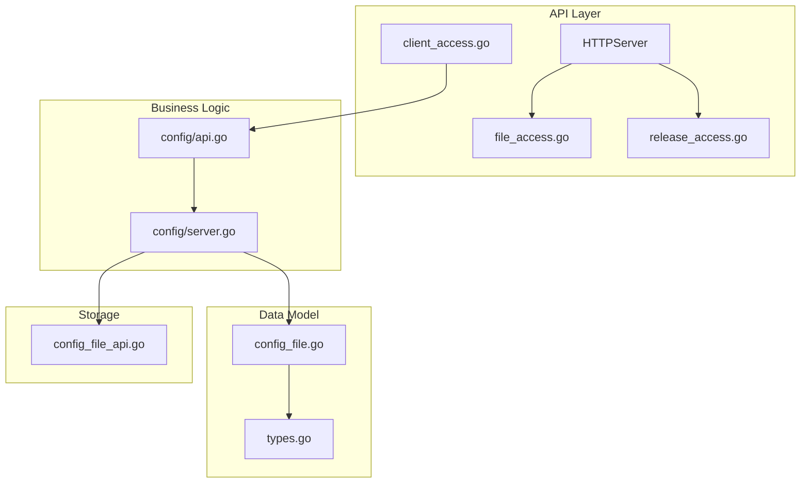
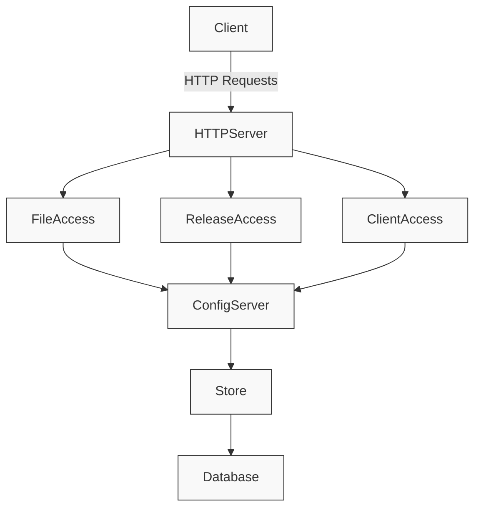
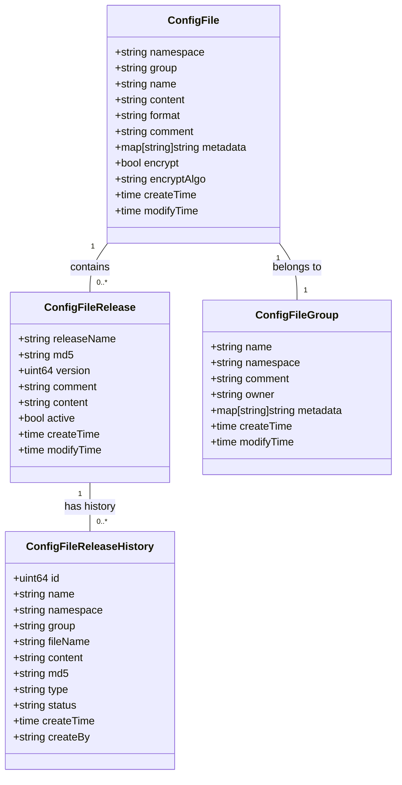
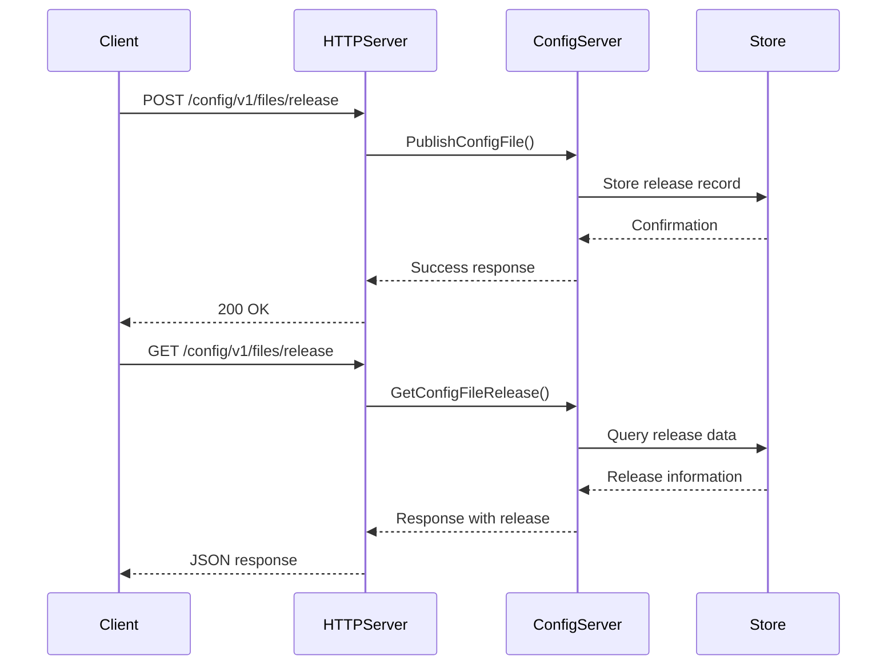
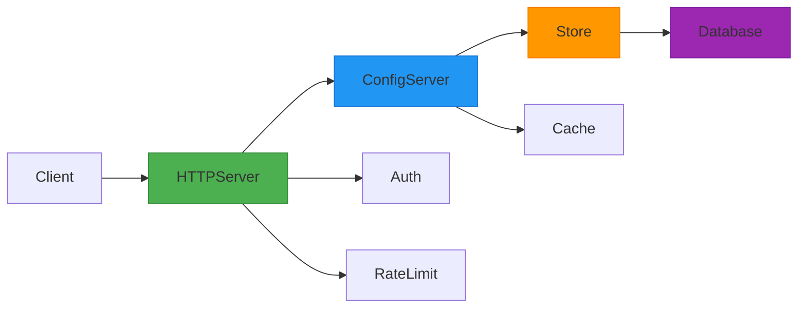

# Configuration Files

<cite>
**Referenced Files in This Document**   
- [config_file.go](file://apis/pkg/types/config/config_file.go)
- [types.go](file://apis/pkg/types/config/types.go)
- [api.go](file://pkg/config/api.go)
- [server.go](file://pkg/config/server.go)
- [file_access.go](file://plugin/apiserver/httpserver/config/file_access.go)
- [release_access.go](file://plugin/apiserver/httpserver/config/release_access.go)
- [client_access.go](file://plugin/apiserver/httpserver/config/client_access.go)
- [config_file_api.go](file://apis/store/config_file_api.go)
</cite>

## Table of Contents
1. [Introduction](#introduction)
2. [Project Structure](#project-structure)
3. [Core Components](#core-components)
4. [Architecture Overview](#architecture-overview)
5. [Detailed Component Analysis](#detailed-component-analysis)
6. [Dependency Analysis](#dependency-analysis)
7. [Performance Considerations](#performance-considerations)
8. [Troubleshooting Guide](#troubleshooting-guide)
9. [Conclusion](#conclusion)

## Introduction
This document provides comprehensive API documentation for the Configuration Files HTTP endpoints in pole-server. It covers all CRUD operations under the `/config/files` path, including creation, retrieval, update, and deletion of configuration files. The documentation details URL parameters, request/response formats, headers, validation rules, error responses, and usage examples.

## Project Structure
The configuration file management system is organized across multiple packages and directories within the pole-server repository. Core functionality is distributed between the `apis`, `pkg`, and `plugin` directories, with specific components dedicated to configuration file operations.



**Diagram sources**
- [file_access.go](file://plugin/apiserver/httpserver/config/file_access.go)
- [api.go](file://pkg/config/api.go)
- [config_file.go](file://apis/pkg/types/config/config_file.go)

**Section sources**
- [file_access.go](file://plugin/apiserver/httpserver/config/file_access.go)
- [server.go](file://pkg/config/server.go)

## Core Components
The configuration files system consists of several core components that handle different aspects of configuration management. These include file creation and modification, version management, release operations, and client-facing endpoints for configuration discovery and long-polling.

**Section sources**
- [config_file.go](file://apis/pkg/types/config/config_file.go)
- [api.go](file://pkg/config/api.go)
- [file_access.go](file://plugin/apiserver/httpserver/config/file_access.go)

## Architecture Overview
The configuration files architecture follows a layered approach with clear separation between HTTP interface, business logic, and data persistence. The system supports both administrative operations through REST APIs and client-facing operations for configuration discovery and watching.



**Diagram sources**
- [server.go](file://plugin/apiserver/httpserver/config/server.go)
- [file_access.go](file://plugin/apiserver/httpserver/config/file_access.go)
- [release_access.go](file://plugin/apiserver/httpserver/config/release_access.go)

## Detailed Component Analysis

### Configuration File Management
The configuration file management system provides comprehensive CRUD operations for configuration files with support for metadata, versioning, and access control.

#### File Operations Class Diagram


**Diagram sources**
- [config_file.go](file://apis/pkg/types/config/config_file.go)

### API Endpoint Analysis

#### Configuration Files CRUD Operations
The system provides standard CRUD operations for configuration files through the following endpoints:

| Operation | Method | Endpoint | Description |
|---------|--------|---------|-------------|
| Create | POST | /config/v1/files | Create one or more configuration files |
| Retrieve | GET | /config/v1/files/detail | Get a specific configuration file |
| Update | PUT | /config/v1/files | Update existing configuration files |
| Delete | POST | /config/v1/files/delete | Delete specified configuration files |
| Search | GET | /config/v1/files/search | Search configuration files by criteria |

**Section sources**
- [file_access.go](file://plugin/apiserver/httpserver/config/file_access.go)

#### Configuration Release Operations
The release management system handles versioning and deployment of configuration changes:



**Diagram sources**
- [release_access.go](file://plugin/apiserver/httpserver/config/release_access.go)
- [config_file_api.go](file://apis/store/config_file_api.go)

#### Client Configuration Discovery
The client discovery mechanism supports long-polling for configuration changes:

```mermaid
sequenceDiagram
participant Client
participant HTTPServer
participant ConfigServer
Client->>HTTPServer : POST /WatchConfigFile
HTTPServer->>ConfigServer : LongPullWatchFile()
alt Configuration changed
ConfigServer-->>HTTPServer : Immediate response
HTTPServer-->>Client : Updated configuration
else No changes
ConfigServer waits for changes or timeout
ConfigServer-->>HTTPServer : Response on change/timeout
HTTPServer-->>Client : Current configuration state
end
```

**Diagram sources**
- [client_access.go](file://plugin/apiserver/httpserver/config/client_access.go)

## Dependency Analysis
The configuration files system has well-defined dependencies between components, ensuring loose coupling and clear responsibility boundaries.



**Diagram sources**
- [server.go](file://pkg/config/server.go)
- [config_file_api.go](file://apis/store/config_file_api.go)

**Section sources**
- [server.go](file://pkg/config/server.go)
- [config_file_api.go](file://apis/store/config_file_api.go)

## Performance Considerations
The configuration files system is designed with performance in mind, particularly for client-facing operations. The use of caching mechanisms and efficient database queries ensures responsive performance even under heavy load. Long-polling operations are optimized to minimize server resource usage while providing timely configuration updates to clients.

## Troubleshooting Guide
Common issues and their solutions:

- **Configuration not persisting**: Verify that the transaction was committed successfully and check database connectivity
- **Encoding problems with special characters**: Ensure UTF-8 encoding is used and validate content before submission
- **Large file storage performance**: Consider breaking large configurations into smaller files or using external storage for large payloads
- **404 File Not Found**: Verify namespace, group, and filename parameters match exactly (case-sensitive)
- **409 Version Mismatch**: When updating, ensure you're working with the latest version of the configuration
- **400 Invalid Syntax**: Check that group and filename follow allowed character rules (alphanumeric, hyphen, underscore)

**Section sources**
- [config_file.go](file://apis/pkg/types/config/config_file.go)
- [file_access.go](file://plugin/apiserver/httpserver/config/file_access.go)

## Conclusion
The Configuration Files system in pole-server provides a robust, scalable solution for managing application configurations. With comprehensive CRUD operations, version management, and efficient client discovery mechanisms, it supports both administrative management and runtime configuration needs. The clear separation of concerns and well-documented APIs make it easy to integrate and maintain.