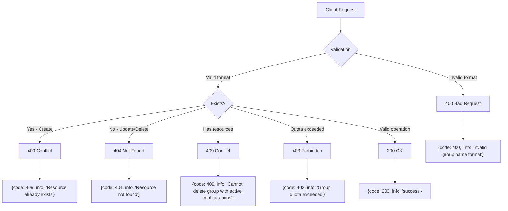
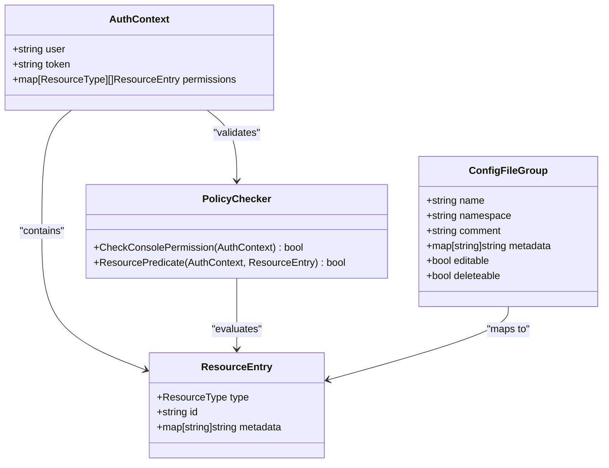
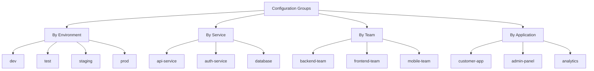

# Configuration Groups

<cite>
**Referenced Files in This Document**   
- [config_file_group.go](file://pkg/config/config_file_group.go)
- [config_file_group.go](file://pkg/config/interceptor/auth/config_file_group.go)
- [config_file_group.go](file://plugin/store/mysql/config_file_group.go)
- [group_access.go](file://plugin/apiserver/httpserver/config/group_access.go)
- [config_response.go](file://pkg/common/api/v1/config_response.go)
- [codeinfo.go](file://pkg/common/api/v1/codeinfo.go)
</cite>

## Table of Contents
1. [Introduction](#introduction)
2. [Core Endpoints](#core-endpoints)
3. [Request/Response Schemas](#requestresponse-schemas)
4. [Error Handling](#error-handling)
5. [Access Control and Permissions](#access-control-and-permissions)
6. [Usage Examples](#usage-examples)
7. [Best Practices](#best-practices)
8. [Common Issues and Troubleshooting](#common-issues-and-troubleshooting)

## Introduction

Configuration Groups in pole-server serve as logical containers for organizing configuration files, enabling teams to manage settings across different environments (dev, test, prod), service tiers, or application domains. The `/config/groups` endpoints provide a comprehensive API for managing these groups throughout their lifecycle. Each configuration group is uniquely identified by a combination of `groupName` and `namespace`, and can contain multiple configuration files that share common metadata and ownership.

Groups support rich metadata, business context (via `business` and `department` fields), and access control policies. They are integral to the configuration management workflow, providing a hierarchical structure that aligns with organizational and operational requirements. The API supports batch operations for efficiency and includes comprehensive auditing through history recording for all create, update, and delete operations.

**Section sources**
- [config_file_group.go](file://pkg/config/config_file_group.go#L1-L50)

## Core Endpoints

The Configuration Groups API provides four primary endpoints for managing groups:

### Create Configuration Groups
- **Endpoint**: `POST /config/groups`
- **Method**: POST
- **Purpose**: Creates one or more configuration groups
- **Behavior**: Automatically creates the namespace if it doesn't exist. Returns 409 if the group already exists within the namespace.

### List Configuration Groups
- **Endpoint**: `GET /config/groups`
- **Method**: GET
- **Purpose**: Retrieves a list of configuration groups with filtering and pagination
- **Parameters**: Supports filtering by namespace, group name, business, and department. Includes pagination via offset and limit.

### Update Configuration Groups
- **Endpoint**: `PUT /config/groups`
- **Method**: PUT
- **Purpose**: Updates metadata of existing configuration groups
- **Behavior**: Only comment, business, department, and metadata fields can be updated. Returns 404 if the group doesn't exist.

### Delete Configuration Groups
- **Endpoint**: `POST /config/groups/delette`
- **Method**: POST
- **Purpose**: Deletes one or more configuration groups
- **Behavior**: Prevents deletion if the group contains active configuration files or releases. Returns 404 if the group doesn't exist.

**Section sources**
- [group_access.go](file://plugin/apiserver/httpserver/config/group_access.go#L32-L110)

## Request/Response Schemas

### Configuration Group Schema
The Configuration Group object includes the following fields:

| Field | Type | Required | Description |
|-------|------|----------|-------------|
| `id` | uint64 | Read-only | Unique identifier assigned by the system |
| `name` | string | Yes | Name of the configuration group |
| `namespace` | string | Yes | Namespace containing the group |
| `comment` | string | No | Description or notes about the group |
| `business` | string | No | Business unit or domain |
| `department` | string | No | Organizational department |
| `metadata` | map[string]string | No | Key-value pairs for additional attributes |
| `fileCount` | uint64 | Read-only | Number of configuration files in the group |
| `editable` | bool | Read-only | Whether the current user can modify the group |
| `deleteable` | bool | Read-only | Whether the current user can delete the group |

### Create Request
```json
{
  "config_file_groups": [
    {
      "namespace": "string",
      "name": "string",
      "comment": "string",
      "business": "string",
      "department": "string",
      "metadata": {
        "key": "value"
      }
    }
  ]
}
```

### List Response
```json
{
  "code": 200,
  "info": "success",
  "total": 1,
  "config_file_groups": [
    {
      "id": 123,
      "namespace": "string",
      "name": "string",
      "comment": "string",
      "business": "string",
      "department": "string",
      "metadata": {
        "key": "value"
      },
      "file_count": 5,
      "editable": true,
      "deleteable": false
    }
  ]
}
```

**Section sources**
- [config_file.go](file://apis/pkg/types/config/config_file.go#L35-L50)
- [config_response.go](file://pkg/common/api/v1/config_response.go#L98-L127)

## Error Handling

The Configuration Groups API implements comprehensive error handling with standardized response codes:

### Common Error Conditions



**Diagram sources**
- [config_file_group.go](file://pkg/config/config_file_group.go#L30-L100)
- [codeinfo.go](file://pkg/common/api/v1/codeinfo.go#L106-L107)

### Error Code Reference

| HTTP Status | Code Value | Error Type | Description |
|-----------|------------|------------|-------------|
| 400 | 400 | InvalidRequest | Invalid group name format or malformed request |
| 403 | 403 | Forbidden | Group quota exceeded or insufficient permissions |
| 404 | 404 | NotFound | Configuration group does not exist |
| 409 | 409 | Conflict | Group already exists or has active resources |

Specific validation rules include:
- Group names must follow naming conventions (alphanumeric, hyphens, underscores)
- Names cannot exceed 128 characters
- Required fields (`namespace`, `name`) must be provided
- Metadata keys must be valid strings

**Section sources**
- [config_file_group.go](file://pkg/config/config_file_group.go#L50-L80)
- [codeinfo.go](file://pkg/common/api/v1/codeinfo.go#L158-L166)

## Access Control and Permissions

Configuration Groups implement a comprehensive access control system that integrates with the platform's authentication and authorization framework.

### Permission Model



**Diagram sources**
- [config_file_group.go](file://pkg/config/interceptor/auth/config_file_group.go#L30-L80)

### Permission Levels

The system enforces four primary permission levels for configuration groups:

1. **Create**: Required to create new groups in a namespace
2. **Read**: Required to list and view group details
3. **Update**: Required to modify group metadata
4. **Delete**: Required to remove groups

The API automatically evaluates permissions during query operations and sets `editable` and `deleteable` flags in the response based on the caller's privileges. This prevents unauthorized modifications while providing clear feedback about available actions.

Namespace-level permissions also affect group access - users must have appropriate namespace permissions to perform operations on groups within that namespace.

**Section sources**
- [config_file_group.go](file://pkg/config/interceptor/auth/config_file_group.go#L30-L177)

## Usage Examples

### Creating a Development Environment Group

```bash
curl -X POST "http://localhost:8080/config/groups" \
  -H "Content-Type: application/json" \
  -d '{
    "config_file_groups": [
      {
        "namespace": "my-service",
        "name": "dev",
        "comment": "Development environment configurations",
        "business": "engineering",
        "department": "platform",
        "metadata": {
          "environment": "development",
          "team": "backend"
        }
      }
    ]
  }'
```

**Expected Response**:
```json
{
  "code": 200,
  "info": "success",
  "responses": [
    {
      "code": 200,
      "info": "success",
      "config_file_group": {
        "id": 1001,
        "namespace": "my-service",
        "name": "dev",
        "comment": "Development environment configurations",
        "business": "engineering",
        "department": "platform",
        "metadata": {
          "environment": "development",
          "team": "backend"
        }
      }
    }
  ]
}
```

### Listing Groups in a Namespace

```bash
curl -X GET "http://localhost:8080/config/groups?namespace=my-service&offset=0&limit=10" \
  -H "Authorization: Bearer your-token"
```

### Deleting an Unused Group

```bash
curl -X POST "http://localhost:8080/config/groups/delette" \
  -H "Content-Type: application/json" \
  -d '{
    "config_file_groups": [
      {
        "namespace": "my-service",
        "name": "deprecated-v1"
      }
    ]
  }'
```

**Section sources**
- [group_access.go](file://plugin/apiserver/httpserver/config/group_access.go#L32-L110)
- [config_file_group_test.go](file://test/integrate/config_file_group_test.go#L36-L93)

## Best Practices

### Organizational Strategies

When implementing Configuration Groups, consider these organizational patterns:



**Diagram sources**
- [config_file_group.go](file://pkg/config/config_file_group.go#L200-L250)

### Recommended Practices

1. **Consistent Naming**: Use a consistent naming convention across your organization (e.g., lowercase with hyphens)
2. **Metadata Utilization**: Leverage metadata for additional context like team ownership, SLA levels, or compliance requirements
3. **Quota Management**: Monitor group creation to prevent namespace pollution
4. **Lifecycle Management**: Implement processes for cleaning up unused groups
5. **Access Control**: Define clear permission policies for different team roles

Groups should be created strategically rather than ad-hoc, with consideration for long-term maintenance and discoverability.

**Section sources**
- [config_file_group.go](file://pkg/config/config_file_group.go#L1-L50)

## Common Issues and Troubleshooting

### Handling Common Error Scenarios

| Issue | Cause | Resolution |
|------|-------|------------|
| 409 Conflict on Create | Group already exists | Use GET to check existence first, or implement upsert logic |
| 409 Conflict on Delete | Group contains active configurations | Remove or migrate configuration files before deletion |
| 403 Forbidden | Exceeded group quota | Contact administrator to increase quota or clean up unused groups |
| 404 Not Found | Invalid namespace or group name | Verify namespace exists and group name is correct |
| 400 Bad Request | Invalid group name format | Ensure name follows naming conventions (alphanumeric, hyphens, underscores) |

### Performance Considerations

Having too many configuration groups in a namespace can impact query performance. For optimal performance:

- Limit the number of groups per namespace to a manageable level (recommended: < 1,000)
- Use pagination when listing groups
- Implement client-side caching for frequently accessed group metadata
- Avoid creating temporary or one-off groups

The system automatically prevents deletion of groups with active configurations, protecting against accidental data loss. When a deletion is attempted on a group with resources, the API returns a 409 Conflict response with appropriate messaging.

**Section sources**
- [config_file_group.go](file://pkg/config/config_file_group.go#L150-L200)
- [config_file_group.go](file://plugin/store/mysql/config_file_group.go#L100-L150)