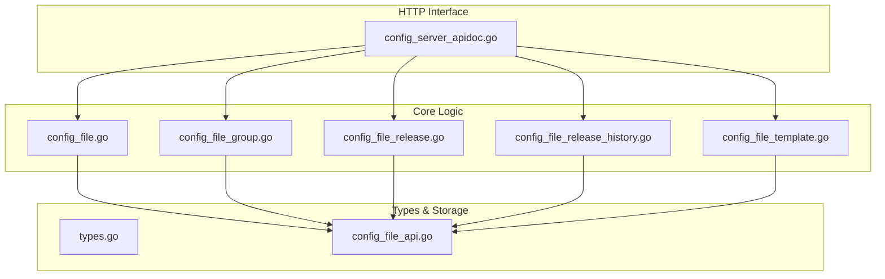
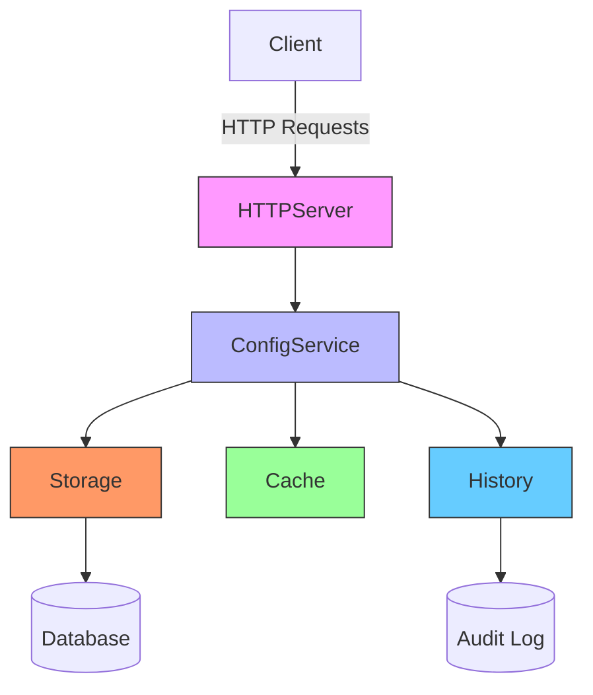
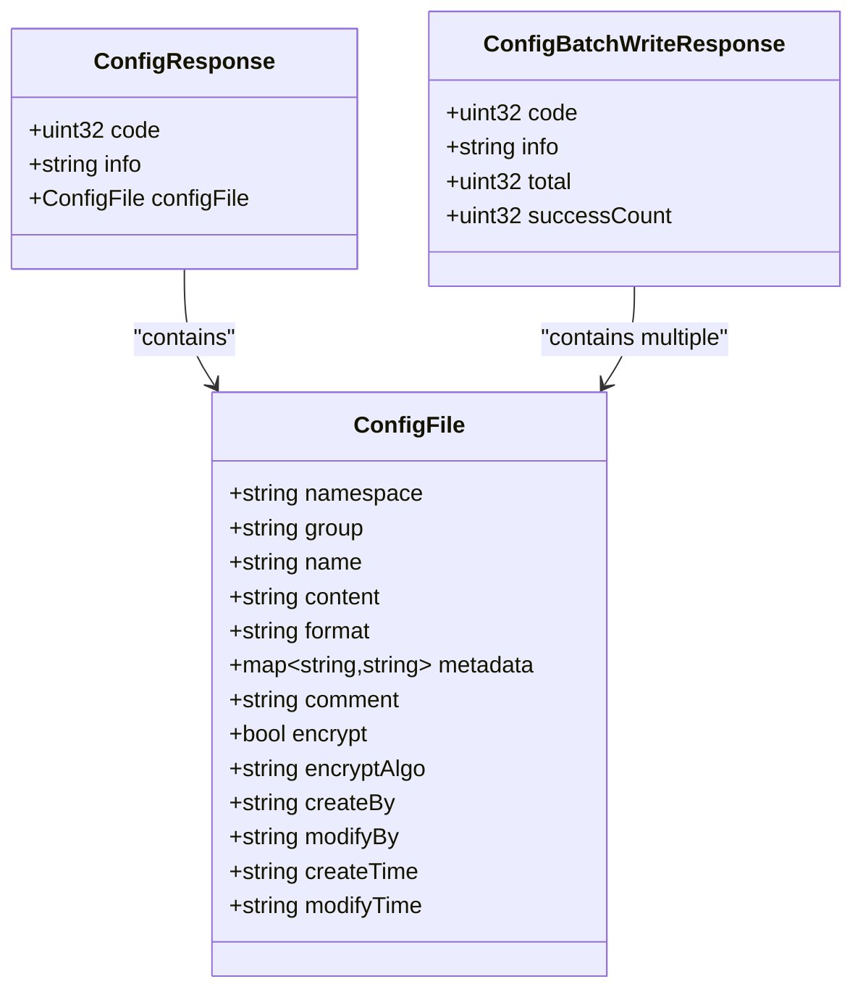
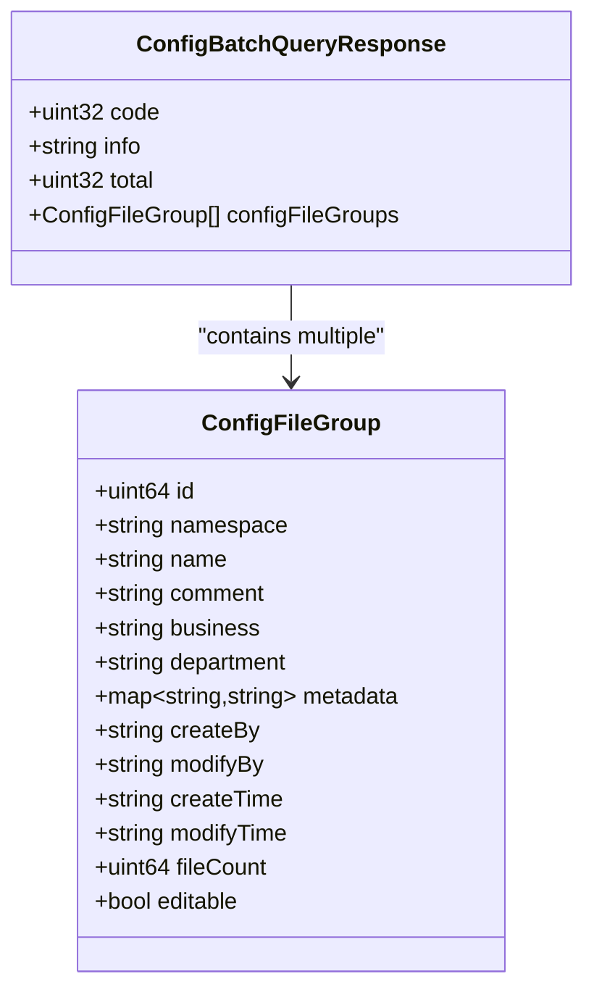
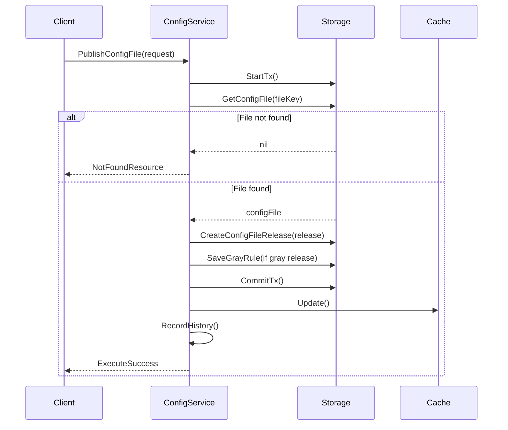
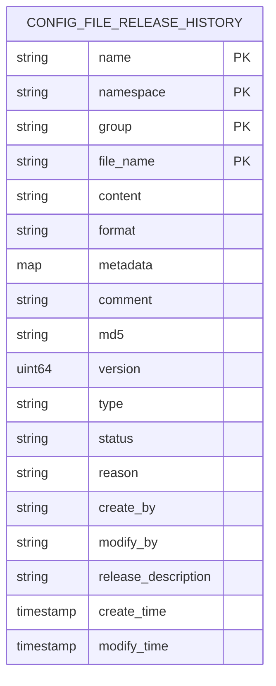
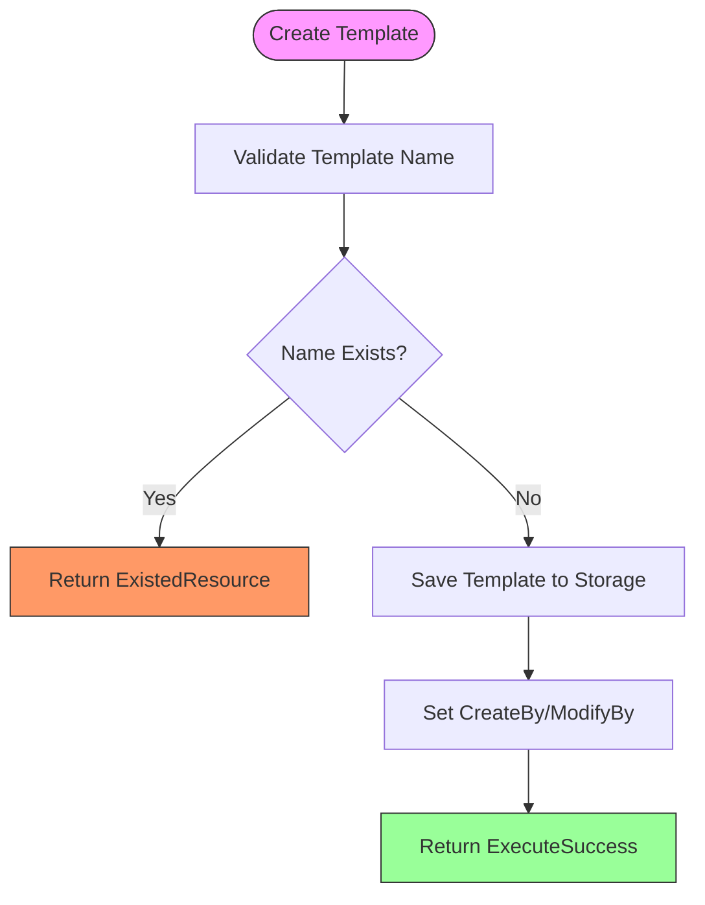
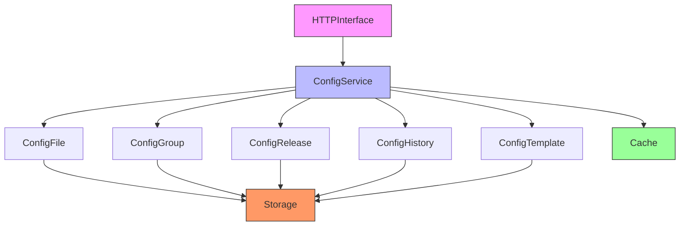

# Configuration Management HTTP API

<cite>
**Referenced Files in This Document**   
- [config_file.go](file://pkg/config/config_file.go)
- [config_file_group.go](file://pkg/config/config_file_group.go)
- [config_file_release.go](file://pkg/config/config_file_release.go)
- [config_file_release_history.go](file://pkg/config/config_file_release_history.go)
- [config_file_template.go](file://pkg/config/config_file_template.go)
- [config_file_api.go](file://apis/store/config_file_api.go)
- [types.go](file://apis/pkg/types/config/types.go)
- [config_server_apidoc.go](file://plugin/apiserver/httpserver/docs/config_server_apidoc.go)
</cite>

## Table of Contents
1. [Introduction](#introduction)
2. [Project Structure](#project-structure)
3. [Core Components](#core-components)
4. [Architecture Overview](#architecture-overview)
5. [Detailed Component Analysis](#detailed-component-analysis)
6. [Dependency Analysis](#dependency-analysis)
7. [Performance Considerations](#performance-considerations)
8. [Troubleshooting Guide](#troubleshooting-guide)
9. [Conclusion](#conclusion)

## Introduction
This document provides comprehensive API documentation for the Configuration Management HTTP endpoints in pole-server. It covers all operations under the `/config` path, including configuration file lifecycle management, group management, release processes, version history, and real-time update mechanisms. The system supports robust configuration management capabilities for distributed environments with features like long-polling, release rollback, and configuration templates.

## Project Structure
The configuration management system is organized across multiple packages with clear separation of concerns. The core logic resides in the `pkg/config` directory, with supporting types in `apis/pkg/types/config`, storage operations in `apis/store`, and HTTP server implementations in `plugin/apiserver/httpserver`.

**Diagram sources**
- [config_file.go](file://pkg/config/config_file.go)
- [config_file_group.go](file://pkg/config/config_file_group.go)
- [config_file_release.go](file://pkg/config/config_file_release.go)
- [config_file_release_history.go](file://pkg/config/config_file_release_history.go)
- [config_file_template.go](file://pkg/config/config_file_template.go)
- [config_file_api.go](file://apis/store/config_file_api.go)
- [types.go](file://apis/pkg/types/config/types.go)
- [config_server_apidoc.go](file://plugin/apiserver/httpserver/docs/config_server_apidoc.go)

**Section sources**
- [config_file.go](file://pkg/config/config_file.go)
- [config_file_group.go](file://pkg/config/config_file_group.go)
- [config_file_release.go](file://pkg/config/config_file_release.go)

## Core Components
The configuration management system consists of five core components: configuration files, configuration groups, configuration releases, release history, and configuration templates. These components work together to provide a complete configuration management solution with version control, rollback capabilities, and template-based configuration.

**Section sources**
- [config_file.go](file://pkg/config/config_file.go#L1-L565)
- [config_file_group.go](file://pkg/config/config_file_group.go#L1-L320)
- [config_file_release.go](file://pkg/config/config_file_release.go#L1-L789)

## Architecture Overview
The configuration management system follows a service-oriented architecture with clear separation between business logic, data access, and HTTP interface layers. The system uses transactional operations to ensure data consistency during configuration changes and provides comprehensive history tracking for audit purposes.

**Diagram sources**
- [config_file.go](file://pkg/config/config_file.go)
- [config_file_release.go](file://pkg/config/config_file_release.go)
- [config_file_release_history.go](file://pkg/config/config_file_release_history.go)

## Detailed Component Analysis

### Configuration File Management
The configuration file component handles the creation, retrieval, update, and deletion of configuration files. Each configuration file belongs to a namespace and group, and contains content, format, metadata, and optional encryption settings.

#### Configuration File Operations

**Diagram sources**
- [config_file.go](file://pkg/config/config_file.go#L1-L565)
- [types.go](file://apis/pkg/types/config/types.go)

**Section sources**
- [config_file.go](file://pkg/config/config_file.go#L1-L565)
- [config_file_api.go](file://apis/store/config_file_api.go)

### Configuration Group Management
Configuration groups provide a way to organize related configuration files. Groups can be created, updated, and deleted, and each group can contain multiple configuration files. The system automatically creates groups when creating configuration files if they don't exist.

#### Configuration Group Operations

**Diagram sources**
- [config_file_group.go](file://pkg/config/config_file_group.go#L1-L320)
- [types.go](file://apis/pkg/types/config/types.go)

**Section sources**
- [config_file_group.go](file://pkg/config/config_file_group.go#L1-L320)

### Configuration Release Management
The configuration release component manages the publishing of configuration changes to clients. Releases can be normal (full) releases or gray (canary) releases with specific labels. The system tracks active releases and provides rollback capabilities.

#### Configuration Release Workflow

**Diagram sources**
- [config_file_release.go](file://pkg/config/config_file_release.go#L1-L789)
- [config_file.go](file://pkg/config/config_file.go#L1-L565)

**Section sources**
- [config_file_release.go](file://pkg/config/config_file_release.go#L1-L789)

### Configuration Release History
The release history component maintains an audit trail of all configuration changes. This includes creation, updates, deletions, and releases of configuration files. The history is used for rollback operations and auditing purposes.

#### Release History Data Model

**Diagram sources**
- [config_file_release_history.go](file://pkg/config/config_file_release_history.go#L1-L99)
- [config_file_release.go](file://pkg/config/config_file_release.go#L1-L789)

**Section sources**
- [config_file_release_history.go](file://pkg/config/config_file_release_history.go#L1-L99)

### Configuration Templates
Configuration templates provide a way to define reusable configuration patterns. Templates can be created, updated, and retrieved by name, and are used to standardize configuration across different services and environments.

#### Template Management Flow

**Diagram sources**
- [config_file_template.go](file://pkg/config/config_file_template.go#L1-L148)
- [types.go](file://apis/pkg/types/config/types.go)

**Section sources**
- [config_file_template.go](file://pkg/config/config_file_template.go#L1-L148)

## Dependency Analysis
The configuration management system has well-defined dependencies between components. The HTTP interface depends on the configuration service, which in turn depends on storage and cache components. The release functionality depends on both the file and group components, creating a hierarchical dependency structure.

**Diagram sources**
- [config_file.go](file://pkg/config/config_file.go)
- [config_file_group.go](file://pkg/config/config_file_group.go)
- [config_file_release.go](file://pkg/config/config_file_release.go)
- [config_file_release_history.go](file://pkg/config/config_file_release_history.go)
- [config_file_template.go](file://pkg/config/config_file_template.go)
- [config_file_api.go](file://apis/store/config_file_api.go)

**Section sources**
- [config_file.go](file://pkg/config/config_file.go)
- [config_file_group.go](file://pkg/config/config_file_group.go)
- [config_file_release.go](file://pkg/config/config_file_release.go)

## Performance Considerations
The configuration management system is designed with performance in mind. It uses caching to reduce database load for read operations, batch processing for bulk operations, and pagination for large result sets. Write operations are transactional to ensure data consistency but may have higher latency due to the atomicity requirements.

## Troubleshooting Guide
Common issues in the configuration management system include configuration not being received by clients, watch timeouts, and large configuration file handling. Ensure that clients are properly connected to the configuration server and that watch timeouts are set appropriately for the network conditions. For large configuration files, consider breaking them into smaller, more manageable pieces.

**Section sources**
- [config_file.go](file://pkg/config/config_file.go#L1-L565)
- [config_file_release.go](file://pkg/config/config_file_release.go#L1-L789)
- [config_file_release_history.go](file://pkg/config/config_file_release_history.go#L1-L99)

## Conclusion
The Configuration Management HTTP API in pole-server provides a comprehensive solution for managing configuration in distributed systems. With support for configuration files, groups, releases, history, and templates, the system offers robust capabilities for configuration lifecycle management. The well-structured architecture ensures reliability and scalability, while the comprehensive API enables integration with various client applications.