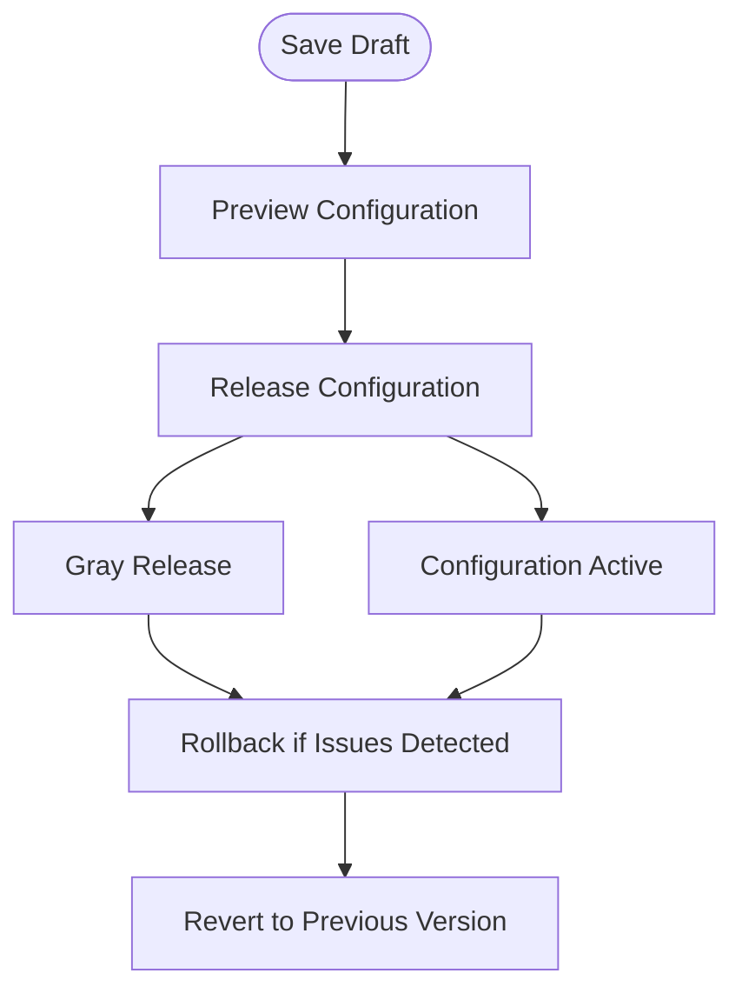
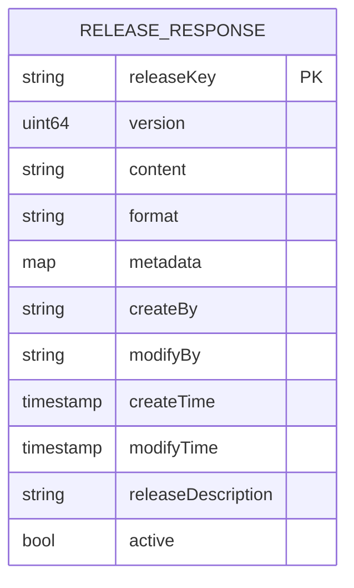
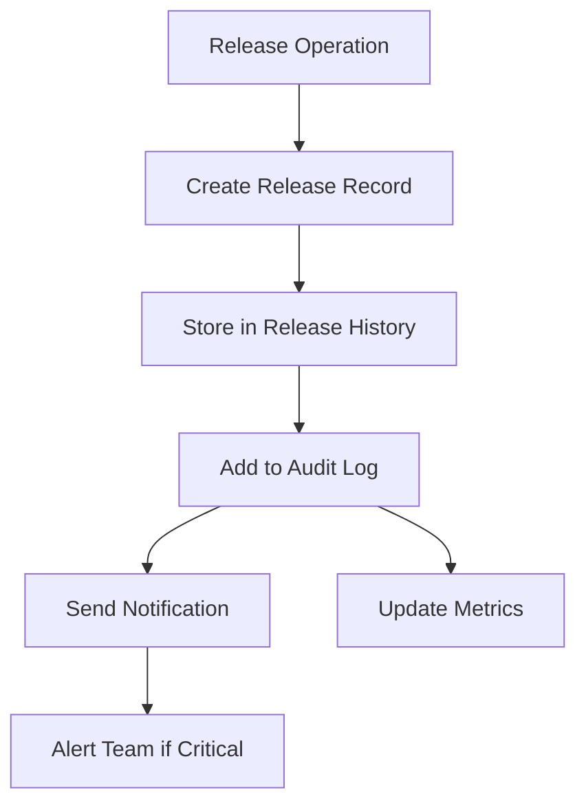
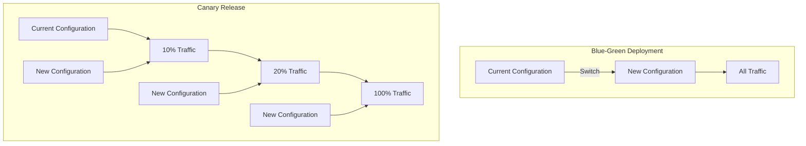

# Releases & Rollbacks

<cite>
**Referenced Files in This Document**   
- [config_file_release.go](file://pkg/config/config_file_release.go)
- [config_file_release_history.go](file://pkg/config/config_file_release_history.go)
- [config_file_release.go](file://pkg/config/interceptor/auth/config_file_release.go)
- [config_file_release_history.go](file://pkg/config/interceptor/auth/config_file_release_history.go)
- [config_file_release.go](file://plugin/store/mysql/config_file_release.go)
- [config_file_release_history.go](file://plugin/store/mysql/config_file_release_history.go)
- [config_response.go](file://pkg/common/api/v1/config_response.go)
</cite>

## Table of Contents
1. [Introduction](#introduction)
2. [Release Workflow](#release-workflow)
3. [API Endpoints](#api-endpoints)
4. [Request Parameters](#request-parameters)
5. [Response Structure](#response-structure)
6. [Release History and Audit Logging](#release-history-and-audit-logging)
7. [Security Controls](#security-controls)
8. [Error Handling](#error-handling)
9. [Deployment Strategies](#deployment-strategies)
10. [Troubleshooting](#troubleshooting)

## Introduction
The Configuration Releases and Rollback system in pole-server provides atomic configuration publishing to clients through a structured release workflow. This system enables teams to safely deploy configuration changes with full traceability, rollback capabilities, and audit logging. The API supports both standard releases and gray (canary) releases, allowing for progressive deployment strategies. Each release generates a unique releaseKey that clients use to consistently access the same configuration version across requests.

**Section sources**
- [config_file_release.go](file://pkg/config/config_file_release.go#L1-L50)

## Release Workflow
The configuration release process follows a four-stage workflow: save draft → preview → release → (optional) rollback. When a configuration change is ready for release, the system creates a release record that includes metadata, version information, and the release description. Each release is assigned a unique releaseKey that serves as a stable reference for clients. The system ensures atomicity by using database transactions to guarantee that either the entire release succeeds or fails completely. For gray releases, the system also creates corresponding routing rules that direct a subset of traffic to the new configuration.

**Diagram sources**
- [config_file_release.go](file://pkg/config/config_file_release.go#L150-L200)
- [config_file_release.go](file://pkg/config/config_file_release.go#L400-L450)

**Section sources**
- [config_file_release.go](file://pkg/config/config_file_release.go#L150-L500)

## API Endpoints
The configuration release system exposes several HTTP endpoints for managing releases. The primary endpoint for publishing configurations is POST /config/releases, which creates a new release from the current draft. To retrieve release information, use GET /config/releases with appropriate query parameters. For rollback operations, the system provides POST /config/releases/rollback which reactivates a previous release. The GET /config/releases/history endpoint returns the complete release history for audit and troubleshooting purposes. All endpoints require proper authentication and authorization, with access controlled through the system's policy engine.

**Section sources**
- [config_file_release.go](file://pkg/config/config_file_release.go#L50-L100)
- [config_file_release.go](file://pkg/config/config_file_release.go#L200-L250)

## Request Parameters
When releasing a configuration, several parameters are required or optional. The releaseName parameter provides a human-readable name for the release and must be unique within the namespace, group, and file context. The releaseDesc parameter contains a description of the changes being released, which is valuable for audit purposes. Metadata can be included as key-value pairs to provide additional context about the release. The content parameter contains the actual configuration data, while format specifies the content type (e.g., JSON, YAML). For gray releases, betaLabels can be specified to define the criteria for routing traffic to the new configuration.

**Section sources**
- [config_file_release.go](file://pkg/config/config_file_release.go#L100-L150)

## Response Structure
The response from release operations includes several key fields. The releaseKey field contains a unique identifier for the release, which clients use to access the configuration. The version field indicates the sequential version number of the release, which increments with each new release. The response also includes timestamps for creation and modification, as well as the username of the person who created and last modified the release. For successful operations, the code field contains ExecuteSuccess, while error conditions are indicated by appropriate error codes. The response may also include metadata about the release, such as tags and descriptions.

**Diagram sources**
- [config_file_release.go](file://pkg/config/config_file_release.go#L300-L350)
- [config_response.go](file://pkg/common/api/v1/config_response.go#L100-L150)

**Section sources**
- [config_file_release.go](file://pkg/config/config_file_release.go#L300-L400)

## Release History and Audit Logging
The system maintains a comprehensive history of all release operations for audit and troubleshooting purposes. Each release operation generates an entry in the release history table, which includes the release type (normal, gray, rollback), status (success, failed), and reason for the operation. The history also captures the full configuration content at the time of release, allowing for complete reconstruction of past states. The system implements a retention policy that keeps release history for a configurable period, after which old records are automatically cleaned up. Audit logs capture who performed each release operation, when it occurred, and what changes were made, providing full traceability for compliance purposes.

**Diagram sources**
- [config_file_release_history.go](file://pkg/config/config_file_release_history.go#L20-L50)
- [config_file_release.go](file://pkg/config/config_file_release.go#L700-L750)

**Section sources**
- [config_file_release_history.go](file://pkg/config/config_file_release_history.go#L1-L98)
- [config_file_release_history.go](file://plugin/store/mysql/config_file_release_history.go#L1-L151)

## Security Controls
Access to release and rollback operations is strictly controlled through role-based access control (RBAC). Only users with the appropriate permissions can publish new releases or roll back existing ones. The system implements authentication at the API gateway level, ensuring that all requests are properly authenticated before processing. Authorization checks are performed for each operation, verifying that the user has the necessary privileges for the specific namespace, group, and configuration file. For sensitive operations like rollback, additional approval workflows can be configured. The system also supports audit trails for all security-relevant operations, providing visibility into who accessed what and when.

**Section sources**
- [config_file_release.go](file://pkg/config/interceptor/auth/config_file_release.go#L1-L146)
- [config_file_release_history.go](file://pkg/config/interceptor/auth/config_file_release_history.go#L1-L42)

## Error Handling
The API implements comprehensive error handling to provide clear feedback for various failure scenarios. When attempting to release a configuration that doesn't exist, the system returns a 404 Not Found error. If a user attempts to release a version that has already been released, a 409 Conflict error is returned to prevent duplicate releases. Invalid metadata or missing required fields result in a 400 Bad Request error with details about the validation failure. For rollback operations, if the target release version is not found, a 404 error is returned. All error responses include descriptive messages to help users understand and resolve the issue. The system also logs detailed error information for troubleshooting while only exposing appropriate details in the API response.

**Section sources**
- [config_file_release.go](file://pkg/config/config_file_release.go#L150-L200)
- [config_file_release.go](file://pkg/config/config_file_release.go#L400-L450)
- [config_response.go](file://pkg/common/api/v1/config_response.go#L1-L286)

## Deployment Strategies
The release API supports multiple deployment strategies to accommodate different risk profiles and release patterns. For blue-green deployments, users can publish a new configuration and then switch traffic by updating the active release pointer. The system's releaseKey mechanism ensures that all clients consistently access the same version during the transition. For canary releases, the API supports gray releases where the configuration is initially exposed to a subset of clients based on defined criteria. Traffic can be gradually increased by modifying the gray release rules until the new configuration is serving all traffic. The rollback capability allows for quick recovery if issues are detected during any deployment strategy.

**Diagram sources**
- [config_file_release.go](file://pkg/config/config_file_release.go#L500-L550)
- [config_file_release.go](file://pkg/config/config_file_release.go#L600-L650)

**Section sources**
- [config_file_release.go](file://pkg/config/config_file_release.go#L500-L700)

## Troubleshooting
When released configurations are not reaching clients, several troubleshooting steps can be taken. First, verify that the release was successful by checking the response code and retrieving the release information using the releaseKey. Next, confirm that clients are using the correct releaseKey to access the configuration. Network connectivity issues between clients and the configuration server should be ruled out. If using gray releases, verify that the client attributes match the betaLabels criteria. The release history and audit logs can provide insights into when the release occurred and who performed it. Monitoring metrics can show whether clients are successfully retrieving the new configuration. For persistent issues, rolling back to a previous known-good configuration provides a quick recovery path while the root cause is investigated.

**Section sources**
- [config_file_release.go](file://pkg/config/config_file_release.go#L750-L788)
- [config_file_release_history.go](file://pkg/config/config_file_release_history.go#L60-L98)