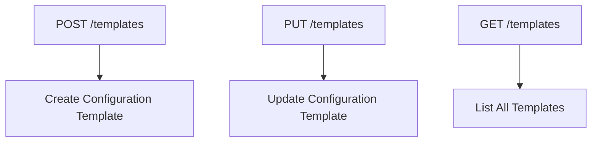
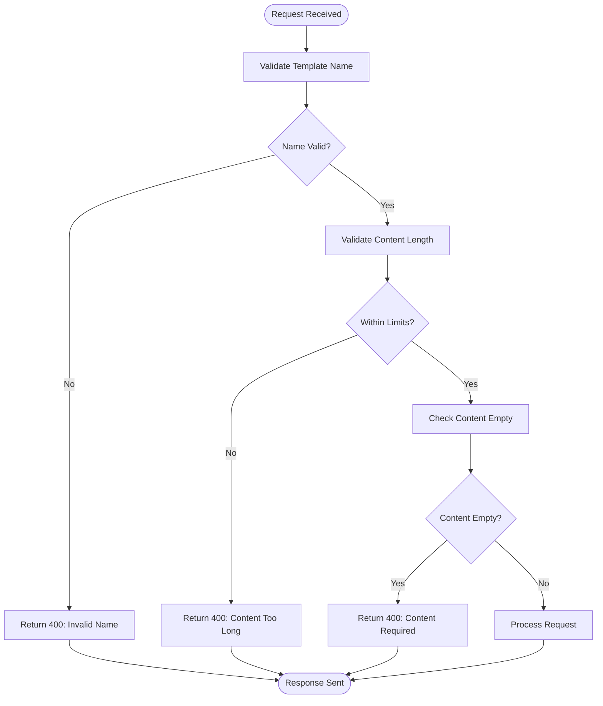
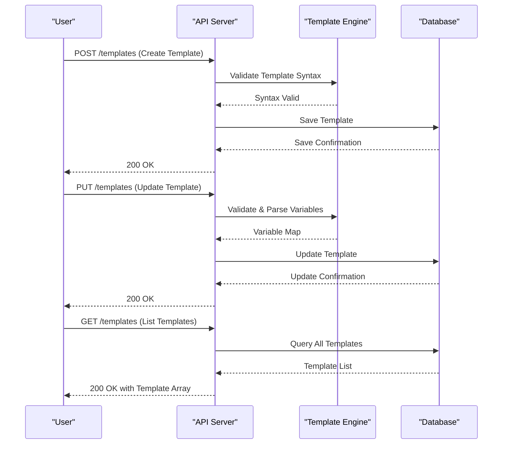
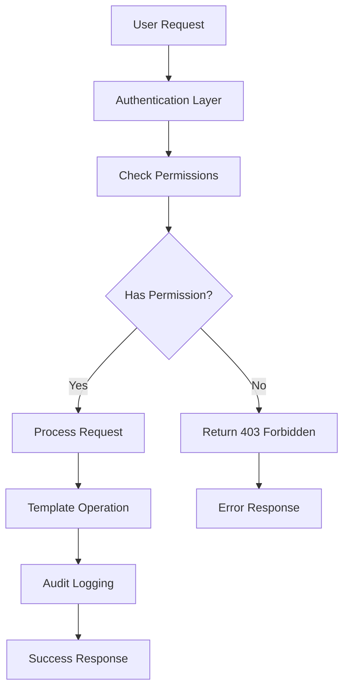
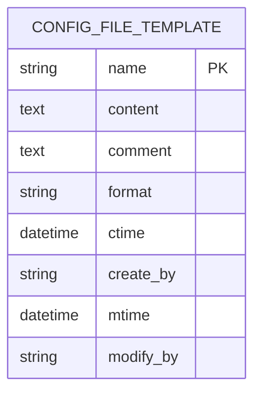

# Templates

<cite>
**Referenced Files in This Document**   
- [config_file_template.go](file://pkg/config/config_file_template.go)
- [config_file_template_check.go](file://pkg/config/interceptor/paramcheck/config_file_template_check.go)
- [tpl_access.go](file://plugin/apiserver/httpserver/config/tpl_access.go)
- [config_file.go](file://apis/pkg/types/config/config_file.go)
- [config_response.go](file://pkg/common/api/v1/config_response.go)
- [codeinfo.go](file://pkg/common/api/v1/codeinfo.go)
- [config_server_apidoc.go](file://plugin/apiserver/httpserver/docs/config_server_apidoc.go)
</cite>

## Table of Contents
1. [Introduction](#introduction)
2. [API Endpoints](#api-endpoints)
3. [Template Structure](#template-structure)
4. [Parameter Validation](#parameter-validation)
5. [Error Responses](#error-responses)
6. [Usage Examples](#usage-examples)
7. [Security and Access Control](#security-and-access-control)
8. [Storage Implementation](#storage-implementation)
9. [Troubleshooting Guide](#troubleshooting-guide)

## Introduction
The Configuration Templates API in pole-server provides a centralized mechanism for managing reusable configuration templates with variable substitution capabilities. This system enables environment-agnostic configuration management through templates containing placeholders (e.g., ${variable}) that are resolved at application time. The API supports CRUD operations for templates, allowing creation, retrieval, update, and listing of configuration templates. Templates can be applied to generate actual configuration files for various environments, with support for previewing rendered output before deployment. This documentation covers the /config/templates API endpoints and their functionality for managing configuration templates across different environments.

## API Endpoints

The Configuration Templates API exposes the following HTTP endpoints for template management:



**Diagram sources**
- [tpl_access.go](file://plugin/apiserver/httpserver/config/tpl_access.go#L5-L10)

**Section sources**
- [tpl_access.go](file://plugin/apiserver/httpserver/config/tpl_access.go#L5-L84)

## Template Structure

Configuration templates are defined with the following structure and metadata:

| Field | Type | Required | Description | Example |
|-------|------|----------|-------------|---------|
| **Name** | string | Yes | Unique identifier for the template | "database-config" |
| **Content** | string | Yes | Template body with variable placeholders | "host: ${DB_HOST}<br/>port: ${DB_PORT}" |
| **Comment** | string | No | Description of template purpose | "Production database configuration" |
| **Format** | string | Yes | Configuration format type | "yaml", "json", "properties" |
| **CreateBy** | string | Server-side | User who created the template | "admin-user" |
| **ModifyBy** | string | Server-side | User who last modified the template | "dev-user" |

The template content supports variable substitution using the ${variable} syntax, enabling dynamic configuration generation across different environments.

**Section sources**
- [config_file.go](file://apis/pkg/types/config/config_file.go#L275-L285)
- [config_file_template.go](file://pkg/config/config_file_template.go#L34-L71)

## Parameter Validation

The API enforces strict validation on template parameters to ensure data integrity and security:



**Diagram sources**
- [config_file_template_check.go](file://pkg/config/interceptor/paramcheck/config_file_template_check.go#L37-L79)

**Section sources**
- [config_file_template_check.go](file://pkg/config/interceptor/paramcheck/config_file_template_check.go#L37-L79)

## Error Responses

The API returns standardized error responses for various failure scenarios:

| HTTP Status | Error Code | Condition | Response Body |
|-------------|------------|---------|---------------|
| 400 | InvalidConfigFileTemplateName | Template name is invalid or missing | {"code": 400012, "info": "invalid config file template name"} |
| 400 | InvalidConfigFileContentLength | Template content exceeds maximum length | {"code": 400014, "info": "invalid config file content length"} |
| 400 | BadRequest | Template content is empty | {"code": 400, "info": "bad request:content can not be blank."} |
| 409 | ExistedResource | Template with same name already exists | {"code": 409, "info": "resource already exists"} |
| 404 | NotFoundResource | Template not found during update or retrieval | {"code": 404, "info": "resource not found"} |
| 500 | StoreError | Database or storage failure | {"code": 500, "info": "internal server error"} |

**Section sources**
- [codeinfo.go](file://pkg/common/api/v1/codeinfo.go#L158-L181)
- [config_response.go](file://pkg/common/api/v1/config_response.go#L161-L226)

## Usage Examples

### Creating a Database Connection Template
```bash
POST /templates
Content-Type: application/json

[{
  "name": "db-connection-template",
  "content": "spring.datasource.url=jdbc:postgresql://${DB_HOST}:${DB_PORT}/${DB_NAME}\nspring.datasource.username=${DB_USER}\nspring.datasource.password=${DB_PASSWORD}",
  "comment": "Database connection template with environment variables",
  "format": "properties"
}]
```

### Applying Template to Generate Configuration
The template system supports rendering preview functionality before deployment:


**Diagram sources**
- [config_file_template.go](file://pkg/config/config_file_template.go#L34-L146)
- [tpl_access.go](file://plugin/apiserver/httpserver/config/tpl_access.go#L35-L84)

**Section sources**
- [config_file_template_test.go](file://pkg/config/config_file_template_test.go#L0-L144)

## Security and Access Control

The template system implements role-based access control (RBAC) for all operations:



All template operations require appropriate permissions:
- **CreateConfigFileTemplate**: Required for creating new templates
- **DescribeConfigFileTemplate**: Required for retrieving specific templates  
- **DescribeAllConfigFileTemplates**: Required for listing all templates
- **UpdateConfigFileTemplate**: Required for modifying existing templates

The system validates user permissions before processing any template operation, ensuring secure access to configuration resources.

**Section sources**
- [config_file_template_check.go](file://pkg/config/interceptor/paramcheck/config_file_template_check.go#L37-L79)
- [config_file_template.go](file://pkg/config/config_file_template.go#L34-L146)

## Storage Implementation

Templates are persisted in a relational database with the following schema:



The storage layer provides the following operations:
- **SaveConfigFileTemplate**: Inserts a new template record into the database
- **GetConfigFileTemplate**: Retrieves a template by name
- **QueryAllConfigFileTemplates**: Returns all stored templates ordered by creation time

Each template operation is atomic and includes automatic timestamp management for creation and modification times.

**Diagram sources**
- [config_file_template.go](file://pkg/config/config_file_template.go#L109-L146)
- [config_file_template.go](file://pkg/config/config_file_template.go#L34-L71)

**Section sources**
- [config_file_template.go](file://pkg/config/config_file_template.go#L34-L146)
- [config_file_template.go](file://plugin/store/mysql/config_file_template.go#L27-L66)

## Troubleshooting Guide

Common issues and their resolutions:

**Template Creation Fails with 400 Error**
- **Cause**: Empty content field
- **Solution**: Ensure template content is not blank
- **Verification**: Check that content field contains at least one character

**Template Creation Fails with 409 Error**
- **Cause**: Template name conflict
- **Solution**: Use a unique template name
- **Verification**: List existing templates to check for name availability

**Content Exceeds Maximum Length**
- **Cause**: Template content surpasses system limit
- **Solution**: Reduce template size or split into multiple templates
- **Verification**: Check ContentMaxLength configuration value

**Variable Substitution Not Working**
- **Cause**: Incorrect placeholder syntax
- **Solution**: Use ${variable} format (not $variable or {variable})
- **Verification**: Test with simple template containing single variable

**Performance Issues with Large Templates**
- **Cause**: Complex templates with numerous variables
- **Solution**: Optimize template structure, consider caching rendered results
- **Verification**: Monitor API response times and database query performance

**Section sources**
- [config_file_template_check.go](file://pkg/config/interceptor/paramcheck/config_file_template_check.go#L37-L79)
- [config_file_template_test.go](file://pkg/config/config_file_template_test.go#L118-L144)
- [config_file_template_test.go](file://pkg/config/config_file_template_test.go#L76-L116)