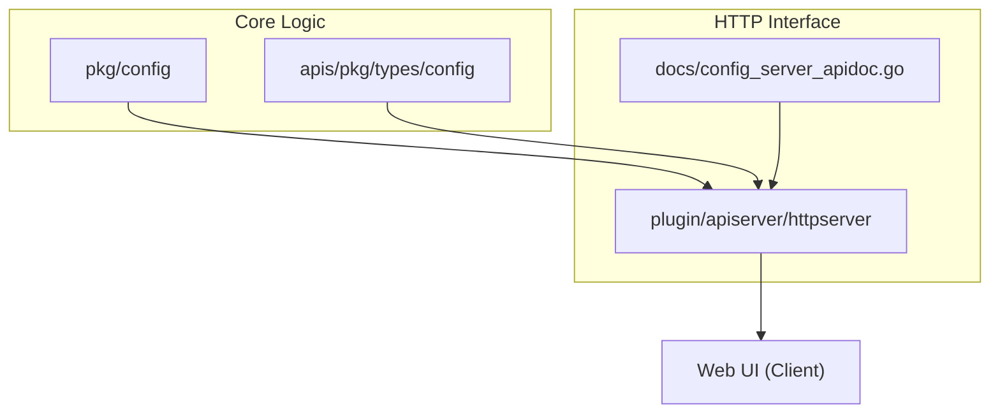
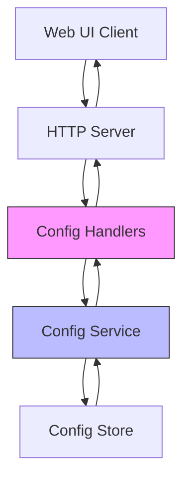
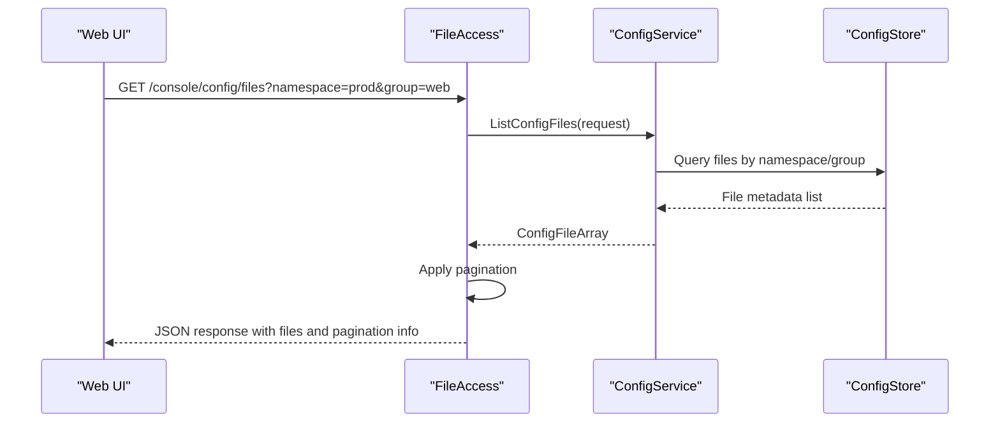
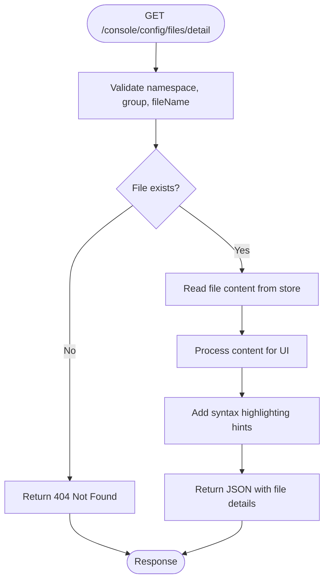
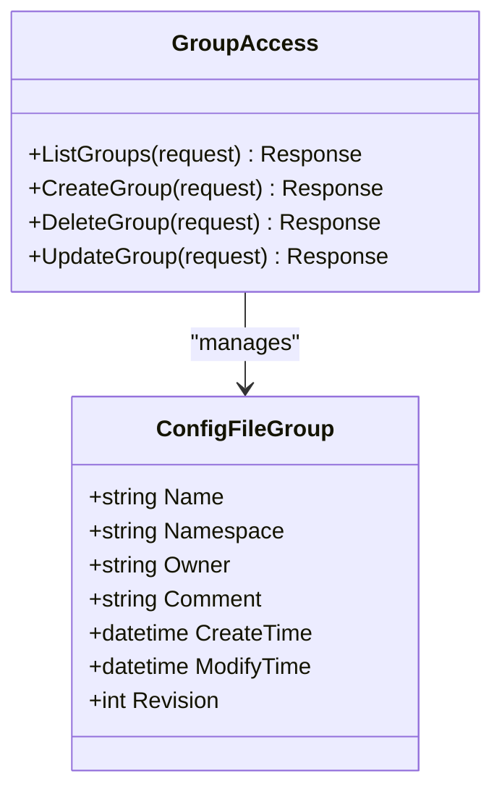
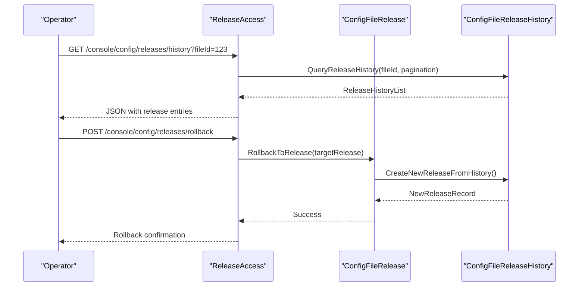
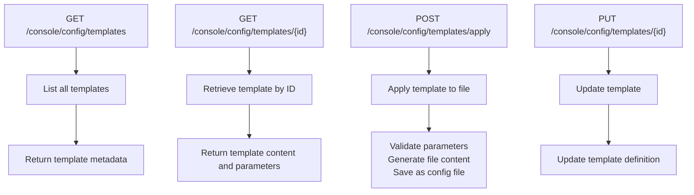
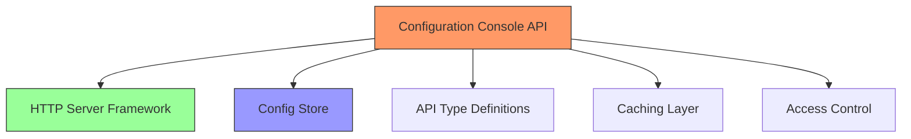

# Configuration Console API

<cite>
**Referenced Files in This Document**   
- [api.go](file://pkg/config/api.go)
- [config_file.go](file://pkg/config/config_file.go)
- [config_file_group.go](file://pkg/config/config_file_group.go)
- [config_file_release.go](file://pkg/config/config_file_release.go)
- [config_file_release_history.go](file://pkg/config/config_file_release_history.go)
- [config_file_template.go](file://pkg/config/config_file_template.go)
- [server.go](file://pkg/config/server.go)
- [client_access.go](file://plugin/apiserver/httpserver/config/client_access.go)
- [file_access.go](file://plugin/apiserver/httpserver/config/file_access.go)
- [group_access.go](file://plugin/apiserver/httpserver/config/group_access.go)
- [release_access.go](file://plugin/apiserver/httpserver/config/release_access.go)
- [tpl_access.go](file://plugin/apiserver/httpserver/config/tpl_access.go)
- [config_server_apidoc.go](file://plugin/apiserver/httpserver/docs/config_server_apidoc.go)
- [config_file.go](file://apis/pkg/types/config/config_file.go)
- [types.go](file://apis/pkg/types/config/types.go)
</cite>

## Table of Contents
1. [Introduction](#introduction)
2. [Project Structure](#project-structure)
3. [Core Components](#core-components)
4. [Architecture Overview](#architecture-overview)
5. [Detailed Component Analysis](#detailed-component-analysis)
6. [Dependency Analysis](#dependency-analysis)
7. [Performance Considerations](#performance-considerations)
8. [Troubleshooting Guide](#troubleshooting-guide)
9. [Conclusion](#conclusion)

## Introduction
The Configuration Console API in pole-server provides a set of HTTP endpoints under the `/console/config` path that enable the web UI to manage and display configuration files, groups, templates, and release history. These endpoints are designed to support operators in viewing, managing, and auditing configuration data across namespaces and services. The API aggregates data from the underlying configuration management system, offering unified views with support for filtering, sorting, and search. This documentation details the available endpoints, their parameters, response structures, and integration points with the config store. It also covers caching strategies, performance implications, and troubleshooting guidance for common operational issues.

## Project Structure
The configuration console functionality is organized across multiple packages and plugins within the pole-server repository. The core logic resides in the `pkg/config` package, while HTTP endpoint routing and access control are managed through the `plugin/apiserver/httpserver` module. The API types and response structures are defined in `apis/pkg/types/config`. This modular structure separates business logic from transport-layer concerns, enabling extensibility and maintainability.

**Diagram sources**
- [api.go](file://pkg/config/api.go#L1-L20)
- [config_server_apidoc.go](file://plugin/apiserver/httpserver/docs/config_server_apidoc.go#L1-L10)

**Section sources**
- [pkg/config](file://pkg/config#L1-L5)
- [plugin/apiserver/httpserver](file://plugin/apiserver/httpserver#L1-L5)
- [apis/pkg/types/config](file://apis/pkg/types/config#L1-L5)

## Core Components
The Configuration Console API is built around several key components that handle configuration file management, grouping, templating, and release tracking. These components work together to provide a comprehensive interface for operators to manage configuration data. The system supports CRUD operations on configuration entities and provides audit trails through release history. Integration with the config store ensures data consistency and durability.

**Section sources**
- [api.go](file://pkg/config/api.go#L25-L100)
- [config_file.go](file://pkg/config/config_file.go#L15-L80)
- [config_file_release_history.go](file://pkg/config/config_file_release_history.go#L10-L30)

## Architecture Overview
The Configuration Console API follows a layered architecture with clear separation between HTTP handling, business logic, and data persistence. The HTTP server routes requests to appropriate handlers based on the endpoint path. These handlers validate input, invoke business logic from the config package, and return structured JSON responses. The architecture supports both console (operator-facing) and client (service-facing) endpoints, with access control enforced at the handler level.

**Diagram sources**
- [server.go](file://pkg/config/server.go#L10-L50)
- [file_access.go](file://plugin/apiserver/httpserver/config/file_access.go#L20-L40)

## Detailed Component Analysis

### Configuration File Management
The configuration file management component handles operations on individual configuration files, including creation, retrieval, update, and deletion. It supports rich metadata and content management, with provisions for syntax highlighting hints in the UI.

#### File Listing and Retrieval
The `/console/config/files` endpoint allows listing configuration files with filtering by namespace and group. The response includes metadata such as file name, format, size, and modification time.

**Diagram sources**
- [file_access.go](file://plugin/apiserver/httpserver/config/file_access.go#L25-L60)
- [config_file.go](file://pkg/config/config_file.go#L30-L80)

#### File Detail Retrieval
The `/console/config/files/detail` endpoint retrieves detailed information about a specific configuration file, including its content and syntax highlighting metadata.

**Diagram sources**
- [file_access.go](file://plugin/apiserver/httpserver/config/file_access.go#L75-L100)
- [config_file.go](file://pkg/config/config_file.go#L120-L150)

**Section sources**
- [file_access.go](file://plugin/apiserver/httpserver/config/file_access.go#L1-L120)
- [config_file.go](file://pkg/config/config_file.go#L1-L200)

### Configuration Group Management
Configuration groups organize related configuration files and provide a logical grouping for management purposes.

**Diagram sources**
- [group_access.go](file://plugin/apiserver/httpserver/config/group_access.go#L15-L45)
- [config_file_group.go](file://pkg/config/config_file_group.go#L5-L25)

**Section sources**
- [group_access.go](file://plugin/apiserver/httpserver/config/group_access.go#L1-L100)
- [config_file_group.go](file://pkg/config/config_file_group.go#L1-L120)

### Configuration Release Management
The release management component handles the publication of configuration changes to clients, with support for release history and rollback.

#### Release History and Rollback
The `/console/config/releases/history` endpoint provides access to the release history of configuration files, enabling operators to view past releases and perform rollbacks.

**Diagram sources**
- [release_access.go](file://plugin/apiserver/httpserver/config/release_access.go#L30-L70)
- [config_file_release.go](file://pkg/config/config_file_release.go#L40-L90)
- [config_file_release_history.go](file://pkg/config/config_file_release_history.go#L25-L60)

**Section sources**
- [release_access.go](file://plugin/apiserver/httpserver/config/release_access.go#L1-L100)
- [config_file_release.go](file://pkg/config/config_file_release.go#L1-L150)
- [config_file_release_history.go](file://pkg/config/config_file_release_history.go#L1-L80)

### Configuration Template Management
Templates provide reusable configuration patterns that can be instantiated across multiple files and environments.

**Diagram sources**
- [tpl_access.go](file://plugin/apiserver/httpserver/config/tpl_access.go#L20-L50)
- [config_file_template.go](file://pkg/config/config_file_template.go#L15-L40)

**Section sources**
- [tpl_access.go](file://plugin/apiserver/httpserver/config/tpl_access.go#L1-L80)
- [config_file_template.go](file://pkg/config/config_file_template.go#L1-L100)

## Dependency Analysis
The Configuration Console API depends on several internal and external components to provide its functionality. The primary dependencies include the config store for persistence, the HTTP server framework for request handling, and the type system for data modeling.

**Diagram sources**
- [server.go](file://pkg/config/server.go#L15-L35)
- [config.go](file://plugin/apiserver/httpserver/config/server.go#L10-L30)

**Section sources**
- [server.go](file://pkg/config/server.go#L1-L50)
- [config/server.go](file://plugin/apiserver/httpserver/config/server.go#L1-L40)

## Performance Considerations
The Configuration Console API implements several performance optimizations to handle large configuration repositories efficiently. Server-side filtering, sorting, and pagination reduce the amount of data transferred between the server and client. Caching strategies are employed to minimize database load and improve response times for frequently accessed configuration data. For repositories with thousands of configuration files, the API supports incremental loading and search functionality to maintain responsive UI interactions. The system also implements rate limiting to prevent abuse and ensure fair resource allocation among clients.

## Troubleshooting Guide
Common issues with the Configuration Console API include missing configuration files, inconsistent release states, and slow search responses. When configuration files appear to be missing, verify that the namespace and group filters are correctly set in the UI. Inconsistent release states may occur due to replication delays in distributed environments; check the release history timestamps and ensure all nodes are synchronized. Slow search responses can be addressed by optimizing database indexes on frequently queried fields such as namespace, group, and file name. Monitoring tools should be used to track API response times and error rates, with alerts configured for abnormal patterns. When troubleshooting, consult the server logs for detailed error messages and stack traces.

**Section sources**
- [log.go](file://pkg/config/log.go#L10-L50)
- [config_file.go](file://pkg/config/config_file.go#L200-L250)

## Conclusion
The Configuration Console API in pole-server provides a comprehensive set of endpoints for managing configuration data through a web interface. By following RESTful principles and providing rich metadata in JSON responses, the API enables a responsive and feature-rich user experience. The separation of concerns between HTTP handling, business logic, and data persistence ensures maintainability and extensibility. With support for configuration files, groups, templates, and release history, the API meets the operational needs of managing complex configuration repositories at scale.