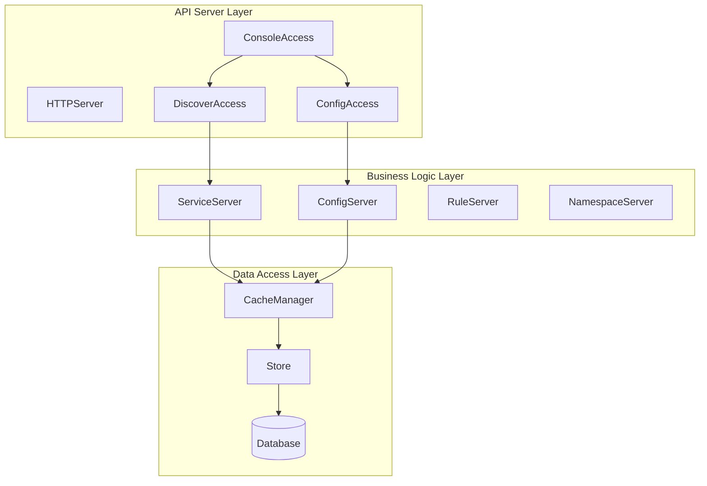
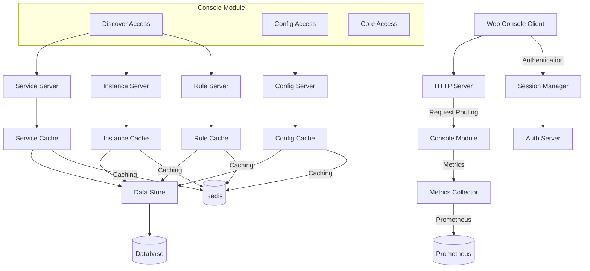
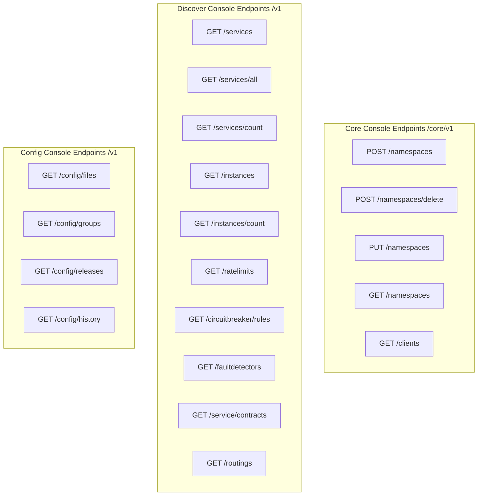
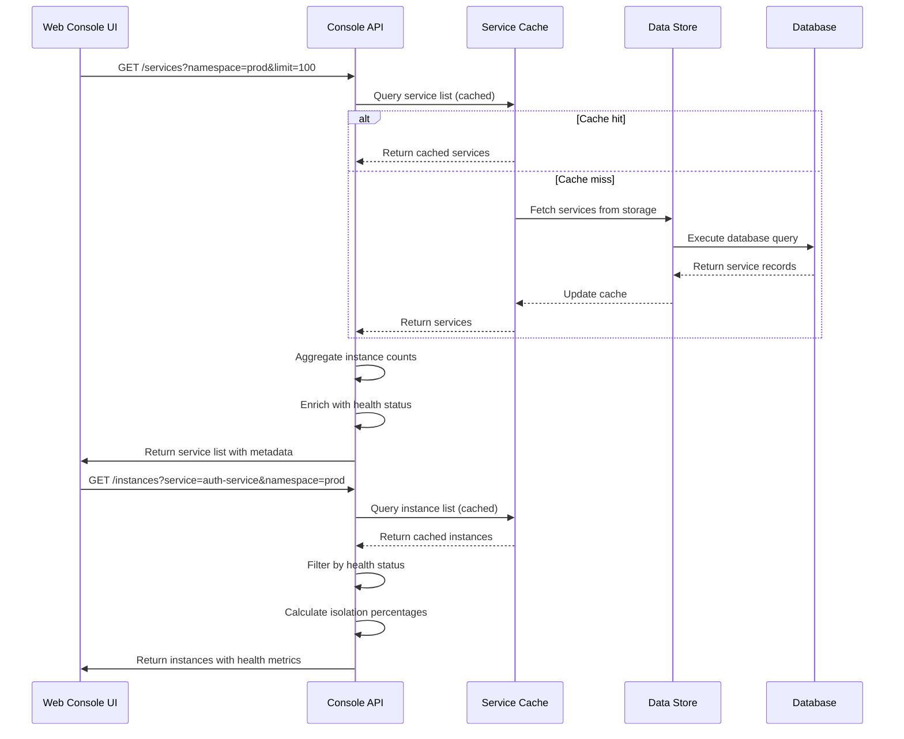
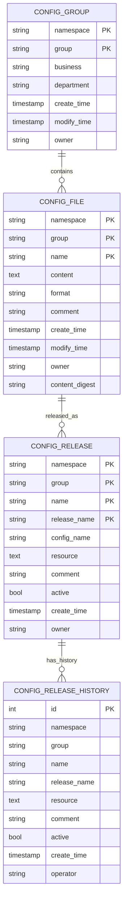
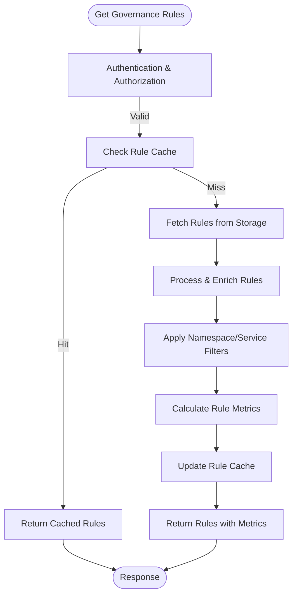
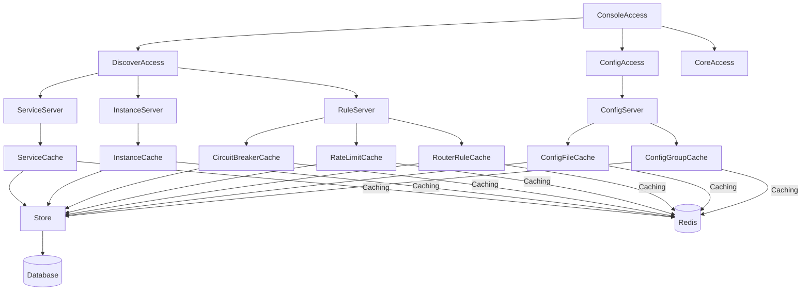

# Console HTTP API

<cite>
**Referenced Files in This Document**   
- [console_access.go](file://plugin/apiserver/httpserver/console_access.go)
- [server.go](file://plugin/apiserver/httpserver/server.go)
- [service_access.go](file://plugin/apiserver/httpserver/discover/service_access.go)
- [instance_access.go](file://plugin/apiserver/httpserver/discover/instance_access.go)
- [circuitbreaker_access.go](file://plugin/apiserver/httpserver/discover/circuitbreaker_access.go)
- [config_file.go](file://pkg/config/config_file.go)
- [router_rule.go](file://apis/pkg/types/rules/router_rule.go)
- [types.go](file://apis/pkg/types/config/types.go)
- [cache.go](file://pkg/cache/service/service.go)
- [statis.go](file://apis/observability/statis/statis.go)
</cite>

## Table of Contents
1. [Introduction](#introduction)
2. [Project Structure](#project-structure)
3. [Core Components](#core-components)
4. [Architecture Overview](#architecture-overview)
5. [Detailed Component Analysis](#detailed-component-analysis)
6. [Dependency Analysis](#dependency-analysis)
7. [Performance Considerations](#performance-considerations)
8. [Troubleshooting Guide](#troubleshooting-guide)
9. [Conclusion](#conclusion)

## Introduction
The Console HTTP API in pole-server provides a comprehensive set of endpoints for the web-based management console, enabling UI rendering and operational insights. These endpoints aggregate data from multiple backend services including service discovery, configuration management, and governance rule systems to deliver unified views for administrators and operators. The API is designed specifically for UI consumption, offering aggregated, enriched data rather than atomic operations. This documentation details all endpoints under the /console path, their request/response schemas, authentication mechanisms, and usage patterns for retrieving service topology, configuration files, governance rules, and system metrics.

## Project Structure
The Console HTTP API functionality is primarily organized within the plugin/apiserver/httpserver directory, with core implementations spread across various packages that handle service discovery, configuration management, and observability. The API endpoints are registered through a modular system that allows for extensibility and separation of concerns between different functional domains.

**Diagram sources**
- [server.go](file://plugin/apiserver/httpserver/server.go#L382-L426)
- [console_access.go](file://plugin/apiserver/httpserver/console_access.go#L20-L50)

**Section sources**
- [server.go](file://plugin/apiserver/httpserver/server.go#L382-L426)
- [console_access.go](file://plugin/apiserver/httpserver/console_access.go#L20-L50)

## Core Components
The Console HTTP API consists of several core components that work together to provide aggregated data views for the management console. These include the HTTP server that routes requests, various access modules that handle specific endpoint groups, cache layers that optimize performance, and backend services that retrieve and process data from storage. The API is designed to aggregate information from multiple sources (service discovery, configuration, governance) into unified responses that can be directly consumed by the UI.

**Section sources**
- [console_access.go](file://plugin/apiserver/httpserver/console_access.go#L20-L153)
- [server.go](file://plugin/apiserver/httpserver/server.go#L382-L426)

## Architecture Overview
The Console HTTP API follows a layered architecture that separates concerns between request handling, business logic processing, and data access. The architecture is designed to provide aggregated views by combining data from multiple subsystems while maintaining performance through extensive caching.

**Diagram sources**
- [server.go](file://plugin/apiserver/httpserver/server.go#L382-L426)
- [console_access.go](file://plugin/apiserver/httpserver/console_access.go#L20-L50)
- [statis.go](file://apis/observability/statis/statis.go#L10-L30)

## Detailed Component Analysis

### Console Access Module
The Console Access module is responsible for exposing HTTP endpoints that are specifically designed for the web-based management console. These endpoints provide aggregated data views that combine information from multiple backend services to support UI rendering and operational insights.

#### Console Access Endpoints

**Diagram sources**
- [console_access.go](file://plugin/apiserver/httpserver/console_access.go#L20-L50)
- [service_access.go](file://plugin/apiserver/httpserver/discover/service_access.go#L33-L45)
- [instance_access.go](file://plugin/apiserver/httpserver/discover/instance_access.go#L33-L65)

**Section sources**
- [console_access.go](file://plugin/apiserver/httpserver/console_access.go#L20-L153)
- [service_access.go](file://plugin/apiserver/httpserver/discover/service_access.go#L33-L45)

### Service Discovery Console Endpoints
The service discovery console endpoints provide comprehensive views of services, instances, and associated governance rules. These endpoints are designed to support service topology visualization, health monitoring, and governance rule management in the web console.

#### Service Discovery Data Flow

**Diagram sources**
- [service_access.go](file://plugin/apiserver/httpserver/discover/service_access.go#L33-L45)
- [instance_access.go](file://plugin/apiserver/httpserver/discover/instance_access.go#L33-L65)
- [cache.go](file://pkg/cache/service/service.go#L100-L150)

**Section sources**
- [service_access.go](file://plugin/apiserver/httpserver/discover/service_access.go#L33-L45)
- [instance_access.go](file://plugin/apiserver/httpserver/discover/instance_access.go#L33-L65)

### Configuration Management Console Endpoints
The configuration management console endpoints provide access to configuration files, groups, and release history. These endpoints support configuration browsing, version comparison, and audit trail functionality in the web console.

#### Configuration Data Model

**Diagram sources**
- [types.go](file://apis/pkg/types/config/types.go#L10-L100)
- [config_file.go](file://pkg/config/config_file.go#L200-L250)

**Section sources**
- [types.go](file://apis/pkg/types/config/types.go#L10-L100)
- [config_file.go](file://pkg/config/config_file.go#L200-L250)

### Governance Rules Console Endpoints
The governance rules console endpoints provide access to circuit breaker, rate limiting, fault detection, and routing rules. These endpoints support rule visualization, impact analysis, and compliance auditing in the web console.

#### Governance Rules Processing

**Diagram sources**
- [circuitbreaker_access.go](file://plugin/apiserver/httpserver/discover/circuitbreaker_access.go#L145-L181)
- [router_rule.go](file://apis/pkg/types/rules/router_rule.go#L20-L50)

**Section sources**
- [circuitbreaker_access.go](file://plugin/apiserver/httpserver/discover/circuitbreaker_access.go#L145-L181)
- [router_rule.go](file://apis/pkg/types/rules/router_rule.go#L20-L50)

## Dependency Analysis
The Console HTTP API has a well-defined dependency structure that ensures separation of concerns while enabling data aggregation across multiple domains. The dependency graph shows how console endpoints depend on various backend services and caching layers to provide unified views.

**Diagram sources**
- [server.go](file://plugin/apiserver/httpserver/server.go#L382-L426)
- [console_access.go](file://plugin/apiserver/httpserver/console_access.go#L20-L50)
- [cache.go](file://pkg/cache/service/service.go#L50-L100)

**Section sources**
- [server.go](file://plugin/apiserver/httpserver/server.go#L382-L426)
- [console_access.go](file://plugin/apiserver/httpserver/console_access.go#L20-L50)

## Performance Considerations
The Console HTTP API is designed with performance in mind, especially for large-scale environments where the web console may need to display thousands of services and instances. The system employs multiple optimization strategies to ensure responsive UI interactions.

### Caching Strategy
The API leverages a multi-layer caching strategy to minimize database load and reduce response times:
- **Service and Instance Data**: Cached in memory with periodic updates from storage
- **Configuration Data**: Cached with TTL-based invalidation
- **Rule Data**: Cached with change-based invalidation
- **Aggregated Metrics**: Pre-computed and cached to avoid runtime calculations

### Response Time Expectations
- **Small environments** (< 100 services): < 100ms response time
- **Medium environments** (100-1,000 services): < 200ms response time
- **Large environments** (1,000-10,000 services): < 500ms response time
- **Very large environments** (> 10,000 services): < 1s response time

### Pagination and Filtering
All list endpoints support pagination and filtering to manage large datasets:
- **Pagination**: offset and limit parameters for chunked responses
- **Filtering**: namespace, service, group, and other domain-specific filters
- **Sorting**: order_field and order_type parameters for custom sorting
- **Brief mode**: brief=true parameter to reduce payload size for large lists

**Section sources**
- [service_access.go](file://plugin/apiserver/httpserver/discover/service_access.go#L33-L45)
- [config_file.go](file://pkg/config/config_file.go#L200-L250)
- [statis.go](file://apis/observability/statis/statis.go#L50-L100)

## Troubleshooting Guide
This section provides guidance for common issues encountered when using the Console HTTP API, particularly related to missing data in the console and slow API responses.

### Missing Data in Console
When data appears to be missing from the console UI, consider the following troubleshooting steps:

1. **Verify data existence in storage**:
   - Check if the data exists in the database directly
   - Use client APIs to verify data is registered

2. **Check cache synchronization**:
   - Verify the cache is properly synchronized with storage
   - Check cache update logs for errors
   - Restart cache if necessary

3. **Authentication and authorization**:
   - Ensure the user has appropriate permissions to view the data
   - Verify namespace access controls

4. **Filtering issues**:
   - Check if UI filters are hiding the expected data
   - Verify default filter settings

### Slow API Responses
When experiencing slow API responses, consider the following optimization steps:

1. **Check cache status**:
   - Verify cache is operational and properly populated
   - Monitor cache hit rates
   - Check for cache stampedes

2. **Optimize queries**:
   - Use pagination to limit result sets
   - Apply appropriate filters to reduce data volume
   - Use brief mode for large lists

3. **Monitor system resources**:
   - Check database performance and indexing
   - Monitor memory usage and GC patterns
   - Verify network connectivity between components

4. **Scale considerations**:
   - For very large environments, consider horizontal scaling
   - Optimize database configuration for read-heavy workloads
   - Adjust cache sizes based on data volume

**Section sources**
- [console_access.go](file://plugin/apiserver/httpserver/console_access.go#L20-L153)
- [statis.go](file://apis/observability/statis/statis.go#L100-L150)
- [cache.go](file://pkg/cache/service/service.go#L200-L250)

## Conclusion
The Console HTTP API in pole-server provides a robust set of endpoints designed specifically for the web-based management console. By aggregating data from multiple backend services (service discovery, configuration management, governance rules), the API delivers unified views that enable effective UI rendering and operational insights. The API distinguishes itself from client-facing APIs by providing enriched, aggregated data rather than atomic operations, making it ideal for visualization and monitoring use cases. With comprehensive support for pagination, filtering, and sorting, the API can efficiently handle large-scale environments while maintaining responsive performance through extensive caching. The clear separation between console APIs (aggregated, UI-focused) and client APIs (atomic, operational) ensures that each interface serves its intended purpose effectively.