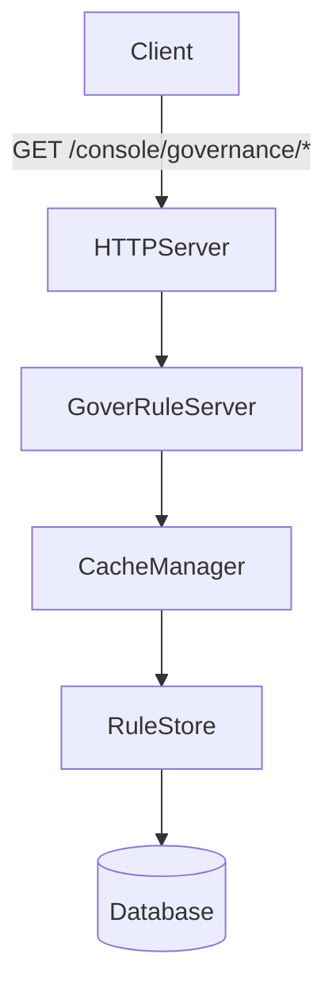
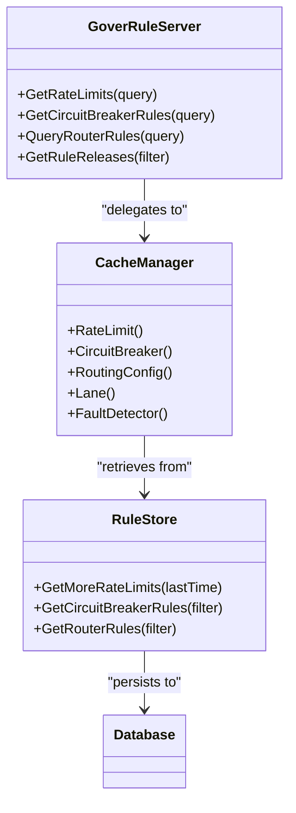
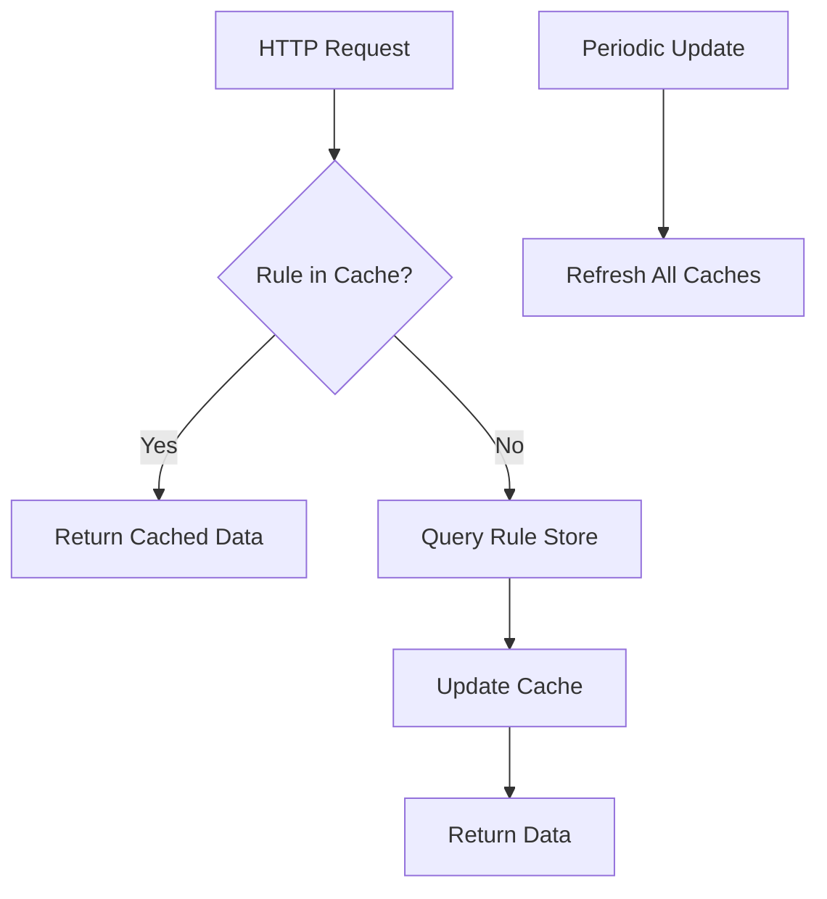

# Governance Console API

<cite>
**Referenced Files in This Document**   
- [circuitbreaker_access.go](file://plugin/apiserver/httpserver/discover/circuitbreaker_access.go)
- [ratelimit_access.go](file://plugin/apiserver/httpserver/discover/ratelimit_access.go)
- [router_access.go](file://plugin/apiserver/httpserver/discover/router_access.go)
- [lane.go](file://pkg/cache/rules/lane.go)
- [goverrule/api.go](file://pkg/goverrule/api.go)
- [circuitbreaker_rule.go](file://pkg/goverrule/circuitbreaker_rule.go)
- [ratelimit_rule.go](file://pkg/goverrule/ratelimit_rule.go)
- [router_rule.go](file://pkg/goverrule/router_rule.go)
- [options.go](file://pkg/goverrule/options.go)
- [types.go](file://apis/cache/types.go)
</cite>

## Table of Contents
1. [Introduction](#introduction)
2. [Core Endpoints](#core-endpoints)
3. [Request Parameters](#request-parameters)
4. [Response Schema](#response-schema)
5. [Rule Aggregation Mechanism](#rule-aggregation-mechanism)
6. [Caching Strategy](#caching-strategy)
7. [Performance Considerations](#performance-considerations)
8. [Troubleshooting Guide](#troubleshooting-guide)

## Introduction
The Governance Console API in pole-server provides HTTP endpoints under the `/console/governance` path to enable UI visualization of service governance policies including rate limiting, circuit breaking, routing rules, and lane configurations. These endpoints aggregate governance rules from multiple rule stores and present them through unified dashboards. The API supports retrieval of rule configurations, enforcement status, and metric summaries for monitoring and management purposes.

## Core Endpoints

The Governance Console API exposes several key endpoints for retrieving governance policies:

- **GET /console/governance/ratelimit**: Retrieves rate limiting rules for services
- **GET /console/governance/circuitbreaker**: Retrieves circuit breaker threshold configurations
- **GET /console/governance/routing**: Retrieves active routing rules across services
- **GET /console/governance/lane**: Retrieves lane configurations for traffic segmentation

These endpoints are implemented through the HTTPServer's governance rule access layer and delegate to the GoverRuleServer interface for actual rule retrieval.



**Diagram sources**
- [circuitbreaker_access.go](file://plugin/apiserver/httpserver/discover/circuitbreaker_access.go#L102-L111)
- [ratelimit_access.go](file://plugin/apiserver/httpserver/discover/ratelimit_access.go#L105-L114)
- [router_access.go](file://plugin/apiserver/httpserver/discover/router_access.go#L123-L131)

**Section sources**
- [circuitbreaker_access.go](file://plugin/apiserver/httpserver/discover/circuitbreaker_access.go#L102-L111)
- [ratelimit_access.go](file://plugin/apiserver/httpserver/discover/ratelimit_access.go#L105-L114)
- [router_access.go](file://plugin/apiserver/httpserver/discover/router_access.go#L123-L131)

## Request Parameters

All governance console endpoints accept query parameters for filtering and pagination:

- **namespace**: Filter rules by namespace (required)
- **service**: Filter rules by service name
- **offset**: Pagination offset (default: 0)
- **limit**: Pagination limit (default: 100)
- **brief**: Boolean flag for brief response format

The API validates all query parameters against allowed filters before processing. Invalid parameters result in a 400 Bad Request response with appropriate error codes.

**Section sources**
- [circuitbreaker_rule.go](file://pkg/goverrule/circuitbreaker_rule.go#L183-L209)
- [ratelimit_rule.go](file://pkg/goverrule/ratelimit_rule.go#L195-L222)
- [router_rule.go](file://pkg/goverrule/router_rule.go#L146-L170)

## Response Schema

Governance endpoints return a standardized JSON response schema containing rule configurations and metadata:

```json
{
  "code": 200,
  "info": "success",
  "amount": 1,
  "size": 1,
  "ratelimits": [...],
  "data": [...]
}
```

The response includes:
- **code**: Operation status code
- **info**: Human-readable status message
- **amount**: Total number of matching rules
- **size**: Number of rules in current response
- **ratelimits**: Array of rate limit rule objects
- **data**: Array of circuit breaker, routing, or other rule objects wrapped in Any type

Rule-specific fields include enforcement status, configuration parameters, and metadata for UI display.

**Section sources**
- [circuitbreaker_rule.go](file://pkg/goverrule/circuitbreaker_rule.go#L183-L209)
- [ratelimit_rule.go](file://pkg/goverrule/ratelimit_rule.go#L195-L222)
- [router_rule.go](file://pkg/goverrule/router_rule.go#L146-L170)

## Rule Aggregation Mechanism

The Governance Console API aggregates rules from multiple sources through a layered architecture. The GoverRuleServer interface coordinates rule retrieval from various rule stores, while the CacheManager provides a unified view of governance policies.



**Diagram sources**
- [goverrule/api.go](file://pkg/goverrule/api.go#L42-L56)
- [options.go](file://pkg/goverrule/options.go#L33-L97)
- [types.go](file://apis/cache/types.go#L365)

**Section sources**
- [goverrule/api.go](file://pkg/goverrule/api.go#L42-L56)
- [options.go](file://pkg/goverrule/options.go#L33-L97)

## Caching Strategy

The Governance Console implements a multi-layer caching strategy to prevent excessive backend queries during UI navigation. The CacheManager maintains in-memory caches for all governance rule types with periodic updates from the rule store.

Cache entries are configured for:
- Rate limiting rules
- Circuit breaker configurations
- Routing rules
- Lane configurations
- Fault detection rules

Caches are updated at configurable intervals, with mechanisms to handle cache misses and ensure data consistency across distributed instances.



**Diagram sources**
- [options.go](file://pkg/goverrule/options.go#L33-L97)
- [ratelimit_config.go](file://pkg/cache/rules/ratelimit_config.go#L65-L94)
- [circuitbreaker.go](file://pkg/cache/rules/circuitbreaker.go#L75-L101)

**Section sources**
- [options.go](file://pkg/goverrule/options.go#L33-L97)
- [ratelimit_config.go](file://pkg/cache/rules/ratelimit_config.go#L65-L94)

## Performance Considerations

When displaying governance rules across large service meshes, consider the following performance implications:

1. **Pagination**: Always use offset and limit parameters to avoid retrieving large datasets
2. **Filtering**: Apply namespace and service filters to reduce result sets
3. **Brief Mode**: Use brief=true parameter when full rule details are not needed
4. **Caching**: Leverage the built-in caching to reduce database load
5. **Parallel Requests**: UI should make parallel requests for different rule types

For optimal performance with large service meshes, implement client-side pagination and incremental loading patterns.

**Section sources**
- [circuitbreaker_rule.go](file://pkg/goverrule/circuitbreaker_rule.go#L183-L209)
- [ratelimit_rule.go](file://pkg/goverrule/ratelimit_rule.go#L195-L222)
- [router_rule.go](file://pkg/goverrule/router_rule.go#L146-L170)

## Troubleshooting Guide

Common issues and their solutions:

**Missing Rules**
- Verify namespace and service parameters match exactly
- Check authentication permissions for rule access
- Confirm rules exist in the database
- Validate cache is properly initialized

**Inconsistent Policy States**
- Check for cache synchronization issues
- Verify rule propagation across cluster nodes
- Ensure consistent timestamps across servers
- Review rule precedence and inheritance logic

**Delayed Rule Propagation**
- Check cache update interval configuration
- Verify rule store connectivity
- Monitor background update goroutines
- Review error logs for update failures

**Section sources**
- [circuitbreaker_access.go](file://plugin/apiserver/httpserver/discover/circuitbreaker_access.go#L102-L111)
- [ratelimit_access.go](file://plugin/apiserver/httpserver/discover/ratelimit_access.go#L105-L114)
- [router_access.go](file://plugin/apiserver/httpserver/discover/router_access.go#L123-L131)