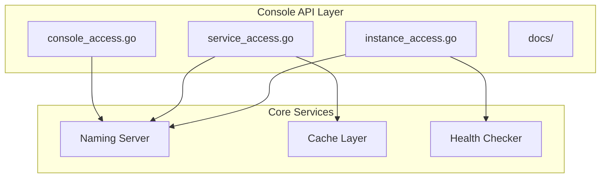
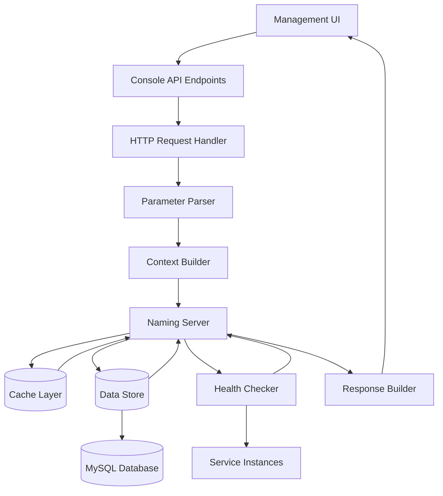
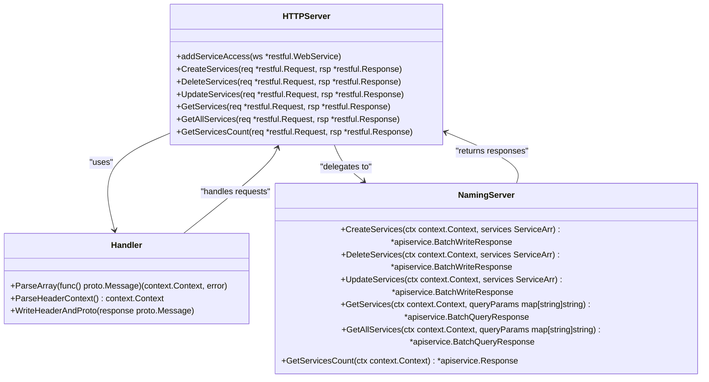
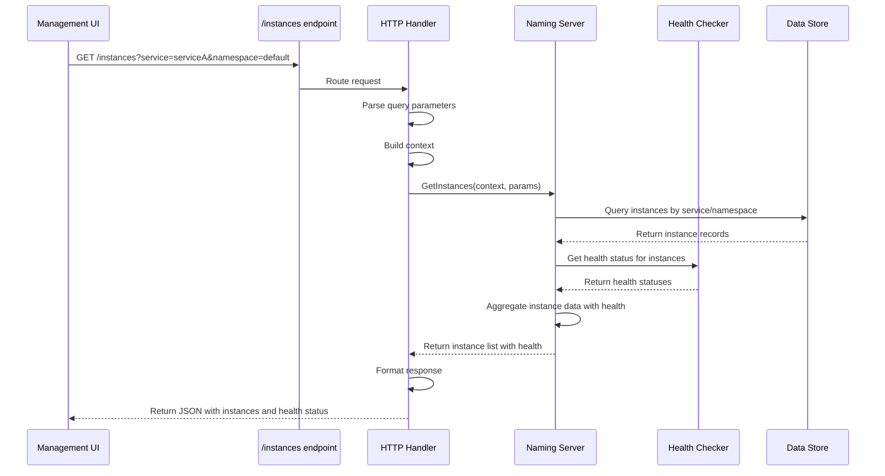
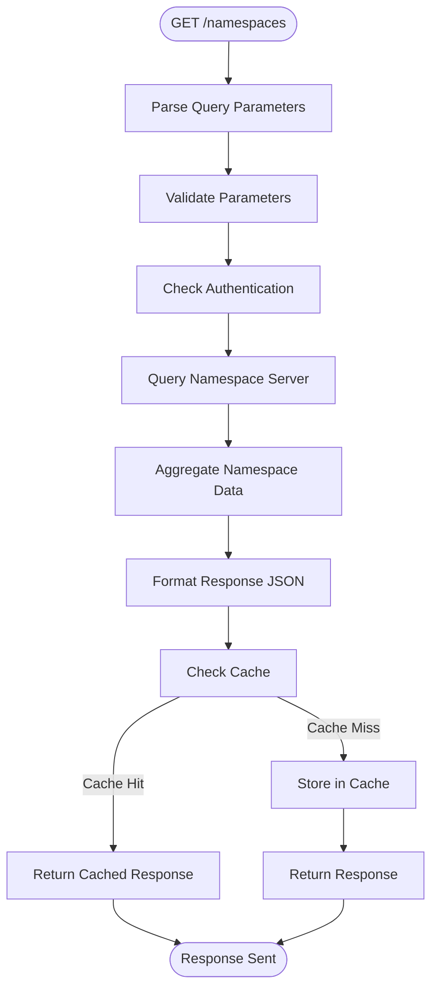
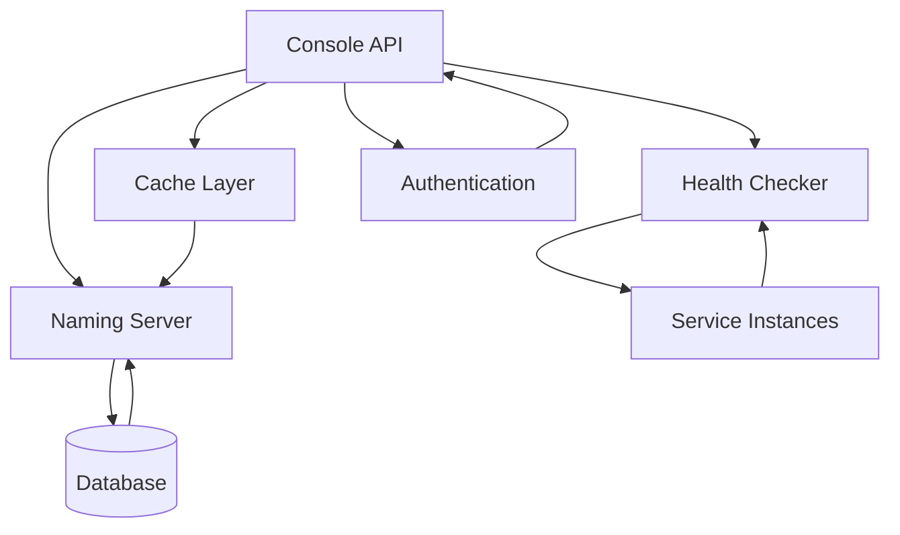

# Service Console API

<cite>
**Referenced Files in This Document**   
- [console_access.go](file://plugin/apiserver/httpserver/console_access.go)
- [service_access.go](file://plugin/apiserver/httpserver/discover/service_access.go)
- [instance_access.go](file://plugin/apiserver/httpserver/discover/instance_access.go)
- [core_console_apidoc.go](file://plugin/apiserver/httpserver/docs/core_console_apidoc.go)
- [naming_console_access_apidoc.go](file://plugin/apiserver/httpserver/docs/naming_console_access_apidoc.go)
</cite>

## Table of Contents
1. [Introduction](#introduction)
2. [Project Structure](#project-structure)
3. [Core Components](#core-components)
4. [Architecture Overview](#architecture-overview)
5. [Detailed Component Analysis](#detailed-component-analysis)
6. [Dependency Analysis](#dependency-analysis)
7. [Performance Considerations](#performance-considerations)
8. [Troubleshooting Guide](#troubleshooting-guide)
9. [Conclusion](#conclusion)

## Introduction
The Service Console API in pole-server provides HTTP endpoints under `/console/service*` and `/console/instance*` paths to support the management UI with service topology, instance health, and metadata. These endpoints are designed for read-heavy operations, aggregating data from the service registry and health checking system to deliver UI-ready summaries. The API supports filtering by namespace and service name, includes pagination, and returns structured JSON responses with service counts, instance status breakdowns, and health statistics. Caching is implemented at the console layer to reduce backend load and improve responsiveness, especially in large-scale deployments.

## Project Structure
The Service Console API functionality is primarily located in the `plugin/apiserver/httpserver` directory, with key components organized across multiple subpackages. The core console access logic resides in `console_access.go`, while service and instance endpoints are implemented in `discover/service_access.go` and `discover/instance_access.go` respectively. API documentation and OpenAPI specifications are defined in the `docs` package.

**Diagram sources**
- [console_access.go](file://plugin/apiserver/httpserver/console_access.go#L1-L154)
- [service_access.go](file://plugin/apiserver/httpserver/discover/service_access.go#L1-L257)
- [instance_access.go](file://plugin/apiserver/httpserver/discover/instance_access.go#L1-L209)

**Section sources**
- [console_access.go](file://plugin/apiserver/httpserver/console_access.go#L1-L154)
- [service_access.go](file://plugin/apiserver/httpserver/discover/service_access.go#L1-L257)
- [instance_access.go](file://plugin/apiserver/httpserver/discover/instance_access.go#L1-L209)

## Core Components
The Service Console API consists of three main components: namespace management, service management, and instance management. The namespace endpoints in `console_access.go` handle CRUD operations for namespaces, which serve as logical groupings for services. The service endpoints in `service_access.go` provide comprehensive service management including creation, deletion, updates, and retrieval of service information along with service aliases and contracts. The instance endpoints in `instance_access.go` manage service instances, supporting operations like registration, deregistration, updates, isolation, and querying instance details.

**Section sources**
- [console_access.go](file://plugin/apiserver/httpserver/console_access.go#L1-L154)
- [service_access.go](file://plugin/apiserver/httpserver/discover/service_access.go#L1-L257)
- [instance_access.go](file://plugin/apiserver/httpserver/discover/instance_access.go#L1-L209)

## Architecture Overview
The Service Console API follows a layered architecture with HTTP handlers delegating to business logic services. The `HTTPServer` struct in the httpserver package routes incoming requests to appropriate handler methods, which parse parameters and headers before delegating to the naming server for data access. Response data is aggregated from multiple sources including the service registry, health checking system, and metadata store. The architecture incorporates caching at multiple levels to optimize performance, with frequently accessed data like service lists and instance counts cached to reduce database load.

**Diagram sources**
- [console_access.go](file://plugin/apiserver/httpserver/console_access.go#L1-L154)
- [service_access.go](file://plugin/apiserver/httpserver/discover/service_access.go#L1-L257)
- [instance_access.go](file://plugin/apiserver/httpserver/discover/instance_access.go#L1-L209)

## Detailed Component Analysis

### Service Management Analysis
The service management component provides endpoints for managing services in the registry. The `/services` endpoint supports GET, POST, PUT, and DELETE operations for retrieving, creating, updating, and deleting services respectively. Additional endpoints include `/services/all` for retrieving all services, `/services/count` for getting service counts, and various endpoints for managing service aliases and contracts.

**Diagram sources**
- [service_access.go](file://plugin/apiserver/httpserver/discover/service_access.go#L1-L257)

**Section sources**
- [service_access.go](file://plugin/apiserver/httpserver/discover/service_access.go#L1-L257)

### Instance Management Analysis
The instance management component handles service instance operations including registration, deregistration, updates, and queries. The `/instances` endpoint supports CRUD operations for instances, with additional endpoints for batch operations and health-related queries. The component integrates with the health checking system to provide up-to-date instance status information.

**Diagram sources**
- [instance_access.go](file://plugin/apiserver/httpserver/discover/instance_access.go#L1-L209)

**Section sources**
- [instance_access.go](file://plugin/apiserver/httpserver/discover/instance_access.go#L1-L209)

### Namespace Management Analysis
The namespace management component provides CRUD operations for namespaces, which are used to organize services in the registry. The `/namespaces` endpoint supports GET, POST, PUT, and DELETE operations through the console access layer. Namespaces serve as the primary organizational unit for services and are used for access control and resource isolation.

**Diagram sources**
- [console_access.go](file://plugin/apiserver/httpserver/console_access.go#L1-L154)

**Section sources**
- [console_access.go](file://plugin/apiserver/httpserver/console_access.go#L1-L154)

## Dependency Analysis
The Service Console API has well-defined dependencies on core services within the pole-server architecture. The primary dependency is on the naming server, which provides the business logic for service and instance management. The API layer also depends on the health checking system for instance health status and on the data store for persistent storage. Caching is implemented through a dedicated cache layer that reduces database load. The dependency graph shows a clean separation of concerns with the console API acting as a facade to the underlying services.

**Diagram sources**
- [console_access.go](file://plugin/apiserver/httpserver/console_access.go#L1-L154)
- [service_access.go](file://plugin/apiserver/httpserver/discover/service_access.go#L1-L257)
- [instance_access.go](file://plugin/apiserver/httpserver/discover/instance_access.go#L1-L209)

**Section sources**
- [console_access.go](file://plugin/apiserver/httpserver/console_access.go#L1-L154)
- [service_access.go](file://plugin/apiserver/httpserver/discover/service_access.go#L1-L257)
- [instance_access.go](file://plugin/apiserver/httpserver/discover/instance_access.go#L1-L209)

## Performance Considerations
The Service Console API is designed to handle large-scale deployments with thousands of services and instances. Caching is implemented at multiple levels to reduce backend load and improve UI responsiveness. The `/services/count` and `/instances/count` endpoints provide efficient ways to retrieve aggregate statistics without loading full datasets. Pagination is supported on list endpoints with a maximum limit of 100 items per request to prevent excessive memory usage. For large deployments, the API performance may be impacted by the volume of health check data that needs to be aggregated with service and instance information. Implementing more aggressive caching strategies and optimizing database queries can help mitigate performance issues in large-scale environments.

## Troubleshooting Guide
Common issues with the Service Console API include missing services in the console, stale health status, and slow response times. For missing services, verify that the namespace and service name filters are correctly specified and that the requesting user has appropriate permissions. Stale health status may indicate issues with the health checking system or caching layer; clearing the cache or restarting the health checker service may resolve the issue. Slow response times in large deployments can often be addressed by optimizing database indexes, increasing cache capacity, or implementing query filtering to reduce result set sizes. Monitoring logs in the naming server and health checker components can provide additional insights into performance bottlenecks.

**Section sources**
- [service_access.go](file://plugin/apiserver/httpserver/discover/service_access.go#L1-L257)
- [instance_access.go](file://plugin/apiserver/httpserver/discover/instance_access.go#L1-L209)
- [console_access.go](file://plugin/apiserver/httpserver/console_access.go#L1-L154)

## Conclusion
The Service Console API in pole-server provides a comprehensive set of endpoints for managing services and instances through the management UI. The API is well-structured with clear separation between namespace, service, and instance management functions. It effectively aggregates data from multiple sources including the service registry and health checking system to provide rich, UI-ready summaries. The caching implementation helps reduce backend load and improve responsiveness, though performance considerations should be taken into account in large-scale deployments. The API design follows RESTful principles and provides extensive filtering and pagination capabilities to support efficient data retrieval.