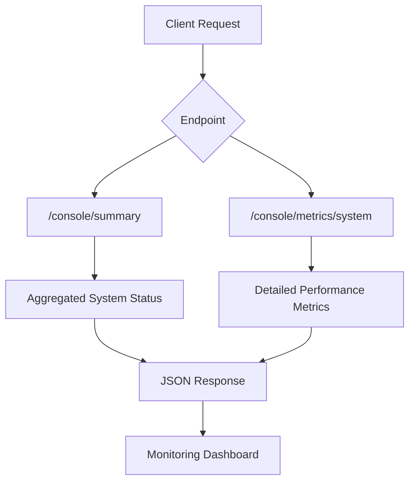
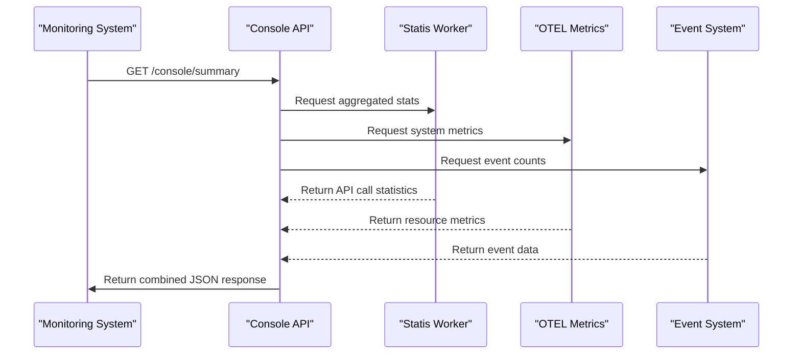
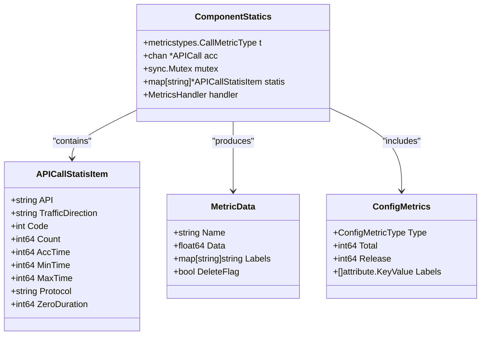
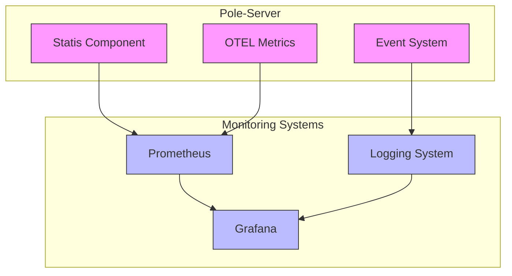

# System Overview API

<cite>
**Referenced Files in This Document**   
- [admin_access.go](file://plugin/apiserver/httpserver/admin_access.go)
- [statis.go](file://plugin/observability/statis/logger/statis.go)
- [apicall.go](file://plugin/observability/statis/base/apicall.go)
- [common.go](file://plugin/observability/statis/base/common.go)
- [discovery_handle.go](file://plugin/observability/statis/prometheus/discovery_handle.go)
- [types.go](file://apis/pkg/types/metrics/types.go)
</cite>

## Table of Contents
1. [Introduction](#introduction)
2. [Core Endpoints](#core-endpoints)
3. [Data Collection and Aggregation](#data-collection-and-aggregation)
4. [Metrics Structure and Response Format](#metrics-structure-and-response-format)
5. [Sampling and Retention Policies](#sampling-and-retention-policies)
6. [Performance Considerations](#performance-considerations)
7. [Troubleshooting Guide](#troubleshooting-guide)
8. [Integration with Prometheus and Logging](#integration-with-prometheus-and-logging)

## Introduction
The System Overview API in pole-server provides comprehensive monitoring and observability capabilities through the `/console/summary` and `/console/metrics` endpoints. These endpoints deliver aggregated system health, operational metrics, and performance indicators for the management console. The API enables real-time monitoring of service status, request throughput, error rates, latency percentiles, and resource utilization across the system. Data is collected from multiple observability components including statis, event, and OTEL metrics, providing a holistic view of system operations. This documentation details the available endpoints, their response structures, data collection mechanisms, and integration points for comprehensive system monitoring.

**Section sources**
- [admin_access.go](file://plugin/apiserver/httpserver/admin_access.go#L59-L77)

## Core Endpoints
The System Overview API exposes several endpoints under the `/console` path to retrieve system-wide operational data. The primary endpoints include `/console/summary` for high-level system status and `/console/metrics/system` for detailed performance metrics. These endpoints use the HTTP GET method and return JSON responses containing aggregated data about server status, service counts, API call volumes, health check success rates, and resource utilization. The endpoints are designed to support real-time monitoring dashboards by providing timely and accurate system health information.

**Diagram sources**
- [admin_access.go](file://plugin/apiserver/httpserver/admin_access.go#L59-L77)

**Section sources**
- [admin_access.go](file://plugin/apiserver/httpserver/admin_access.go#L59-L77)

## Data Collection and Aggregation
The System Overview API collects data from multiple observability components within pole-server. The statis component gathers API call statistics, including request counts, latency measurements, and error codes. The event component captures system events such as service registration, health check results, and configuration changes. OTEL metrics provide standardized telemetry data that can be exported to external monitoring systems. Data aggregation occurs through the ComponentStatics structure, which maintains a channel-based system for collecting API call data and processing it in batches. The aggregation process runs continuously, summarizing data over configurable time intervals before exposing it through the API endpoints.

**Diagram sources**
- [apicall.go](file://plugin/observability/statis/base/apicall.go#L41-L98)
- [statis.go](file://plugin/observability/statis/logger/statis.go#L106-L152)
- [discovery_handle.go](file://plugin/observability/statis/prometheus/discovery_handle.go#L87-L124)

**Section sources**
- [apicall.go](file://plugin/observability/statis/base/apicall.go#L41-L98)
- [statis.go](file://plugin/observability/statis/logger/statis.go#L106-L152)
- [discovery_handle.go](file://plugin/observability/statis/prometheus/discovery_handle.go#L87-L124)

## Metrics Structure and Response Format
The API endpoints return structured JSON responses containing various performance indicators and system health metrics. The response includes server status information, request throughput metrics, error rates, latency percentiles, and resource utilization data. Key metrics include service online/offline/abnormal counts, instance health status, API call volume, and latency measurements. The data is organized with appropriate labels for API endpoint, protocol, and error code, enabling detailed analysis of system performance. The metrics follow a consistent naming convention and include descriptive help text for clarity.

**Diagram sources**
- [apicall.go](file://plugin/observability/statis/base/apicall.go#L41-L98)
- [common.go](file://plugin/observability/statis/base/common.go#L0-L48)
- [types.go](file://apis/pkg/types/metrics/types.go#L142-L164)

**Section sources**
- [apicall.go](file://plugin/observability/statis/base/apicall.go#L41-L98)
- [common.go](file://plugin/observability/statis/base/common.go#L43-L65)
- [types.go](file://apis/pkg/types/metrics/types.go#L142-L164)

## Sampling and Retention Policies
The System Overview API implements specific sampling intervals and retention policies to balance data accuracy with system performance. Metrics are collected in real-time through a buffered channel system with a capacity of 1024 entries, ensuring that high-volume API calls do not overwhelm the system. The aggregation process runs with a maximum add duration of 800 milliseconds, after which warnings are logged if processing becomes delayed. Data is retained for a configurable period, with zero-duration metrics (representing periods with no requests) being removed from Prometheus after exceeding a threshold of 3 intervals. The system uses a sliding window approach to calculate averages, minimums, and maximums over recent time periods, providing up-to-date performance insights while managing memory usage efficiently.

**Section sources**
- [apicall.go](file://plugin/observability/statis/base/apicall.go#L41-L98)
- [common.go](file://plugin/observability/statis/base/common.go#L0-L48)

## Performance Considerations
The System Overview API is designed with performance in mind to minimize impact on production systems. The data collection mechanism uses non-blocking channels to prevent request processing delays, with a quick-return mechanism when the channel buffer is full. The aggregation process runs in a separate goroutine, ensuring that metric collection does not block critical system operations. For real-time monitoring dashboards, the API provides optimized responses with pre-aggregated data, reducing the computational overhead of on-demand calculations. The system implements configurable sampling rates and data retention policies to balance monitoring granularity with resource consumption. Additionally, the use of efficient data structures and algorithms ensures that metric processing scales well with increasing system load.

**Section sources**
- [apicall.go](file://plugin/observability/statis/base/apicall.go#L41-L98)
- [common.go](file://plugin/observability/statis/base/common.go#L0-L48)

## Troubleshooting Guide
When encountering issues with the System Overview API, several common problems may arise. Missing metrics typically indicate issues with the data collection pipeline or channel overflow. Inconsistent data aggregation may result from timing issues between the aggregation worker and data collection. Delayed metric updates in the console can occur when the system is under heavy load, causing the metric processing queue to back up. To troubleshoot these issues, first verify that the statis worker is running and processing data by checking system logs. Monitor the channel buffer usage to ensure it's not consistently full, which would indicate a processing bottleneck. Check for warning messages related to the MaxAddDuration threshold being exceeded, which suggests the system cannot keep up with the volume of metric data. Additionally, verify that the OTEL meter is properly registered and that Prometheus scraping is configured correctly.

**Section sources**
- [apicall.go](file://plugin/observability/statis/base/apicall.go#L41-L98)
- [common.go](file://plugin/observability/statis/base/common.go#L0-L48)
- [statis.go](file://plugin/observability/statis/logger/statis.go#L106-L152)

## Integration with Prometheus and Logging
The System Overview API integrates seamlessly with Prometheus and logging systems for comprehensive observability. The statis component exposes metrics in a format compatible with Prometheus, allowing direct scraping of system performance data. OTEL metrics are registered with the system meter and can be exported to various backends, including Prometheus, Jaeger, and other observability platforms. The logging system captures detailed information about API call statistics, including protocol, traffic direction, error codes, and latency measurements, which can be correlated with metrics for deeper analysis. This integration enables organizations to build comprehensive monitoring solutions that combine real-time metrics, historical trends, and detailed logs for effective system management and troubleshooting.

**Diagram sources**
- [discovery_handle.go](file://plugin/observability/statis/prometheus/discovery_handle.go#L87-L124)
- [statis.go](file://plugin/observability/statis/logger/statis.go#L106-L152)

**Section sources**
- [discovery_handle.go](file://plugin/observability/statis/prometheus/discovery_handle.go#L87-L124)
- [statis.go](file://plugin/observability/statis/logger/statis.go#L106-L152)