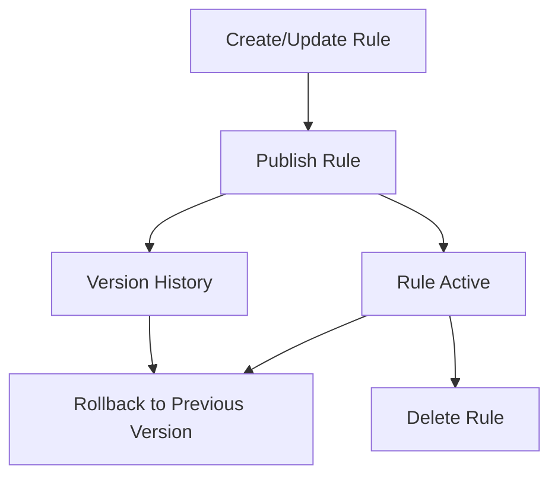
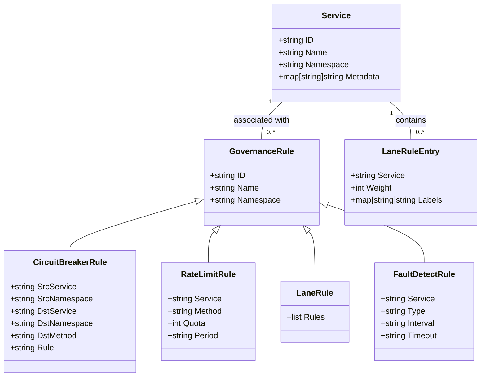
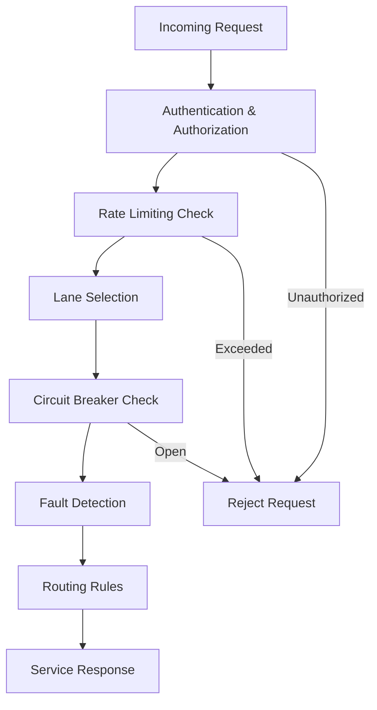

# Governance Rules

<cite>
**Referenced Files in This Document**   
- [circuitbreaker_access.go](file://plugin/apiserver/httpserver/discover/circuitbreaker_access.go)
- [faultdetect_access.go](file://plugin/apiserver/httpserver/discover/faultdetect_access.go)
- [lane_access.go](file://plugin/apiserver/httpserver/discover/lane_access.go)
- [ratelimit_rule.go](file://pkg/goverrule/ratelimit_rule.go)
- [circuitbreaker_rule.go](file://pkg/goverrule/circuitbreaker_rule.go)
- [faultdetect_rule.go](file://pkg/goverrule/faultdetect_rule.go)
- [lane_rule.go](file://pkg/goverrule/lane_rule.go)
- [releases.go](file://pkg/goverrule/releases.go)
- [release.go](file://apis/pkg/types/rules/release.go)
- [circuit_breaker.go](file://apis/pkg/types/rules/circuit_breaker.go)
- [fault_detect.go](file://apis/pkg/types/rules/fault_detect.go)
- [lane.go](file://apis/pkg/types/rules/lane.go)
- [ratelimit.go](file://apis/pkg/types/rules/ratelimit.go)
- [circuitbreaker.go](file://plugin/store/mysql/circuitbreaker.go)
- [faultdetect.go](file://plugin/store/mysql/faultdetect.go)
- [lane.go](file://plugin/store/mysql/lane.go)
- [ratelimit_config.go](file://plugin/store/mysql/ratelimit_config.go)
</cite>

## Table of Contents
1. [Introduction](#introduction)
2. [Governance Rule Management](#governance-rule-management)
3. [Circuit Breaker Configuration](#circuit-breaker-configuration)
4. [Rate Limiting Rules](#rate-limiting-rules)
5. [Lane Management](#lane-management)
6. [Fault Detection Settings](#fault-detection-settings)
7. [Rule Association with Services](#rule-association-with-services)
8. [Rule Evaluation Order](#rule-evaluation-order)
9. [Error Conditions and Validation](#error-conditions-and-validation)
10. [Common Configuration Issues](#common-configuration-issues)

## Introduction
This document provides comprehensive API documentation for applying governance rules through HTTP endpoints in pole-server. The governance system enables service resilience and traffic control through circuit breaker configuration, rate limiting, lane management, and fault detection settings. Each rule type can be managed through standard CRUD operations and supports versioned releases for safe deployment.

**Section sources**
- [circuitbreaker_access.go](file://plugin/apiserver/httpserver/discover/circuitbreaker_access.go#L0-L32)
- [faultdetect_access.go](file://plugin/apiserver/httpserver/discover/faultdetect_access.go#L0-L32)
- [lane_access.go](file://plugin/apiserver/httpserver/discover/lane_access.go#L0-L32)

## Governance Rule Management
Governance rules in pole-server are managed through a consistent API pattern that supports creation, retrieval, update, and deletion operations. All governance rules follow a release-based deployment model where changes are published to become active. The system maintains version history and supports rollback operations.

The governance rule lifecycle consists of:
1. Rule creation/modification
2. Rule publishing (activation)
3. Rule version management
4. Rule deactivation/deletion

Each rule type has dedicated endpoints for managing its lifecycle, with consistent request/response patterns across all rule types.



**Diagram sources**
- [releases.go](file://pkg/goverrule/releases.go#L204-L252)
- [release.go](file://apis/pkg/types/rules/release.go#L0-L84)

**Section sources**
- [releases.go](file://pkg/goverrule/releases.go#L0-L36)
- [release.go](file://apis/pkg/types/rules/release.go#L0-L84)

## Circuit Breaker Configuration
Circuit breaker rules protect services from cascading failures by automatically opening the circuit when error rates exceed configured thresholds. The circuit breaker operates in three states: closed, open, and half-open.

### Endpoints
- **POST /naming/v1/circuitbreaker**: Create circuit breaker rules
- **GET /naming/v1/circuitbreaker**: Query circuit breaker rules
- **PUT /naming/v1/circuitbreaker**: Update circuit breaker rules
- **POST /naming/v1/circuitbreaker/delete**: Delete circuit breaker rules
- **POST /naming/v1/circuitbreaker/releases**: Publish circuit breaker rules
- **PUT /naming/v1/circuitbreaker/releases/rollback**: Rollback circuit breaker rules

### Request Schema
```json
{
  "id": "string",
  "name": "string",
  "namespace": "string",
  "description": "string",
  "level": 0,
  "srcService": "string",
  "srcNamespace": "string",
  "dstService": "string",
  "dstNamespace": "string",
  "dstMethod": "string",
  "rule": "string",
  "enable": true
}
```

### Response Schema
```json
{
  "code": 200,
  "info": "string",
  "configWithServices": [
    {
      "circuitBreaker": {
        "id": "string",
        "name": "string",
        "namespace": "string",
        "rule": "string",
        "enable": true
      }
    }
  ]
}
```

### Example: Configuring Circuit Breaker Thresholds
```bash
curl -X POST http://localhost:8080/naming/v1/circuitbreaker \
  -H "Content-Type: application/json" \
  -d '[
    {
      "name": "payment-service-cb",
      "namespace": "production",
      "srcService": "*",
      "srcNamespace": "production",
      "dstService": "payment-service",
      "dstNamespace": "production",
      "rule": "{\"outlierDetection\":{\"consecutiveErrorThreshold\":5,\"interval\":"10s","baseEjectionTime":"30s","maxEjectionPercent":50}}",
      "enable": true
    }
  ]'
```

```go
// Go client code for creating circuit breaker rule
func CreateCircuitBreaker(client *http.Client, rule *apifault.CircuitBreakerRule) error {
    url := "http://localhost:8080/naming/v1/circuitbreaker"
    data, _ := json.Marshal([]*apifault.CircuitBreakerRule{rule})
    
    resp, err := client.Post(url, "application/json", bytes.NewBuffer(data))
    if err != nil {
        return err
    }
    defer resp.Body.Close()
    
    return nil
}
```

**Section sources**
- [circuitbreaker_access.go](file://plugin/apiserver/httpserver/discover/circuitbreaker_access.go#L0-L111)
- [circuitbreaker_rule.go](file://pkg/goverrule/circuitbreaker_rule.go#L0-L30)
- [circuit_breaker.go](file://apis/pkg/types/rules/circuit_breaker.go#L143-L162)

## Rate Limiting Rules
Rate limiting rules control the traffic flow to services by enforcing quotas on request rates. The system supports various rate limiting strategies including token bucket, leaky bucket, and fixed window algorithms.

### Endpoints
- **POST /naming/v1/ratelimit**: Create rate limiting rules
- **GET /naming/v1/ratelimit**: Query rate limiting rules
- **PUT /naming/v1/ratelimit**: Update rate limiting rules
- **POST /naming/v1/ratelimit/delete**: Delete rate limiting rules
- **POST /naming/v1/ratelimit/releases**: Publish rate limiting rules
- **PUT /naming/v1/ratelimit/releases/rollback**: Rollback rate limiting rules

### Request Schema
```json
{
  "id": "string",
  "name": "string",
  "namespace": "string",
  "service": "string",
  "method": "string",
  "quota": 100,
  "period": "1s",
  "strategy": "TOKEN_BUCKET",
  "burst": 20,
  "description": "string"
}
```

### Response Schema
```json
{
  "code": 200,
  "info": "string",
  "rateLimits": [
    {
      "id": "string",
      "name": "string",
      "namespace": "string",
      "service": "string",
      "quota": 100,
      "period": "1s",
      "strategy": "TOKEN_BUCKET"
    }
  ]
}
```

### Example: Configuring Rate Limiting Quotas
```bash
curl -X POST http://localhost:8080/naming/v1/ratelimit \
  -H "Content-Type: application/json" \
  -d '[
    {
      "name": "api-gateway-rl",
      "namespace": "production",
      "service": "api-gateway",
      "quota": 1000,
      "period": "1s",
      "strategy": "TOKEN_BUCKET",
      "burst": 200,
      "description": "Limit API gateway to 1000 requests per second"
    }
  ]'
```

```go
// Go client code for creating rate limiting rule
func CreateRateLimit(client *http.Client, rule *apitraffic.RateLimit) error {
    url := "http://localhost:8080/naming/v1/ratelimit"
    data, _ := json.Marshal([]*apitraffic.RateLimit{rule})
    
    resp, err := client.Post(url, "application/json", bytes.NewBuffer(data))
    if err != nil {
        return err
    }
    defer resp.Body.Close()
    
    return nil
}
```

**Section sources**
- [ratelimit_rule.go](file://pkg/goverrule/ratelimit_rule.go#L0-L30)
- [ratelimit.go](file://apis/pkg/types/rules/ratelimit.go#L0-L50)
- [ratelimit_config.go](file://plugin/store/mysql/ratelimit_config.go#L0-L30)

## Lane Management
Lane management enables traffic segmentation for canary deployments, A/B testing, and blue-green deployments. Lanes are logical groupings of service instances that can receive different traffic proportions.

### Endpoints
- **POST /naming/v1/lane**: Create lane rules
- **GET /naming/v1/lane**: Query lane rules
- **PUT /naming/v1/lane**: Update lane rules
- **POST /naming/v1/lane/delete**: Delete lane rules
- **POST /naming/v1/lane/releases**: Publish lane rules
- **PUT /naming/v1/lane/releases/rollback**: Rollback lane rules

### Request Schema
```json
{
  "id": "string",
  "name": "string",
  "namespace": "string",
  "version": "string",
  "rules": [
    {
      "service": "string",
      "weight": 100,
      "labels": {
        "key": "value"
      }
    }
  ],
  "description": "string"
}
```

### Response Schema
```json
{
  "code": 200,
  "info": "string",
  "lanes": [
    {
      "id": "string",
      "name": "string",
      "namespace": "string",
      "rules": [
        {
          "service": "string",
          "weight": 100
        }
      ]
    }
  ]
}
```

### Example: Configuring Lane Weights
```bash
curl -X POST http://localhost:8080/naming/v1/lane \
  -H "Content-Type: application/json" \
  -d '[
    {
      "name": "canary-deployment",
      "namespace": "production",
      "rules": [
        {
          "service": "order-service",
          "weight": 90,
          "labels": {
            "version": "v1"
          }
        },
        {
          "service": "order-service",
          "weight": 10,
          "labels": {
            "version": "v2"
          }
        }
      ],
      "description": "90% traffic to v1, 10% to v2"
    }
  ]'
```

```go
// Go client code for creating lane rule
func CreateLaneRule(client *http.Client, rule *apitraffic.LaneRule) error {
    url := "http://localhost:8080/naming/v1/lane"
    data, _ := json.Marshal([]*apitraffic.LaneRule{rule})
    
    resp, err := client.Post(url, "application/json", bytes.NewBuffer(data))
    if err != nil {
        return err
    }
    defer resp.Body.Close()
    
    return nil
}
```

**Section sources**
- [lane_access.go](file://plugin/apiserver/httpserver/discover/lane_access.go#L0-L32)
- [lane_rule.go](file://pkg/goverrule/lane_rule.go#L0-L30)
- [lane.go](file://apis/pkg/types/rules/lane.go#L0-L50)

## Fault Detection Settings
Fault detection rules configure active health checking for service instances. The system supports various health check types including HTTP, TCP, and gRPC probes with configurable intervals and thresholds.

### Endpoints
- **POST /naming/v1/faultdetect**: Create fault detection rules
- **GET /naming/v1/faultdetect**: Query fault detection rules
- **PUT /naming/v1/faultdetect**: Update fault detection rules
- **POST /naming/v1/faultdetect/delete**: Delete fault detection rules
- **POST /naming/v1/faultdetect/releases**: Publish fault detection rules
- **PUT /naming/v1/faultdetect/releases/rollback**: Rollback fault detection rules

### Request Schema
```json
{
  "id": "string",
  "name": "string",
  "namespace": "string",
  "service": "string",
  "type": "HTTP",
  "interval": "30s",
  "timeout": "5s",
  "unhealthyThreshold": 3,
  "healthyThreshold": 1,
  "httpPath": "/health",
  "httpHeaders": {
    "key": "value"
  },
  "port": 8080,
  "description": "string"
}
```

### Response Schema
```json
{
  "code": 200,
  "info": "string",
  "faultDetects": [
    {
      "id": "string",
      "name": "string",
      "namespace": "string",
      "service": "string",
      "type": "HTTP",
      "interval": "30s",
      "timeout": "5s"
    }
  ]
}
```

### Example: Configuring Fault Detection Intervals
```bash
curl -X POST http://localhost:8080/naming/v1/faultdetect \
  -H "Content-Type: application/json" \
  -d '[
    {
      "name": "payment-service-health",
      "namespace": "production",
      "service": "payment-service",
      "type": "HTTP",
      "interval": "10s",
      "timeout": "2s",
      "unhealthyThreshold": 2,
      "healthyThreshold": 1,
      "httpPath": "/health",
      "port": 8080,
      "description": "Health check for payment service"
    }
  ]'
```

```go
// Go client code for creating fault detection rule
func CreateFaultDetectRule(client *http.Client, rule *apifault.FaultDetectRule) error {
    url := "http://localhost:8080/naming/v1/faultdetect"
    data, _ := json.Marshal([]*apifault.FaultDetectRule{rule})
    
    resp, err := client.Post(url, "application/json", bytes.NewBuffer(data))
    if err != nil {
        return err
    }
    defer resp.Body.Close()
    
    return nil
}
```

**Section sources**
- [faultdetect_access.go](file://plugin/apiserver/httpserver/discover/faultdetect_access.go#L0-L32)
- [faultdetect_rule.go](file://pkg/goverrule/faultdetect_rule.go#L0-L30)
- [fault_detect.go](file://apis/pkg/types/rules/fault_detect.go#L0-L50)

## Rule Association with Services
Governance rules are associated with services through matching criteria defined in the rule configuration. The association mechanism supports multiple matching strategies including service name, namespace, method, and metadata labels.

### Service Matching
Rules are associated with services through source and destination matching:
- **Source Matching**: Defines which callers are subject to the rule
- **Destination Matching**: Defines which service instances the rule applies to

The matching system supports wildcards and regular expressions for flexible rule application.

### Instance Association
For lane management and some fault detection rules, rules can be associated with specific service instances based on metadata labels. This enables fine-grained traffic control and health checking.



**Diagram sources**
- [circuit_breaker.go](file://apis/pkg/types/rules/circuit_breaker.go#L143-L162)
- [ratelimit.go](file://apis/pkg/types/rules/ratelimit.go#L0-L50)
- [lane.go](file://apis/pkg/types/rules/lane.go#L0-L50)
- [fault_detect.go](file://apis/pkg/types/rules/fault_detect.go#L0-L50)

**Section sources**
- [circuit_breaker.go](file://apis/pkg/types/rules/circuit_breaker.go#L143-L162)
- [ratelimit.go](file://apis/pkg/types/rules/ratelimit.go#L0-L50)

## Rule Evaluation Order
Governance rules are evaluated in a specific order to ensure predictable behavior when multiple rules apply to the same service interaction. The evaluation order is:

1. **Authentication and Authorization**: Verify caller identity and permissions
2. **Rate Limiting**: Apply rate limiting rules to control request volume
3. **Lane Selection**: Determine which lane the request should be routed to
4. **Circuit Breaker**: Check circuit breaker state for service resilience
5. **Fault Detection**: Apply active health checking for instance selection
6. **Routing Rules**: Apply any additional routing logic

This order ensures that traffic is first controlled for security and volume, then routed through the appropriate lanes with resilience protections in place.



**Diagram sources**
- [releases.go](file://pkg/goverrule/releases.go#L204-L252)
- [circuitbreaker.go](file://plugin/store/mysql/circuitbreaker.go#L510-L539)

**Section sources**
- [releases.go](file://pkg/goverrule/releases.go#L204-L252)
- [circuitbreaker.go](file://plugin/store/mysql/circuitbreaker.go#L510-L539)

## Error Conditions and Validation
The governance rule system validates all rule configurations before activation and returns appropriate error codes for invalid configurations.

### Common Error Conditions
- **Invalid Rule Configuration**: Rule JSON is malformed or contains invalid values
- **Conflicting Rules**: Multiple rules with conflicting settings for the same service
- **Unsupported Strategies**: Rate limiting strategy not supported by the system
- **Missing Required Fields**: Required fields like name, namespace, or service are missing
- **Duplicate Rule Names**: Rule with the same name already exists in the namespace

### Validation Constraints
- Rule names must be unique within a namespace
- Quotas must be positive integers
- Time intervals must be valid duration strings (e.g., "30s", "1m")
- Weights must sum to 100 for lane rules
- Health check intervals must be greater than timeouts

### Error Response Schema
```json
{
  "code": 400,
  "info": "Invalid rule configuration: quota must be positive",
  "size": 0
}
```

**Section sources**
- [releases.go](file://pkg/goverrule/releases.go#L204-L252)
- [circuitbreaker_rule.go](file://pkg/goverrule/circuitbreaker_rule.go#L0-L30)

## Common Configuration Issues
This section addresses common configuration issues and debugging techniques for governance rule application.

### Issue: Rules Not Taking Effect
**Symptoms**: Created rules are not affecting service traffic
**Solution**: Ensure rules are published using the releases endpoint. Unpublished rules are stored but not active.

### Issue: Unexpected Traffic Distribution
**Symptoms**: Traffic is not distributed according to lane weights
**Solution**: Verify that service instances have the correct metadata labels matching the lane rules.

### Issue: Circuit Breaker Not Opening
**Symptoms**: Circuit breaker remains closed despite high error rates
**Solution**: Check that the error threshold and interval are properly configured. Verify that error responses are being properly reported.

### Issue: Rate Limiting Too Aggressive
**Symptoms**: Valid requests are being rate limited
**Solution**: Adjust the quota and period settings. Consider using a token bucket with burst capacity.

### Debugging Techniques
1. **Check Rule Status**: Use GET endpoints to verify rule configuration
2. **Verify Publishing**: Check that rules have been published and are active
3. **Review Logs**: Examine server logs for validation errors or processing issues
4. **Test with Curl**: Use curl commands to verify rule behavior
5. **Check Metrics**: Monitor governance rule metrics for error rates and invocation counts

**Section sources**
- [releases.go](file://pkg/goverrule/releases.go#L204-L252)
- [circuitbreaker_access.go](file://plugin/apiserver/httpserver/discover/circuitbreaker_access.go#L0-L32)
- [test/integrate/http/circuitbreaker_config.go](file://test/integrate/http/circuitbreaker_config.go#L258-L308)