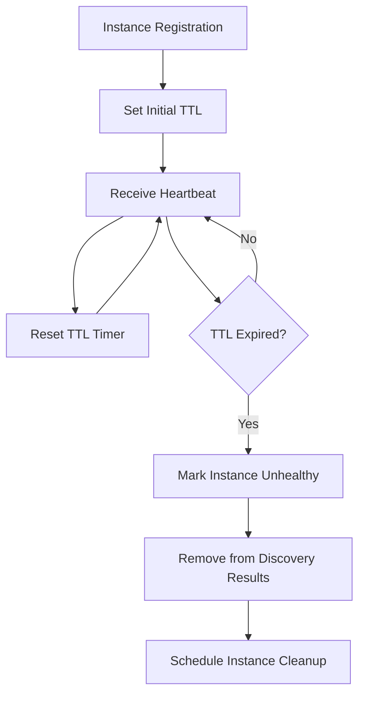
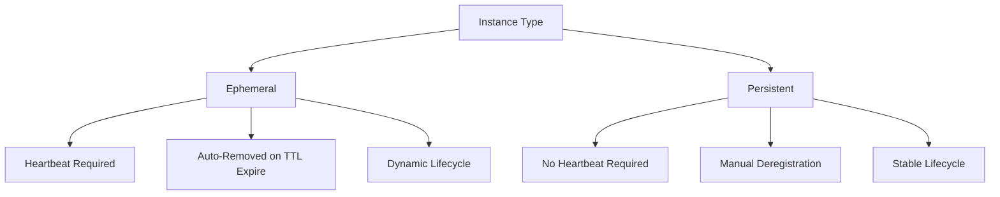

# Instance Management

<cite>
**Referenced Files in This Document**   
- [instance_access.go](file://plugin/apiserver/httpserver/discover/instance_access.go)
- [instance.go](file://pkg/service/instance.go)
- [healthchecker.go](file://apis/service/healthcheck/healthchecker.go)
- [config.go](file://pkg/service/healthcheck/config.go)
- [check.go](file://pkg/service/healthcheck/check.go)
- [instance_query.go](file://pkg/cache/service/instance_query.go)
- [naming_request.go](file://plugin/apiserver/nacosserver/v2/pb/naming_request.go)
- [instance_test.go](file://pkg/service/instance_test.go)
- [cache.go](file://pkg/cache/cache.go)
- [types.go](file://apis/cache/types.go)
</cite>

## Table of Contents
1. [Introduction](#introduction)
2. [Instance Registration (POST /naming/v1/instance)](#instance-registration-post-namingv1instance)
3. [Heartbeat Reporting (PUT /naming/v1/instance/beat)](#heartbeat-reporting-put-namingv1instancebeat)
4. [Instance Deregistration (DELETE /naming/v1/instance)](#instance-deregistration-delete-namingv1instance)
5. [Instance Query (GET /naming/v1/instance)](#instance-query-get-namingv1instance)
6. [Request/Response Schemas](#requestresponse-schemas)
7. [TTL-Based Health Checking Mechanism](#ttl-based-health-checking-mechanism)
8. [Error Conditions](#error-conditions)
9. [Curl Examples](#curl-examples)
10. [Go Client Code Snippets](#go-client-code-snippets)
11. [Ephemeral vs Persistent Instances](#ephemeral-vs-persistent-instances)
12. [Heartbeat Timing and Recovery Guidance](#heartbeat-timing-and-recovery-guidance)
13. [Related Components](#related-components)

## Introduction
This document provides comprehensive API documentation for service instance management endpoints in pole-server. The Service Discovery HTTP API enables clients to register, maintain, query, and deregister service instances within the system. The core operations include registering a new service instance, sending periodic heartbeats to maintain liveness, querying instance details for service discovery, and deregistering instances during shutdown. The system implements a TTL-based health checking mechanism to automatically detect and remove unhealthy instances. This documentation covers all aspects of the instance management lifecycle, including request/response schemas, error handling, client usage patterns, and integration with health checking components.

## Instance Registration (POST /naming/v1/instance)
The instance registration endpoint allows services to register themselves with the discovery system. This operation creates a new service instance record that becomes available for discovery by other services. The registration process involves submitting instance metadata including service name, IP address, port, namespace, and optional metadata. Upon successful registration, the instance is marked as healthy and becomes part of the active service pool. The system supports both ephemeral and persistent instance types, with ephemeral instances being automatically cleaned up if heartbeats are not received within the TTL period. Registration is idempotent - attempting to register an existing instance with the same identifier will update its properties while preserving critical state such as isolation status.

**Section sources**
- [instance_access.go](file://plugin/apiserver/httpserver/discover/instance_access.go#L33-L65)
- [instance.go](file://pkg/service/instance.go#L166-L202)
- [naming_request.go](file://plugin/apiserver/nacosserver/v2/pb/naming_request.go#L54-L108)

## Heartbeat Reporting (PUT /naming/v1/instance/beat)
The heartbeat endpoint allows registered service instances to report their liveness to the discovery system. Clients must send periodic heartbeat requests to maintain their healthy status in the service registry. Each heartbeat extends the instance's TTL (Time To Live), preventing it from being marked as unhealthy or removed from the registry. The heartbeat mechanism is crucial for the TTL-based health checking system, as missed heartbeats trigger health status transitions. The system returns an optimal heartbeat interval to clients, allowing them to adjust their reporting frequency. For ephemeral instances, failure to send heartbeats within the configured TTL window results in automatic deregistration. The endpoint supports both direct instance identification and service-level heartbeat reporting.

**Section sources**
- [healthchecker.go](file://apis/service/healthcheck/healthchecker.go)
- [config.go](file://pkg/service/healthcheck/config.go#L17-L53)
- [check.go](file://pkg/service/healthcheck/check.go#L287-L329)

## Instance Deregistration (DELETE /naming/v1/instance)
The instance deregistration endpoint allows services to gracefully remove themselves from the discovery system. This operation marks the specified instance as inactive and removes it from the list of available instances for service discovery. Deregistration is typically performed during service shutdown to ensure that traffic is not routed to terminating instances. The operation is implemented as a soft delete, setting a flag to mark the instance as invalid rather than immediately removing it from storage. This approach preserves audit trails and historical data while ensuring the instance is no longer returned in discovery queries. The endpoint supports batch deregistration of multiple instances in a single request, improving efficiency for services with multiple endpoints.

**Section sources**
- [instance_access.go](file://plugin/apiserver/httpserver/discover/instance_access.go#L64-L116)
- [instance.go](file://pkg/service/instance.go#L225-L253)
- [instance_test.go](file://pkg/service/instance_test.go#L1936-L1963)

## Instance Query (GET /naming/v1/instance)
The instance query endpoint allows clients to discover registered service instances based on various filtering criteria. This operation is fundamental to service discovery, enabling clients to locate available instances of a particular service. The query supports filtering by service name, namespace, and metadata attributes, allowing for sophisticated service routing and filtering. Results can be paginated using offset and limit parameters to handle large result sets efficiently. The response includes comprehensive instance details including network location, health status, weights, and custom metadata. The query operation leverages cached data for performance, with mechanisms to ensure cache consistency. Clients can also query instance counts and labels for monitoring and analytics purposes.

**Section sources**
- [instance_access.go](file://plugin/apiserver/httpserver/discover/instance_access.go#L33-L65)
- [instance_query.go](file://pkg/cache/service/instance_query.go#L144-L153)
- [naming_console_access_apidoc.go](file://plugin/apiserver/httpserver/docs/naming_console_access_apidoc.go#L359-L376)

## Request/Response Schemas
The instance management API uses standardized request and response schemas for all operations. The core instance schema includes required fields such as serviceName, ip, port, and namespace, along with optional fields for metadata, weights, and health configuration. The metadata field supports arbitrary key-value pairs for service-specific configuration and routing information. All requests and responses follow a batch processing pattern, allowing multiple instances to be processed in a single API call. The response schema includes a status code, informational message, and operation-specific data. Error responses include descriptive messages to aid in troubleshooting. The API supports both JSON and protocol buffer serialization formats for maximum flexibility.

**Section sources**
- [naming_request.go](file://plugin/apiserver/nacosserver/v2/pb/naming_request.go#L54-L108)
- [instance.go](file://pkg/service/instance.go#L166-L202)
- [instance_query.go](file://pkg/cache/service/instance_query.go#L188-L244)

## TTL-Based Health Checking Mechanism
The system implements a TTL (Time To Live) based health checking mechanism to automatically detect and handle unhealthy service instances. Each registered instance is assigned a TTL value that represents the maximum time interval between heartbeats. When an instance registers or sends a heartbeat, its TTL timer is reset. The health checking scheduler monitors these timers and marks instances as unhealthy when their TTL expires without a heartbeat. The default TTL is configured at the system level but can be overridden per instance. The health checker uses a time wheel algorithm for efficient timer management, allowing the system to scale to large numbers of instances. Unhealthy instances are automatically removed from service discovery results, ensuring traffic is not routed to potentially failing services. The mechanism supports both client-side heartbeats and server-side active health checks.



**Diagram sources**
- [healthchecker.go](file://apis/service/healthcheck/healthchecker.go)
- [config.go](file://pkg/service/healthcheck/config.go#L17-L53)
- [check.go](file://pkg/service/healthcheck/check.go#L287-L329)

## Error Conditions
The instance management API defines several error conditions that clients should handle appropriately. Common errors include invalid heartbeat intervals, missing required parameters, unauthorized access due to authentication failures, and service quota limits. When a heartbeat is received outside the acceptable interval (too frequent or too infrequent), the system returns an appropriate error code. Missing required fields such as serviceName, ip, port, or namespace in registration requests results in validation errors. Authentication and authorization errors occur when clients lack proper credentials or permissions to perform operations on specific services. The API uses standardized error codes that are consistent across all endpoints, enabling clients to implement uniform error handling logic. Rate limiting may also be applied to prevent abuse of the discovery system.

**Section sources**
- [instance_access.go](file://plugin/apiserver/httpserver/discover/instance_access.go#L33-L173)
- [instance.go](file://pkg/service/instance.go#L166-L253)
- [healthchecker.go](file://apis/service/healthcheck/healthchecker.go)

## Curl Examples
The following curl examples demonstrate how to interact with the instance management API:

**Register an instance:**
```bash
curl -X POST http://localhost:8080/naming/v1/instances \
  -H "Content-Type: application/json" \
  -d '[
    {
      "serviceName": "echo-service",
      "namespace": "default",
      "ip": "192.168.1.100",
      "port": 8080,
      "metadata": {
        "version": "1.0.0",
        "region": "us-west"
      }
    }
  ]'
```

**Send a heartbeat:**
```bash
curl -X PUT http://localhost:8080/naming/v1/instance/beat \
  -H "Content-Type: application/json" \
  -d '{
    "serviceName": "echo-service",
    "namespace": "default",
    "ip": "192.168.1.100",
    "port": 8080
  }'
```

**Query instances:**
```bash
curl -X GET "http://localhost:8080/naming/v1/instances?service=echo-service&namespace=default"
```

**Deregister an instance:**
```bash
curl -X POST http://localhost:8080/naming/v1/instances/delete \
  -H "Content-Type: application/json" \
  -d '[
    {
      "serviceName": "echo-service",
      "namespace": "default",
      "ip": "192.168.1.100",
      "port": 8080
    }
  ]'
```

**Section sources**
- [instance_access.go](file://plugin/apiserver/httpserver/discover/instance_access.go#L33-L173)
- [instance.go](file://pkg/service/instance.go#L166-L253)

## Go Client Code Snippets
The following Go code snippets demonstrate how to use the instance management API:

**Register instances:**
```go
func (c *Client) CreateInstances(instances []*apiservice.Instance) (*apiservice.BatchWriteResponse, error) {
	url := fmt.Sprintf("http://%v/naming/%v/instances", c.Address, c.Version)
	body, err := JSONFromInstances(instances)
	if err != nil {
		return nil, err
	}
	response, err := c.SendRequest("POST", url, body)
	if err != nil {
		return nil, err
	}
	return GetBatchWriteResponse(response)
}
```

**Send heartbeats:**
```go
func (c *Client) ReportHeartbeat(instance *apiservice.Instance) error {
	url := fmt.Sprintf("http://%v/naming/%v/instance/beat", c.Address, c.Version)
	body, err := json.Marshal(instance)
	if err != nil {
		return err
	}
	_, err = c.SendRequest("PUT", url, body)
	return err
}
```

**Query instances:**
```go
func (c *Client) GetInstances(serviceName, namespace string) (*apiservice.BatchQueryResponse, error) {
	url := fmt.Sprintf("http://%v/naming/%v/instances", c.Address, c.Version)
	params := map[string][]interface{}{
		"service":   {serviceName},
		"namespace": {namespace},
	}
	url = c.CompleteURL(url, params)
	response, err := c.SendRequest("GET", url, nil)
	if err != nil {
		return nil, err
	}
	return GetBatchQueryResponse(response)
}
```

**Section sources**
- [instance.go](file://test/integrate/http/instance.go#L51-L179)
- [instance_access.go](file://plugin/apiserver/httpserver/discover/instance_access.go#L33-L173)

## Ephemeral vs Persistent Instances
The system supports two types of service instances: ephemeral and persistent. Ephemeral instances are designed for dynamic, short-lived services that rely on heartbeat-based health checking. These instances are automatically removed from the registry if heartbeats are not received within the TTL period, making them ideal for containerized or cloud-native applications that may start and stop frequently. Persistent instances, in contrast, remain in the registry until explicitly deregistered, regardless of heartbeat status. They are suitable for long-running services or infrastructure components that should remain discoverable even during temporary network outages. The instance type is determined at registration time and cannot be changed. Ephemeral instances provide automatic cleanup of failed services, while persistent instances offer greater reliability for critical infrastructure.



**Diagram sources**
- [naming_request.go](file://plugin/apiserver/nacosserver/v2/pb/naming_request.go#L54-L108)
- [instance.go](file://pkg/service/instance.go#L166-L202)
- [instance_test.go](file://pkg/service/instance_test.go#L1936-L1963)

## Heartbeat Timing and Recovery Guidance
Proper heartbeat timing is critical for maintaining instance health status. Clients should send heartbeats at intervals significantly shorter than the configured TTL to account for network latency and system processing delays. The recommended heartbeat interval is one-third to one-half of the TTL value. For example, with a 30-second TTL, heartbeats should be sent every 10-15 seconds. The system returns the optimal heartbeat interval in heartbeat responses, allowing clients to adjust their timing dynamically. In case of missed heartbeats, clients should immediately resume sending heartbeats upon recovery without attempting to compensate for missed intervals. The system automatically handles recovery by resetting the TTL timer on the first successful heartbeat. Clients should implement exponential backoff when encountering transient errors to avoid overwhelming the discovery server.

**Section sources**
- [healthchecker.go](file://apis/service/healthcheck/healthchecker.go)
- [config.go](file://pkg/service/healthcheck/config.go#L17-L53)
- [check.go](file://pkg/service/healthcheck/check.go#L287-L329)

## Related Components
The instance management functionality is integrated with several key components in the pole-server architecture. The health checking system monitors instance liveness and updates health status based on heartbeat patterns and TTL expiration. The cache layer provides high-performance access to instance data for discovery queries, with mechanisms to ensure consistency between the cache and persistent storage. The authentication and authorization system controls access to instance management operations, ensuring only permitted clients can register, modify, or deregister instances. The event system publishes instance lifecycle events for monitoring and integration with external systems. The storage layer persists instance data and provides transactional guarantees for data integrity. These components work together to provide a reliable and scalable service discovery platform.

**Section sources**
- [cache.go](file://pkg/cache/cache.go#L184-L186)
- [types.go](file://apis/cache/types.go#L135)
- [healthchecker.go](file://apis/service/healthcheck/healthchecker.go)
- [discover_api.go](file://apis/store/discover_api.go#L89-L114)