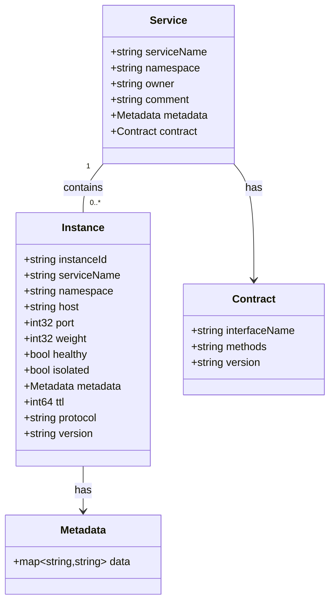
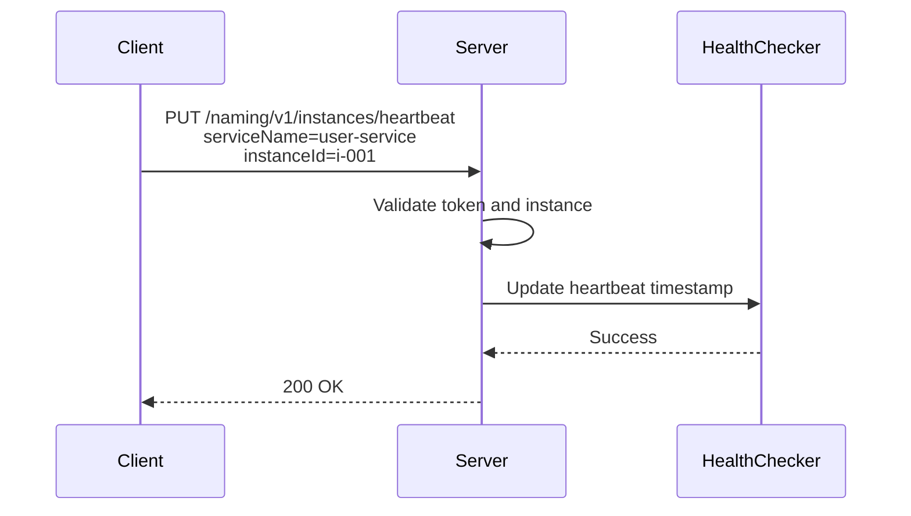

# Service Discovery HTTP API

<cite>
**Referenced Files in This Document**   
- [service_contract_access.go](file://plugin/apiserver/httpserver/discover/service_contract_access.go)
- [instance_access.go](file://plugin/apiserver/httpserver/discover/instance_access.go)
- [service_access.go](file://plugin/apiserver/httpserver/discover/service_access.go)
- [client_v1.go](file://pkg/service/client_v1.go)
- [instance.go](file://pkg/service/instance.go)
- [service.go](file://pkg/service/service.go)
- [contract.go](file://apis/pkg/types/service/contract.go)
- [discover_api.go](file://apis/store/discover_api.go)
</cite>

## Table of Contents
1. [Introduction](#introduction)
2. [Service and Instance Model](#service-and-instance-model)
3. [Authentication and Headers](#authentication-and-headers)
4. [Service Registration](#service-registration)
5. [Instance Heartbeat](#instance-heartbeat)
6. [Service Querying](#service-querying)
7. [Instance Deregistration](#instance-deregistration)
8. [Service Metadata and Contracts](#service-metadata-and-contracts)
9. [Governing Rules Management](#governing-rules-management)
10. [Error Handling](#error-handling)
11. [Rate Limiting](#rate-limiting)
12. [Versioning and Revision](#versioning-and-revision)
13. [Client Examples](#client-examples)
14. [Common Issues](#common-issues)

## Introduction

The Service Discovery HTTP API in pole-server provides a comprehensive set of endpoints under the `/naming` path for managing service instances, querying service information, and applying governance rules. This API enables dynamic service registration, health monitoring via heartbeats, and metadata-driven service contracts. It supports ephemeral and persistent instances with TTL-based health checking and integrates with access control via the `X-Pole-Token` header.

The API is designed for high availability and scalability, supporting large-scale microservices environments with features such as namespace isolation, metadata tagging, and governance rule enforcement.

**Section sources**
- [service_contract_access.go](file://plugin/apiserver/httpserver/discover/service_contract_access.go#L1-L77)
- [service_access.go](file://plugin/apiserver/httpserver/discover/service_access.go#L1-L200)

## Service and Instance Model

In pole-server, a **Service** represents a logical grouping of network endpoints that provide the same functionality. Each service contains multiple **Instances**, which represent individual running processes. Services are identified by `serviceName` and `namespace`, while instances are uniquely identified by their `instanceId`.

Instances can be either **ephemeral** (default) or **persistent**. Ephemeral instances rely on periodic heartbeats to maintain registration, while persistent instances remain registered until explicitly deregistered. Health status is determined through TTL-based checks for ephemeral instances.



**Diagram sources**
- [service.go](file://apis/pkg/types/service/service.go#L10-L50)
- [instance.go](file://apis/pkg/types/service/instance.go#L15-L60)
- [contract.go](file://apis/pkg/types/service/contract.go#L5-L25)

**Section sources**
- [service.go](file://apis/pkg/types/service/service.go#L1-L100)
- [instance.go](file://apis/pkg/types/service/instance.go#L1-L80)

## Authentication and Headers

All Service Discovery endpoints require authentication via the `X-Pole-Token` header. This token is used for access control and rate limiting enforcement. The token must be included in all requests to the `/naming` endpoints.

Additional headers may be used for context propagation and client identification:
- `X-Pole-Token`: Required authentication token
- `X-Request-ID`: Optional request tracing identifier
- `User-Agent`: Client identification

Access control is enforced at both service and instance levels, with policies defined in the access control plugin system.

**Section sources**
- [client_v1.go](file://pkg/service/interceptor/auth/client_v1.go#L15-L45)
- [server.go](file://pkg/service/interceptor/auth/server.go#L20-L60)

## Service Registration

Service instances are registered via the `POST /naming/v1/instances` endpoint. The registration request includes instance metadata, health configuration, and network location.

**Endpoint**: `POST /naming/v1/instances`  
**Headers**: `X-Pole-Token`  
**Request Schema**:
```json
{
  "instanceId": "instance-001",
  "serviceName": "user-service",
  "namespace": "production",
  "host": "192.168.1.10",
  "port": 8080,
  "weight": 100,
  "metadata": {
    "version": "v1.2.0",
    "region": "us-west"
  },
  "ttl": 5,
  "protocol": "http",
  "version": "v1"
}
```

The `ttl` field specifies the heartbeat interval in seconds. If not provided, the instance is treated as persistent.

**Section sources**
- [instance_access.go](file://plugin/apiserver/httpserver/discover/instance_access.go#L25-L80)
- [instance.go](file://pkg/service/instance.go#L30-L120)

## Instance Heartbeat

Ephemeral instances must send periodic heartbeats to maintain their registration. Heartbeats are sent via `PUT /naming/v1/instances/heartbeat`.

**Endpoint**: `PUT /naming/v1/instances/heartbeat`  
**Headers**: `X-Pole-Token`  
**Query Parameters**:
- `serviceName`: Required service name
- `namespace`: Required namespace
- `instanceId`: Required instance identifier

A successful heartbeat returns HTTP 200. If an instance fails to send heartbeats within 3x the TTL period, it is marked as unhealthy and eventually removed.



**Diagram sources**
- [instance_access.go](file://plugin/apiserver/httpserver/discover/instance_access.go#L85-L120)
- [healthchecker.go](file://plugin/service/healthchecker/heartbeat/beat_checker.go#L15-L50)

**Section sources**
- [instance_access.go](file://plugin/apiserver/httpserver/discover/instance_access.go#L82-L130)
- [beat_checker.go](file://plugin/service/healthchecker/heartbeat/beat_checker.go#L10-L60)

## Service Querying

Services and instances can be queried using various endpoints with filtering capabilities.

**Get All Instances**: `GET /naming/v1/instances`  
**Query Parameters**:
- `serviceName`: Filter by service name
- `namespace`: Filter by namespace
- `healthyOnly`: Return only healthy instances (true/false)
- `revision`: Return data only if revision differs

**Response Schema**:
```json
{
  "code": 200,
  "message": "success",
  "instances": [
    {
      "instanceId": "i-001",
      "host": "192.168.1.10",
      "port": 8080,
      "weight": 100,
      "healthy": true,
      "metadata": {
        "version": "v1.2.0"
      }
    }
  ],
  "revision": "abc123"
}
```

The `revision` parameter enables efficient polling by allowing clients to request data only when it has changed.

**Section sources**
- [instance_access.go](file://plugin/apiserver/httpserver/discover/instance_access.go#L135-L200)
- [service_query.go](file://pkg/cache/service/service_query.go#L10-L80)

## Instance Deregistration

Instances are deregistered using the `DELETE /naming/v1/instances` endpoint.

**Endpoint**: `DELETE /naming/v1/instances`  
**Headers**: `X-Pole-Token`  
**Query Parameters**:
- `serviceName`: Required
- `namespace`: Required
- `instanceId`: Required

For persistent instances, this endpoint must be called explicitly to remove the registration. For ephemeral instances, this is optional as they will be automatically cleaned up when heartbeats stop.

**Section sources**
- [instance_access.go](file://plugin/apiserver/httpserver/discover/instance_access.go#L205-L240)
- [instance.go](file://pkg/service/instance.go#L150-L180)

## Service Metadata and Contracts

Service contracts define the interface and methods of a service, enabling client-side validation and tooling support.

**Create Service Contract**: `POST /naming/v1/service/contracts`  
**Request Body**:
```json
{
  "serviceName": "user-service",
  "namespace": "production",
  "interfaceName": "UserService",
  "methods": [
    {
      "name": "GetUser",
      "parameters": ["string"],
      "returns": "User"
    }
  ],
  "version": "v1"
}
```

**Get Service Contracts**: `GET /naming/v1/service/contracts`  
Supports filtering by `serviceName`, `namespace`, and `version`.

Service metadata can be updated independently of the service registration, allowing dynamic configuration changes.

**Section sources**
- [service_contract_access.go](file://plugin/apiserver/httpserver/discover/service_contract_access.go#L1-L77)
- [contract.go](file://apis/pkg/types/service/contract.go#L1-L40)

## Governing Rules Management

The API supports several governance rules that can be applied to services:

### Circuit Breaker
`POST /naming/v1/circuitbreaker/rule` - Configure circuit breaker thresholds (error rate, consecutive failures)

### Rate Limiting
`POST /naming/v1/ratelimit/rule` - Define rate limits per service or method

### Lane Management
`POST /naming/v1/lane/rule` - Configure traffic lanes for canary deployments

### Fault Detection
`POST /naming/v1/faultdetect/rule` - Set up active health checking probes

Each rule type has corresponding GET, PUT, and DELETE endpoints for management. Rules are versioned and support gradual rollout via release configurations.

**Section sources**
- [circuitbreaker_access.go](file://plugin/apiserver/httpserver/discover/circuitbreaker_access.go#L1-L50)
- [ratelimit_access.go](file://plugin/apiserver/httpserver/discover/ratelimit_access.go#L1-L50)
- [lane_access.go](file://plugin/apiserver/httpserver/discover/lane_access.go#L1-L50)
- [faultdetect_access.go](file://plugin/apiserver/httpserver/discover/faultdetect_access.go#L1-L50)

## Error Handling

The API returns standardized error responses in the following format:

```json
{
  "code": 404,
  "message": "service not found"
}
```

**Common Error Codes**:
- `400`: Invalid request parameters
- `401`: Authentication failed (invalid token)
- `403`: Insufficient permissions
- `404`: Service or instance not found
- `412`: Precondition failed (e.g., heartbeat from unknown instance)
- `429`: Rate limit exceeded
- `500`: Internal server error

The `412 Precondition Failed` status is specifically used for heartbeat operations when the instance is not registered or the service does not exist.

**Section sources**
- [api.go](file://pkg/common/api/v1/naming_response.go#L15-L100)
- [instance_access.go](file://plugin/apiserver/httpserver/discover/instance_access.go#L90-L100)

## Rate Limiting

All discovery endpoints are subject to rate limiting based on the `X-Pole-Token` header. Rate limits are configured in the ratelimit plugin and can be set at the service, namespace, or client level.

By default, clients are limited to:
- 100 requests/second for read operations (GET)
- 10 requests/second for write operations (POST, PUT, DELETE)

Rate limit information is included in responses via headers:
- `X-RateLimit-Limit`: Total requests allowed
- `X-RateLimit-Remaining`: Requests remaining in current window
- `X-RateLimit-Reset`: Time when limit resets (Unix timestamp)

Exceeding rate limits returns HTTP 429 with a `Retry-After` header.

**Section sources**
- [ratelimit.go](file://apis/access_control/ratelimit/ratelimit.go#L1-L40)
- [resource_limiter.go](file://plugin/access_control/ratelimit/token/resource_limiter.go#L15-L60)

## Versioning and Revision

The API supports two versioning mechanisms:

1. **URL Versioning**: `/naming/v1/` indicates the API version
2. **Revision-based Polling**: The `revision` query parameter and response field enable efficient long-polling

Clients can use revision checking to avoid unnecessary data transfers:
```
GET /naming/v1/instances?serviceName=user-service&revision=abc123
```

If the revision matches the current version, the server returns HTTP 304 Not Modified. Otherwise, it returns the updated data with the new revision.

**Section sources**
- [revision.go](file://apis/pkg/utils/revision/revision.go#L1-L25)
- [instance_query.go](file://pkg/cache/service/instance_query.go#L30-L70)

## Client Examples

### Register Instance (curl)
```bash
curl -X POST http://localhost:8080/naming/v1/instances \
  -H "X-Pole-Token: your-token" \
  -d '{
    "serviceName": "user-service",
    "namespace": "production",
    "host": "192.168.1.10",
    "port": 8080,
    "weight": 100,
    "ttl": 5,
    "metadata": {"version": "v1.2.0"}
  }'
```

### Send Heartbeat (curl)
```bash
curl -X PUT http://localhost:8080/naming/v1/instances/heartbeat \
  -H "X-Pole-Token: your-token" \
  -G \
  --data-urlencode "serviceName=user-service" \
  --data-urlencode "namespace=production" \
  --data-urlencode "instanceId=i-001"
```

### Go Client Snippet
```go
client := &http.Client{}
req, _ := http.NewRequest("PUT", "http://localhost:8080/naming/v1/instances/heartbeat", nil)
req.Header.Set("X-Pole-Token", "your-token")
q := req.URL.Query()
q.Add("serviceName", "user-service")
q.Add("namespace", "production")
q.Add("instanceId", "i-001")
req.URL.RawQuery = q.Encode()

resp, err := client.Do(req)
if err != nil {
    log.Printf("heartbeat failed: %v", err)
}
```

**Section sources**
- [client_v1.go](file://pkg/service/client_v1.go#L25-L100)
- [instance_access.go](file://plugin/apiserver/httpserver/discover/instance_access.go#L82-L120)

## Common Issues

### Failed Heartbeats
**Symptoms**: Instances marked as unhealthy despite running  
**Causes**: 
- Network connectivity issues
- Clock skew between client and server
- Token expiration
- Instance ID mismatch

**Solution**: Verify network connectivity, check token validity, ensure consistent instance IDs.

### Service Not Found
**Symptoms**: 404 errors during registration or querying  
**Causes**:
- Incorrect namespace
- Typo in service name
- Missing namespace creation

**Solution**: Verify namespace exists and service name spelling.

### Invalid Metadata
**Symptoms**: 400 errors during registration  
**Causes**:
- Metadata values exceeding size limits
- Invalid characters in metadata keys
- Excessive number of metadata entries

**Solution**: Validate metadata format and size before submission.

**Section sources**
- [instance.go](file://pkg/service/instance.go#L50-L90)
- [paramcheck.go](file://pkg/service/interceptor/paramcheck/instance.go#L15-L60)