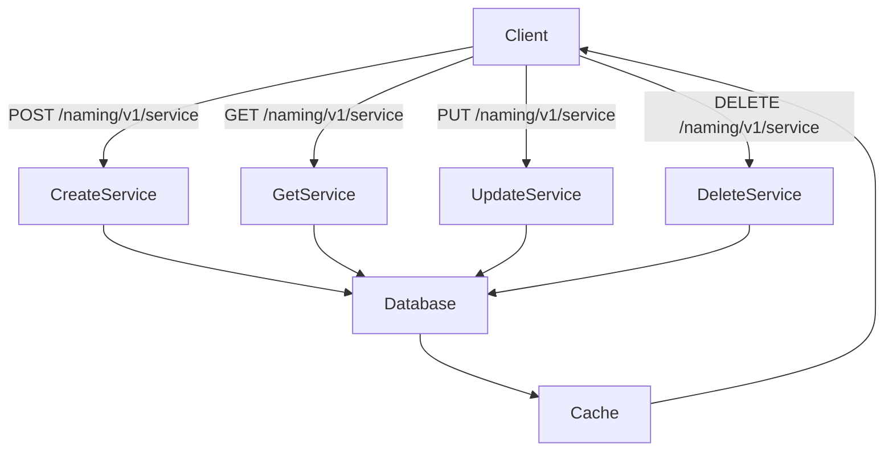
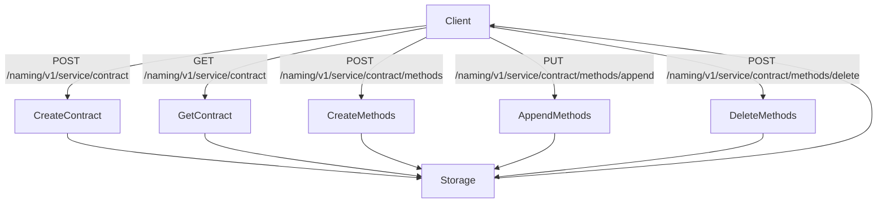
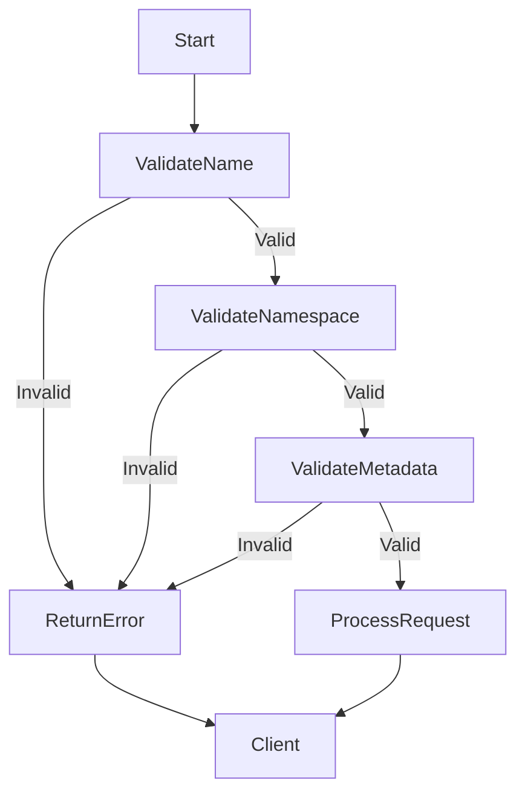
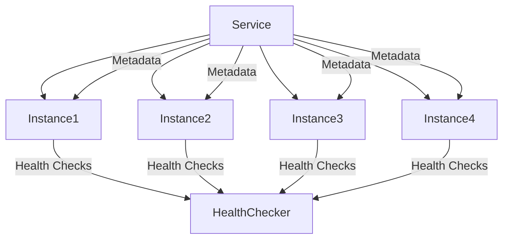

# Service Management

<cite>
**Referenced Files in This Document**   
- [service_access.go](file://plugin/apiserver/httpserver/discover/service_access.go)
- [service_contract_access.go](file://plugin/apiserver/httpserver/discover/service_contract_access.go)
- [service.go](file://pkg/service/service.go)
- [service_contract.go](file://pkg/service/service_contract.go)
- [valid.go](file://pkg/common/utils/valid/valid.go)
- [codeinfo.go](file://pkg/common/api/v1/codeinfo.go)
</cite>

## Table of Contents
1. [Introduction](#introduction)
2. [Service Management Endpoints](#service-management-endpoints)
3. [Service Contract Management](#service-contract-management)
4. [Request and Response Formats](#request-and-response-formats)
5. [Validation Rules](#validation-rules)
6. [Error Handling](#error-handling)
7. [Examples](#examples)
8. [Relationship Between Services and Instances](#relationship-between-services-and-instances)
9. [Common Issues](#common-issues)

## Introduction
The Service Management API in pole-server provides comprehensive operations for managing service entities within a service mesh environment. This documentation covers the HTTP endpoints for creating, retrieving, updating, and deleting services, as well as managing service contracts that define service interfaces and protocols. The API supports metadata management, revision tracking, and access control for service operations.

**Section sources**
- [service_access.go](file://plugin/apiserver/httpserver/discover/service_access.go#L33-L45)
- [service_contract_access.go](file://plugin/apiserver/httpserver/discover/service_contract_access.go#L0-L35)

## Service Management Endpoints
The service management endpoints are exposed under the `/naming/v1/service` path and support standard CRUD operations for service entities. These endpoints enable service registration, discovery, and lifecycle management within the service mesh.



**Diagram sources**
- [service_access.go](file://plugin/apiserver/httpserver/discover/service_access.go#L33-L45)
- [service.go](file://pkg/service/service.go#L150-L200)

### Create Service (POST /naming/v1/service)
Creates a new service in the specified namespace. If the namespace does not exist, it will be automatically created. The service creation operation generates a unique ID, token, and revision for the service.

**Section sources**
- [service.go](file://pkg/service/service.go#L150-L180)

### Retrieve Service (GET /naming/v1/service)
Retrieves service details based on query parameters such as service name, namespace, metadata, and other attributes. Supports pagination through offset and limit parameters.

**Section sources**
- [service.go](file://pkg/service/service.go#L400-L450)

### Update Service (PUT /naming/v1/service)
Updates an existing service's attributes including metadata, business information, department, and other properties. The operation requires appropriate permissions and updates the service revision.

**Section sources**
- [service.go](file://pkg/service/service.go#L250-L280)

### Delete Service (DELETE /naming/v1/service)
Deletes a service and its associated resources. The operation checks for existing instances, aliases, and routing configurations before deletion to prevent orphaned resources.

**Section sources**
- [service.go](file://pkg/service/service.go#L200-L230)

## Service Contract Management
Service contracts define the interface specifications for services, including protocols, versions, and method definitions. The contract management endpoints enable creating, retrieving, and updating service contracts that describe how services should be consumed.



**Diagram sources**
- [service_contract_access.go](file://plugin/apiserver/httpserver/discover/service_contract_access.go#L77-L128)
- [service_contract.go](file://pkg/service/service_contract.go#L50-L80)

### Create Service Contract (POST /naming/v1/service/contract)
Creates a new service contract that defines the interface for a service. The contract includes metadata, protocol information, version, and content that describes the service interface.

**Section sources**
- [service_contract.go](file://pkg/service/service_contract.go#L50-L100)

### Retrieve Service Contract (GET /naming/v1/service/contract)
Retrieves service contract information based on various query parameters including namespace, service name, protocol, version, and metadata. Supports brief mode to exclude content details.

**Section sources**
- [service_contract.go](file://pkg/service/service_contract.go#L168-L201)

## Request and Response Formats
The API uses Protocol Buffers for request and response serialization. All service operations follow a consistent format with standardized fields for service identification, metadata, and operational attributes.

### Service Request Format
The service request includes the following fields:
- **serviceName**: Name of the service (required)
- **namespace**: Namespace containing the service (required)
- **metadata**: Key-value pairs for service metadata (optional)
- **owners**: Service ownership information (optional)
- **business**: Business unit associated with the service (optional)
- **department**: Department responsible for the service (optional)
- **comment**: Description of the service (optional)

### Service Response Format
The service response includes:
- **id**: Unique identifier for the service
- **serviceName**: Name of the service
- **namespace**: Namespace containing the service
- **revision**: Revision identifier for tracking changes
- **metadata**: Service metadata key-value pairs
- **totalInstanceCount**: Total number of instances for the service
- **healthyInstanceCount**: Number of healthy instances
- **ctime**: Creation timestamp
- **mtime**: Last modification timestamp

**Section sources**
- [service.go](file://pkg/service/service.go#L100-L150)
- [service_contract.go](file://pkg/service/service_contract.go#L240-L282)

## Validation Rules
The API enforces strict validation rules for service names, namespaces, and metadata to ensure consistency and prevent invalid data from being stored.

### Service Name Validation
Service names must:
- Contain only alphanumeric characters, hyphens, periods, colons, slashes, and underscores
- Be non-empty
- Not exceed 64 characters in length
- Be unique within a namespace

### Namespace Validation
Namespaces must:
- Follow the same character restrictions as service names
- Be non-empty
- Not exceed 64 characters in length

### Metadata Validation
Metadata rules include:
- Maximum of 64 key-value pairs per service
- Individual key and value length limited to 128 and 4096 characters respectively
- Keys and values can contain alphanumeric characters, hyphens, periods, underscores, and asterisks



**Diagram sources**
- [valid.go](file://pkg/common/utils/valid/valid.go#L100-L150)
- [codeinfo.go](file://pkg/common/api/v1/codeinfo.go#L41-L58)

**Section sources**
- [valid.go](file://pkg/common/utils/valid/valid.go#L100-L200)

## Error Handling
The API returns standardized error responses with appropriate HTTP status codes and error codes for different failure scenarios.

### Common Error Responses
- **Duplicate Service Name**: Returns error code `ExistedResource` when attempting to create a service that already exists
- **Invalid Namespace**: Returns error code `InvalidNamespaceName` for malformed or non-existent namespaces
- **Unauthorized Operation**: Returns error code `NotAllowAliasUpdate` when attempting to modify a service alias
- **Missing Service**: Returns error code `NotFoundResource` when attempting to update or delete a non-existent service

### Error Response Format
Error responses include:
- **code**: Numeric error code
- **message**: Human-readable error description
- **info**: Additional context about the error
- **details**: Specific information about the failed operation

**Section sources**
- [codeinfo.go](file://pkg/common/api/v1/codeinfo.go#L41-L58)
- [service.go](file://pkg/service/service.go#L180-L200)

## Examples
### Creating a Service with Custom Metadata
```bash
curl -X POST http://localhost:8080/naming/v1/service \
  -H "Content-Type: application/json" \
  -d '{
    "serviceName": "user-service",
    "namespace": "production",
    "metadata": {
      "version": "1.2.0",
      "environment": "prod",
      "team": "backend"
    },
    "owners": "team-backend@company.com",
    "business": "E-commerce",
    "department": "Engineering"
  }'
```

### Retrieving Service Details with Revision Tracking
```bash
curl -X GET "http://localhost:8080/naming/v1/service?name=user-service&namespace=production&brief=true"
```

### Go Client Example
```go
client := pole.NewClient("http://localhost:8080")
service := &pole.Service{
    Name:      "user-service",
    Namespace: "production",
    Metadata: map[string]string{
        "version": "1.2.0",
        "environment": "prod",
    },
}
response := client.CreateService(context.Background(), service)
if response.Code != pole.Code_ExecuteSuccess {
    log.Printf("Failed to create service: %s", response.Info)
}
```

**Section sources**
- [service_access.go](file://plugin/apiserver/httpserver/discover/service_access.go#L50-L100)
- [service.go](file://pkg/service/service.go#L150-L180)

## Relationship Between Services and Instances
Services and instances have a parent-child relationship where a service represents a logical grouping of instances that provide the same functionality. Service-level metadata affects instance registration and discovery.

When instances register with the service mesh, they inherit certain properties from the parent service, including:
- Default metadata values
- Health check configurations
- Routing rules
- Access control policies

The service metadata can be used to influence instance behavior and routing decisions. For example, metadata indicating a service version can be used to implement canary deployments or blue-green deployments.



**Diagram sources**
- [service.go](file://pkg/service/service.go#L500-L550)
- [service_contract.go](file://pkg/service/service_contract.go#L300-L350)

**Section sources**
- [service.go](file://pkg/service/service.go#L500-L550)

## Common Issues
### Service Not Found
This error occurs when attempting to retrieve, update, or delete a service that does not exist. Ensure the service name and namespace are correct and that the service has been properly created.

### Metadata Validation Failures
Metadata validation fails when:
- The metadata contains invalid characters
- The number of key-value pairs exceeds the limit of 64
- Individual keys or values exceed their length limits
- The metadata structure is malformed

### Duplicate Service Creation
Attempting to create a service with a name that already exists in the same namespace will result in a duplicate resource error. Use the GET endpoint to check for existing services before creation, or implement idempotent creation logic in your client.

**Section sources**
- [service.go](file://pkg/service/service.go#L180-L200)
- [valid.go](file://pkg/common/utils/valid/valid.go#L300-L350)