# Nacos API Reference

<cite>
**Referenced Files in This Document**   
- [nacosserver/server.go](file://plugin/apiserver/nacosserver/server.go)
- [nacosserver/v1/server.go](file://plugin/apiserver/nacosserver/v1/server.go)
- [nacosserver/v1/discover/access.go](file://plugin/apiserver/nacosserver/v1/discover/access.go)
- [nacosserver/v1/config/access.go](file://plugin/apiserver/nacosserver/v1/config/access.go)
- [nacosserver/v2/server.go](file://plugin/apiserver/nacosserver/v2/server.go)
- [nacosserver/v2/discover/instance.go](file://plugin/apiserver/nacosserver/v2/discover/instance.go)
- [nacosserver/v2/config/config_file.go](file://plugin/apiserver/nacosserver/v2/config/config_file.go)
- [nacosserver/v2/config/watch.go](file://plugin/apiserver/nacosserver/v2/config/watch.go)
- [nacosserver/config.go](file://plugin/apiserver/nacosserver/config.go)
</cite>

## Table of Contents
1. [Introduction](#introduction)
2. [Dual-Protocol Architecture](#dual-protocol-architecture)
3. [Nacos v1 HTTP API Implementation](#nacos-v1-http-api-implementation)
4. [Nacos v2 gRPC API Implementation](#nacos-v2-grpc-api-implementation)
5. [Data Model Mapping](#data-model-mapping)
6. [Watch Mechanisms Comparison](#watch-mechanisms-comparison)
7. [Service Discovery Operations](#service-discovery-operations)
8. [Configuration Management Operations](#configuration-management-operations)
9. [Performance Characteristics](#performance-characteristics)
10. [Migration Strategies](#migration-strategies)

## Introduction
The pole-server implements dual-protocol support for Nacos API through both HTTP (v1) and gRPC (v2) interfaces, providing backward compatibility while enabling modern streaming capabilities. The system supports service discovery and configuration management operations through both protocols, with v1 maintaining compatibility with Nacos HTTP API specifications and v2 leveraging gRPC streaming for improved performance and real-time updates.

**Section sources**
- [nacosserver/server.go](file://plugin/apiserver/nacosserver/server.go#L37-L91)

## Dual-Protocol Architecture
The Nacos server implementation in pole-server supports both v1 (HTTP) and v2 (gRPC) protocols simultaneously through a unified architecture. The `NacosServer` struct manages both protocol implementations, initializing separate v1 and v2 server instances that share the same underlying data storage and business logic.

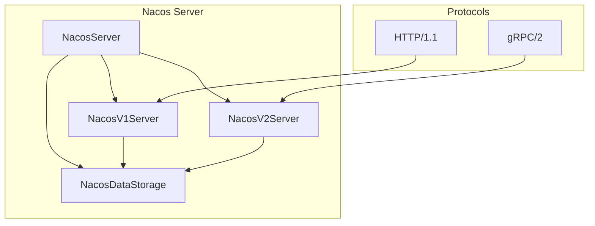

**Diagram sources**
- [nacosserver/server.go](file://plugin/apiserver/nacosserver/server.go#L37-L91)
- [nacosserver/v1/server.go](file://plugin/apiserver/nacosserver/v1/server.go#L31-L63)
- [nacosserver/v2/server.go](file://plugin/apiserver/nacosserver/v2/server.go#L53-L108)

**Section sources**
- [nacosserver/server.go](file://plugin/apiserver/nacosserver/server.go#L37-L91)
- [nacosserver/v1/server.go](file://plugin/apiserver/nacosserver/v1/server.go#L31-L63)
- [nacosserver/v2/server.go](file://plugin/apiserver/nacosserver/v2/server.go#L53-L108)

## Nacos v1 HTTP API Implementation
The v1 implementation provides HTTP-based endpoints for service discovery and configuration management, maintaining compatibility with the Nacos HTTP API specification. The server exposes RESTful endpoints under the `/nacos/v1` path prefix for both service discovery (`/ns`) and configuration management (`/cs/configs`).

### Service Discovery Endpoints
The service discovery API provides standard Nacos v1 endpoints for service registration, instance management, and service listing.

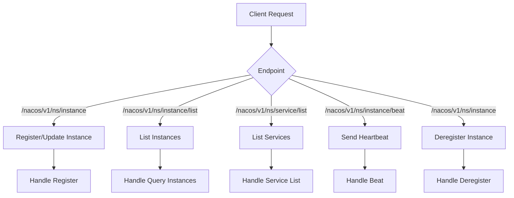

**Diagram sources**
- [nacosserver/v1/discover/access.go](file://plugin/apiserver/nacosserver/v1/discover/access.go#L0-L186)

### Configuration Management Endpoints
The configuration management API provides endpoints for publishing, retrieving, and watching configuration data.

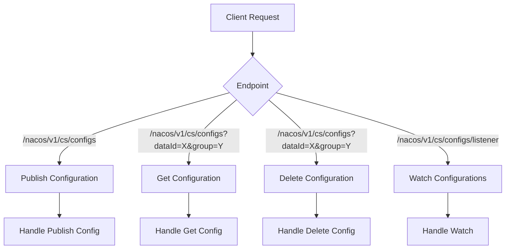

**Diagram sources**
- [nacosserver/v1/config/access.go](file://plugin/apiserver/nacosserver/v1/config/access.go#L0-L187)

**Section sources**
- [nacosserver/v1/discover/access.go](file://plugin/apiserver/nacosserver/v1/discover/access.go#L0-L186)
- [nacosserver/v1/config/access.go](file://plugin/apiserver/nacosserver/v1/config/access.go#L0-L187)

## Nacos v2 gRPC API Implementation
The v2 implementation leverages gRPC streaming for service discovery and configuration management, providing improved performance and real-time update capabilities. The server uses a handler registry pattern to manage different request types and supports bidirectional streaming for watch operations.

### gRPC Service Architecture
The gRPC server implements a modular handler system where different functionality is organized into separate handler groups.

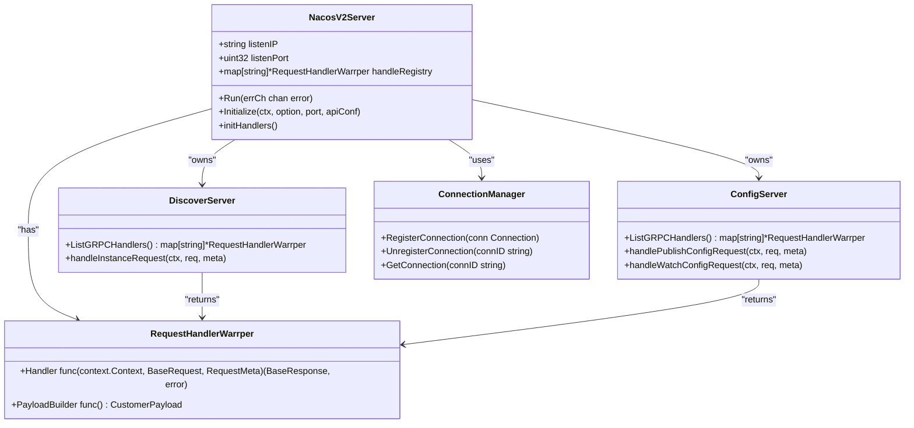

**Diagram sources**
- [nacosserver/v2/server.go](file://plugin/apiserver/nacosserver/v2/server.go#L53-L108)
- [nacosserver/v2/server.go](file://plugin/apiserver/nacosserver/v2/server.go#L149-L194)

### gRPC Request Flow
The gRPC server processes requests through a standardized flow that includes connection management, request handling, and response generation.

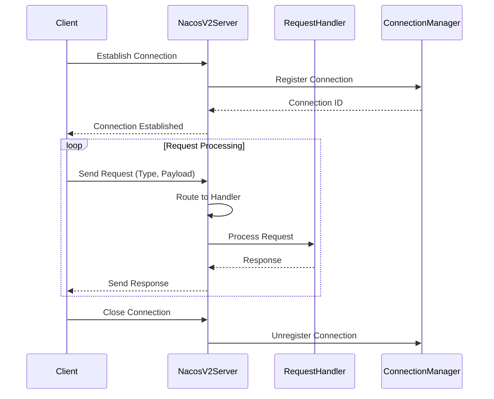

**Diagram sources**
- [nacosserver/v2/server.go](file://plugin/apiserver/nacosserver/v2/server.go#L149-L194)
- [nacosserver/v2/server.go](file://plugin/apiserver/nacosserver/v2/server.go#L323-L365)

**Section sources**
- [nacosserver/v2/server.go](file://plugin/apiserver/nacosserver/v2/server.go#L53-L108)
- [nacosserver/v2/server.go](file://plugin/apiserver/nacosserver/v2/server.go#L149-L194)
- [nacosserver/v2/server.go](file://plugin/apiserver/nacosserver/v2/server.go#L323-L365)

## Data Model Mapping
The system implements a comprehensive mapping between Nacos data models and internal pole-server data structures, ensuring compatibility while leveraging internal optimizations.

### Service Discovery Model Mapping
The service discovery data model maps Nacos service and instance concepts to internal representations.

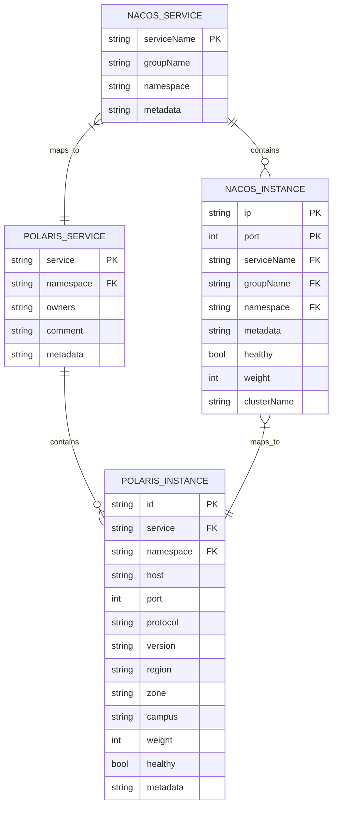

**Diagram sources**
- [nacosserver/v2/discover/instance.go](file://plugin/apiserver/nacosserver/v2/discover/instance.go#L26-L55)
- [nacosserver/v1/discover/access.go](file://plugin/apiserver/nacosserver/v1/discover/access.go#L0-L186)

### Configuration Model Mapping
The configuration management data model maps Nacos configuration concepts to internal representations.

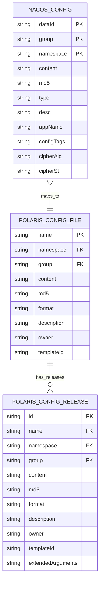

**Diagram sources**
- [nacosserver/v2/config/config_file.go](file://plugin/apiserver/nacosserver/v2/config/config_file.go#L25-L51)
- [nacosserver/v1/config/access.go](file://plugin/apiserver/nacosserver/v1/config/access.go#L0-L187)

**Section sources**
- [nacosserver/v2/discover/instance.go](file://plugin/apiserver/nacosserver/v2/discover/instance.go#L26-L55)
- [nacosserver/v2/config/config_file.go](file://plugin/apiserver/nacosserver/v2/config/config_file.go#L25-L51)
- [nacosserver/v1/discover/access.go](file://plugin/apiserver/nacosserver/v1/discover/access.go#L0-L186)
- [nacosserver/v1/config/access.go](file://plugin/apiserver/nacosserver/v1/config/access.go#L0-L187)

## Watch Mechanisms Comparison
The system implements different watch mechanisms for v1 (HTTP long-polling) and v2 (gRPC streaming), each with distinct performance characteristics and use cases.

### v1 HTTP Long-Polling Watch
The v1 implementation uses HTTP long-polling for configuration watches, where clients maintain open connections that are held until configuration changes occur.

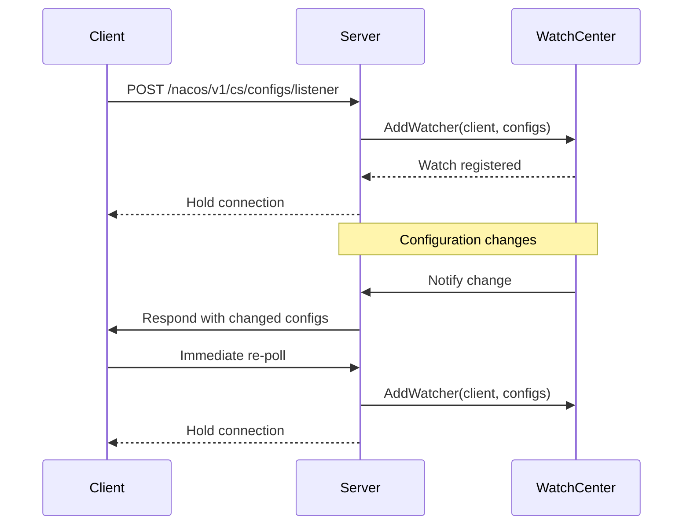

**Diagram sources**
- [nacosserver/v1/config/access.go](file://plugin/apiserver/nacosserver/v1/config/access.go#L94-L142)

### v2 gRPC Streaming Watch
The v2 implementation uses gRPC bidirectional streaming for configuration watches, establishing persistent connections that enable real-time push notifications.

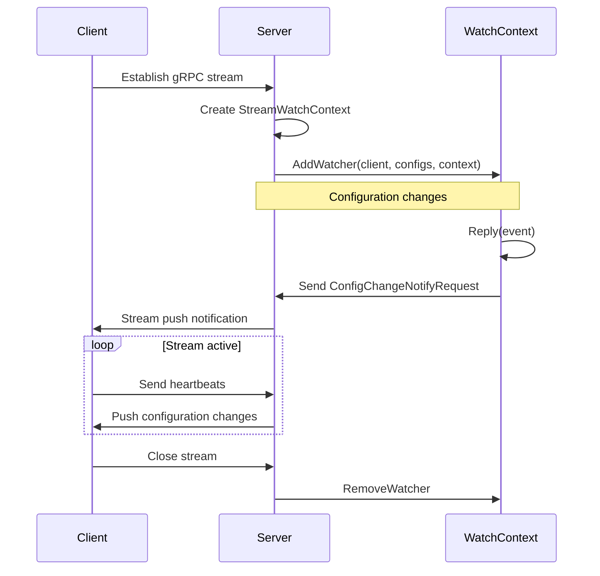

**Diagram sources**
- [nacosserver/v2/config/watch.go](file://plugin/apiserver/nacosserver/v2/config/watch.go#L146-L172)
- [nacosserver/v2/config/config_file.go](file://plugin/apiserver/nacosserver/v2/config/config_file.go#L177-L214)

**Section sources**
- [nacosserver/v1/config/access.go](file://plugin/apiserver/nacosserver/v1/config/access.go#L94-L142)
- [nacosserver/v2/config/watch.go](file://plugin/apiserver/nacosserver/v2/config/watch.go#L146-L172)
- [nacosserver/v2/config/config_file.go](file://plugin/apiserver/nacosserver/v2/config/config_file.go#L177-L214)

## Service Discovery Operations
The service discovery operations are implemented consistently across both v1 and v2 protocols, with identical functionality exposed through different transport mechanisms.

### Service Registration
Service registration allows clients to register instances with the service registry, making them available for discovery by other services.

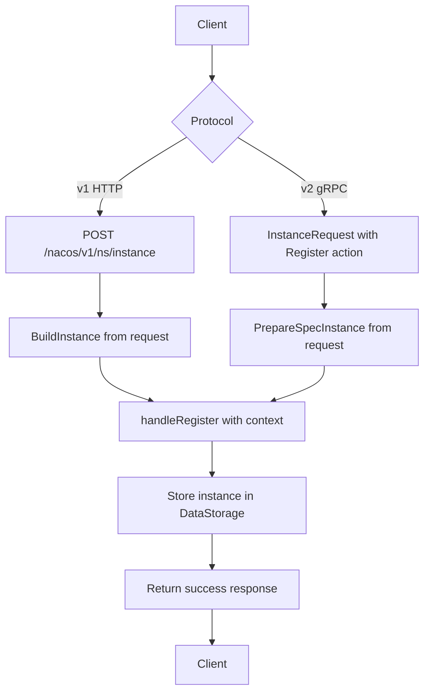

**Section sources**
- [nacosserver/v1/discover/access.go](file://plugin/apiserver/nacosserver/v1/discover/access.go#L104-L125)
- [nacosserver/v2/discover/instance.go](file://plugin/apiserver/nacosserver/v2/discover/instance.go#L26-L55)

### Service Subscription
Service subscription enables clients to receive updates when instances of a service change, supporting both polling and streaming models.

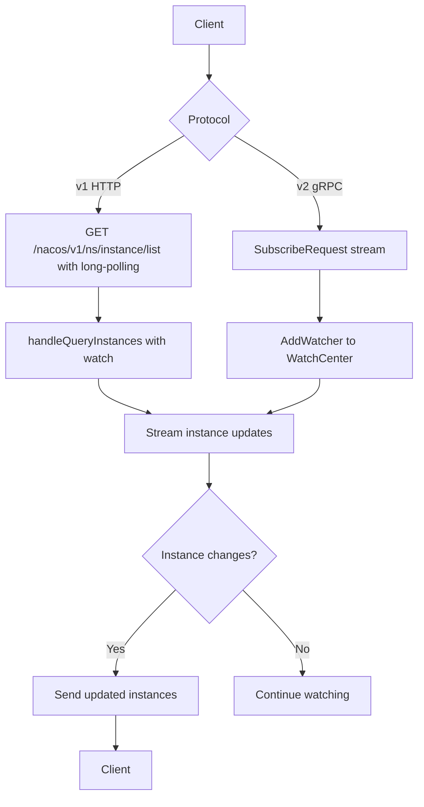

**Section sources**
- [nacosserver/v1/discover/access.go](file://plugin/apiserver/nacosserver/v1/discover/access.go#L168-L185)
- [nacosserver/v2/discover/instance.go](file://plugin/apiserver/nacosserver/v2/discover/instance.go#L26-L55)

## Configuration Management Operations
Configuration management operations provide CRUD functionality for configuration data, with watch capabilities for real-time updates.

### Configuration Publishing
Configuration publishing allows clients to create or update configuration data in the system.

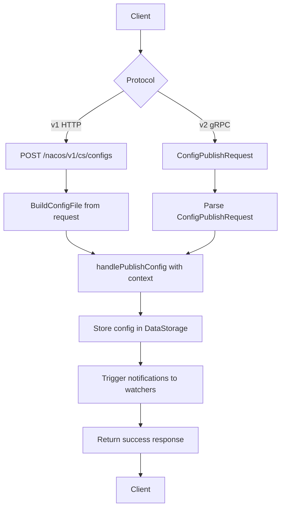

**Section sources**
- [nacosserver/v1/config/access.go](file://plugin/apiserver/nacosserver/v1/config/access.go#L58-L78)
- [nacosserver/v2/config/config_file.go](file://plugin/apiserver/nacosserver/v2/config/config_file.go#L25-L51)

### Configuration Watching
Configuration watching enables clients to receive updates when configuration data changes, supporting both push and pull models.

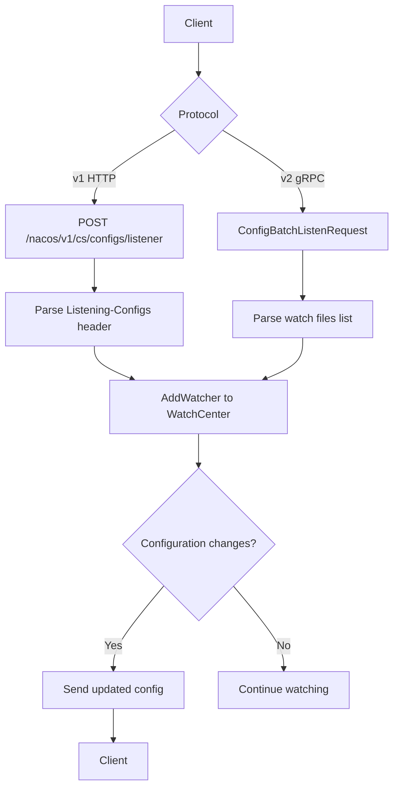

**Section sources**
- [nacosserver/v1/config/access.go](file://plugin/apiserver/nacosserver/v1/config/access.go#L94-L142)
- [nacosserver/v2/config/config_file.go](file://plugin/apiserver/nacosserver/v2/config/config_file.go#L177-L214)

## Performance Characteristics
The dual-protocol implementation exhibits different performance characteristics based on the transport mechanism and watch strategy employed.

### Latency Comparison
The gRPC v2 implementation generally provides lower latency for operations due to the persistent connection model and binary serialization.

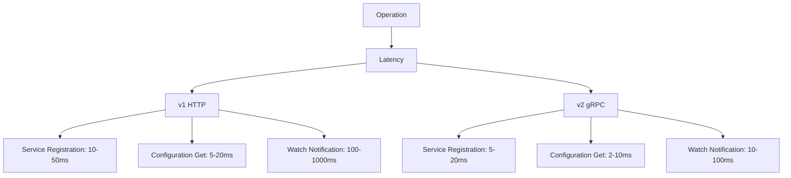

### Throughput Comparison
The gRPC v2 implementation supports higher throughput due to connection multiplexing and reduced connection overhead.

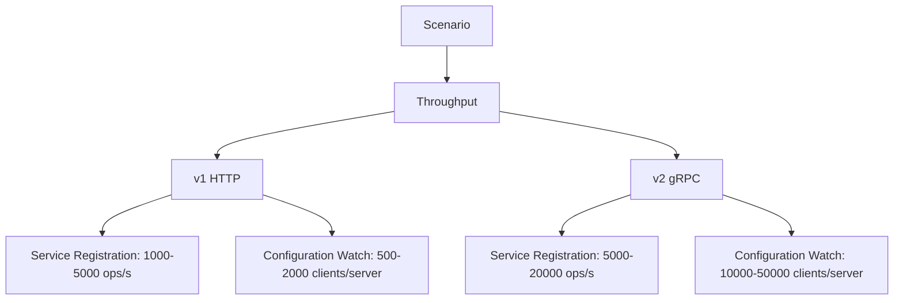

### Resource Utilization
The resource utilization differs significantly between the two protocols, particularly in terms of connection overhead.

```mermaid
graph TD
A[Resource] --> B[Utilization]
B --> C[v1 HTTP]
B --> D[v2 gRPC]
C --> E[Connections: High (1 per request)]
C --> F[Memory: Medium]
C --> G[CPU: Medium]
D --> H[Connections: Low (1 per client)]
D --> I[Memory: High (per connection)]
D --> J[CPU: Low]
```

**Section sources**
- [nacosserver/v1/server.go](file://plugin/apiserver/nacosserver/v1/server.go#L31-L63)
- [nacosserver/v2/server.go](file://plugin/apiserver/nacosserver/v2/server.go#L53-L108)
- [nacosserver/v2/server.go](file://plugin/apiserver/nacosserver/v2/server.go#L323-L365)

## Migration Strategies
Migrating from v1 to v2 requires careful planning to ensure compatibility and minimize service disruption.

### Gradual Migration
A gradual migration strategy allows both protocols to coexist while transitioning clients incrementally.

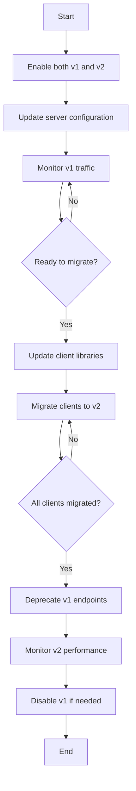

### Compatibility Considerations
When migrating between versions, several compatibility factors must be considered.

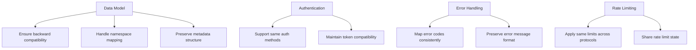

**Section sources**
- [nacosserver/server.go](file://plugin/apiserver/nacosserver/server.go#L207-L237)
- [nacosserver/v2/server.go](file://plugin/apiserver/nacosserver/v2/server.go#L105-L147)
- [nacosserver/config.go](file://plugin/apiserver/nacosserver/config.go#L0-L35)