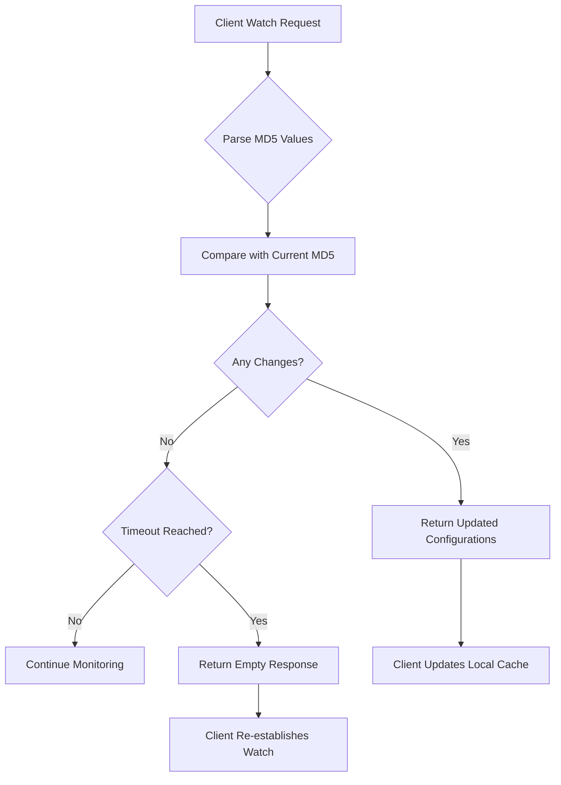

# Nacos v1 Configuration Management

<cite>
**Referenced Files in This Document**   
- [access.go](file://plugin/apiserver/nacosserver/v1/config/access.go)
- [builder.go](file://plugin/apiserver/nacosserver/v1/config/builder.go)
- [config_file.go](file://plugin/apiserver/nacosserver/v1/config/config_file.go)
- [server.go](file://plugin/apiserver/nacosserver/v1/config/server.go)
- [watch.go](file://plugin/apiserver/nacosserver/v1/config/watch.go)
- [config.go](file://plugin/apiserver/nacosserver/model/config.go)
- [core/storage.go](file://plugin/apiserver/nacosserver/core/storage.go)
</cite>

## Table of Contents
1. [Introduction](#introduction)
2. [Configuration Operations](#configuration-operations)
3. [Long-Polling Mechanism](#long-polling-mechanism)
4. [Tenant Isolation and Namespace Mapping](#tenant-isolation-and-namespace-mapping)
5. [Configuration Types and Content Handling](#configuration-types-and-content-handling)
6. [MD5-Based Change Detection](#md5-based-change-detection)
7. [Authentication and Security](#authentication-and-security)
8. [Rate Limiting](#rate-limiting)
9. [Client Compatibility](#client-compatibility)
10. [Common Issues and Best Practices](#common-issues-and-best-practices)

## Introduction
The Nacos v1 Configuration Management API in pole-server provides a RESTful interface for managing configuration data in a distributed environment. This API enables clients to publish, retrieve, delete, and listen to configuration changes using standard HTTP operations. The system supports tenant isolation through namespace mapping, handles various configuration types (text, JSON, YAML), and implements efficient change detection using MD5 hashing. The long-polling mechanism ensures timely configuration updates with minimal network overhead.

## Configuration Operations

### Publish Configuration
The configuration publishing endpoint allows clients to create or update configuration data.

**Endpoint**: `POST /nacos/v1/cs/configs`  
**Method**: POST  
**Parameters**:
- `dataId`: Unique identifier for the configuration (required)
- `group`: Group to which the configuration belongs (required)
- `tenant`: Namespace for tenant isolation (optional, defaults to default namespace)
- `content`: Configuration content (required)
- `appName`: Application name associated with the configuration (optional)
- `src_user`: Source user identifier (optional)
- `config_tags`: Tags for categorizing configurations (optional)
- `desc`: Description of the configuration (optional)
- `type`: Configuration format (text/json/yaml, optional)
- `encryptedDataKey`: Encryption key for sensitive configurations (optional)

**Response**: Returns success status upon successful publication.

**Section sources**
- [access.go](file://plugin/apiserver/nacosserver/v1/config/access.go#L50-L75)
- [builder.go](file://plugin/apiserver/nacosserver/v1/config/builder.go#L25-L48)

### Retrieve Configuration
Clients can retrieve configuration data by specifying the configuration identifier.

**Endpoint**: `GET /nacos/v1/cs/configs`  
**Method**: GET  
**Parameters**:
- `dataId`: Configuration identifier (required)
- `group`: Configuration group (required)
- `tenant`: Namespace for tenant isolation (optional)
- `beta`: Flag to retrieve beta configurations (optional)

**Response**: Returns configuration content with metadata in the response body.

**Section sources**
- [access.go](file://plugin/apiserver/nacosserver/v1/config/access.go#L77-L97)

### Delete Configuration
The delete operation removes a configuration from the system.

**Endpoint**: `DELETE /nacos/v1/cs/configs`  
**Method**: DELETE  
**Parameters**:
- `dataId`: Configuration identifier to delete (required)
- `group`: Configuration group (required)
- `tenant`: Namespace from which to delete (optional)

**Response**: Returns success status upon successful deletion.

**Section sources**
- [access.go](file://plugin/apiserver/nacosserver/v1/config/access.go#L99-L120)

## Long-Polling Mechanism

### Configuration Listening
The long-polling endpoint enables clients to receive real-time configuration updates.

**Endpoint**: `POST /nacos/v1/cs/configs/listener`  
**Method**: POST  
**Headers**:
- `Long-Pulling-Timeout`: Client-specified timeout in milliseconds (recommended: 30000)
- `Long-Pulling-Timeout-No-Hangup`: If "true", returns immediately if no changes (optional)
- `Client-Version`: Client version identifier (optional)

**Request Body**: Encoded list of configurations to watch, formatted as:
```
dataId1\x02group1\x02md5_1\x01dataId2\x02group2\x02md5_2\x01
```
For multi-tenant format:
```
dataId\x02group\x02md5\x02tenant\x01
```

**Timeout Behavior**: The server holds the request for up to the specified timeout duration minus 2 seconds (minimum 10 seconds) to ensure timely response delivery.

**Client-Side Caching**: Clients should include MD5 hashes of their current configurations to enable efficient change detection.

**Push Reliability**: The system ensures at-least-once delivery of configuration changes through connection tracking and event queuing.

```mermaid
sequenceDiagram
participant Client
participant Server
participant Storage
Client->>Server : POST /nacos/v1/cs/configs/listener
Server->>Server : Parse listening configurations
loop Check for changes
Server->>Storage : Check configuration updates
Storage-->>Server : Return change status
alt Changes detected
Server->>Client : Return changed configurations
break Exit loop
end
alt Timeout reached
Server->>Client : Return 200 with no changes
break Exit loop
end
end
```

**Diagram sources**
- [access.go](file://plugin/apiserver/nacosserver/v1/config/access.go#L122-L145)
- [config.go](file://plugin/apiserver/nacosserver/model/config.go#L150-L227)
- [watch.go](file://plugin/apiserver/nacosserver/v1/config/watch.go#L25-L145)

**Section sources**
- [access.go](file://plugin/apiserver/nacosserver/v1/config/access.go#L122-L145)
- [config.go](file://plugin/apiserver/nacosserver/model/config.go#L150-L227)

## Tenant Isolation and Namespace Mapping

The system implements tenant isolation through namespace mapping, ensuring configuration separation between different tenants.

**Namespace Parameter**: The `tenant` parameter (also accessible as `namespaceId`) identifies the tenant namespace. When not specified, configurations are stored in the default namespace.

**Mapping Logic**: The `ToPolarisNamespace` function converts Nacos tenant identifiers to internal Polaris namespace format, enabling compatibility between different naming conventions.

**Isolation Level**: Each namespace maintains completely separate configuration data, preventing cross-tenant access and ensuring data privacy.

**Section sources**
- [config.go](file://plugin/apiserver/nacosserver/model/config.go#L30-L45)

## Configuration Types and Content Handling

The API supports multiple configuration formats with appropriate content-type handling.

**Supported Types**:
- `text`: Plain text configurations
- `json`: JSON-formatted configurations
- `yaml`: YAML-formatted configurations
- `properties`: Java properties format
- `xml`: XML-formatted configurations

**Content Processing**: The `type` parameter specifies the configuration format, which is stored as the `format` field in the internal representation. The system preserves the original content encoding and returns it unchanged during retrieval.

**Example - Publishing YAML Configuration**:
```bash
curl -X POST 'http://localhost:8080/nacos/v1/cs/configs' \
  -d 'dataId=application.yaml' \
  -d 'group=DEFAULT_GROUP' \
  -d 'content=server:\n  port: 8080\nspring:\n  application:\n    name: demo-service' \
  -d 'type=yaml'
```

**Section sources**
- [config.go](file://plugin/apiserver/nacosserver/model/config.go#L55-L75)

## MD5-Based Change Detection

The system implements MD5-based change detection to efficiently identify configuration modifications.

**MD5 Calculation**: The MD5 hash is calculated from the configuration content and used for change detection in long-polling requests.

**Change Detection Logic**: When a client sends a watch request with MD5 values, the server compares these with the current MD5 values in storage. If any MD5 values differ, the server returns the updated configurations.

**Beta Configuration Handling**: The system supports beta releases through IP-based targeting, where specific clients receive different configuration versions based on their IP addresses.



**Diagram sources**
- [watch.go](file://plugin/apiserver/nacosserver/v1/config/watch.go#L100-L120)
- [config.go](file://plugin/apiserver/nacosserver/model/config.go#L150-L227)

**Section sources**
- [watch.go](file://plugin/apiserver/nacosserver/v1/config/watch.go#L100-L120)

## Authentication and Security

The API integrates with the system's authentication framework to ensure secure access to configuration data.

**Authentication Mechanism**: The system uses header-based authentication, where clients must provide valid credentials in HTTP headers.

**Access Control**: The `ParseHeaderContext` method extracts authentication information from request headers and validates client permissions before processing configuration operations.

**Encrypted Configurations**: Support for encrypted configurations through the `cipher-` prefix in dataId and the `encryptedDataKey` parameter for key management.

**Section sources**
- [access.go](file://plugin/apiserver/nacosserver/v1/config/access.go#L50-L145)

## Rate Limiting

The system implements rate limiting on configuration publishing operations to prevent abuse and ensure system stability.

**Rate Limit Configuration**: Rate limiting is configured through the `ratelimit` component, which can be customized based on deployment requirements.

**Limit Enforcement**: The system tracks publish operations per client and enforces limits to prevent excessive configuration changes that could impact system performance.

**Section sources**
- [server.go](file://plugin/apiserver/nacosserver/v1/server.go#L31-L63)

## Client Compatibility

The API maintains compatibility with Nacos 1.x configuration clients through protocol emulation.

**Protocol Support**: The system supports both old and new message formats for configuration listening:
- Old format: `dataId\x02group\x02md5\x01`
- New format: `dataId\x02group\x02md5\x02tenant\x01`

**Version Handling**: The `Client-Version` header allows the server to adapt its response format based on client capabilities.

**Section sources**
- [config.go](file://plugin/apiserver/nacosserver/model/config.go#L180-L227)

## Common Issues and Best Practices

### Encoding Problems
Ensure proper URL encoding of special characters in dataId and group parameters. Use UTF-8 encoding for configuration content to avoid character corruption.

### Watch Connection Leaks
Implement proper timeout handling on the client side and ensure connections are closed when no longer needed. Use the `Long-Pulling-Timeout-No-Hangup` header to prevent indefinite blocking.

### Large Configuration Payload Handling
For configurations exceeding typical size limits:
- Consider splitting large configurations into smaller, logical units
- Use compression when appropriate
- Implement pagination for retrieval operations

### Efficient Configuration Watches
To optimize long-polling efficiency:
- Batch multiple configuration watches in a single request
- Use appropriate timeout values (20-30 seconds recommended)
- Implement exponential backoff for reconnection after network failures
- Cache MD5 values locally to minimize unnecessary data transfer

**Section sources**
- [watch.go](file://plugin/apiserver/nacosserver/v1/config/watch.go#L25-L145)
- [config.go](file://plugin/apiserver/nacosserver/model/config.go#L150-L227)