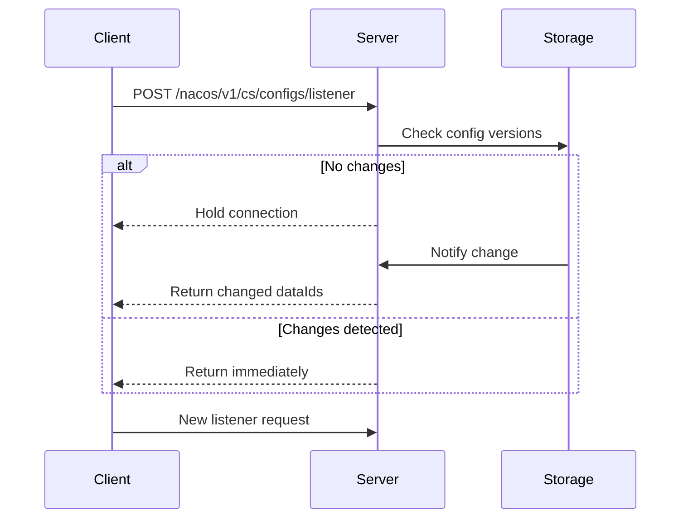

# Nacos v1 HTTP API

<cite>
**Referenced Files in This Document**   
- [endpoints.go](file://plugin/apiserver/nacosserver/v1/endpoints.go)
- [access.go](file://plugin/apiserver/nacosserver/v1/discover/access.go)
- [builder.go](file://plugin/apiserver/nacosserver/v1/discover/builder.go)
- [server.go](file://plugin/apiserver/nacosserver/v1/server.go)
- [config/access.go](file://plugin/apiserver/nacosserver/v1/config/access.go)
- [config/server.go](file://plugin/apiserver/nacosserver/v1/config/server.go)
- [config/watch.go](file://plugin/apiserver/nacosserver/v1/config/watch.go)
- [model/instance.go](file://plugin/apiserver/nacosserver/model/instance.go)
- [model/config.go](file://plugin/apiserver/nacosserver/model/config.go)
- [model/constant.go](file://plugin/apiserver/nacosserver/model/constant.go)
</cite>

## Table of Contents
1. [Introduction](#introduction)
2. [Service Discovery API](#service-discovery-api)
3. [Configuration Management API](#configuration-management-api)
4. [Authentication and Security](#authentication-and-security)
5. [Rate Limiting and Access Control](#rate-limiting-and-access-control)
6. [Long-Polling Mechanism](#long-polling-mechanism)
7. [Error Handling](#error-handling)
8. [Compatibility with Nacos 1.x Clients](#compatibility-with-nacos-1x-clients)
9. [Common Issues and Troubleshooting](#common-issues-and-troubleshooting)

## Introduction
The Nacos v1 HTTP API in pole-server provides a comprehensive interface for service discovery and configuration management, fully compatible with Nacos 1.x clients. This API enables microservices to register, discover, and maintain service instances while managing dynamic configurations across distributed environments. The implementation supports standard Nacos endpoints for service registration, instance querying, health reporting, and configuration publishing with tenant isolation.

**Section sources**
- [server.go](file://plugin/apiserver/nacosserver/v1/server.go#L31-L63)
- [endpoints.go](file://plugin/apiserver/nacosserver/v1/endpoints.go#L0-L42)

## Service Discovery API

### Service Registration
Registers a service instance with the discovery system. The endpoint supports metadata attachment and health check configuration.

**Endpoint**: `POST /nacos/v1/ns/instance`

**Query Parameters**:
- `serviceName`: Name of the service (required)
- `ip`: IP address of the instance (required)
- `port`: Port number (required)
- `namespaceId`: Tenant namespace identifier
- `weight`: Instance weight for load balancing
- `ephemeral`: Whether the instance is ephemeral (default: true)
- `enabled`: Whether the instance is initially enabled
- `metadata`: JSON-encoded metadata string

**Request Body**: None (parameters passed via query string)

**Response**: `200 OK` on success

**Section sources**
- [access.go](file://plugin/apiserver/nacosserver/v1/discover/access.go#L0-L39)
- [builder.go](file://plugin/apiserver/nacosserver/v1/discover/builder.go#L0-L30)

### Instance Deregistration
Removes a service instance from the registry.

**Endpoint**: `DELETE /nacos/v1/ns/instance`

**Query Parameters**:
- `serviceName`: Name of the service (required)
- `ip`: IP address of the instance (required)
- `port`: Port number (required)
- `namespaceId`: Tenant namespace identifier

**Response**: `200 OK` on success

### Service Instance Query
Retrieves the list of healthy instances for a service.

**Endpoint**: `GET /nacos/v1/ns/instance/list`

**Query Parameters**:
- `serviceName`: Name of the service (required)
- `namespaceId`: Tenant namespace identifier
- `healthyOnly`: Return only healthy instances (default: false)

**Response Schema (JSON)**:
```json
{
  "name": "string",
  "groupName": "string",
  "clusters": "string",
  "cacheMillis": 10000,
  "hosts": [
    {
      "ip": "string",
      "port": 8080,
      "weight": 1.0,
      "healthy": true,
      "enabled": true,
      "ephemeral": true,
      "metadata": {},
      "instanceId": "string",
      "serviceName": "string"
    }
  ],
  "lastRefTime": 1234567890,
  "reachProtectionThreshold": false,
  "valid": true
}
```

### Service List
Retrieves all services in a namespace.

**Endpoint**: `GET /nacos/v1/ns/service/list`

**Query Parameters**:
- `namespaceId`: Tenant namespace identifier
- `pageNo`: Page number (default: 1)
- `pageSize`: Number of services per page (default: 100)

**Response Schema (JSON)**:
```json
{
  "count": 10,
  "doms": ["service1", "service2"]
}
```

**Section sources**
- [access.go](file://plugin/apiserver/nacosserver/v1/discover/access.go#L0-L39)
- [model/instance.go](file://plugin/apiserver/nacosserver/model/instance.go)

## Configuration Management API

### Publish Configuration
Publishes or updates a configuration item.

**Endpoint**: `POST /nacos/v1/cs/configs`

**Query Parameters**:
- `dataId`: Configuration identifier (required)
- `group`: Configuration group (required)
- `content`: Configuration content (required)
- `namespaceId`: Tenant namespace identifier
- `type`: Configuration type (text, json, yaml, etc.)

**Response**: `200 OK` on success, `400 Bad Request` on validation error

### Get Configuration
Retrieves a configuration item by dataId and group.

**Endpoint**: `GET /nacos/v1/cs/configs`

**Query Parameters**:
- `dataId`: Configuration identifier (required)
- `group`: Configuration group (required)
- `namespaceId`: Tenant namespace identifier
- `timeout`: Read timeout in milliseconds

**Response Schema (JSON)**:
- Returns raw configuration content in the response body
- HTTP headers include:
  - `Content-Type`: Based on configuration type
  - `Config-Type`: Configuration format
  - `Last-Modified`: Timestamp of last update

### Remove Configuration
Deletes a configuration item.

**Endpoint**: `DELETE /nacos/v1/cs/configs`

**Query Parameters**:
- `dataId`: Configuration identifier (required)
- `group`: Configuration group (required)
- `namespaceId`: Tenant namespace identifier

**Response**: `200 OK` on success, `404 Not Found` if configuration doesn't exist

### Configuration Watch
Establishes a long-polling connection to watch for configuration changes.

**Endpoint**: `POST /nacos/v1/cs/configs/listener`

**Request Body (Form Data)**:
- `Listening-Configs`: Semicolon-separated list of dataId@group@namespaceId triples
- `Long-Pulling-Timeout`: Client timeout in milliseconds (default: 30000)
- `Probe-Modify-Request`: JSON array of objects with dataId, group, and tenant fields

**Example Request Body**:
```
Listening-Configs=app.properties@DEFAULT_GROUP@public;database.yaml@DB_GROUP@test
```

**Response**: Returns immediately if any watched configuration has changed, otherwise holds the connection until timeout or change detection.

**Section sources**
- [config/access.go](file://plugin/apiserver/nacosserver/v1/config/access.go)
- [config/server.go](file://plugin/apiserver/nacosserver/v1/config/server.go)
- [config/watch.go](file://plugin/apiserver/nacosserver/v1/config/watch.go)

## Authentication and Security
The Nacos v1 API supports authentication via HTTP headers. Clients must provide valid credentials for protected operations.

**Authentication Headers**:
- `Authorization`: Bearer token for API access
- `Nacos-Access-Key`: Access key identifier
- `Nacos-Secret-Key`: Secret key for request signing

**Tenant Isolation**: All operations support namespace-based tenant isolation through the `namespaceId` parameter. The system enforces access control policies based on user roles and namespace permissions.

**Section sources**
- [server.go](file://plugin/apiserver/nacosserver/v1/server.go#L65-L118)
- [auth.go](file://plugin/apiserver/nacosserver/v1/auth.go)

## Rate Limiting and Access Control
The API implements rate limiting and access control mechanisms to protect server resources.

**Rate Limiting**: Configurable rate limits per client IP or access key. Limits are defined in the server configuration and can be adjusted based on deployment requirements.

**Whitelist Support**: Optional IP whitelist for restricting API access to trusted clients.

**Access Control**: Role-based access control (RBAC) system that enforces permissions for configuration and service operations based on user roles and namespace ownership.

**Section sources**
- [server.go](file://plugin/apiserver/nacosserver/v1/server.go#L65-L118)
- [ratelimit.go](file://apis/access_control/ratelimit/ratelimit.go)

## Long-Polling Mechanism
The `/nacos/v1/cs/configs/listener` endpoint implements a long-polling mechanism for efficient configuration change notification.



**Diagram sources**
- [config/watch.go](file://plugin/apiserver/nacosserver/v1/config/watch.go)
- [core/push.go](file://plugin/apiserver/nacosserver/core/push.go)

**Section sources**
- [config/watch.go](file://plugin/apiserver/nacosserver/v1/config/watch.go)

## Error Handling
The API returns standardized error responses with appropriate HTTP status codes.

**Common Error Codes**:
- `400 Bad Request`: Invalid parameters or request format
- `403 Forbidden`: Authentication failure or insufficient permissions
- `404 Not Found`: Resource not found
- `408 Request Timeout`: Long-polling timeout
- `429 Too Many Requests`: Rate limit exceeded
- `500 Internal Server Error`: Server-side processing error

**Error Response Schema**:
```json
{
  "timestamp": "2023-01-01T00:00:00Z",
  "status": 400,
  "error": "Bad Request",
  "message": "Detailed error message",
  "path": "/nacos/v1/cs/configs"
}
```

**Section sources**
- [model/error.go](file://plugin/apiserver/nacosserver/model/error.go)
- [config/server.go](file://plugin/apiserver/nacosserver/v1/config/server.go)

## Compatibility with Nacos 1.x Clients
The implementation maintains full compatibility with Nacos 1.x clients through:

- Standard endpoint URLs and parameter names
- Identical request/response formats
- Same error code semantics
- Compatible long-polling behavior
- Support for Nacos 1.x client SDKs

The system handles all Nacos 1.x specific behaviors including parameter encoding, metadata format, and health check protocols.

**Section sources**
- [endpoints.go](file://plugin/apiserver/nacosserver/v1/endpoints.go)
- [model/constant.go](file://plugin/apiserver/nacosserver/model/constant.go)

## Common Issues and Troubleshooting

### Watch Timeout Handling
Clients should implement exponential backoff when handling 408 timeouts from the listener endpoint. The recommended approach is to start with a 30-second timeout and gradually increase the interval after consecutive timeouts.

### Metadata Parsing Errors
Ensure metadata is properly JSON-encoded when passed as a query parameter. Invalid JSON in metadata will cause 400 Bad Request responses.

### Service Name Encoding
Service names containing special characters should be URL-encoded. The system follows Nacos 1.x conventions for service name validation and encoding.

### Configuration Watch Memory Usage
Applications with many configuration watches should monitor memory usage, as each active watch consumes server resources. Consider grouping related configurations to reduce the number of watch registrations.

**Section sources**
- [config/watch.go](file://plugin/apiserver/nacosserver/v1/config/watch.go)
- [model/instance.go](file://plugin/apiserver/nacosserver/model/instance.go)
- [model/config.go](file://plugin/apiserver/nacosserver/model/config.go)