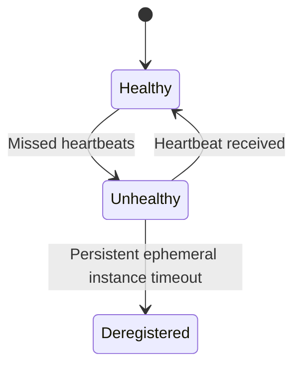

# Nacos v1 Service Discovery

<cite>
**Referenced Files in This Document**   
- [access.go](file://plugin/apiserver/nacosserver/v1/discover/access.go)
- [instance.go](file://plugin/apiserver/nacosserver/v1/discover/instance.go)
- [constant.go](file://plugin/apiserver/nacosserver/model/constant.go)
- [instance.go](file://plugin/apiserver/nacosserver/model/instance.go)
- [server.go](file://plugin/apiserver/nacosserver/v1/server.go)
- [http.go](file://plugin/apiserver/nacosserver/v1/http/handler.go)
</cite>

## Table of Contents
1. [Introduction](#introduction)
2. [API Endpoints Overview](#api-endpoints-overview)
3. [Service Registration](#service-registration)
4. [Instance Deregistration](#instance-deregistration)
5. [Instance Listing](#instance-listing)
6. [Health Status Update](#health-status-update)
7. [Service Querying](#service-querying)
8. [Metadata Handling](#metadata-handling)
9. [Ephemeral Instances](#ephemeral-instances)
10. [Health Check Integration](#health-check-integration)
11. [Authentication](#authentication)
12. [Rate Limiting](#rate-limiting)
13. [Common Issues](#common-issues)
14. [Appendices](#appendices)

## Introduction
The Nacos v1 Service Discovery API in pole-server provides a compatibility layer for Nacos 1.x clients to register, discover, and manage services. This documentation details the HTTP endpoints, request/response formats, and operational semantics for service discovery operations. The implementation maintains compatibility with Nacos 1.x client SDKs while integrating with the underlying Polaris service registry.

**Section sources**
- [access.go](file://plugin/apiserver/nacosserver/v1/discover/access.go#L1-L39)
- [server.go](file://plugin/apiserver/nacosserver/v1/server.go#L31-L63)

## API Endpoints Overview
The Nacos v1 Service Discovery API is mounted under the `/nacos/v1/ns` path and provides RESTful operations for service instance management. The endpoints support service registration, deregistration, instance listing, health status updates, and service querying.

```mermaid
graph TB
A[/nacos/v1/ns] --> B[POST /instance]
A --> C[PUT /instance]
A --> D[DELETE /instance]
A --> E[PUT /instance/beat]
A --> F[GET /instance/list]
A --> G[GET /service/list]
A --> H[GET /operator/metrics]
```

**Diagram sources**
- [access.go](file://plugin/apiserver/nacosserver/v1/discover/access.go#L41-L58)

## Service Registration
Registers a service instance with the discovery system.

### Endpoint
```
POST /nacos/v1/ns/instance
```

### Parameters
- **serviceName**: Service name (required)
- **ip**: Instance IP address (required)
- **port**: Instance port (required)
- **namespaceId**: Namespace identifier (optional, defaults to "public")
- **groupName**: Group name (optional, defaults to "DEFAULT_GROUP")
- **clusterName**: Cluster name (optional, defaults to "DEFAULT")
- **weight**: Instance weight (optional, defaults to 1.0)
- **ephemeral**: Whether instance is ephemeral (optional, defaults to true)
- **enabled**: Whether instance is enabled (optional, defaults to true)
- **metadata**: Custom metadata as key-value pairs (optional)

### Request Example
```http
POST /nacos/v1/ns/instance?serviceName=example-service&ip=192.168.1.10&port=8080&weight=2.0&metadata=version:1.0,env:prod
```

### Response
- **Success**: HTTP 200 with body "ok"
- **Error**: HTTP 400/500 with error details

**Section sources**
- [access.go](file://plugin/apiserver/nacosserver/v1/discover/access.go#L60-L74)
- [instance.go](file://plugin/apiserver/nacosserver/v1/discover/instance.go#L30-L45)

## Instance Deregistration
Removes a service instance from the registry.

### Endpoint
```
DELETE /nacos/v1/ns/instance
```

### Parameters
- **serviceName**: Service name (required)
- **ip**: Instance IP address (required)
- **port**: Instance port (required)
- **namespaceId**: Namespace identifier (optional)
- **ephemeral**: Whether instance is ephemeral (optional)

### Request Example
```http
DELETE /nacos/v1/ns/instance?serviceName=example-service&ip=192.168.1.10&port=8080
```

### Response
- **Success**: HTTP 200 with body "ok"
- **Error**: HTTP 400/500 with error details

**Section sources**
- [access.go](file://plugin/apiserver/nacosserver/v1/discover/access.go#L108-L125)
- [instance.go](file://plugin/apiserver/nacosserver/v1/discover/instance.go#L55-L65)

## Instance Listing
Retrieves instances for a service with filtering options.

### Endpoint
```
GET /nacos/v1/ns/instance/list
```

### Parameters
- **serviceName**: Service name (required)
- **namespaceId**: Namespace identifier (optional)
- **groupName**: Group name (optional)
- **clusters**: Comma-separated cluster names for filtering (optional)
- **healthyOnly**: Whether to return only healthy instances (optional, defaults to false)
- **clientIP**: Client IP for subscriber registration (optional)
- **udpPort**: UDP port for push notifications (optional)

### Response Schema
```json
{
  "name": "string",
  "groupName": "string",
  "clusters": "string",
  "hosts": [
    {
      "instanceId": "string",
      "ip": "string",
      "port": "number",
      "weight": "number",
      "healthy": "boolean",
      "enabled": "boolean",
      "ephemeral": "boolean",
      "clusterName": "string",
      "serviceName": "string",
      "metadata": {
        "key": "value"
      }
    }
  ],
  "checksum": "string",
  "cacheMillis": "number",
  "lastRefTime": "number"
}
```

### Request Example
```http
GET /nacos/v1/ns/instance/list?serviceName=example-service&healthyOnly=true&clusters=zone-1,zone-2
```

**Section sources**
- [access.go](file://plugin/apiserver/nacosserver/v1/discover/access.go#L165-L185)
- [instance.go](file://plugin/apiserver/nacosserver/v1/discover/instance.go#L120-L179)

## Health Status Update
Updates the health status of an instance via heartbeat mechanism.

### Endpoint
```
PUT /nacos/v1/ns/instance/beat
```

### Parameters
- **serviceName**: Service name (required)
- **beat**: JSON payload containing heartbeat information (required)

### Beat Payload
```json
{
  "ip": "string",
  "port": "number",
  "namespace": "string",
  "serviceName": "string",
  "cluster": "string",
  "weight": "number",
  "ephemeral": "boolean",
  "metadata": {
    "key": "value"
  }
}
```

### Response Schema
```json
{
  "code": "number",
  "clientBeatInterval": "number",
  "lightBeatEnabled": "boolean"
}
```

### Request Example
```http
PUT /nacos/v1/ns/instance/beat?serviceName=example-service
Content-Type: application/json

{
  "ip": "192.168.1.10",
  "port": 8080,
  "namespace": "public",
  "serviceName": "example-service",
  "cluster": "DEFAULT"
}
```

**Section sources**
- [access.go](file://plugin/apiserver/nacosserver/v1/discover/access.go#L145-L164)
- [instance.go](file://plugin/apiserver/nacosserver/v1/discover/instance.go#L85-L119)

## Service Querying
Lists available services with pagination.

### Endpoint
```
GET /nacos/v1/ns/service/list
```

### Parameters
- **pageNo**: Page number (required)
- **pageSize**: Page size (required)
- **namespaceId**: Namespace identifier (optional)
- **groupName**: Group name (optional)

### Response Schema
```json
{
  "count": "number",
  "doms": ["string"]
}
```

### Request Example
```http
GET /nacos/v1/ns/service/list?pageNo=1&pageSize=100&namespaceId=public&groupName=DEFAULT_GROUP
```

**Section sources**
- [access.go](file://plugin/apiserver/nacosserver/v1/discover/access.go#L50-L59)
- [access.go](file://plugin/apiserver/nacosserver/v1/discover/access.go#L40-L49)

## Metadata Handling
Service instances can include custom metadata as key-value pairs.

### Metadata Format
- Passed via `metadata` query parameter
- Key-value pairs separated by colons (:)
- Multiple pairs separated by commas (,)
- Example: `metadata=version:1.0,env:prod,region:us-west`

### Internal Metadata
The system adds internal metadata to track Nacos-specific attributes:
- `internal-nacos-cluster`: Original cluster name
- `internal-nacos-service`: Original service name
- `internal-nacos-clientconnId`: Client connection identifier

**Section sources**
- [instance.go](file://plugin/apiserver/nacosserver/model/instance.go#L100-L115)
- [constant.go](file://plugin/apiserver/nacosserver/model/constant.go#L70-L73)

## Ephemeral Instances
Instances can be registered as ephemeral, meaning they are automatically removed when health checks fail.

### Ephemeral Semantics
- **ephemeral=true**: Instance is removed when health checks fail
- **ephemeral=false**: Instance persists even when unhealthy
- Default value is true
- Controlled via `ephemeral` query parameter

### Use Cases
- **Ephemeral**: Standard microservices that should be removed when unhealthy
- **Persistent**: Critical infrastructure services that should remain registered

**Section sources**
- [instance.go](file://plugin/apiserver/nacosserver/model/instance.go#L85-L88)
- [constant.go](file://plugin/apiserver/nacosserver/model/constant.go#L55-L56)

## Health Check Integration
The system integrates with a heartbeat-based health check mechanism.

### Heartbeat System
- Clients must send heartbeats every 5 seconds (5000ms)
- Server responds with `clientBeatInterval` indicating expected interval
- Missing heartbeats trigger health status changes
- Light heartbeat mode supported for efficiency

### Health Status Flow


**Diagram sources**
- [instance.go](file://plugin/apiserver/nacosserver/v1/discover/instance.go#L85-L119)
- [constant.go](file://plugin/apiserver/nacosserver/model/constant.go#L65-L66)

## Authentication
The API supports authentication via custom headers.

### Authentication Header
- **Header**: `accessToken`
- **Value**: Token for authentication
- Processed by access control middleware
- Integrated with the system's authentication framework

**Section sources**
- [constant.go](file://plugin/apiserver/nacosserver/model/constant.go#L35-L36)
- [server.go](file://plugin/apiserver/nacosserver/v1/server.go#L31-L63)

## Rate Limiting
API endpoints are protected by rate limiting to prevent abuse.

### Rate Limiting Implementation
- Configured via access control plugins
- Applied at the API gateway level
- Configurable thresholds and burst limits
- Returns appropriate HTTP status codes when limits are exceeded

**Section sources**
- [server.go](file://plugin/apiserver/nacosserver/v1/server.go#L31-L63)
- [ratelimit.go](file://apis/access_control/ratelimit/ratelimit.go#L1-L10)

## Common Issues
### Service Name Encoding
Service names containing special characters may require proper encoding. The system handles the `@@` separator between service and group names, converting it to `__` internally.

### Metadata Parsing Errors
Malformed metadata strings (missing colons, invalid syntax) will result in registration failures. Ensure metadata follows the `key:value` format with proper separation.

### Long-Polling Timeout Handling
When using UDP push notifications, ensure clients handle timeouts appropriately and re-establish subscriptions when needed. The system registers subscribers based on client IP and UDP port parameters.

**Section sources**
- [constant.go](file://plugin/apiserver/nacosserver/model/constant.go#L45-L52)
- [instance.go](file://plugin/apiserver/nacosserver/v1/discover/instance.go#L145-L179)

## Appendices

### HTTP Status Codes
| Code | Meaning |
|------|---------|
| 200 | Success |
| 400 | Bad Request |
| 403 | Forbidden |
| 404 | Not Found |
| 500 | Internal Server Error |

### Query Parameters Reference
| Parameter | Required | Default | Description |
|---------|----------|---------|-------------|
| serviceName | Yes | - | Service name |
| ip | Yes | - | Instance IP address |
| port | Yes | - | Instance port |
| namespaceId | No | public | Namespace identifier |
| groupName | No | DEFAULT_GROUP | Group name |
| clusterName | No | DEFAULT | Cluster name |
| weight | No | 1.0 | Instance weight |
| ephemeral | No | true | Ephemeral instance flag |
| enabled | No | true | Enabled status |
| healthyOnly | No | false | Filter for healthy instances only |
| pageNo | Yes (for service list) | - | Page number |
| pageSize | Yes (for service list) | - | Page size |

**Section sources**
- [constant.go](file://plugin/apiserver/nacosserver/model/constant.go#L37-L64)
- [access.go](file://plugin/apiserver/nacosserver/v1/discover/access.go#L1-L186)