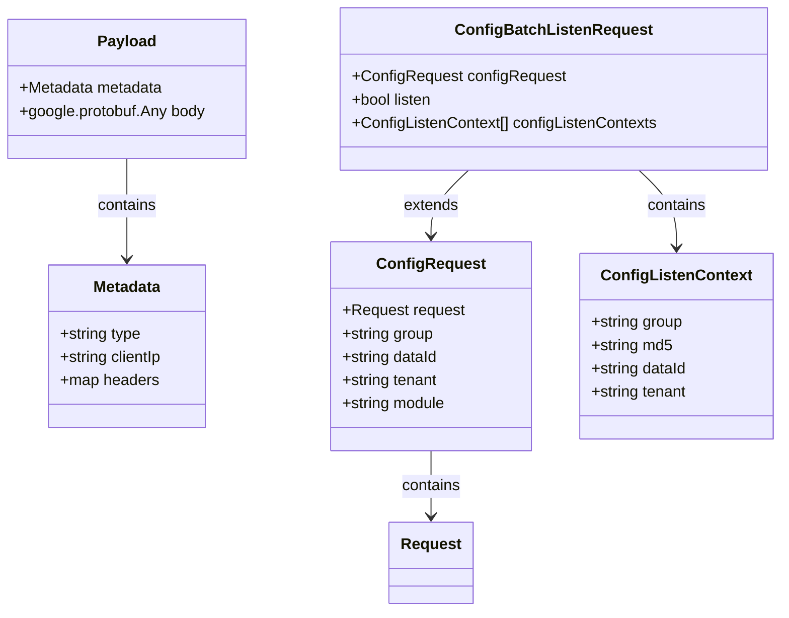
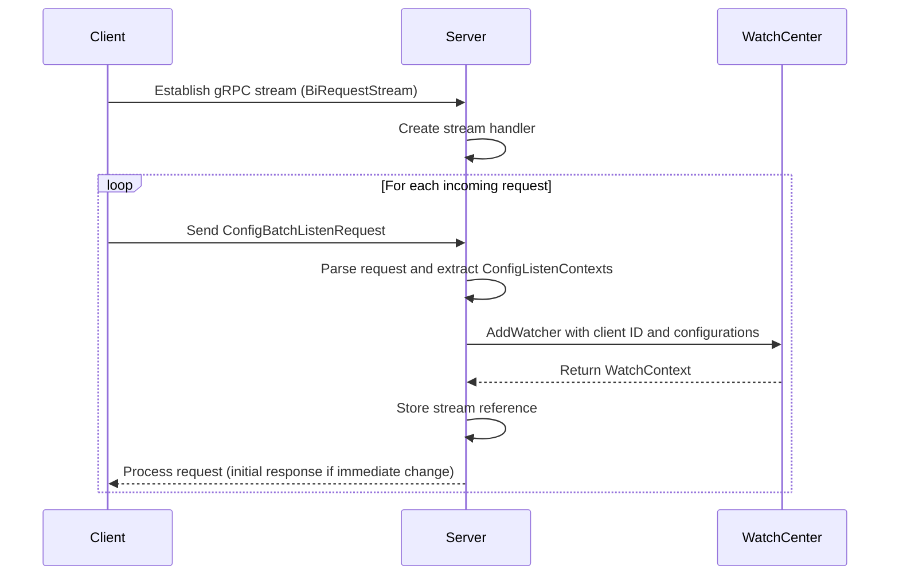
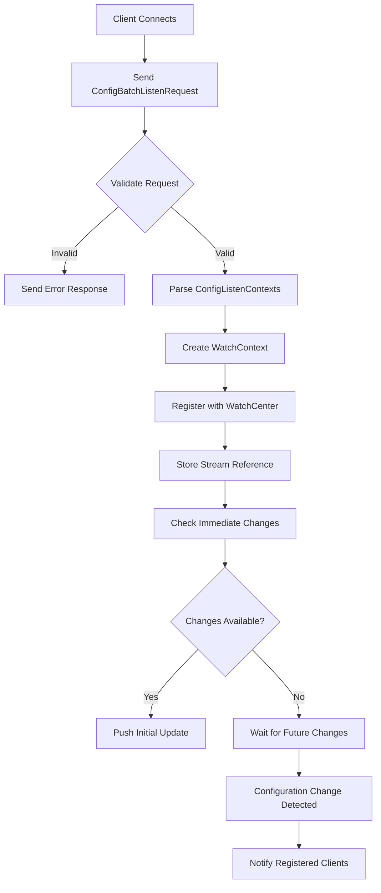
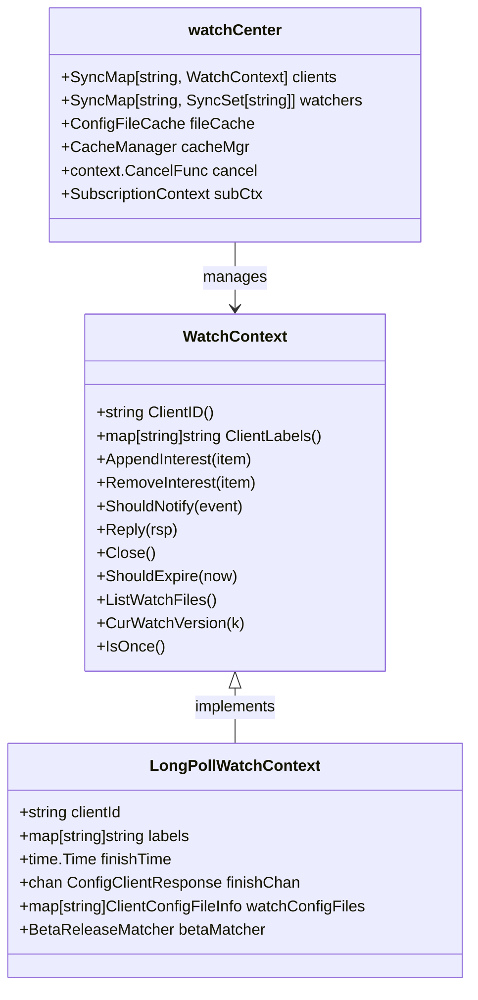
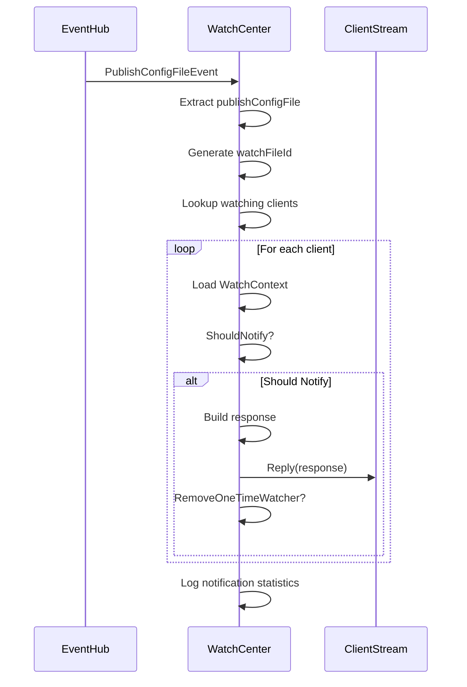
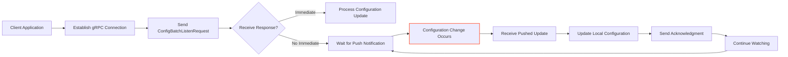
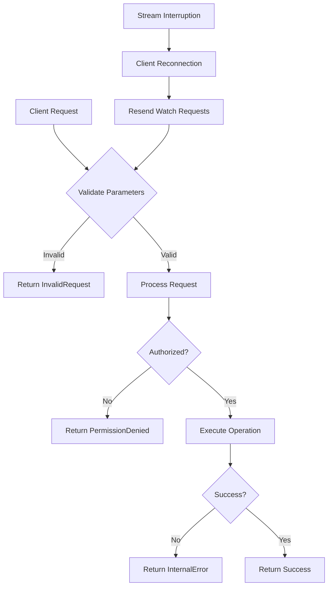

# Configuration Management

<cite>
**Referenced Files in This Document**   
- [nacos_grpc_service.proto](file://plugin/apiserver/nacosserver/v2/pb/nacos_grpc_service.proto)
- [config_request.go](file://plugin/apiserver/nacosserver/v2/pb/config_request.go)
- [watcher.go](file://pkg/config/watcher.go)
- [config.go](file://plugin/apiserver/nacosserver/model/config.go)
</cite>

## Table of Contents
1. [Introduction](#introduction)
2. [gRPC Service Definition](#grpc-service-definition)
3. [Watch Stream Establishment](#watch-stream-establishment)
4. [Configuration Watch Processing](#configuration-watch-processing)
5. [Internal Watch Management](#internal-watch-management)
6. [Change Detection and Notification](#change-detection-and-notification)
7. [Client Interaction Examples](#client-interaction-examples)
8. [Performance and Resource Management](#performance-and-resource-management)
9. [Error Handling](#error-handling)
10. [Conclusion](#conclusion)

## Introduction
This document provides comprehensive documentation for the Nacos v2 gRPC Configuration Management implementation in pole-server, focusing on the long-lived streaming Watch mechanism for real-time configuration updates. The system enables clients to establish persistent connections for receiving push notifications when configuration changes occur. The architecture leverages gRPC bidirectional streaming to maintain efficient, low-latency communication between clients and the configuration server. This mechanism supports real-time propagation of configuration changes across distributed systems, enabling dynamic reconfiguration without requiring clients to poll for updates.

## gRPC Service Definition



**Diagram sources**
- [nacos_grpc_service.proto](file://plugin/apiserver/nacosserver/v2/pb/nacos_grpc_service.proto)
- [config_request.go](file://plugin/apiserver/nacosserver/v2/pb/config_request.go)

**Section sources**
- [nacos_grpc_service.proto](file://plugin/apiserver/nacosserver/v2/pb/nacos_grpc_service.proto#L1-L43)
- [config_request.go](file://plugin/apiserver/nacosserver/v2/pb/config_request.go#L1-L226)

The gRPC service definition for configuration management is centered around the `BiRequestStream` service, which enables bidirectional streaming between clients and the server. The core message structure is the `Payload`, which encapsulates both metadata and a body containing protocol buffer messages. The `Metadata` message includes client identification information such as IP address and headers, while the `Payload` serves as a wrapper for various request and response types.

The configuration watch functionality is implemented through specialized request types that extend the base `ConfigRequest`. The `ConfigBatchListenRequest` is particularly important for the watch mechanism, as it allows clients to register interest in multiple configuration items simultaneously. Each `ConfigListenContext` within the batch request specifies a configuration to watch, including its dataId, group, tenant, and current MD5 hash. The MD5 hash serves as a revision identifier, enabling the server to determine whether the client's cached configuration is up-to-date.

## Watch Stream Establishment



**Diagram sources**
- [config_request.go](file://plugin/apiserver/nacosserver/v2/pb/config_request.go#L42-L226)
- [watcher.go](file://pkg/config/watcher.go#L275-L320)

**Section sources**
- [config_request.go](file://plugin/apiserver/nacosserver/v2/pb/config_request.go#L42-L226)
- [watcher.go](file://pkg/config/watcher.go#L275-L320)

Clients establish a configuration watch by initiating a bidirectional gRPC stream using the `BiRequestStream` service. Upon connection, clients send one or more `ConfigBatchListenRequest` messages containing the configurations they wish to monitor. Each request includes a list of `ConfigListenContext` objects, specifying the dataId, group, tenant, and current MD5 hash for each configuration item.

The server processes these requests by extracting the watch parameters and registering the client with the internal watch management system. A unique client identifier is associated with the stream, allowing the server to track which configurations each client is watching. The registration process involves creating a `WatchContext` that maintains the client's subscription details and stream reference. This context is stored in memory for efficient lookup when configuration changes occur.

## Configuration Watch Processing



**Diagram sources**
- [config.go](file://plugin/apiserver/nacosserver/model/config.go#L110-L151)
- [watcher.go](file://pkg/config/watcher.go#L370-L410)

**Section sources**
- [config.go](file://plugin/apiserver/nacosserver/model/config.go#L110-L151)
- [watcher.go](file://pkg/config/watcher.go#L370-L410)

The configuration watch processing pipeline begins when a client establishes a gRPC stream and sends a `ConfigBatchListenRequest`. The server validates the request parameters, ensuring that required fields such as dataId, group, and tenant are present. Upon successful validation, the server parses the list of `ConfigListenContext` objects and creates a corresponding internal representation of the watch request.

The system performs an immediate check for configuration changes by comparing the MD5 hashes provided by the client with the current hashes stored on the server. If any configuration has changed since the client's last known state, the server pushes the updated configuration immediately through the stream. This ensures that clients receive the most current configuration without delay.

For configurations that have not changed, the server maintains the client's subscription in the watch registry, associating the client's stream with the specific configuration items. The system then waits for future configuration changes, which will trigger push notifications to all interested clients.

## Internal Watch Management



**Diagram sources**
- [watcher.go](file://pkg/config/watcher.go#L0-L411)

**Section sources**
- [watcher.go](file://pkg/config/watcher.go#L0-L411)

The internal watch management system is centered around the `watchCenter` struct, which serves as the central registry for all active configuration watches. The `watchCenter` maintains two primary data structures: a map of client IDs to `WatchContext` objects, and a map of configuration file IDs to sets of client IDs. This bidirectional indexing enables efficient operations for both client management and change notification.

The `WatchContext` interface defines the contract for client watch sessions, with `LongPollWatchContext` providing the concrete implementation. Each `WatchContext` maintains the client's subscription details, including the configurations being watched and their current versions. The context also handles the notification mechanism, using a channel to deliver configuration updates to the client.

The `watchCenter` subscribes to configuration change events through the event hub system, allowing it to react immediately when configurations are modified. When a change occurs, the system looks up all clients watching the affected configuration and evaluates whether each client should receive a notification based on version comparison and any applicable filtering rules.

## Change Detection and Notification



**Diagram sources**
- [watcher.go](file://pkg/config/watcher.go#L322-L368)

**Section sources**
- [watcher.go](file://pkg/config/watcher.go#L322-L368)

Configuration change detection and notification is implemented as an event-driven process. When a configuration is modified, a `PublishConfigFileEvent` is published to the event hub, which delivers it to the `watchCenter`. The `watchCenter` extracts the changed configuration details and generates a unique file identifier using the namespace, group, and file name.

The system then looks up all clients registered to watch this configuration by querying the `watchers` map. For each watching client, the system retrieves their `WatchContext` and evaluates whether they should be notified of the change. The `ShouldNotify` method compares the client's currently watched version with the new version, triggering a notification if the server version is newer.

When a notification is sent, the system constructs a `ConfigClientResponse` containing the updated configuration and pushes it through the client's gRPC stream. For one-time watches (such as long-polling requests), the client's watch context is automatically removed after notification to free up resources. The system logs detailed statistics about each change event, including the number of affected clients and notifications sent.

## Client Interaction Examples



**Diagram sources**
- [config_request.go](file://plugin/apiserver/nacosserver/v2/pb/config_request.go#L42-L226)
- [watcher.go](file://pkg/config/watcher.go#L275-L320)

**Section sources**
- [config_request.go](file://plugin/apiserver/nacosserver/v2/pb/config_request.go#L42-L226)
- [watcher.go](file://pkg/config/watcher.go#L275-L320)

Clients interact with the configuration watch system through a straightforward process. To initiate watching, a client establishes a gRPC bidirectional stream and sends a `ConfigBatchListenRequest` containing the configurations of interest. The request includes the dataId, group, tenant, and current MD5 hash for each configuration, allowing the server to determine if immediate updates are needed.

After establishing the watch, clients enter a receive loop, waiting for configuration updates to be pushed from the server. When an update is received, the client processes the new configuration and may send an acknowledgment back through the stream. The client maintains the connection to continue receiving future updates.

In cases where the stream is interrupted due to network issues or server restarts, clients should implement reconnection logic. Upon reconnection, clients resend their `ConfigBatchListenRequest` with current MD5 hashes, allowing the server to determine which configurations have changed since the client's last known state and push only the necessary updates.

## Performance and Resource Management

```mermaid
flowchart TD
A[Connection Reuse] --> B[Single gRPC Stream]
B --> C[Multiplex Multiple Watches]
C --> D[Reduce Connection Overhead]
E[Efficient Change Detection] --> F[Revision Hashing]
F --> G[MD5 Comparison]
G --> H[O(1) Change Detection]
I[Resource Cleanup] --> J[Timeout Worker]
J --> K[Check Expired WatchContexts]
K --> L[Remove Stale Watches]
L --> M[Reply with NotModified]
D --> N[High Throughput]
H --> N
M --> O[Memory Efficiency]
```

**Diagram sources**
- [watcher.go](file://pkg/config/watcher.go#L370-L410)
- [config.go](file://plugin/apiserver/nacosserver/model/config.go#L110-L151)

**Section sources**
- [watcher.go](file://pkg/config/watcher.go#L370-L410)
- [config.go](file://plugin/apiserver/nacosserver/model/config.go#L110-L151)

The system employs several strategies to ensure high performance and efficient resource utilization. Connection reuse is achieved through gRPC bidirectional streaming, allowing multiple configuration watches to be multiplexed over a single connection. This reduces the overhead associated with establishing and maintaining numerous individual connections, particularly in large-scale deployments with many clients.

Efficient change detection is implemented using revision hashing with MD5 checksums. When clients register their watches, they provide the MD5 hash of their current configuration. The server compares this with the current hash to determine if a change has occurred, enabling O(1) change detection without requiring expensive content comparison.

Resource cleanup is handled by a dedicated timeout worker that runs periodically to identify and remove stale watch contexts. The worker checks each active `WatchContext` to determine if it has expired, typically after a configurable timeout period. When a stale watch is identified, the system sends a "not modified" response to the client and removes the watch context from memory, preventing memory leaks and ensuring efficient resource utilization.

## Error Handling



**Diagram sources**
- [config_request.go](file://plugin/apiserver/nacosserver/v2/pb/config_request.go#L42-L226)
- [watcher.go](file://pkg/config/watcher.go#L275-L320)

**Section sources**
- [config_request.go](file://plugin/apiserver/nacosserver/v2/pb/config_request.go#L42-L226)
- [watcher.go](file://pkg/config/watcher.go#L275-L320)

The system implements comprehensive error handling for various failure scenarios. For invalid requests, such as those missing required parameters or containing malformed data, the server returns appropriate error codes indicating the nature of the validation failure. Unauthorized access attempts are detected during request processing and result in permission denied responses.

Server-side processing failures, such as database errors or internal system issues, are handled gracefully by returning internal error codes while logging detailed information for troubleshooting. The system is designed to maintain stability even when individual requests fail, ensuring that other clients' watch streams remain unaffected.

For stream interruptions, whether due to network issues or server restarts, the system relies on client-side reconnection logic. Clients are expected to detect disconnections and re-establish the stream, resending their watch requests. The server treats reconnection requests the same as initial requests, validating parameters and re-registering the watches, ensuring continuity of configuration monitoring.

## Conclusion
The Nacos v2 gRPC Configuration Management implementation in pole-server provides a robust, efficient mechanism for real-time configuration updates through long-lived streaming watches. By leveraging gRPC bidirectional streaming, the system enables push-based notification of configuration changes, eliminating the need for client polling and reducing latency. The architecture combines efficient change detection using revision hashing with scalable watch management through the `watchCenter` component, supporting high-throughput scenarios with thousands of concurrent clients. Comprehensive error handling and resource management ensure system stability and reliability, while the clean separation of concerns between the gRPC interface and internal watch logic facilitates maintenance and extension. This implementation provides a solid foundation for dynamic configuration management in distributed systems.