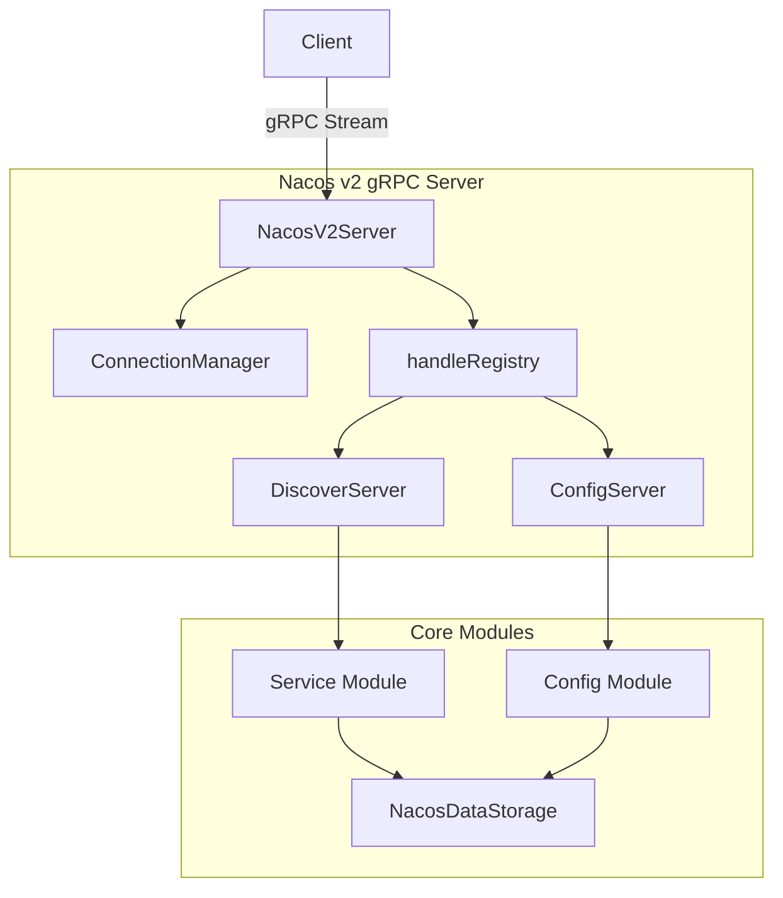
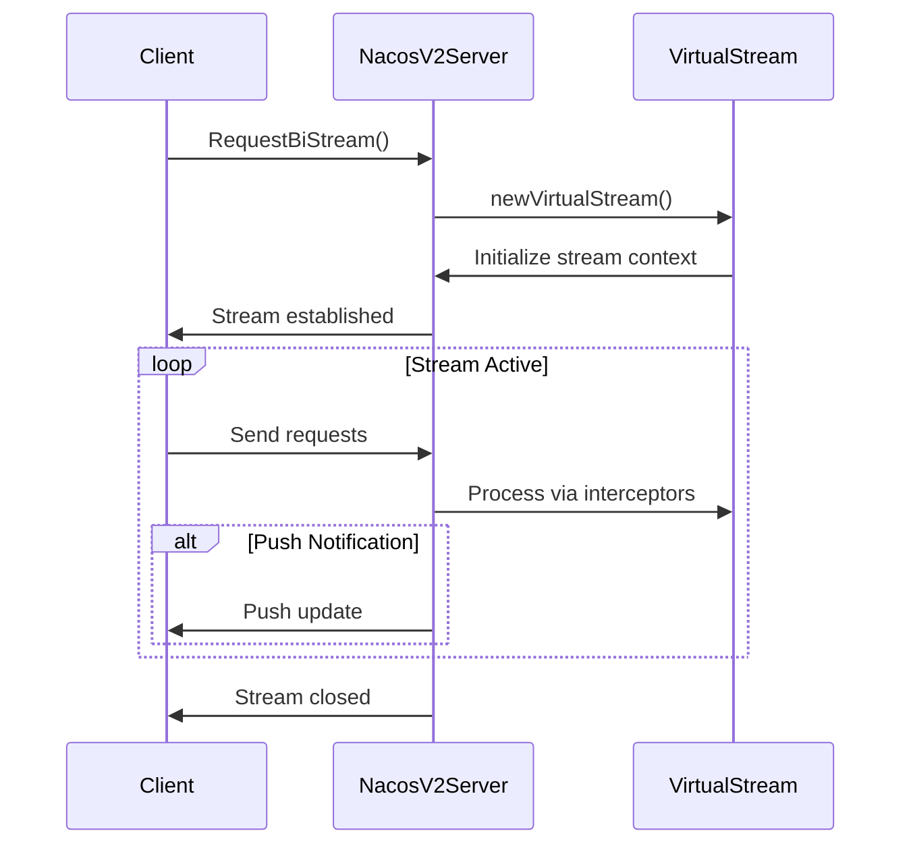
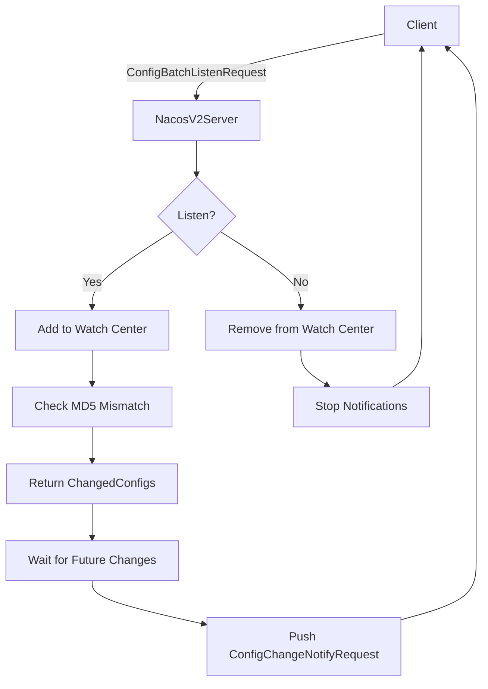
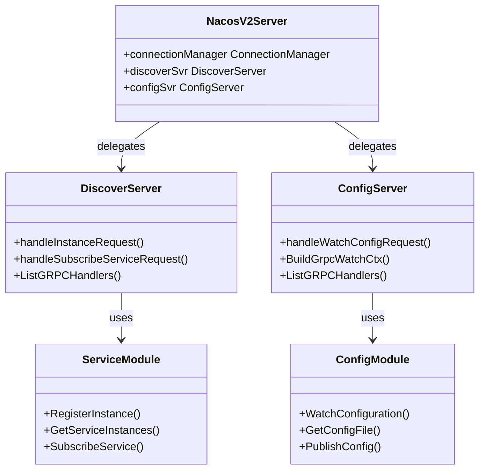

# Nacos v2 gRPC API

<cite>
**Referenced Files in This Document**   
- [server.go](file://plugin/apiserver/nacosserver/v2/server.go)
- [discover/server.go](file://plugin/apiserver/nacosserver/v2/discover/server.go)
- [config/config_file.go](file://plugin/apiserver/nacosserver/v2/config/config_file.go)
- [config/watch.go](file://plugin/apiserver/nacosserver/v2/config/watch.go)
- [remote/client_conn.go](file://plugin/apiserver/nacosserver/v2/remote/client_conn.go)
- [stream.go](file://plugin/apiserver/nacosserver/v2/stream.go)
- [access.go](file://plugin/apiserver/nacosserver/v2/access.go)
- [discover/grpc_push.go](file://plugin/apiserver/nacosserver/v2/discover/grpc_push.go)
- [discover/subscribe.go](file://plugin/apiserver/nacosserver/v2/discover/subscribe.go)
- [pb/request.go](file://plugin/apiserver/nacosserver/v2/pb/request.go)
- [pkg/service/server.go](file://pkg/service/server.go)
- [pkg/config/server.go](file://pkg/config/server.go)
</cite>

## Table of Contents
1. [Introduction](#introduction)
2. [Architecture Overview](#architecture-overview)
3. [gRPC Service Definitions](#grpc-service-definitions)
4. [Bidirectional Streaming Model](#bidirectional-streaming-model)
5. [Service Discovery Mechanism](#service-discovery-mechanism)
6. [Configuration Watch Mechanism](#configuration-watch-mechanism)
7. [Stream Lifecycle Management](#stream-lifecycle-management)
8. [Error Handling](#error-handling)
9. [Internal Mapping to Service and Config Modules](#internal-mapping-to-service-and-config-modules)
10. [Client Implementation Examples](#client-implementation-examples)
11. [Performance and Connection Management](#performance-and-connection-management)
12. [Fault Tolerance and Network Resilience](#fault-tolerance-and-network-resilience)

## Introduction
The Nacos v2 gRPC API in pole-server provides a high-performance, bidirectional communication channel for service discovery and configuration management. This documentation details the implementation of the gRPC-based push model that enables real-time updates for service instances and configuration changes, replacing traditional HTTP polling with efficient streaming mechanisms. The API supports both unary and bidirectional streaming calls, with comprehensive support for client registration, heartbeat management, delta updates, and push-based notifications.

**Section sources**
- [server.go](file://plugin/apiserver/nacosserver/v2/server.go#L53-L108)
- [pb/request.go](file://plugin/apiserver/nacosserver/v2/pb/request.go#L16-L56)

## Architecture Overview
The Nacos v2 gRPC API architecture is built around a central `NacosV2Server` that manages connections, handles requests, and routes them to appropriate service and configuration subsystems. The server uses a connection manager to track client streams and implements both unary and streaming interceptors for metrics collection and error handling. The architecture separates concerns between discovery and configuration domains, each with their own handler registries and processing logic.



**Diagram sources**
- [server.go](file://plugin/apiserver/nacosserver/v2/server.go#L53-L108)
- [discover/server.go](file://plugin/apiserver/nacosserver/v2/discover/server.go#L83-L125)
- [config/config_file.go](file://plugin/apiserver/nacosserver/v2/config/config_file.go#L177-L214)

## gRPC Service Definitions
The Nacos v2 gRPC API defines a set of message types and request/response patterns for service discovery and configuration management. The protocol uses custom payload types identified by string constants that correspond to different operation types. Each request includes metadata such as connection ID, client IP, and labels that are used for routing and access control.

Key message types include:
- **ConnectionSetupRequest**: Establishes a bidirectional stream
- **InstanceRequest**: Registers or updates service instances
- **SubscribeServiceRequest**: Subscribes to service instance changes
- **ConfigBatchListenRequest**: Watches for configuration changes
- **NotifySubscriberRequest**: Pushes service instance updates
- **ConfigChangeNotifyRequest**: Pushes configuration updates

The API uses a generic `CustomerPayload` interface to handle different request types and a `RequestMeta` structure to carry contextual information about the client.

**Section sources**
- [pb/request.go](file://plugin/apiserver/nacosserver/v2/pb/request.go#L16-L56)
- [access.go](file://plugin/apiserver/nacosserver/v2/access.go#L88-L133)

## Bidirectional Streaming Model
The Nacos v2 gRPC API implements a bidirectional streaming model that enables real-time push notifications for both service discovery and configuration changes. Clients establish a persistent connection using the `RequestBiStream` method, which creates a long-lived stream for exchanging messages in both directions.

The streaming model provides several advantages over HTTP polling:
- Reduced latency for change notifications
- Lower network overhead
- Efficient batching of updates
- Built-in flow control and backpressure handling

The server uses a `VirtualStream` abstraction that wraps the gRPC `ServerStream` and adds metadata, preprocessing, and postprocessing capabilities for metrics collection and error handling.



**Diagram sources**
- [server.go](file://plugin/apiserver/nacosserver/v2/server.go#L275-L321)
- [stream.go](file://plugin/apiserver/nacosserver/v2/stream.go#L43-L156)
- [access.go](file://plugin/apiserver/nacosserver/v2/access.go#L88-L133)

## Service Discovery Mechanism
The service discovery mechanism in Nacos v2 gRPC API supports both service instance registration and subscription-based push updates. Clients can register service instances using `InstanceRequest` or `PersistentInstanceRequest` messages, and subscribe to changes using `SubscribeServiceRequest`.

The discovery server maintains a registry of handlers for different request types and routes incoming requests to appropriate handlers. When a client subscribes to a service, the server adds the client as a subscriber to the push center, which will notify the client of any changes to the service instances.

Subscribers are identified by their connection ID and resource (service name and namespace). The push center validates subscriptions and ensures that only valid subscribers receive updates.

**Section sources**
- [discover/server.go](file://plugin/apiserver/nacosserver/v2/discover/server.go#L83-L125)
- [discover/subscribe.go](file://plugin/apiserver/nacosserver/v2/discover/subscribe.go#L83-L102)

## Configuration Watch Mechanism
The configuration watch mechanism allows clients to receive push notifications when configuration files change. Clients send a `ConfigBatchListenRequest` with a list of configurations they want to watch, specifying namespace, group, and data ID for each configuration.

The server processes watch requests by:
1. Creating a watch context for the client
2. Registering the client with the configuration watch center
3. Checking current MD5 values against client's expectations
4. Returning immediate changes in the response
5. Pushing future changes as they occur

When a configuration changes, the watch center notifies all interested clients by sending a `ConfigChangeNotifyRequest` message through their established streams.



**Diagram sources**
- [config/config_file.go](file://plugin/apiserver/nacosserver/v2/config/config_file.go#L177-L260)
- [config/watch.go](file://plugin/apiserver/nacosserver/v2/config/watch.go#L146-L172)

## Stream Lifecycle Management
The Nacos v2 gRPC API implements comprehensive stream lifecycle management to ensure efficient resource utilization and connection health. The `ConnectionManager` tracks all active connections and streams, providing methods to register, unregister, and retrieve client connections.

Key aspects of stream lifecycle management include:
- **Connection Tracking**: Each connection is assigned a unique ID and tracked in a concurrent map
- **Heartbeat Monitoring**: Connections are refreshed on activity and ejected if inactive for 20 seconds
- **Stream Registration**: Clients register their streams during bidirectional communication setup
- **Graceful Shutdown**: Streams are properly closed and resources cleaned up

The server uses gRPC stats handlers to monitor connection events (ConnBegin and ConnEnd) and publish corresponding events to the event hub for further processing.

**Section sources**
- [remote/client_conn.go](file://plugin/apiserver/nacosserver/v2/remote/client_conn.go#L259-L359)
- [server.go](file://plugin/apiserver/nacosserver/v2/server.go#L194-L233)

## Error Handling
The Nacos v2 gRPC API implements a comprehensive error handling system that translates internal errors to appropriate gRPC status codes and Nacos-specific error responses. Errors are handled at multiple levels:

1. **gRPC Level**: Uses gRPC status codes for transport-level errors
2. **Nacos Level**: Translates business logic errors to Nacos error codes
3. **Client Level**: Provides meaningful error messages and codes

The error handling system distinguishes between different types of errors:
- **NacosError**: Business logic errors with specific error codes
- **NacosApiError**: API-level errors with detailed error codes
- **Generic Errors**: Other errors converted to server error codes

Error responses include the result code, error code, success flag, and message, providing clients with sufficient information to handle failures appropriately.

**Section sources**
- [access.go](file://plugin/apiserver/nacosserver/v2/access.go#L88-L133)
- [server.go](file://plugin/apiserver/nacosserver/v2/server.go#L275-L321)

## Internal Mapping to Service and Config Modules
The Nacos v2 gRPC API acts as a bridge between the gRPC protocol and the internal service and configuration modules. The `NacosV2Server` initializes separate `DiscoverServer` and `ConfigServer` instances that interface with the core service and config modules.

For service discovery:
- gRPC requests are mapped to operations in the `pkg/service` module
- Instance operations are handled by the service server
- Subscription management is coordinated with the discovery push center

For configuration management:
- gRPC requests are mapped to operations in the `pkg/config` module
- Configuration watches are managed by the config watch center
- Change notifications are pushed through the established streams

The mapping is configured during server initialization, where the `NacosV2Server` passes the shared `NacosDataStorage` and `ConnectionManager` to both the discovery and config servers.



**Diagram sources**
- [server.go](file://plugin/apiserver/nacosserver/v2/server.go#L53-L108)
- [pkg/service/server.go](file://pkg/service/server.go)
- [pkg/config/server.go](file://pkg/config/server.go)

## Client Implementation Examples
### Establishing a gRPC Connection
Clients establish a bidirectional gRPC connection using the `RequestBiStream` method. The connection is maintained for the lifetime of the client and used for both sending requests and receiving push notifications.

```go
conn, err := grpc.Dial(address, grpc.WithTransportCredentials(credentials))
if err != nil {
    // handle error
}
defer conn.Close()

client := nacospb.NewRequestBiStreamClient(conn)
stream, err := client.RequestBiStream(context.Background())
if err != nil {
    // handle error
}
```

### Subscribing to Service Instances
Clients can subscribe to service instance changes by sending a `SubscribeServiceRequest` through the established stream.

```go
subscribeReq := &nacospb.SubscribeServiceRequest{
    ServiceName: "my-service",
    GroupName:   "DEFAULT_GROUP",
    Namespace:   "public",
    // other fields
}

err := stream.Send(&nacospb.BaseRequest{
    Type:    nacospb.TypeSubscribeServiceRequest,
    Payload: subscribeReq,
})
```

### Handling Configuration Change Notifications
Clients receive configuration change notifications as `ConfigChangeNotifyRequest` messages on their bidirectional stream.

```go
for {
    resp, err := stream.Recv()
    if err != nil {
        // handle stream error
        break
    }
    
    switch resp.Type {
    case nacospb.TypeConfigChangeNotifyRequest:
        notifyReq := resp.Payload.(*nacospb.ConfigChangeNotifyRequest)
        // handle configuration change
        processConfigChange(notifyReq)
    // handle other message types
    }
}
```

**Section sources**
- [server.go](file://plugin/apiserver/nacosserver/v2/server.go#L323-L365)
- [config/watch.go](file://plugin/apiserver/nacosserver/v2/config/watch.go#L146-L172)
- [discover/subscribe.go](file://plugin/apiserver/nacosserver/v2/discover/subscribe.go#L83-L102)

## Performance and Connection Management
The Nacos v2 gRPC API includes several performance optimizations and connection management features:

- **Connection Limiting**: Configurable limits on maximum connections per host and total connections
- **Keep-Alive**: Built-in keep-alive mechanism to detect stale connections
- **Backpressure Handling**: gRPC's built-in flow control manages backpressure
- **Metrics Collection**: Comprehensive metrics for call duration, success rates, and error codes
- **Rate Limiting**: Optional rate limiting at the API level

The server uses a connection manager that periodically ejects outdated connections (inactive for more than 20 seconds) and can enforce connection limits based on configuration. This ensures that the server maintains optimal performance even under high load.

**Section sources**
- [server.go](file://plugin/apiserver/nacosserver/v2/server.go#L194-L233)
- [remote/client_conn.go](file://plugin/apiserver/nacosserver/v2/remote/client_conn.go#L303-L359)
- [server.go](file://plugin/apiserver/nacosserver/v2/server.go#L323-L365)

## Fault Tolerance and Network Resilience
The Nacos v2 gRPC API implements several mechanisms to ensure fault tolerance and resilience during network partitions:

- **Connection Recovery**: Clients can re-establish streams after network interruptions
- **State Synchronization**: On reconnection, clients receive current state before incremental updates
- **Idempotent Operations**: Service registration and configuration operations are idempotent
- **Heartbeat Mechanism**: Regular health checks ensure service instance liveness
- **Graceful Degradation**: The system continues to serve cached data when backend storage is unavailable

The push center maintains subscriber state and automatically removes stale subscribers when connections are closed. This ensures that the system remains consistent even during network disruptions.

**Section sources**
- [remote/client_conn.go](file://plugin/apiserver/nacosserver/v2/remote/client_conn.go#L303-L359)
- [discover/grpc_push.go](file://plugin/apiserver/nacosserver/v2/discover/grpc_push.go#L48-L96)
- [server.go](file://plugin/apiserver/nacosserver/v2/server.go#L275-L321)