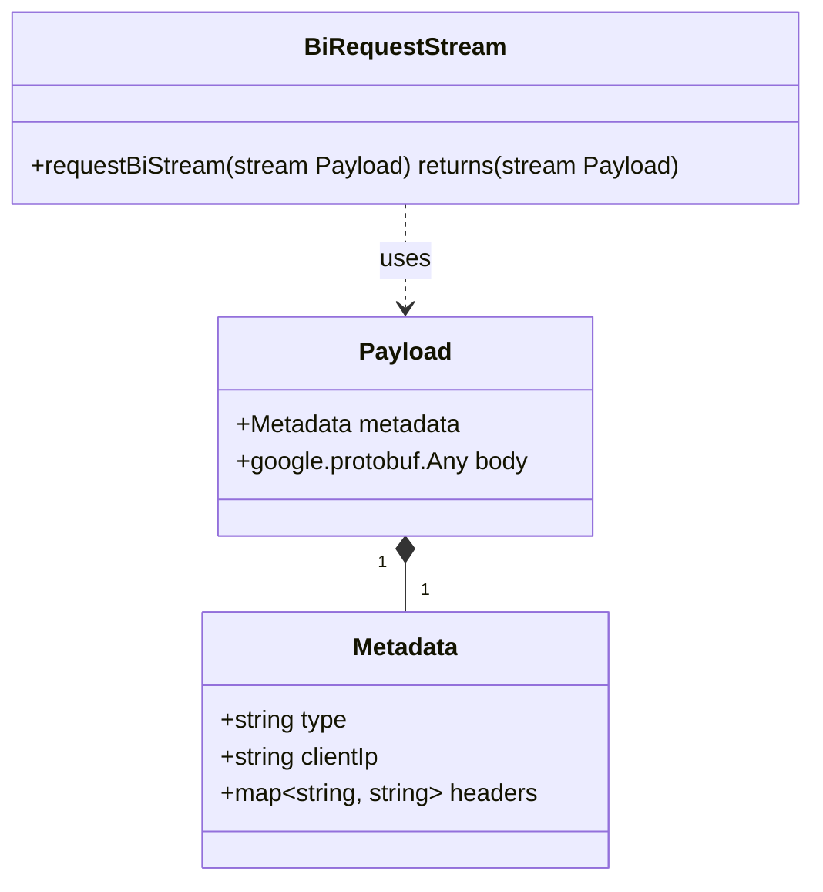
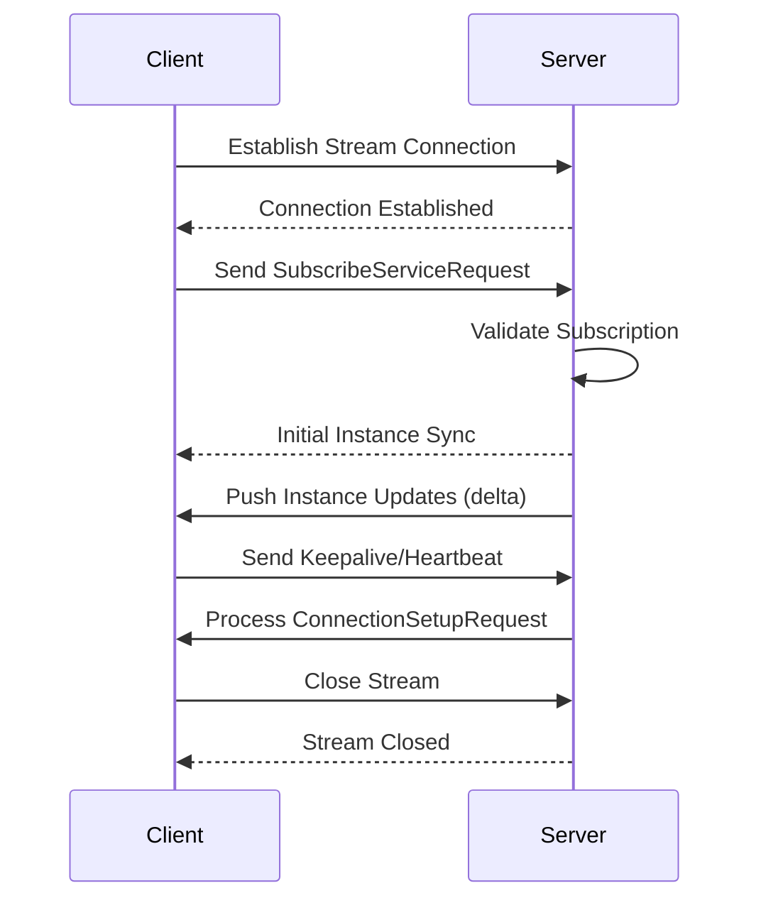
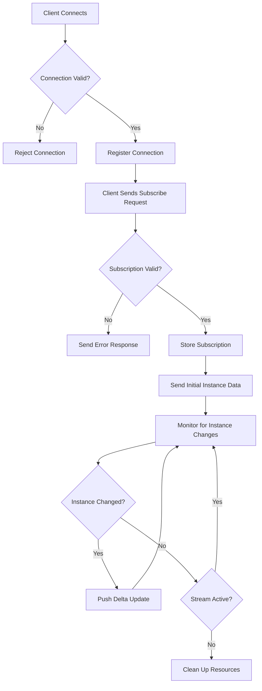
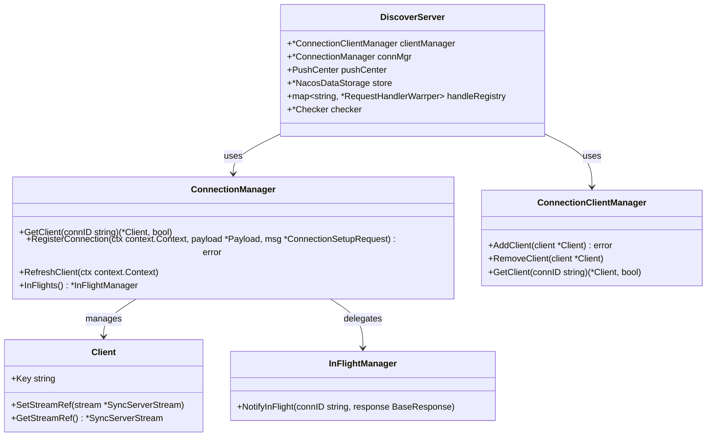
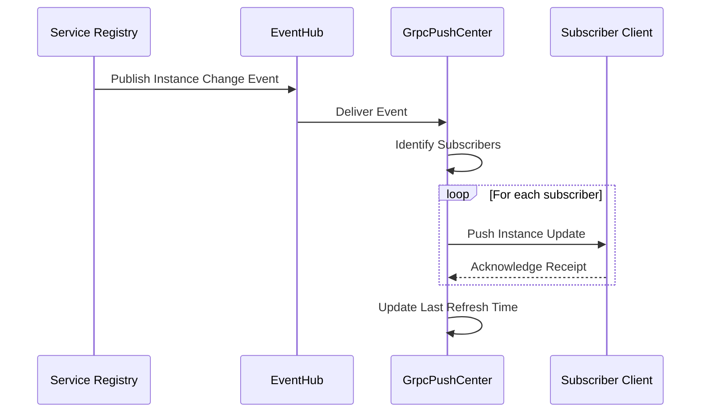
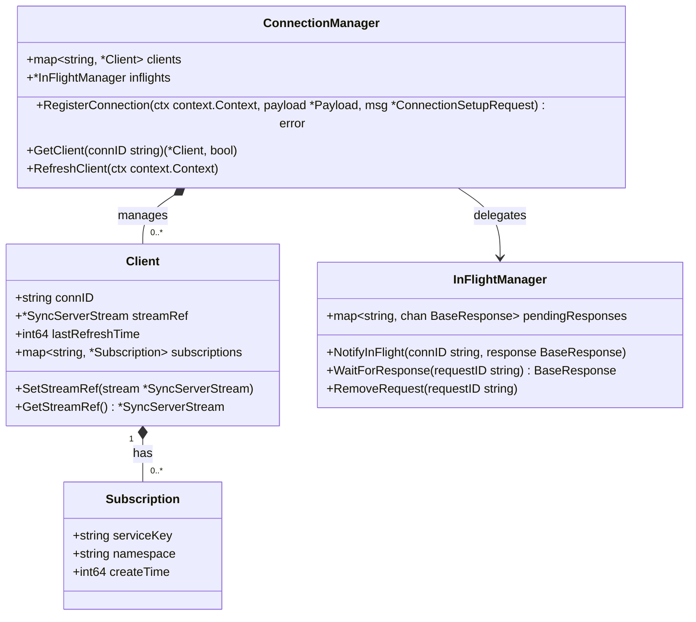
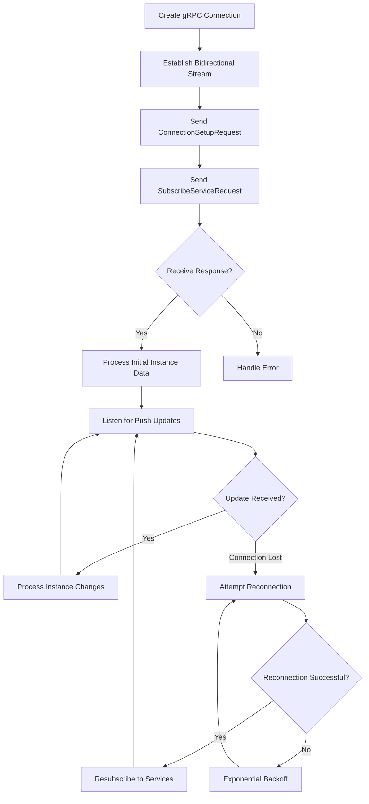
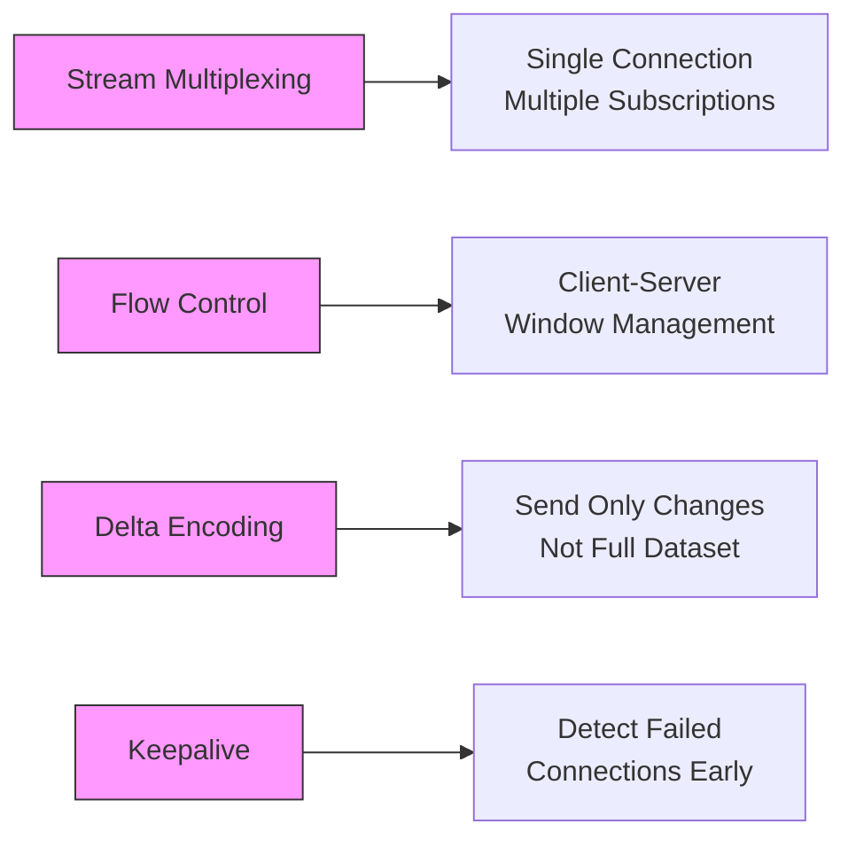
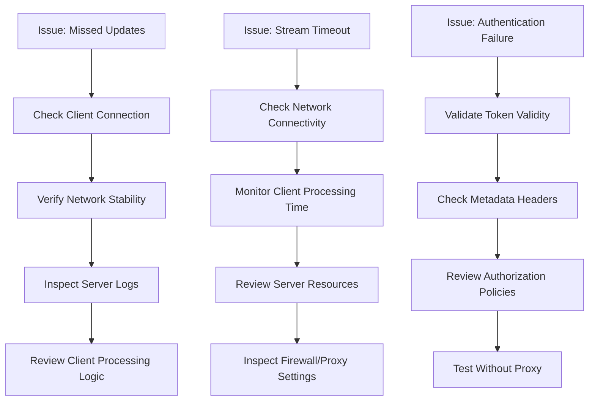

# Service Discovery

<cite>
**Referenced Files in This Document**   
- [nacos_grpc_service.proto](file://plugin/apiserver/nacosserver/v2/pb/nacos_grpc_service.proto)
- [server.go](file://plugin/apiserver/nacosserver/v2/server.go)
- [discover/server.go](file://plugin/apiserver/nacosserver/v2/discover/server.go)
- [discover/grpc_push.go](file://plugin/apiserver/nacosserver/v2/discover/grpc_push.go)
- [access.go](file://plugin/apiserver/nacosserver/v2/access.go)
</cite>

## Table of Contents
1. [Introduction](#introduction)
2. [gRPC Service Definition](#grpc-service-definition)
3. [Bidirectional Streaming Model](#bidirectional-streaming-model)
4. [Discovery Stream Lifecycle](#discovery-stream-lifecycle)
5. [Subscription Management](#subscription-management)
6. [Push-Based Notification System](#push-based-notification-system)
7. [Client State and Inflight Management](#client-state-and-inflight-management)
8. [Code Examples](#code-examples)
9. [Performance Considerations](#performance-considerations)
10. [Troubleshooting Guide](#troubleshooting-guide)

## Introduction
The Nacos v2 gRPC Service Discovery implementation in pole-server provides a real-time, bidirectional streaming interface for service discovery operations. This system enables clients to subscribe to service instances and receive immediate push updates when changes occur, eliminating the need for polling. The implementation follows the Nacos v2 gRPC protocol specification and integrates with pole-server's internal service registry and event distribution system.

**Section sources**
- [server.go](file://plugin/apiserver/nacosserver/v2/server.go#L53-L108)
- [discover/server.go](file://plugin/apiserver/nacosserver/v2/discover/server.go#L42-L55)

## gRPC Service Definition
The service discovery functionality is defined in the `nacos_grpc_service.proto` file, which specifies the bidirectional streaming interface for service discovery operations. The core service is `BiRequestStream` which enables full-duplex communication between clients and server.

**Diagram sources**
- [nacos_grpc_service.proto](file://plugin/apiserver/nacosserver/v2/pb/nacos_grpc_service.proto#L0-L42)

The service supports various request types identified by the `type` field in the Metadata, including:
- `SubscribeServiceRequest`: For subscribing to service instance changes
- `InstanceRequest`: For querying service instances
- `BatchInstanceRequest`: For batch querying of service instances
- `ConnectionSetupRequest`: For establishing the initial connection

**Section sources**
- [nacos_grpc_service.proto](file://plugin/apiserver/nacosserver/v2/pb/nacos_grpc_service.proto#L0-L42)

## Bidirectional Streaming Model
The bidirectional streaming model allows clients to establish a persistent connection with the server and receive real-time updates about service instance changes. This model provides several advantages over traditional request-response patterns:

- **Real-time updates**: Clients receive instance changes immediately via push notifications
- **Reduced latency**: Eliminates polling intervals and associated delays
- **Efficient resource usage**: Single connection can handle multiple subscriptions
- **Stateful communication**: Server maintains client context and subscription state

The streaming model is implemented using gRPC's bidirectional streaming capability, where both client and server can send multiple messages in any order over a single connection.

**Diagram sources**
- [access.go](file://plugin/apiserver/nacosserver/v2/access.go#L134-L205)
- [discover/server.go](file://plugin/apiserver/nacosserver/v2/discover/server.go#L42-L145)

**Section sources**
- [access.go](file://plugin/apiserver/nacosserver/v2/access.go#L134-L205)
- [discover/server.go](file://plugin/apiserver/nacosserver/v2/discover/server.go#L42-L145)

## Discovery Stream Lifecycle
The lifecycle of a discovery stream consists of several phases: connection establishment, subscription validation, initial synchronization, delta updates, and disconnection handling.

### Connection Establishment
When a client establishes a bidirectional stream, the server registers the connection in the ConnectionManager and sets up the stream reference for the client.

### Initial Synchronization
After a successful subscription request, the server performs an initial synchronization by sending the complete set of current instances for the requested service.

### Delta Updates via grpc_push
The server uses the grpc_push system to deliver incremental updates to subscribed clients whenever service instances change. This ensures clients receive only the changes (deltas) rather than the entire dataset.

### Disconnection Handling
The system properly handles both graceful and abrupt disconnections. When a stream is closed, the server cleans up the client's subscriptions and removes it from the active connections registry.

**Diagram sources**
- [access.go](file://plugin/apiserver/nacosserver/v2/access.go#L134-L205)
- [discover/grpc_push.go](file://plugin/apiserver/nacosserver/v2/discover/grpc_push.go#L0-L97)

**Section sources**
- [access.go](file://plugin/apiserver/nacosserver/v2/access.go#L134-L205)
- [discover/grpc_push.go](file://plugin/apiserver/nacosserver/v2/discover/grpc_push.go#L0-L97)

## Subscription Management
The system validates subscriptions through a multi-step process that ensures clients have proper authorization and the requested services exist in the registry.

### Subscription Validation
When a client sends a SubscribeServiceRequest, the server validates:
- Client authentication and authorization
- Service namespace existence
- Service name validity
- Client IP and metadata

### Inflight Management
The ConnectionManager maintains client state through inflight tracking, which allows the server to:
- Track active subscriptions per client
- Manage request-response correlation
- Handle acknowledgments for push notifications
- Prevent duplicate processing of requests

**Diagram sources**
- [discover/server.go](file://plugin/apiserver/nacosserver/v2/discover/server.go#L42-L55)
- [access.go](file://plugin/apiserver/nacosserver/v2/access.go#L88-L133)

**Section sources**
- [discover/server.go](file://plugin/apiserver/nacosserver/v2/discover/server.go#L42-L55)
- [access.go](file://plugin/apiserver/nacosserver/v2/access.go#L88-L133)

## Push-Based Notification System
The push-based notification system is the core mechanism for delivering real-time service instance updates to subscribed clients.

### grpc_push Implementation
The GrpcPushCenter implements the push center interface and manages subscribers for gRPC-based push notifications. It integrates with the eventhub system to receive service instance change events.

### Push Data Flow
When a service instance changes, the following sequence occurs:
1. The change is detected by the system
2. An event is published to the eventhub
3. The GrpcPushCenter receives the event
4. The push center identifies all subscribers to the affected service
5. Delta updates are sent to each subscribed client

**Diagram sources**
- [discover/grpc_push.go](file://plugin/apiserver/nacosserver/v2/discover/grpc_push.go#L0-L97)
- [discover/server.go](file://plugin/apiserver/nacosserver/v2/discover/server.go#L42-L145)

**Section sources**
- [discover/grpc_push.go](file://plugin/apiserver/nacosserver/v2/discover/grpc_push.go#L0-L97)

## Client State and Inflight Management
The system maintains detailed client state to ensure reliable message delivery and proper handling of network disruptions.

### Connection State Management
The ConnectionManager tracks each client's connection state, including:
- Connection ID and metadata
- Stream reference for push operations
- Last refresh time for keepalive detection
- Active subscriptions

### Inflight Request Tracking
The inflight system tracks pending requests and responses, allowing the server to:
- Correlate requests with their responses
- Handle acknowledgments for push notifications
- Manage timeout and retry logic
- Prevent message loss during network interruptions

**Diagram sources**
- [access.go](file://plugin/apiserver/nacosserver/v2/access.go#L88-L133)
- [discover/server.go](file://plugin/apiserver/nacosserver/v2/discover/server.go#L42-L55)

**Section sources**
- [access.go](file://plugin/apiserver/nacosserver/v2/access.go#L88-L133)
- [discover/server.go](file://plugin/apiserver/nacosserver/v2/discover/server.go#L42-L55)

## Code Examples
The following examples demonstrate how to interact with the Nacos v2 gRPC service discovery system.

### Subscribing to a Service
Clients can subscribe to service instance changes by sending a SubscribeServiceRequest over the bidirectional stream.

### Handling Instance Push Events
Clients receive instance updates through the stream and should implement proper handling for both full syncs and delta updates.

### Managing Reconnections
Clients should implement reconnection logic to handle network failures and maintain subscription continuity.

**Diagram sources**
- [access.go](file://plugin/apiserver/nacosserver/v2/access.go#L134-L205)
- [discover/server.go](file://plugin/apiserver/nacosserver/v2/discover/server.go#L42-L145)

**Section sources**
- [access.go](file://plugin/apiserver/nacosserver/v2/access.go#L134-L205)
- [discover/server.go](file://plugin/apiserver/nacosserver/v2/discover/server.go#L42-L145)

## Performance Considerations
The system incorporates several performance optimizations to handle high-volume service discovery traffic efficiently.

### Stream Multiplexing
A single bidirectional stream can carry multiple subscription requests and responses, reducing the overhead of maintaining multiple connections.

### Backpressure via Flow Control
The gRPC framework provides built-in flow control mechanisms that prevent overwhelming clients with too many push notifications.

### Efficient Delta Encoding
The system sends only the changes (deltas) to service instances rather than the complete dataset, minimizing network bandwidth usage.

### Connection Keepalive
Regular keepalive messages ensure connection health and allow for timely detection of failed connections.

**Diagram sources**
- [access.go](file://plugin/apiserver/nacosserver/v2/access.go#L134-L205)
- [discover/grpc_push.go](file://plugin/apiserver/nacosserver/v2/discover/grpc_push.go#L0-L97)

**Section sources**
- [access.go](file://plugin/apiserver/nacosserver/v2/access.go#L134-L205)
- [discover/grpc_push.go](file://plugin/apiserver/nacosserver/v2/discover/grpc_push.go#L0-L97)

## Troubleshooting Guide
This section addresses common issues encountered when using the Nacos v2 gRPC service discovery system.

### Missed Updates
If clients are missing instance updates, check:
- Client connection stability
- Network connectivity between client and server
- Server-side push center functionality
- Client processing logic for incoming messages

### Stream Timeouts
Stream timeouts can occur due to:
- Network interruptions
- Client processing delays
- Server resource constraints
- Firewall or proxy interference

### Authentication Failures
Authentication failures may result from:
- Invalid or expired tokens
- Incorrect client metadata
- Authorization policy changes
- Network proxy altering headers

**Diagram sources**
- [access.go](file://plugin/apiserver/nacosserver/v2/access.go#L88-L133)
- [discover/server.go](file://plugin/apiserver/nacosserver/v2/discover/server.go#L42-L55)

**Section sources**
- [access.go](file://plugin/apiserver/nacosserver/v2/access.go#L88-L133)
- [discover/server.go](file://plugin/apiserver/nacosserver/v2/discover/server.go#L42-L55)