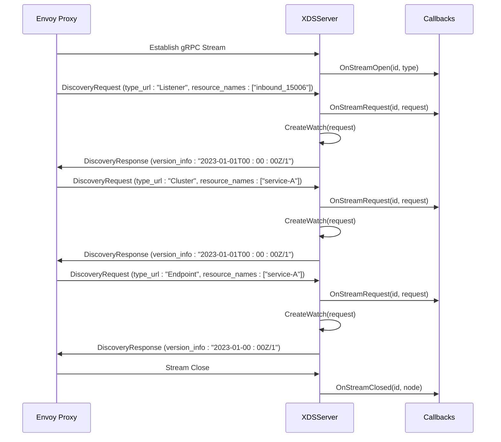
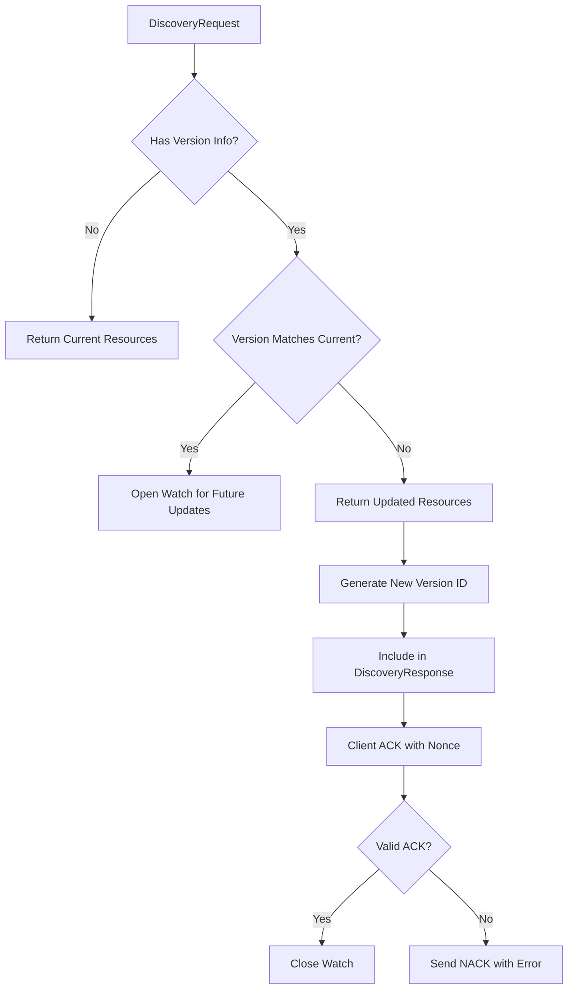
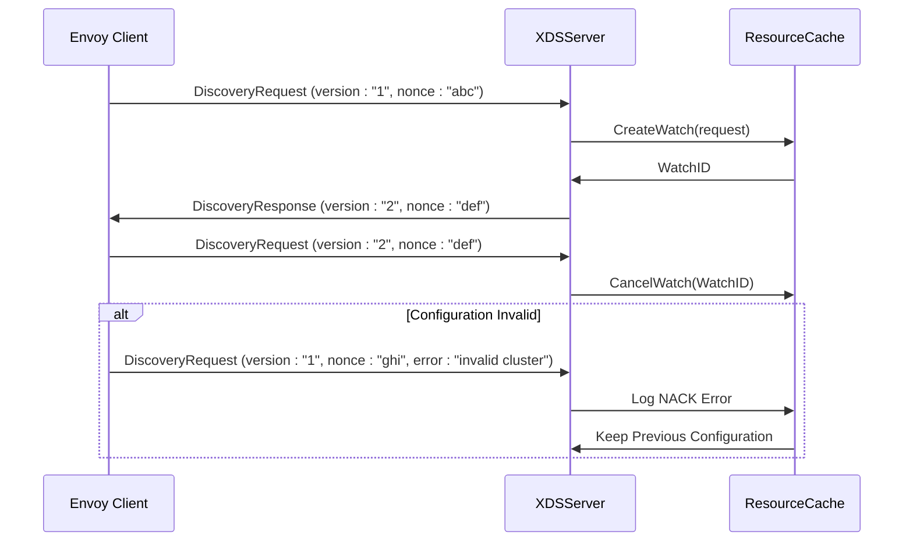
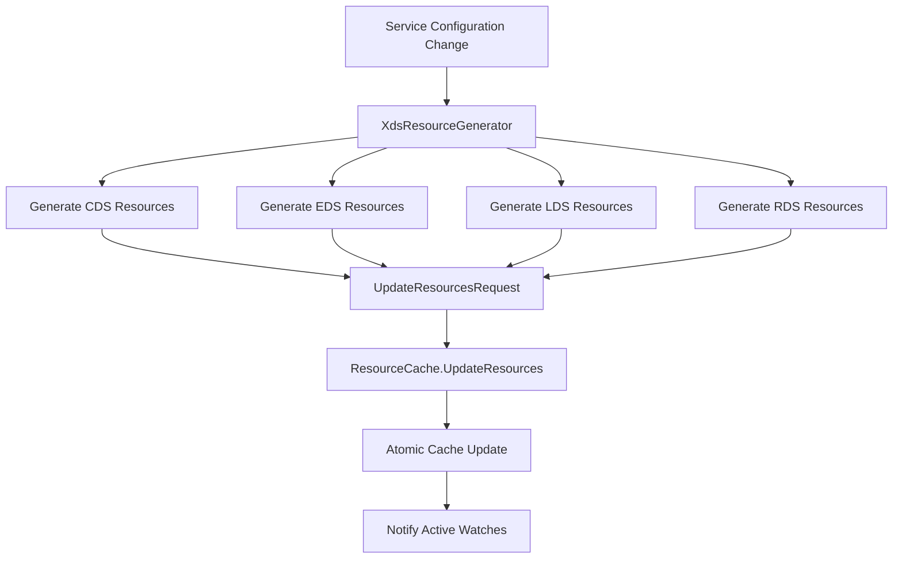
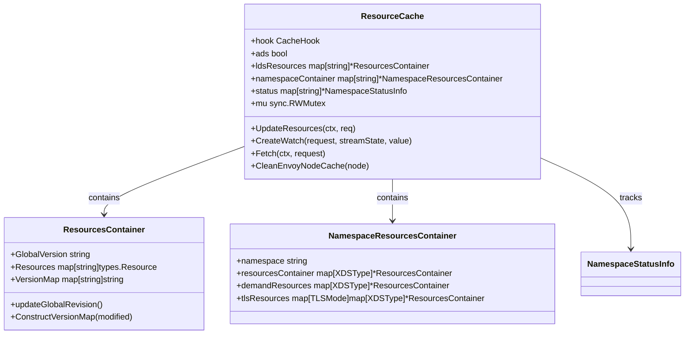
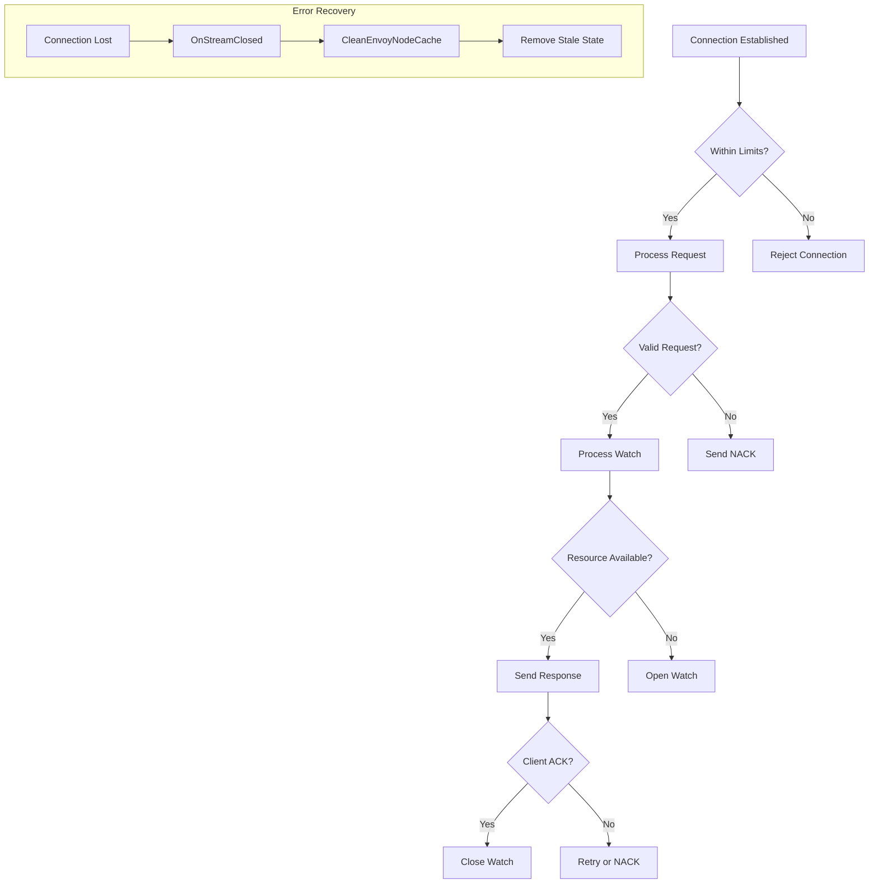
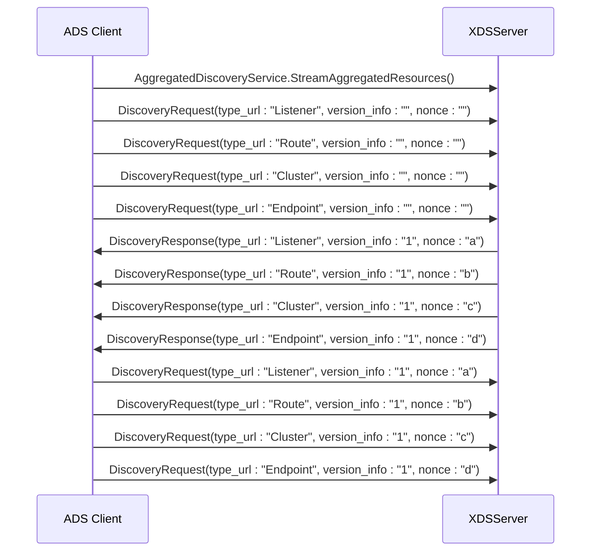
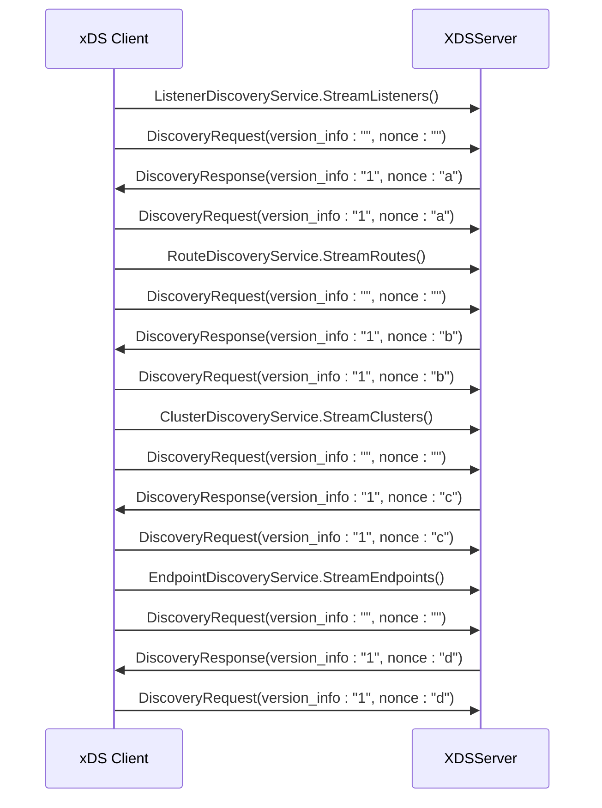
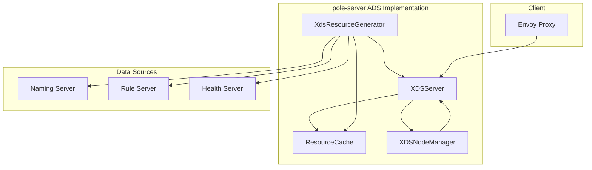

# ADS (Aggregated Discovery Service)

<cite>
**Referenced Files in This Document**   
- [server.go](file://plugin/apiserver/xdsserverv3/server.go)
- [cache.go](file://plugin/apiserver/xdsserverv3/cache/cache.go)
- [callback.go](file://plugin/apiserver/xdsserverv3/cache/callback.go)
- [model.go](file://plugin/apiserver/xdsserverv3/resource/model.go)
- [node.go](file://plugin/apiserver/xdsserverv3/resource/node.go)
- [generate.go](file://plugin/apiserver/xdsserverv3/generate.go)
- [lds.go](file://plugin/apiserver/xdsserverv3/lds.go)
- [rds.go](file://plugin/apiserver/xdsserverv3/rds.go)
- [eds.go](file://plugin/apiserver/xdsserverv3/eds.go)
- [cds.go](file://plugin/apiserver/xdsserverv3/cds.go)
</cite>

## Table of Contents
1. [Introduction](#introduction)
2. [ADS Stream Multiplexing and Connection Management](#ads-stream-multiplexing-and-connection-management)
3. [ADS Request/Response Structure and Versioning](#ads-requestresponse-structure-and-versioning)
4. [ACK/NACK Handling and Resource Synchronization](#acknack-handling-and-resource-synchronization)
5. [Consistency Management Across Related Resources](#consistency-management-across-related-resources)
6. [Cache Coordination and Resource Invalidation](#cache-coordination-and-resource-invalidation)
7. [Flow Control and Error Recovery](#flow-control-and-error-recovery)
8. [Client Implementation Examples](#client-implementation-examples)
9. [Architecture Overview](#architecture-overview)

## Introduction

The Aggregated Discovery Service (ADS) in pole-server provides a unified gRPC interface for Envoy proxies to discover and configure service mesh components including Cluster Discovery Service (CDS), Endpoint Discovery Service (EDS), Listener Discovery Service (LDS), and Route Discovery Service (RDS). This implementation enables efficient configuration delivery by multiplexing multiple discovery streams over a single persistent gRPC connection, reducing connection overhead and improving configuration consistency across distributed service instances.

The ADS implementation in pole-server follows the Envoy xDS v3 API specification and provides advanced features including connection multiplexing, resource versioning, cache coordination, and consistent updates across related resources. The system is designed to handle high-volume, long-lived connections from Envoy proxies while maintaining strong consistency guarantees and efficient resource utilization.

**Section sources**
- [server.go](file://plugin/apiserver/xdsserverv3/server.go#L1-L50)

## ADS Stream Multiplexing and Connection Management

The ADS implementation in pole-server enables multiple discovery streams (CDS, EDS, LDS, RDS) to be multiplexed over a single gRPC connection through the Aggregated Discovery Service protocol. This approach reduces the number of connections required between Envoy proxies and the control plane, improving scalability and reducing resource consumption.

When an Envoy proxy establishes a connection to the ADS server, it creates a persistent bidirectional streaming gRPC connection. The `XDSServer` struct manages these connections through its gRPC server instance, with connection limits configurable via the `connLimitConfig` parameter. Each connection is associated with an Envoy node identified by its node ID, which contains metadata specifying the proxy's role (sidecar or gateway), namespace, and TLS mode.

The connection lifecycle is managed through the `Run` method of the `XDSServer`, which initializes the gRPC server with appropriate options including maximum concurrent streams. Connection termination is handled by the `Stop` method, which gracefully shuts down the server. The system also supports connection restart through the `Restart` method, allowing configuration updates without service interruption.

**Diagram sources**
- [server.go](file://plugin/apiserver/xdsserverv3/server.go#L200-L250)
- [callback.go](file://plugin/apiserver/xdsserverv3/cache/callback.go#L30-L70)

**Section sources**
- [server.go](file://plugin/apiserver/xdsserverv3/server.go#L150-L300)
- [callback.go](file://plugin/apiserver/xdsserverv3/cache/callback.go#L30-L80)

## ADS Request/Response Structure and Versioning

The ADS implementation in pole-server follows the standard xDS discovery request/response pattern with specific enhancements for aggregated discovery. Each discovery request includes a type URL identifying the resource type (e.g., "type.googleapis.com/envoy.config.listener.v3.Listener"), a list of requested resource names, and a version information string representing the client's current configuration version.

The response structure includes the requested resources, a new version identifier, and a nonce for acknowledgment tracking. The versioning system in pole-server uses RFC3339 timestamps combined with an incrementing counter to ensure globally unique version identifiers. This approach provides chronological ordering while preventing version collisions in distributed environments.

Version assignment occurs when the `ResourceCache` generates a response. The `GlobalVersion` field in the `ResourcesContainer` struct is updated with a new UUID for each configuration change, ensuring that clients can detect configuration updates by comparing version strings. The versioning system supports both state-of-the-world (SOTW) and delta xDS protocols, with the ADS flag enabling ordered delivery of resources.

**Diagram sources**
- [cache.go](file://plugin/apiserver/xdsserverv3/cache/cache.go#L500-L600)
- [server.go](file://plugin/apiserver/xdsserverv3/server.go#L200-L250)

**Section sources**
- [cache.go](file://plugin/apiserver/xdsserverv3/cache/cache.go#L450-L650)
- [server.go](file://plugin/apiserver/xdsserverv3/server.go#L180-L220)

## ACK/NACK Handling and Resource Synchronization

The ADS implementation in pole-server provides robust acknowledgment (ACK) and negative acknowledgment (NACK) handling to ensure reliable configuration delivery and synchronization across discovery streams. When a client receives a discovery response, it must acknowledge the update by sending a new request with the same version_info and a unique nonce. If the configuration is invalid or cannot be applied, the client sends a NACK with an error message.

The `ResourceCache` component manages the acknowledgment process through its watch mechanism. When a client acknowledges a configuration update, the corresponding watch is canceled, indicating that the client has successfully applied the configuration. If a NACK is received, the server logs the error and may retain the previous configuration until a valid update is available.

Resource synchronization across different discovery types (CDS, EDS, LDS, RDS) is achieved through atomic updates to the resource cache. The `UpdateResources` method in `ResourceCache` ensures that all related resources are updated together, preventing inconsistent states where, for example, a cluster references endpoints that have not yet been delivered.

**Diagram sources**
- [cache.go](file://plugin/apiserver/xdsserverv3/cache/cache.go#L600-L800)
- [server.go](file://plugin/apiserver/xdsserverv3/server.go#L250-L300)

**Section sources**
- [cache.go](file://plugin/apiserver/xdsserverv3/cache/cache.go#L550-L750)

## Consistency Management Across Related Resources

The ADS implementation in pole-server ensures consistency between related resources during updates through a coordinated resource generation and update process. When service configuration changes occur (such as service instances, routing rules, or circuit breaker policies), the system updates all dependent xDS resources atomically to prevent configuration drift.

The consistency mechanism is implemented in the `XdsResourceGenerator` component, which coordinates the generation of CDS, EDS, LDS, and RDS resources for both sidecar and gateway proxies. When a configuration change is detected, the generator creates a unified update request containing all affected resources, which is then applied to the resource cache in a single transaction.

For sidecar proxies, the system ensures that inbound and outbound configurations are consistent with the service's current state. For example, when a service's routing rules are updated, the generator updates both the inbound RDS configuration (for incoming requests) and the outbound RDS configuration (for outgoing requests to other services) simultaneously.

**Diagram sources**
- [generate.go](file://plugin/apiserver/xdsserverv3/generate.go#L50-L150)
- [cache.go](file://plugin/apiserver/xdsserverv3/cache/cache.go#L300-L400)

**Section sources**
- [generate.go](file://plugin/apiserver/xdsserverv3/generate.go#L30-L200)

## Cache Coordination and Resource Invalidation

The ADS implementation in pole-server employs a sophisticated caching architecture to coordinate resource delivery and handle invalidation efficiently. The `ResourceCache` component maintains separate resource containers for each namespace and TLS mode, allowing for fine-grained cache management and reducing memory overhead.

Cache coordination occurs through the `UpdateResources` method, which processes resource updates and invalidations across multiple namespaces and resource types. When a service is deleted or modified, the system identifies all dependent resources (clusters, endpoints, listeners, routes) and marks them for removal or update in the next configuration push.

Resource invalidation is handled through the `CleanEnvoyNodeCache` method, which removes all cached resources associated with a specific Envoy node when the connection is closed. This prevents stale configuration from being delivered to new connections with the same node ID.

The cache also supports on-demand resource delivery through the VHDS (Virtual Host Discovery Service) protocol, allowing Envoy proxies to request specific virtual hosts only when needed. This feature reduces the initial configuration payload and improves startup performance for proxies that only need a subset of available services.

**Diagram sources**
- [cache.go](file://plugin/apiserver/xdsserverv3/cache/cache.go#L100-L300)
- [model.go](file://plugin/apiserver/xdsserverv3/resource/model.go#L100-L150)

**Section sources**
- [cache.go](file://plugin/apiserver/xdsserverv3/cache/cache.go#L50-L400)

## Flow Control and Error Recovery

The ADS implementation in pole-server incorporates comprehensive flow control and error recovery mechanisms to ensure reliable operation under various network conditions and system loads. The system uses gRPC's built-in flow control mechanisms combined with custom connection limiting to prevent resource exhaustion.

Flow control is implemented at multiple levels:
1. Connection-level limiting through the `connLimitConfig` parameter
2. Stream-level limiting via `grpc.MaxConcurrentStreams(1000)`
3. Watch-level limiting through atomic counters in the `ResourceCache`

Error recovery is handled through several mechanisms:
- Connection restart capability via the `Restart` method
- Graceful shutdown and cleanup in the `Stop` method
- Automatic cleanup of stale watches and node state
- Comprehensive logging and error reporting

The system also implements a heartbeat mechanism through the `startSynTask` function, which periodically synchronizes the control plane state with the underlying service registry. This ensures that configuration updates are delivered promptly and that stale resources are removed.

**Diagram sources**
- [server.go](file://plugin/apiserver/xdsserverv3/server.go#L250-L400)
- [cache.go](file://plugin/apiserver/xdsserverv3/cache/cache.go#L700-L800)

**Section sources**
- [server.go](file://plugin/apiserver/xdsserverv3/server.go#L250-L400)
- [callback.go](file://plugin/apiserver/xdsserverv3/cache/callback.go#L60-L80)

## Client Implementation Examples

The ADS implementation in pole-server supports both aggregated and individual discovery service patterns, providing flexibility for different deployment scenarios.

For clients using the aggregated discovery service, a single gRPC stream is established to receive all configuration types:

For clients using individual discovery services, separate gRPC streams are established for each resource type:

The ADS approach reduces connection overhead and ensures atomic updates across resource types, while individual discovery services provide simpler implementation and easier debugging.

**Diagram sources**
- [server.go](file://plugin/apiserver/xdsserverv3/server.go#L100-L150)
- [cache.go](file://plugin/apiserver/xdsserverv3/cache/cache.go#L600-L700)

**Section sources**
- [server.go](file://plugin/apiserver/xdsserverv3/server.go#L80-L150)

## Architecture Overview

The ADS implementation in pole-server follows a modular architecture with clear separation of concerns between connection handling, resource management, and configuration generation.

The architecture consists of several key components:
- **XDSServer**: Manages the gRPC server lifecycle and connection handling
- **ResourceCache**: Stores and manages xDS resources with versioning and watch mechanisms
- **XdsResourceGenerator**: Generates xDS configuration from service registry data
- **XDSNodeManager**: Tracks connected Envoy nodes and their metadata
- **Callbacks**: Handles stream lifecycle events and logging

This architecture enables efficient, scalable delivery of service mesh configuration while maintaining strong consistency and reliability guarantees.

**Diagram sources**
- [server.go](file://plugin/apiserver/xdsserverv3/server.go#L1-L50)
- [generate.go](file://plugin/apiserver/xdsserverv3/generate.go#L1-L30)
- [cache.go](file://plugin/apiserver/xdsserverv3/cache/cache.go#L1-L50)

**Section sources**
- [server.go](file://plugin/apiserver/xdsserverv3/server.go#L1-L50)
- [generate.go](file://plugin/apiserver/xdsserverv3/generate.go#L1-L30)
- [cache.go](file://plugin/apiserver/xdsserverv3/cache/cache.go#L1-L50)