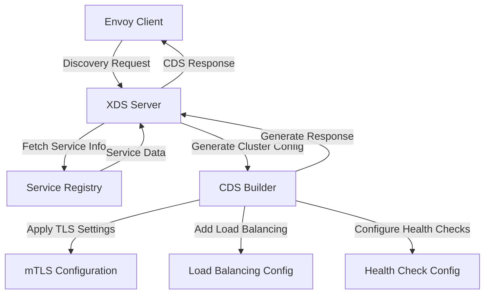
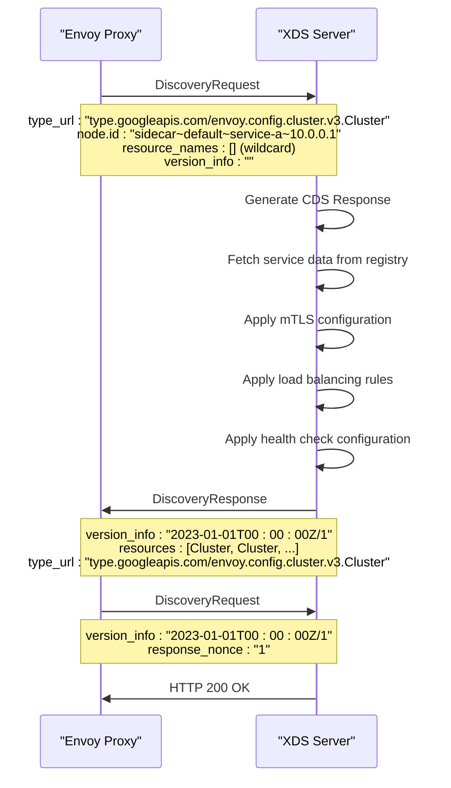
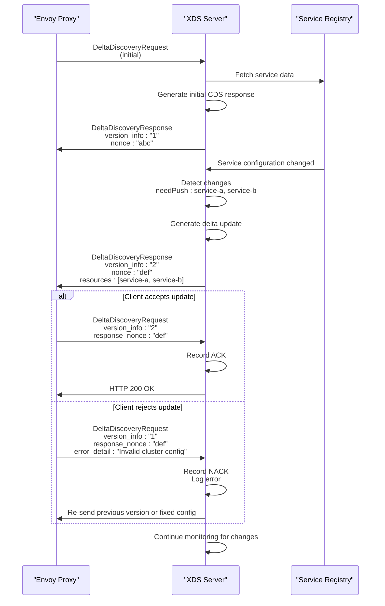

# CDS (Cluster Discovery Service)

<cite>
**Referenced Files in This Document**   
- [cds.go](file://plugin/apiserver/xdsserverv3/cds.go)
- [model.go](file://plugin/apiserver/xdsserverv3/resource/model.go)
- [mtls.go](file://plugin/apiserver/xdsserverv3/resource/mtls.go)
- [help.go](file://plugin/apiserver/xdsserverv3/resource/help.go)
- [generate.go](file://plugin/apiserver/xdsserverv3/generate.go)
- [server.go](file://plugin/apiserver/xdsserverv3/server.go)
- [node.go](file://plugin/apiserver/xdsserverv3/resource/node.go)
</cite>

## Table of Contents
1. [Introduction](#introduction)
2. [Cluster Discovery and Representation](#cluster-discovery-and-representation)
3. [Request/Response Structure and Versioning](#requestresponse-structure-and-versioning)
4. [Internal Service Model Mapping](#internal-service-model-mapping)
5. [CDS Response Examples](#cds-response-examples)
6. [Streaming Updates and ACK/NACK Handling](#streaming-updates-and-acknack-handling)
7. [Common Configuration Issues and Troubleshooting](#common-configuration-issues-and-troubleshooting)
8. [Conclusion](#conclusion)

## Introduction
The Cluster Discovery Service (CDS) in pole-server implements the XDS v3 protocol to dynamically deliver cluster configurations to Envoy proxies. This documentation details how pole-server discovers and represents clusters, manages load balancing policies, health checks, and secure communication. It covers the full lifecycle of CDS interactions, from service discovery to configuration updates, providing a comprehensive guide for understanding and troubleshooting the CDS implementation.

## Cluster Discovery and Representation

The CDS implementation in pole-server discovers clusters through its integration with the service registry and represents them according to the XDS v3 protocol specifications. Cluster discovery is initiated when Envoy proxies connect to the XDS server and send discovery requests containing node metadata that identifies the client's service and namespace.

Clusters are represented as Envoy `Cluster` resources with specific configurations based on the traffic direction (inbound or outbound) and security requirements. The system creates a cluster for each Polaris service, with special handling for passthrough traffic. The cluster type is determined by the service configuration and is typically set to EDS (Endpoint Discovery Service) to enable dynamic endpoint updates.

Load balancing policies are implemented through the `LbSubsetConfig` field in the cluster configuration, which enables subset-based load balancing based on service metadata. The system supports various load balancing algorithms that can be configured through service governance rules. Health checks are configured using the `HealthChecks` field, with check parameters derived from the service's health check configuration in the registry.



**Diagram sources**
- [cds.go](file://plugin/apiserver/xdsserverv3/cds.go#L50-L149)
- [model.go](file://plugin/apiserver/xdsserverv3/resource/model.go#L150-L250)
- [mtls.go](file://plugin/apiserver/xdsserverv3/resource/mtls.go#L50-L118)

**Section sources**
- [cds.go](file://plugin/apiserver/xdsserverv3/cds.go#L1-L149)
- [model.go](file://plugin/apiserver/xdsserverv3/resource/model.go#L1-L250)

## Request/Response Structure and Versioning

The CDS request/response structure follows the XDS v3 protocol specifications with specific implementations in pole-server. The request structure includes the node identifier, resource names (for wildcard or specific resource requests), version information, and type URL specifying the CDS resource type.

The response structure contains a version information string, a list of resources (clusters), and a type URL. Each cluster resource includes the cluster name, connect timeout, discovery type, and associated configuration such as load balancing and health checks. The versioning mechanism uses a combination of timestamp and incrementing counter to ensure proper ordering of updates.

Resource naming follows a specific convention: `{traffic_direction}|{namespace}|{service_name}` for regular clusters, with special names for passthrough clusters and on-demand configurations. The version information is generated using RFC3339 timestamp format combined with an atomic incrementing counter to ensure uniqueness across restarts.



**Diagram sources**
- [server.go](file://plugin/apiserver/xdsserverv3/server.go#L300-L483)
- [generate.go](file://plugin/apiserver/xdsserverv3/generate.go#L100-L245)
- [cds.go](file://plugin/apiserver/xdsserverv3/cds.go#L50-L149)

**Section sources**
- [server.go](file://plugin/apiserver/xdsserverv3/server.go#L1-L483)
- [generate.go](file://plugin/apiserver/xdsserverv3/generate.go#L1-L245)

## Internal Service Model Mapping

pole-server maps its internal service model to Envoy cluster resources through a structured transformation process. The internal `ServiceInfo` structure contains comprehensive service metadata including service identity, instances, routing rules, rate limiting, circuit breaking, and fault detection configurations. This information is transformed into Envoy cluster configurations through the `CDSBuilder` component.

The mapping process begins with the `ServiceInfo` object, which is populated from the service registry and governance rules. For each service, the system creates a corresponding Envoy cluster with the name derived from the service key and traffic direction. The cluster configuration includes EDS (Endpoint Discovery Service) as the discovery type, enabling dynamic endpoint updates from the EDS service.

Security configurations are mapped based on the TLS mode specified in the service metadata. Three modes are supported: none, strict, and permissive. In permissive mode, the system configures transport socket matches to handle both mTLS and plain text traffic. In strict mode, only mTLS connections are allowed. The SNI (Server Name Indication) is generated using a template that incorporates the service name and namespace.

Load balancing policies are mapped from the service's routing rules, with subset load balancing configured based on service metadata. Circuit breaker and outlier detection configurations are also translated from the internal service model to the corresponding Envoy cluster settings.

```mermaid
classDiagram
class ServiceInfo {
+string ID
+string Name
+string Namespace
+ServiceKey ServiceKey
+*Instance Instances
+string SvcInsRevision
+Routing Routing
+string SvcRoutingRevision
+*ServicePort Ports
+RateLimit RateLimit
+string SvcRateLimitRevision
+CircuitBreaker CircuitBreaker
+string CircuitBreakerRevision
+FaultDetector FaultDetect
+string FaultDetectRevision
}
class Cluster {
+string Name
+Duration ConnectTimeout
+ClusterDiscoveryType ClusterDiscoveryType
+EdsClusterConfig EdsClusterConfig
+LbSubsetConfig LbSubsetConfig
+OutlierDetection OutlierDetection
+*HealthCheck HealthChecks
+*Cluster_TransportSocketMatch TransportSocketMatches
}
class BuildOption {
+RunType RunType
+string Namespace
+map~ServiceKey,ServiceInfo~ Services
+TrafficDirection TrafficDirection
+ServiceKey SelfService
+TLSMode TLSMode
+bool OpenOnDemand
+bool ForceDelete
}
ServiceInfo --> BuildOption : "used in"
BuildOption --> Cluster : "generates"
CDSBuilder --> BuildOption : "uses"
CDSBuilder --> Cluster : "creates"
class CDSBuilder {
+DiscoverServer svr
+Init(DiscoverServer)
+Generate(*BuildOption) interface{}, error
+GenerateByDirection(*BuildOption, TrafficDirection) []Resource, error
+makeCluster(*ServiceInfo, TrafficDirection, *BuildOption) *Cluster
}
```

**Diagram sources**
- [model.go](file://plugin/apiserver/xdsserverv3/resource/model.go#L150-L250)
- [cds.go](file://plugin/apiserver/xdsserverv3/cds.go#L1-L149)
- [help.go](file://plugin/apiserver/xdsserverv3/resource/help.go#L500-L799)

**Section sources**
- [model.go](file://plugin/apiserver/xdsserverv3/resource/model.go#L1-L250)
- [cds.go](file://plugin/apiserver/xdsserverv3/cds.go#L1-L149)

## CDS Response Examples

This section provides examples of CDS responses for different service configurations, covering both plain text and secure communication scenarios.

### Plain Text Communication Example
For services without mTLS enabled, the CDS response includes a simple cluster configuration with EDS discovery and basic load balancing:

```json
{
  "version_info": "2023-01-01T00:00:00Z/1",
  "resources": [
    {
      "name": "outbound|default|service-a",
      "connect_timeout": "5s",
      "cluster_discovery_type": {
        "type": "EDS"
      },
      "eds_cluster_config": {
        "service_name": "outbound|default|service-a",
        "eds_config": {
          "ads": {}
        }
      },
      "lb_subset_config": {
        "fallback_policy": "ANY_ENDPOINT",
        "subset_selectors": [
          {
            "keys": ["version", "environment"]
          }
        ]
      },
      "health_checks": [
        {
          "timeout": "1s",
          "interval": "5s",
          "unhealthy_threshold": 3,
          "healthy_threshold": 2,
          "http_health_check": {
            "path": "/health"
          }
        }
      ]
    }
  ],
  "type_url": "type.googleapis.com/envoy.config.cluster.v3.Cluster"
}
```

### Secure Communication Example (Permissive Mode)
In permissive mode, the CDS response includes transport socket matches to handle both mTLS and plain text traffic:

```json
{
  "version_info": "2023-01-01T00:00:00Z/2",
  "resources": [
    {
      "name": "outbound|secure|service-b",
      "connect_timeout": "5s",
      "cluster_discovery_type": {
        "type": "EDS"
      },
      "eds_cluster_config": {
        "service_name": "outbound|secure|service-b",
        "eds_config": {
          "ads": {}
        }
      },
      "transport_socket_matches": [
        {
          "name": "tls-mode",
          "match": {
            "fields": {
              "acceptMTLS": {
                "string_value": "true"
              }
            }
          },
          "transport_socket": {
            "name": "envoy.transport_sockets.tls",
            "typed_config": {
              "@type": "type.googleapis.com/envoy.extensions.transport_sockets.tls.v3.UpstreamTlsContext",
              "common_tls_context": {
                "tls_certificate_sds_secret_configs": [
                  {
                    "name": "default",
                    "sds_config": {
                      "api_config_source": {
                        "api_type": "GRPC",
                        "transport_api_version": "V3",
                        "grpc_services": [
                          {
                            "envoy_grpc": {
                              "cluster_name": "sds-grpc"
                            }
                          }
                        ]
                      }
                    }
                  }
                ],
                "combined_validation_context": {
                  "default_validation_context": {},
                  "validation_context_sds_secret_config": {
                    "name": "ROOTCA",
                    "sds_config": {
                      "api_config_source": {
                        "api_type": "GRPC",
                        "transport_api_version": "V3",
                        "grpc_services": [
                          {
                            "envoy_grpc": {
                              "cluster_name": "sds-grpc"
                            }
                          }
                        ]
                      }
                    }
                  }
                }
              },
              "sni": "outbound_.default_.service-b.secure.svc.cluster.local"
            }
          }
        },
        {
          "name": "rawbuffer",
          "match": {},
          "transport_socket": {
            "name": "envoy.transport_sockets.raw_buffer",
            "typed_config": {
              "@type": "type.googleapis.com/envoy.extensions.transport_sockets.raw_buffer.v3.RawBuffer"
            }
          }
        }
      ]
    }
  ],
  "type_url": "type.googleapis.com/envoy.config.cluster.v3.Cluster"
}
```

### Secure Communication Example (Strict Mode)
In strict mode, the CDS response only includes the mTLS transport socket configuration:

```json
{
  "version_info": "2023-01-01T00:00:00Z/3",
  "resources": [
    {
      "name": "outbound|strict|service-c",
      "connect_timeout": "5s",
      "cluster_discovery_type": {
        "type": "EDS"
      },
      "eds_cluster_config": {
        "service_name": "outbound|strict|service-c",
        "eds_config": {
          "ads": {}
        }
      },
      "transport_socket": {
        "name": "envoy.transport_sockets.tls",
        "typed_config": {
          "@type": "type.googleapis.com/envoy.extensions.transport_sockets.tls.v3.UpstreamTlsContext",
          "common_tls_context": {
            "tls_certificate_sds_secret_configs": [
              {
                "name": "default",
                "sds_config": {
                  "api_config_source": {
                    "api_type": "GRPC",
                    "transport_api_version": "V3",
                    "grpc_services": [
                      {
                        "envoy_grpc": {
                          "cluster_name": "sds-grpc"
                        }
                      }
                    ]
                  }
                }
              }
            ],
            "combined_validation_context": {
              "default_validation_context": {},
              "validation_context_sds_secret_config": {
                "name": "ROOTCA",
                "sds_config": {
                  "api_config_source": {
                    "api_type": "GRPC",
                    "transport_api_version": "V3",
                    "grpc_services": [
                      {
                        "envoy_grpc": {
                          "cluster_name": "sds-grpc"
                        }
                      }
                    ]
                  }
                }
              }
            }
          },
          "sni": "outbound_.strict_.service-c.strict.svc.cluster.local"
        }
      }
    }
  ],
  "type_url": "type.googleapis.com/envoy.config.cluster.v3.Cluster"
}
```

**Section sources**
- [cds.go](file://plugin/apiserver/xdsserverv3/cds.go#L50-L149)
- [mtls.go](file://plugin/apiserver/xdsserverv3/resource/mtls.go#L1-L118)
- [help.go](file://plugin/apiserver/xdsserverv3/resource/help.go#L500-L799)

## Streaming Updates and ACK/NACK Handling

The CDS implementation in pole-server supports streaming updates through the Delta Discovery Protocol, enabling efficient incremental updates to cluster configurations. The streaming behavior is managed by the XDS server's callback mechanism, which processes discovery requests and generates appropriate responses based on the current state and requested resources.

The update process begins when an Envoy proxy establishes a gRPC stream and sends a DeltaDiscoveryRequest. The server maintains the stream and tracks the client's state, including the versions of resources the client has acknowledged. When service configurations change in the registry, the system detects these changes and pushes updated configurations to affected clients.

ACK/NACK handling is implemented through the response nonce and version information. When the server sends a response, it includes a unique nonce. The client must acknowledge the update by sending a new request with the same nonce and the updated version information. If the client rejects the update (NACK), it sends the request with the previous version information and includes error details in the error_detail field.

The system uses a single-flight pattern to prevent duplicate processing of the same update and employs atomic counters to ensure version consistency across server restarts. The update frequency is controlled by a ticker that checks for configuration changes at regular intervals (every 5 seconds by default).



**Diagram sources**
- [server.go](file://plugin/apiserver/xdsserverv3/server.go#L300-L483)
- [generate.go](file://plugin/apiserver/xdsserverv3/generate.go#L50-L245)
- [cache/response.go](file://plugin/apiserver/xdsserverv3/cache/response.go#L1-L106)

**Section sources**
- [server.go](file://plugin/apiserver/xdsserverv3/server.go#L1-L483)
- [generate.go](file://plugin/apiserver/xdsserverv3/generate.go#L1-L245)

## Common Configuration Issues and Troubleshooting

This section addresses common configuration issues and provides troubleshooting steps for clients not receiving expected cluster updates.

### Common Issues

1. **Missing Cluster Updates**: Clients may not receive cluster updates due to incorrect node metadata or namespace filtering. Ensure the node ID follows the correct format: `{run_type}~{namespace}~{uuid}~{host_ip}` and that the namespace in the metadata matches the service namespace.

2. **mTLS Configuration Problems**: In permissive or strict TLS modes, clients may fail to establish connections due to incorrect SNI values or missing SDS (Secret Discovery Service) configuration. Verify that the SNI matches the expected format: `outbound_.{namespace}.{service}.{namespace}.svc.cluster.local`.

3. **Version Skew Issues**: Clients may experience version skew when the server restarts and the version counter resets. The system uses a timestamp-based versioning scheme combined with an atomic counter to prevent this issue.

4. **Resource Naming Conflicts**: Conflicts can occur when multiple services have similar names across different namespaces. The system uses a composite naming scheme that includes traffic direction, namespace, and service name to prevent conflicts.

### Troubleshooting Steps

1. **Verify Node Registration**: Check that the Envoy node is properly registered with the XDS server by querying the debug endpoint `/debug/apiserver/xds/envoy_nodes`. This will show all connected nodes and their metadata.

2. **Check Service Registry**: Verify that the services exist in the registry and have the correct configuration. Use the service discovery API to confirm service existence and metadata.

3. **Inspect Logs**: Examine the XDS server logs for errors during configuration generation. Look for messages related to "generate xds resource fail" or "sync polaris services error".

4. **Validate Configuration Changes**: Ensure that configuration changes are being detected by checking the update ticker logs. The message "start update xds resource snapshot ticker task" indicates the update process is running.

5. **Test Connectivity**: Verify that the SDS cluster (`sds-grpc`) is reachable from the Envoy proxies, as mTLS configurations depend on this service for certificate distribution.

6. **Check Resource Limits**: Ensure that the gRPC server is not hitting connection limits that could prevent new clients from connecting.

The system provides several debug endpoints to assist with troubleshooting:
- `/debug/apiserver/xds/envoy_nodes`: Lists all connected Envoy nodes
- `/debug/apiserver/xds/resources`: Shows the current XDS resources by type and node

**Section sources**
- [server.go](file://plugin/apiserver/xdsserverv3/server.go#L450-L483)
- [node.go](file://plugin/apiserver/xdsserverv3/resource/node.go#L1-L454)
- [generate.go](file://plugin/apiserver/xdsserverv3/generate.go#L150-L245)

## Conclusion
The CDS implementation in pole-server provides a robust mechanism for dynamically delivering cluster configurations to Envoy proxies according to the XDS v3 protocol. By mapping its internal service model to Envoy cluster resources, the system enables sophisticated service mesh capabilities including dynamic load balancing, health checking, and secure communication. The streaming update mechanism with proper ACK/NACK handling ensures reliable configuration delivery, while comprehensive debugging tools help diagnose and resolve common issues. This implementation forms a critical component of the service mesh infrastructure, enabling seamless service-to-service communication with advanced traffic management capabilities.