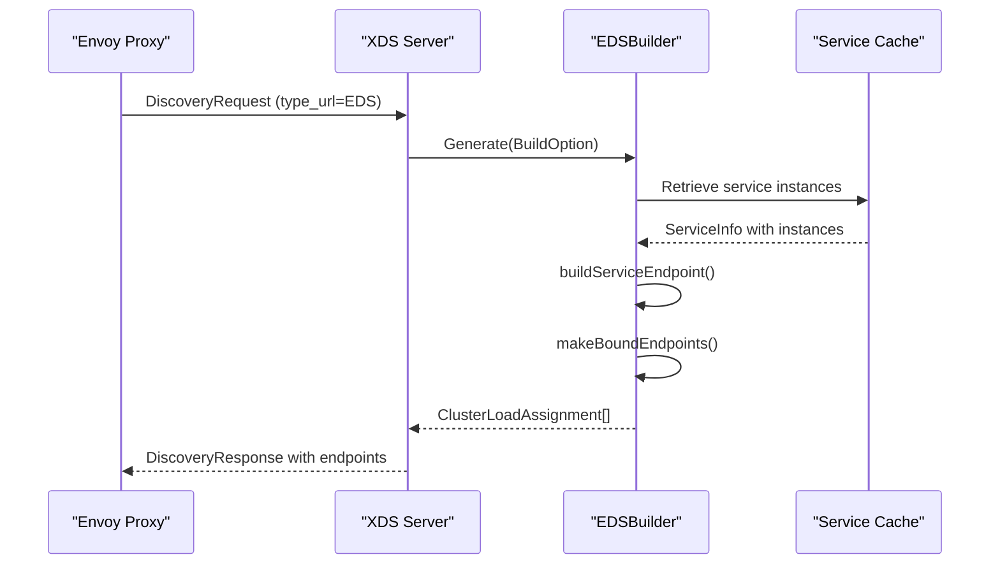
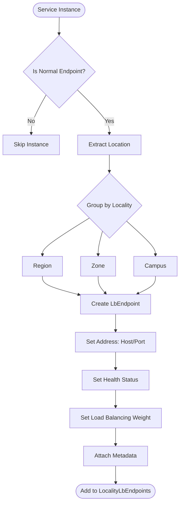
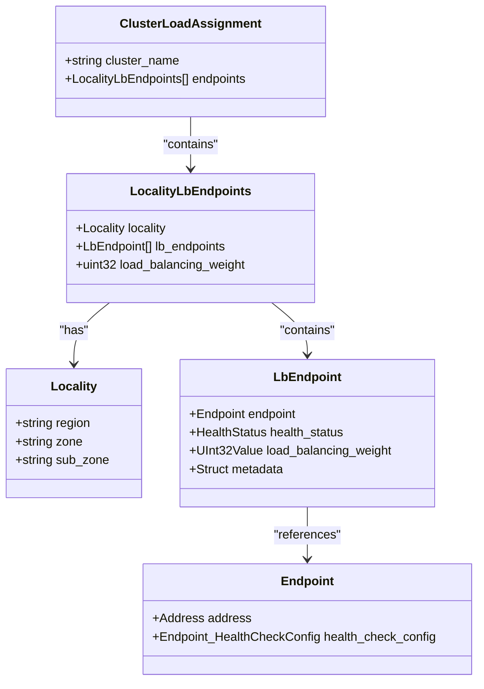
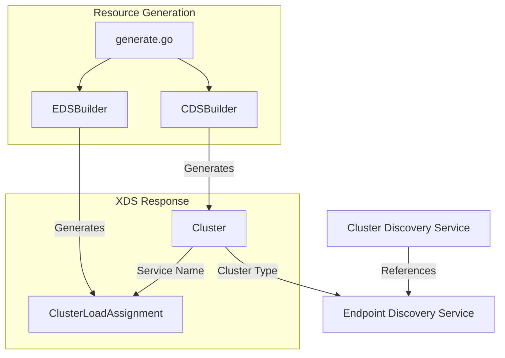

# EDS (Endpoint Discovery Service)

<cite>
**Referenced Files in This Document**   
- [eds.go](file://plugin/apiserver/xdsserverv3/eds.go)
- [healthchecker.go](file://apis/service/healthcheck/healthchecker.go)
- [cache.go](file://pkg/service/healthcheck/cache.go)
- [check.go](file://pkg/service/healthcheck/check.go)
- [cds.go](file://plugin/apiserver/xdsserverv3/cds.go)
- [generate.go](file://plugin/apiserver/xdsserverv3/generate.go)
</cite>

## Table of Contents
1. [Introduction](#introduction)
2. [EDS Request/Response Flow](#eds-requestresponse-flow)
3. [Service Instance to Envoy Endpoint Mapping](#service-instance-to-envoy-endpoint-mapping)
4. [Health Status Propagation](#health-status-propagation)
5. [Locality and Load Balancing Weights](#locality-and-load-balancing-weights)
6. [EDS Versioning and Subscription Mechanism](#eds-versioning-and-subscription-mechanism)
7. [EDS and CDS Resource Relationship](#eds-and-cds-resource-relationship)
8. [Delta Updates and Large-Scale Performance](#delta-updates-and-large-scale-performance)
9. [Example EDS Responses](#example-eds-responses)
10. [Conclusion](#conclusion)

## Introduction
The Endpoint Discovery Service (EDS) in pole-server is responsible for dynamically discovering and distributing endpoint information to Envoy proxies. This service enables intelligent load balancing by providing real-time information about service instances, including their network addresses, health status, locality, and load balancing weights. The EDS implementation in pole-server integrates tightly with its health checking system and service discovery mechanisms to ensure that only healthy, properly weighted instances are included in routing decisions.

**Section sources**
- [eds.go](file://plugin/apiserver/xdsserverv3/eds.go#L1-L20)

## EDS Request/Response Flow
The EDS request/response flow begins when an Envoy proxy sends a DiscoveryRequest for endpoint information. The pole-server's EDSBuilder processes this request by generating ClusterLoadAssignment resources based on the requested services and traffic direction. For outbound traffic, the system retrieves service instances from the discovery store and constructs endpoint lists. For inbound traffic (sidecar scenarios), endpoints are limited to localhost (127.0.0.1) to facilitate proper service-to-service communication within the same pod. The response includes a list of ClusterLoadAssignment resources, each containing endpoints grouped by locality.



**Diagram sources**
- [eds.go](file://plugin/apiserver/xdsserverv3/eds.go#L45-L74)
- [eds.go](file://plugin/apiserver/xdsserverv3/eds.go#L76-L110)

**Section sources**
- [eds.go](file://plugin/apiserver/xdsserverv3/eds.go#L40-L110)

## Service Instance to Envoy Endpoint Mapping
Service instances are mapped to Envoy endpoints through the EDSBuilder's `buildServiceEndpoint` method. Each service instance is transformed into an LbEndpoint containing its network address (host and port). Instances that are isolated or have zero weight are filtered out and not included in the EDS response. The mapping process preserves the instance's metadata, health status, and load balancing weight. The system organizes endpoints by locality (region, zone, campus) to support locality-based load balancing strategies. This hierarchical organization enables Envoy to preferentially route traffic to instances in the same locality, reducing latency and improving fault isolation.



**Diagram sources**
- [eds.go](file://plugin/apiserver/xdsserverv3/eds.go#L76-L110)
- [resource.go](file://plugin/apiserver/xdsserverv3/resource.go#L150-L180)

**Section sources**
- [eds.go](file://plugin/apiserver/xdsserverv3/eds.go#L76-L110)

## Health Status Propagation
Health status from pole-server's health checking system is reflected in endpoint health status through a coordinated process between the health checker and EDS components. When an instance's health status changes, the health checking system updates the instance record in storage and notifies the cache. The EDSBuilder uses the `FormatEndpointHealth` function to convert the internal health status of a service instance into the corresponding Envoy HealthStatus enum value. Healthy instances are marked as HEALTHY, while unhealthy instances are marked as UNHEALTHY. The health check configuration for endpoints has active health checking disabled, as health determination is performed server-side by pole-server rather than by Envoy.

**Section sources**
- [eds.go](file://plugin/apiserver/xdsserverv3/eds.go#L90-L95)
- [resource.go](file://plugin/apiserver/xdsserverv3/resource.go#L200-L220)
- [check.go](file://pkg/service/healthcheck/check.go#L590-L629)

## Locality and Load Balancing Weights
The EDS implementation supports sophisticated locality-based routing and weighted load balancing. Endpoints are organized into LocalityLbEndpoints based on the instance's region, zone, and campus attributes extracted from its location metadata. This three-level hierarchy enables fine-grained control over traffic distribution across different infrastructure segments. Each endpoint is assigned a load balancing weight derived from the instance's weight property, which influences the probability of the endpoint being selected during load balancing. Higher-weighted instances receive proportionally more traffic. The system uses Envoy's LocalityLbEndpoints structure to represent this information, allowing Envoy to implement locality-weighted load balancing algorithms.



**Diagram sources**
- [eds.go](file://plugin/apiserver/xdsserverv3/eds.go#L76-L110)
- [envoy/config/endpoint/v3/endpoint.proto]

**Section sources**
- [eds.go](file://plugin/apiserver/xdsserverv3/eds.go#L76-L110)

## EDS Versioning and Subscription Mechanism
The EDS versioning and subscription mechanism is managed through the XDS server's resource generation system. When service instances change, the system triggers an update that propagates through the EDSBuilder. The versioning is handled at the XDS level, where each resource update increments a version counter. Subscribers (Envoy proxies) maintain a subscription to EDS resources and receive incremental updates when the version changes. The system uses an aggregated discovery service (ADS) configuration, allowing multiple resource types to be delivered through a single stream. When a service configuration changes, the system generates updated EDS resources and pushes them to subscribed envoys, ensuring that endpoint information remains current.

**Section sources**
- [generate.go](file://plugin/apiserver/xdsserverv3/generate.go#L62-L85)
- [eds.go](file://plugin/apiserver/xdsserverv3/eds.go#L45-L74)

## EDS and CDS Resource Relationship
EDS and CDS resources are closely coordinated in the pole-server implementation. The CDS (Cluster Discovery Service) defines clusters that use EDS for endpoint discovery, creating a dependency between these resources. In the CDS configuration, clusters are configured with a ClusterDiscoveryType of EDS, and the EdsClusterConfig specifies the service name that corresponds to the EDS resource. When generating CDS resources, the system ensures that corresponding EDS resources are also generated. The coordination occurs in the resource generation process, where both CDS and EDS resources are built in sequence for the same set of services and traffic directions. This tight coupling ensures that cluster configurations and their endpoint assignments remain synchronized.



**Diagram sources**
- [cds.go](file://plugin/apiserver/xdsserverv3/cds.go#L123-L148)
- [generate.go](file://plugin/apiserver/xdsserverv3/generate.go#L62-L85)

**Section sources**
- [cds.go](file://plugin/apiserver/xdsserverv3/cds.go#L123-L148)
- [generate.go](file://plugin/apiserver/xdsserverv3/generate.go#L62-L85)

## Delta Updates and Large-Scale Performance
For large-scale deployments with thousands of endpoints, the EDS implementation employs several strategies to ensure efficient delta updates and optimal performance. The system uses a selective update mechanism where only changed services trigger EDS resource regeneration. The cache layer minimizes database queries by maintaining in-memory representations of service instances. When processing EDS requests, the system only iterates through relevant service instances rather than the entire service registry. For delta updates, the XDS server can send only the changed ClusterLoadAssignment resources rather than the complete set, reducing network bandwidth and processing overhead. The system also supports force deletion of resources through the ForceDelete flag, enabling clean removal of endpoint information when services are deregistered.

**Section sources**
- [eds.go](file://plugin/apiserver/xdsserverv3/eds.go#L65-L68)
- [generate.go](file://plugin/apiserver/xdsserverv3/generate.go#L62-L85)
- [cache.go](file://pkg/service/healthcheck/cache.go#L203-L236)

## Example EDS Responses
The following examples illustrate EDS responses for various service topologies and failure scenarios:

### Normal Service with Multiple Instances
```json
{
  "version_info": "1",
  "resources": [
    {
      "@type": "type.googleapis.com/envoy.config.endpoint.v3.ClusterLoadAssignment",
      "cluster_name": "service-A",
      "endpoints": [
        {
          "locality": {
            "region": "us-west",
            "zone": "us-west-1",
            "sub_zone": "campus-a"
          },
          "lb_endpoints": [
            {
              "endpoint": {
                "address": {
                  "socket_address": {
                    "address": "10.0.0.1",
                    "port_value": 8080
                  }
                }
              },
              "health_status": "HEALTHY",
              "load_balancing_weight": 100
            }
          ]
        }
      ]
    }
  ]
}
```

### Service with Unhealthy Instances
```json
{
  "cluster_name": "service-B",
  "endpoints": [
    {
      "locality": {
        "region": "us-east",
        "zone": "us-east-1",
        "sub_zone": "campus-b"
      },
      "lb_endpoints": [
        {
          "endpoint": {
            "address": {
              "socket_address": {
                "address": "10.1.0.1",
                "port_value": 8080
              }
            }
          },
          "health_status": "UNHEALTHY",
          "load_balancing_weight": 100
        },
        {
          "endpoint": {
            "address": {
              "socket_address": {
                "address": "10.1.0.2",
                "port_value": 8080
              }
            }
          },
          "health_status": "HEALTHY",
          "load_balancing_weight": 100
        }
      ]
    }
  ]
}
```

### Sidecar Inbound Configuration
```json
{
  "cluster_name": "inbound|local-service",
  "endpoints": [
    {
      "lb_endpoints": [
        {
          "endpoint": {
            "address": {
              "socket_address": {
                "address": "127.0.0.1",
                "port_value": 8080
              }
            }
          },
          "health_status": "HEALTHY",
          "load_balancing_weight": 100
        }
      ]
    }
  ]
}
```

**Section sources**
- [eds.go](file://plugin/apiserver/xdsserverv3/eds.go#L112-L203)
- [eds.go](file://plugin/apiserver/xdsserverv3/eds.go#L45-L74)

## Conclusion
The EDS implementation in pole-server provides a robust mechanism for dynamic endpoint discovery and distribution to Envoy proxies. By integrating service discovery, health checking, and locality-aware routing, the system enables intelligent traffic management in service mesh environments. The coordination between EDS and CDS resources ensures consistent cluster and endpoint configurations, while the support for delta updates and efficient caching enables scalability to large deployments. The health status propagation mechanism ensures that only healthy instances receive traffic, improving overall system reliability. This comprehensive EDS implementation forms a critical component of the pole-server's service mesh capabilities.