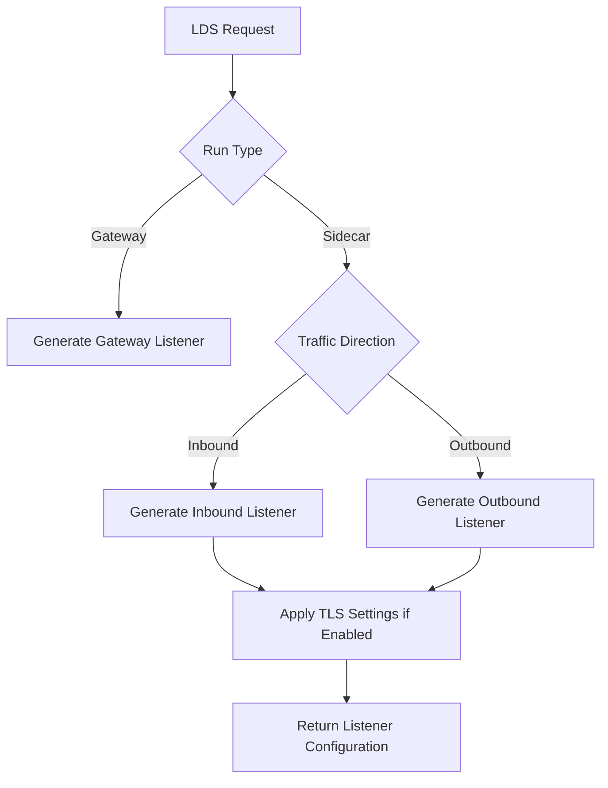
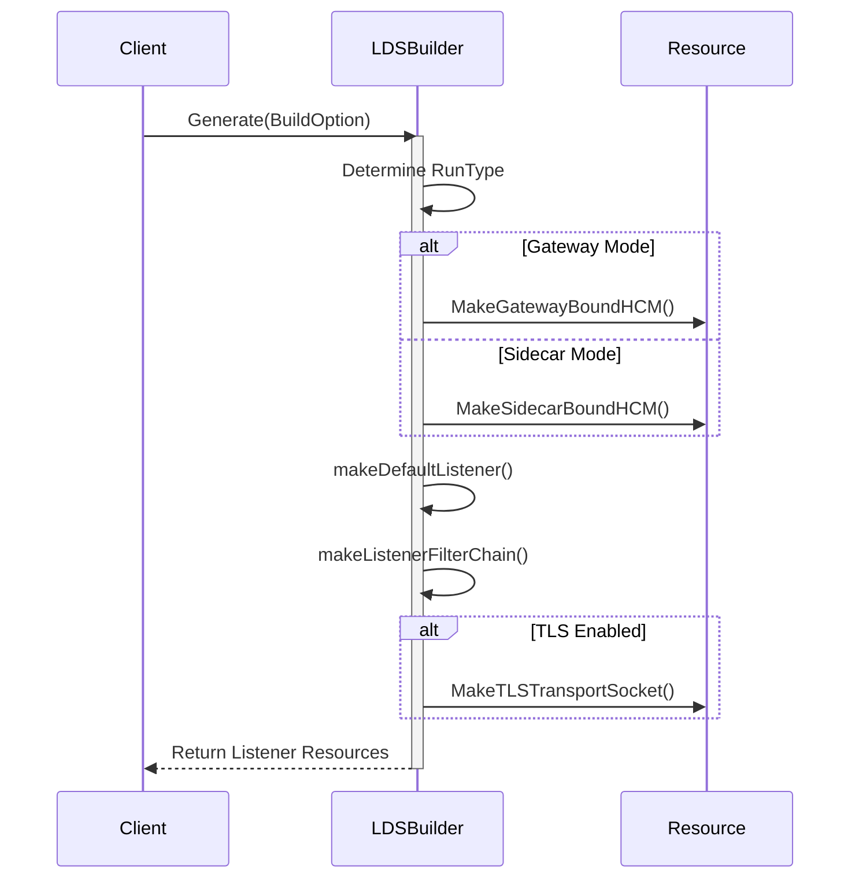
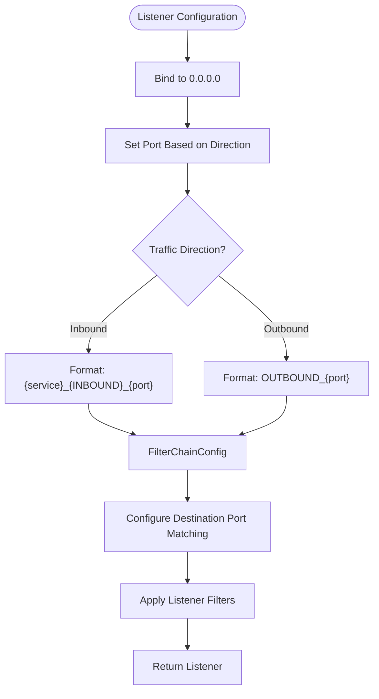
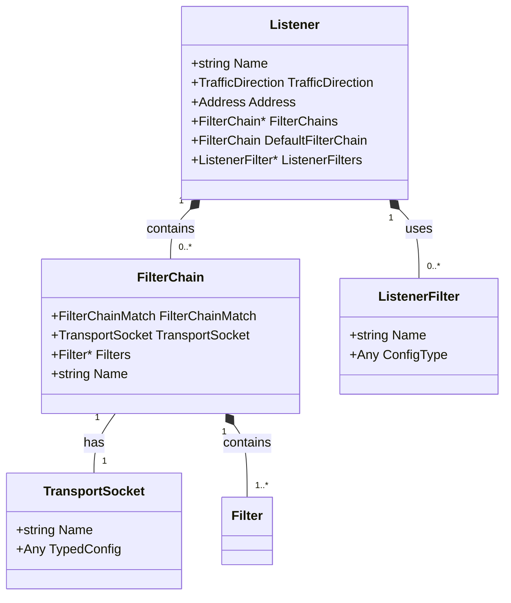
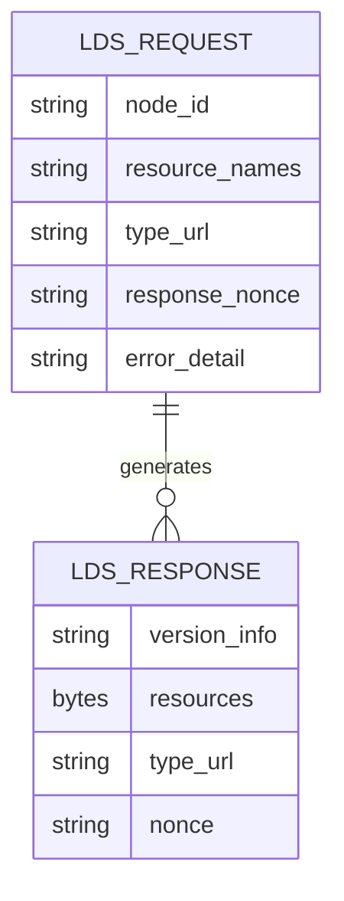
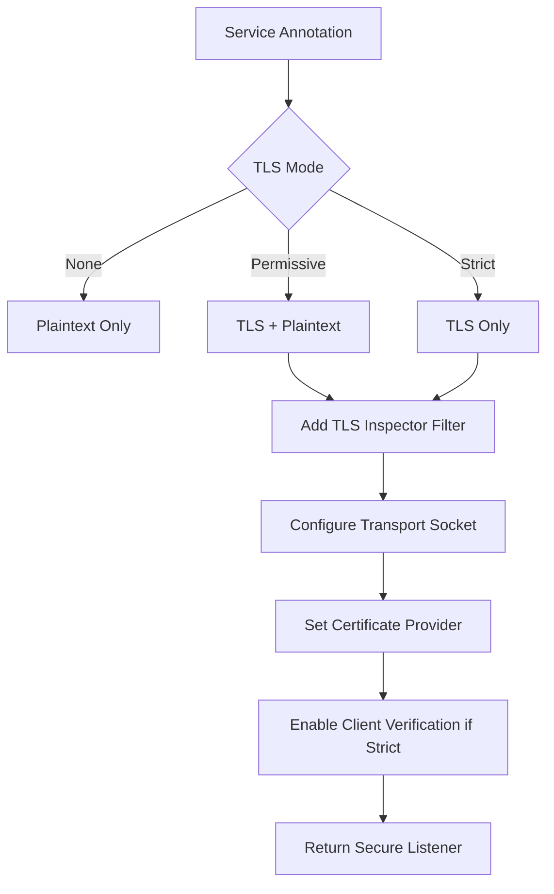
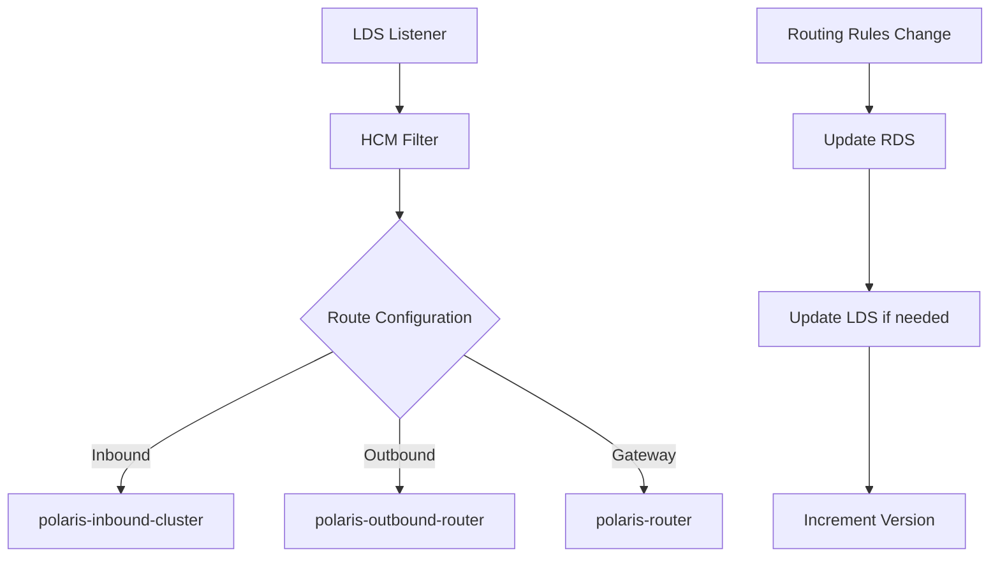

# LDS (Listener Discovery Service)

<cite>
**Referenced Files in This Document**   
- [lds.go](file://plugin/apiserver/xdsserverv3/lds.go)
- [model.go](file://plugin/apiserver/xdsserverv3/resource/model.go)
- [mtls.go](file://plugin/apiserver/xdsserverv3/resource/mtls.go)
- [resource/api.go](file://plugin/apiserver/xdsserverv3/resource/api.go)
</cite>

## Table of Contents
1. [Introduction](#introduction)
2. [LDS Configuration Overview](#lds-configuration-overview)
3. [Listener Generation Process](#listener-generation-process)
4. [Network Listener Configuration](#network-listener-configuration)
5. [Filter Chain and TLS Settings](#filter-chain-and-tls-settings)
6. [Request/Response Message Structure](#requestresponse-message-structure)
7. [Versioning and Resource Naming](#versioning-and-resource-naming)
8. [mTLS Configuration Distribution](#mtls-configuration-distribution)
9. [Example LDS Responses](#example-lds-responses)
10. [LDS and RDS Interaction](#lds-and-rds-interaction)
11. [Security Considerations](#security-considerations)
12. [Validation Mechanisms](#validation-mechanisms)

## Introduction
The Listener Discovery Service (LDS) in pole-server implements Envoy's xDS API to dynamically configure network listeners for service mesh sidecars and gateways. This document details the implementation of LDS within the pole-server architecture, focusing on listener configuration delivery, TLS integration, and interaction with other xDS components. The system supports both plaintext and secure communication scenarios with configurable mTLS policies.

**Section sources**
- [lds.go](file://plugin/apiserver/xdsserverv3/lds.go#L1-L245)
- [model.go](file://plugin/apiserver/xdsserverv3/resource/model.go#L1-L250)

## LDS Configuration Overview
The LDS implementation in pole-server provides dynamic listener configuration for both sidecar proxies and gateway components. The system supports multiple deployment modes including sidecar injection and gateway-based routing. Listener configurations are generated based on service metadata, traffic direction, and security policies defined in the control plane.

The configuration model distinguishes between inbound and outbound traffic with different port bindings:
- **Inbound direction**: Listens on port 15006 for traffic entering the service
- **Outbound direction**: Listens on port 15001 for traffic leaving the service

Listeners are configured with appropriate filter chains based on the transport protocol and security requirements. The system supports both demand-driven and pre-configured listener generation modes.



**Diagram sources**
- [lds.go](file://plugin/apiserver/xdsserverv3/lds.go#L50-L245)
- [model.go](file://plugin/apiserver/xdsserverv3/resource/model.go#L81-L81)

**Section sources**
- [lds.go](file://plugin/apiserver/xdsserverv3/lds.go#L1-L245)
- [model.go](file://plugin/apiserver/xdsserverv3/resource/model.go#L1-L250)

## Listener Generation Process
The listener generation process is orchestrated by the `LDSBuilder` struct, which implements the `XdsResourceGenerator` interface. The generation workflow follows a structured approach based on the client's request parameters and service configuration.

When a client requests listener configuration, the process follows these steps:
1. Determine the run type (gateway or sidecar)
2. Identify the traffic direction (inbound or outbound)
3. Generate appropriate HTTP connection manager configuration
4. Configure listener filters and filter chains
5. Apply TLS settings if required
6. Set destination port matching rules
7. Return the complete listener configuration

The `Generate` method serves as the entry point, delegating to `makeListener` for actual configuration construction. The builder pattern allows for flexible configuration based on runtime parameters while maintaining separation of concerns.



**Diagram sources**
- [lds.go](file://plugin/apiserver/xdsserverv3/lds.go#L50-L245)

**Section sources**
- [lds.go](file://plugin/apiserver/xdsserverv3/lds.go#L50-L245)

## Network Listener Configuration
Network listeners in pole-server are configured with comprehensive socket options and address binding parameters. The system supports both IPv4 and IPv6 addressing with configurable port bindings based on traffic direction.

Key configuration parameters include:
- **Address binding**: Listeners bind to "0.0.0.0" to accept connections on all interfaces
- **Port configuration**: Dynamic port assignment based on traffic direction (15001 for outbound, 15006 for inbound)
- **Protocol specification**: TCP protocol is used for all listener configurations
- **Traffic direction**: Explicitly specified for proper routing and policy application

The listener name follows a consistent naming convention: `{traffic_direction}_{port}` for gateway listeners and `{service_domain}_{traffic_direction}_{port}` for sidecar inbound listeners. This naming scheme enables easy identification and troubleshooting.

Destination port matching is automatically configured based on the service's registered ports. For inbound listeners, filter chains are created for each destination port, allowing granular control over traffic handling.



**Diagram sources**
- [lds.go](file://plugin/apiserver/xdsserverv3/lds.go#L150-L245)

**Section sources**
- [lds.go](file://plugin/apiserver/xdsserverv3/lds.go#L150-L245)

## Filter Chain and TLS Settings
The filter chain configuration in pole-server's LDS implementation provides flexible traffic processing capabilities with integrated TLS support. The system supports multiple TLS modes: none, permissive, and strict, allowing for gradual security adoption.

For plaintext communication, the default configuration includes:
- Original destination listener filter for proper routing
- HTTP inspector for protocol detection
- Default HTTP connection manager filter

When TLS is enabled, additional components are added:
- TLS inspector listener filter for SNI and ALPN detection
- TLS transport socket with appropriate certificate configuration
- Client certificate verification (in strict mode)

The filter chain structure supports both port-specific and default chains. Inbound listeners create separate filter chains for each service port, while a default chain handles any unmatched traffic. This allows for service-specific policies while maintaining a fallback mechanism.



**Diagram sources**
- [lds.go](file://plugin/apiserver/xdsserverv3/lds.go#L100-L149)
- [model.go](file://plugin/apiserver/xdsserverv3/resource/model.go#L70-L75)

**Section sources**
- [lds.go](file://plugin/apiserver/xdsserverv3/lds.go#L100-L149)
- [model.go](file://plugin/apiserver/xdsserverv3/resource/model.go#L70-L75)

## Request/Response Message Structure
The LDS request/response structure follows the Envoy xDS API specification with pole-server specific extensions. The communication occurs over gRPC with proper versioning and resource tracking.

Request structure includes:
- **Node identifier**: Client identification and metadata
- **Resource names**: Optional list of specific listeners to retrieve
- **Type URL**: Specifies the resource type (type.googleapis.com/envoy.config.listener.v3.Listener)
- **Response nonce**: For request/response matching in delta queries
- **Error detail**: When acknowledging previous responses

Response structure contains:
- **Version info**: Configuration version for consistency checking
- **Resources**: List of serialized Listener messages
- **Type URL**: Resource type identifier
- **Nonce**: Unique identifier for the response

The system supports both full state and incremental updates through the delta xDS API. Clients can request specific listeners by name or receive all relevant configurations based on their service context.



**Diagram sources**
- [lds.go](file://plugin/apiserver/xdsserverv3/lds.go#L50-L245)
- [model.go](file://plugin/apiserver/xdsserverv3/resource/model.go#L1-L250)

**Section sources**
- [lds.go](file://plugin/apiserver/xdsserverv3/lds.go#L50-L245)
- [model.go](file://plugin/apiserver/xdsserverv3/resource/model.go#L1-L250)

## Versioning and Resource Naming
The LDS implementation uses a comprehensive versioning and naming strategy to ensure configuration consistency and enable proper caching. Each listener resource is assigned a unique name based on its functional role and traffic characteristics.

Naming conventions:
- **Gateway outbound**: `OUTBOUND_15001`
- **Sidecar inbound**: `{service-domain}_INBOUND_15006`
- **Sidecar outbound**: `OUTBOUND_15001`

Versioning is handled through the xDS API's version_info field, which contains a monotonically increasing identifier. The system tracks configuration changes at the service level, incrementing the version when any service parameter changes (instances, routing rules, security policies, etc.).

Resource naming follows Envoy's standard format while incorporating pole-server specific identifiers. The type URL is consistently set to `type.googleapis.com/envoy.config.listener.v3.Listener` to ensure compatibility with Envoy proxies.

The BuildOption struct contains metadata used for version determination, including service information, traffic direction, and security mode. This ensures that configuration changes are properly reflected in the versioning system.

**Section sources**
- [lds.go](file://plugin/apiserver/xdsserverv3/lds.go#L150-L245)
- [model.go](file://plugin/apiserver/xdsserverv3/resource/model.go#L1-L250)

## mTLS Configuration Distribution
mTLS configuration in pole-server is distributed through the LDS as part of the listener's transport socket configuration. The system supports three TLS modes defined by the TLSMode enum: none, permissive, and strict.

The mTLS configuration process:
1. Service owners annotate services with TLS mode using the `polarismesh.cn/tls-mode` annotation
2. The control plane validates the TLS mode during service registration
3. When generating listeners, the LDS builder checks the service's TLS mode
4. If TLS is enabled (permissive or strict), TLS inspector and HTTP inspector filters are added
5. A TLS transport socket is configured with appropriate certificate providers
6. Client certificate verification is enabled in strict mode

Certificate providers are configured to retrieve certificates from the control plane's certificate management system. The configuration includes:
- Certificate authority (CA) certificate for client validation
- Server certificate and private key
- Certificate provider instance for dynamic certificate rotation

The permissive mode allows both TLS and plaintext traffic, facilitating gradual migration to secure communication. Strict mode rejects all plaintext connections, enforcing end-to-end encryption.



**Diagram sources**
- [lds.go](file://plugin/apiserver/xdsserverv3/lds.go#L100-L149)
- [model.go](file://plugin/apiserver/xdsserverv3/resource/model.go#L70-L75)
- [mtls.go](file://plugin/apiserver/xdsserverv3/resource/mtls.go#L1-L50)

**Section sources**
- [lds.go](file://plugin/apiserver/xdsserverv3/lds.go#L100-L149)
- [model.go](file://plugin/apiserver/xdsserverv3/resource/model.go#L70-L75)
- [mtls.go](file://plugin/apiserver/xdsserverv3/resource/mtls.go#L1-L50)

## Example LDS Responses
This section provides example LDS responses for both plaintext and secure communication scenarios.

### Plaintext Service Configuration
```json
{
  "version_info": "1",
  "resources": [
    {
      "@type": "type.googleapis.com/envoy.config.listener.v3.Listener",
      "name": "OUTBOUND_15001",
      "traffic_direction": "OUTBOUND",
      "address": {
        "socket_address": {
          "address": "0.0.0.0",
          "port_value": 15001
        }
      },
      "filter_chains": [
        {
          "filters": [
            {
              "name": "envoy.filters.network.http_connection_manager",
              "typed_config": {
                "@type": "type.googleapis.com/envoy.extensions.filters.network.http_connection_manager.v3.HttpConnectionManager"
              }
            }
          ]
        }
      ],
      "listener_filters": [
        {
          "name": "envoy.filters.listener.original_dst",
          "typed_config": {
            "@type": "type.googleapis.com/envoy.extensions.filters.listener.original_dst.v3.OriginalDst"
          }
        }
      ],
      "default_filter_chain": {
        "filters": [
          {
            "name": "envoy.filters.network.http_connection_manager",
            "typed_config": {
              "@type": "type.googleapis.com/envoy.extensions.filters.network.http_connection_manager.v3.HttpConnectionManager"
            }
          }
        ]
      }
    }
  ],
  "type_url": "type.googleapis.com/envoy.config.listener.v3.Listener",
  "nonce": "1"
}
```

### Secure Service Configuration (Strict Mode)
```json
{
  "version_info": "2",
  "resources": [
    {
      "@type": "type.googleapis.com/envoy.config.listener.v3.Listener",
      "name": "my-service_INBOUND_15006",
      "traffic_direction": "INBOUND",
      "address": {
        "socket_address": {
          "address": "0.0.0.0",
          "port_value": 15006
        }
      },
      "filter_chains": [
        {
          "filter_chain_match": {
            "transport_protocol": "tls"
          },
          "transport_socket": {
            "name": "envoy.transport_sockets.tls",
            "typed_config": {
              "@type": "type.googleapis.com/envoy.extensions.transport_sockets.tls.v3.DownstreamTlsContext",
              "common_tls_context": {
                "tls_certificate_provider_instance": {
                  "instance_name": "my-service-cert-provider"
                },
                "combined_validation_context": {
                  "default_validation_context": {
                    "match_subject_alt_names": [
                      {"exact": "my-service.namespace.pole.svc"}
                    ]
                  },
                  "validation_context_certificate_provider_instance": {
                    "instance_name": "ca-cert-provider"
                  }
                }
              },
              "require_client_certificate": true
            }
          },
          "filters": [
            {
              "name": "envoy.filters.network.http_connection_manager",
              "typed_config": {
                "@type": "type.googleapis.com/envoy.extensions.filters.network.http_connection_manager.v3.HttpConnectionManager"
              }
            }
          ],
          "name": "PassthroughFilterChain-TLS"
        }
      ],
      "listener_filters": [
        {
          "name": "envoy.filters.listener.original_dst",
          "typed_config": {
            "@type": "type.googleapis.com/envoy.extensions.filters.listener.original_dst.v3.OriginalDst"
          }
        },
        {
          "name": "envoy.filters.listener.http_inspector",
          "typed_config": {
            "@type": "type.googleapis.com/envoy.extensions.filters.listener.http_inspector.v3.HttpInspector"
          }
        },
        {
          "name": "envoy.filters.listener.tls_inspector",
          "typed_config": {
            "@type": "type.googleapis.com/envoy.extensions.filters.listener.tls_inspector.v3.TlsInspector"
          }
        }
      ]
    }
  ],
  "type_url": "type.googleapis.com/envoy.config.listener.v3.Listener",
  "nonce": "2"
}
```

**Section sources**
- [lds.go](file://plugin/apiserver/xdsserverv3/lds.go#L1-L245)
- [model.go](file://plugin/apiserver/xdsserverv3/resource/model.go#L1-L250)

## LDS and RDS Interaction
The LDS and RDS (Route Discovery Service) components work together to provide complete traffic management capabilities. The interaction follows the standard Envoy xDS hierarchy where listeners reference route configurations by name.

Key interaction points:
- **Route configuration reference**: Listeners reference route configurations by name (e.g., "polaris-router")
- **Traffic direction mapping**: Different route configurations for inbound and outbound traffic
- **Shared versioning**: Configuration changes trigger updates to both LDS and RDS resources
- **Dependency resolution**: Route configurations must be available before listeners can be applied

The HTTP connection manager (HCM) filter in each listener references a specific route configuration:
- Inbound traffic uses `polaris-inbound-cluster`
- Outbound traffic uses `polaris-outbound-router`
- Gateway traffic uses `polaris-router`

When a service's routing rules change, both the RDS and LDS configurations may need to be updated. The control plane ensures consistency by versioning related resources together and coordinating the update sequence.



**Diagram sources**
- [lds.go](file://plugin/apiserver/xdsserverv3/lds.go#L50-L245)
- [model.go](file://plugin/apiserver/xdsserverv3/resource/model.go#L30-L40)

**Section sources**
- [lds.go](file://plugin/apiserver/xdsserverv3/lds.go#L50-L245)
- [model.go](file://plugin/apiserver/xdsserverv3/resource/model.go#L30-L40)

## Security Considerations
The LDS implementation incorporates several security measures to protect against configuration vulnerabilities and ensure secure service communication.

Key security features:
- **Input validation**: All service metadata and configuration parameters are validated before use
- **TLS mode enforcement**: Strict mode enforces mutual TLS authentication
- **Certificate management**: Automated certificate rotation and revocation
- **Listener isolation**: Separate listeners for inbound and outbound traffic
- **Port binding security**: Listeners bind to specific ports with proper access controls

Security best practices:
- Use strict TLS mode in production environments
- Regularly rotate service certificates
- Monitor for unauthorized configuration changes
- Implement network policies to restrict listener access
- Use service mesh wide trust domains

The system prevents common security issues such as:
- Plaintext downgrade attacks through permissive mode configuration
- Certificate pinning bypass through proper validation context
- Resource exhaustion through connection limits
- Configuration injection through input sanitization

**Section sources**
- [lds.go](file://plugin/apiserver/xdsserverv3/lds.go#L1-L245)
- [model.go](file://plugin/apiserver/xdsserverv3/resource/model.go#L70-L75)

## Validation Mechanisms
The LDS implementation includes comprehensive validation mechanisms to prevent malformed listener definitions and ensure configuration integrity.

Validation occurs at multiple levels:
- **Service metadata validation**: During service registration and updates
- **TLS configuration validation**: Certificate and key format checking
- **Listener structure validation**: Proper filter chain and match criteria
- **Security policy validation**: Compliance with organizational standards

The system validates:
- TLS mode values (none, permissive, strict)
- Certificate provider configurations
- Service port definitions
- Traffic direction parameters
- Resource naming conventions

When invalid configurations are detected, the system:
1. Rejects the configuration update
2. Logs detailed error information
3. Maintains the previous valid configuration
4. Notifies administrators through monitoring systems

The validation framework ensures that only properly formed and secure listener configurations are distributed to sidecars and gateways, maintaining the integrity of the service mesh.

**Section sources**
- [lds.go](file://plugin/apiserver/xdsserverv3/lds.go#L50-L245)
- [model.go](file://plugin/apiserver/xdsserverv3/resource/model.go#L70-L75)