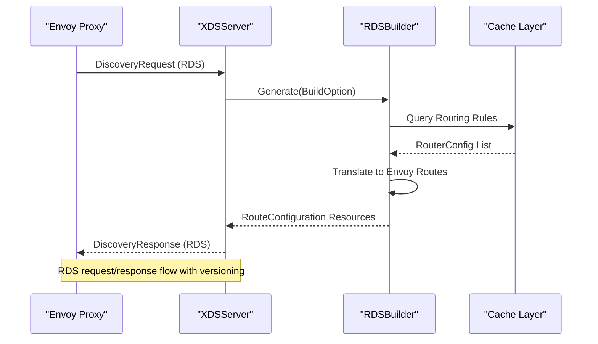
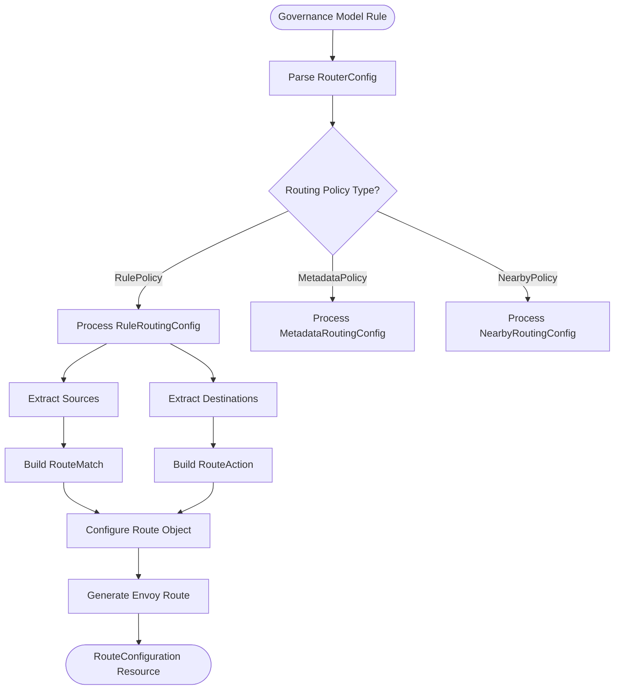
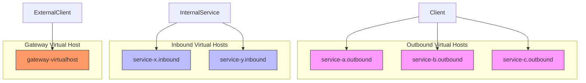
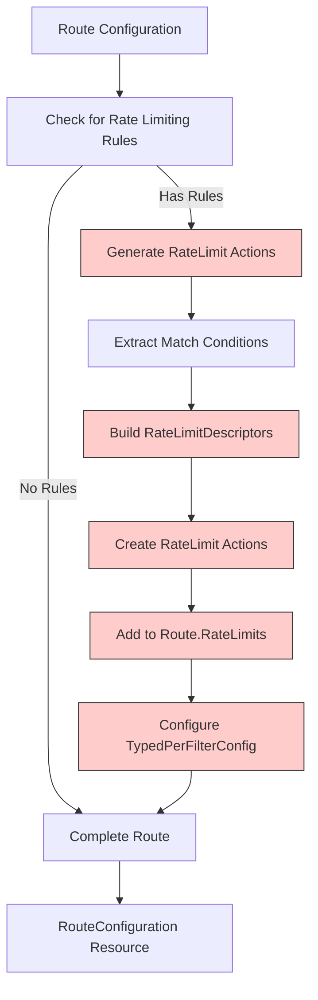
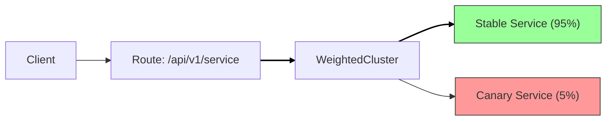
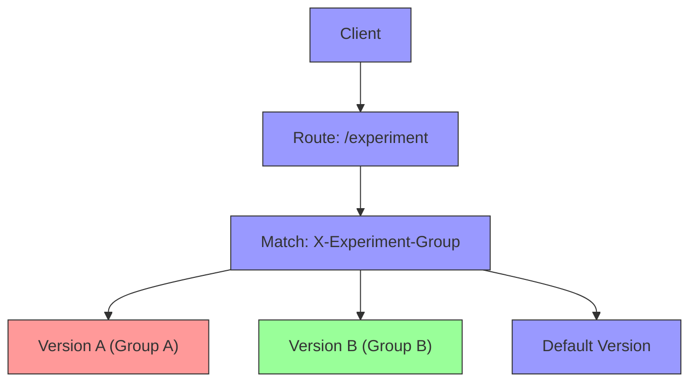
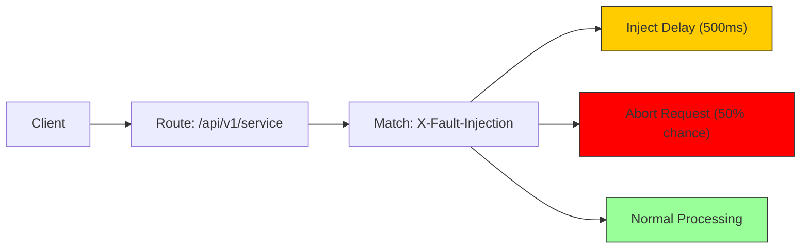
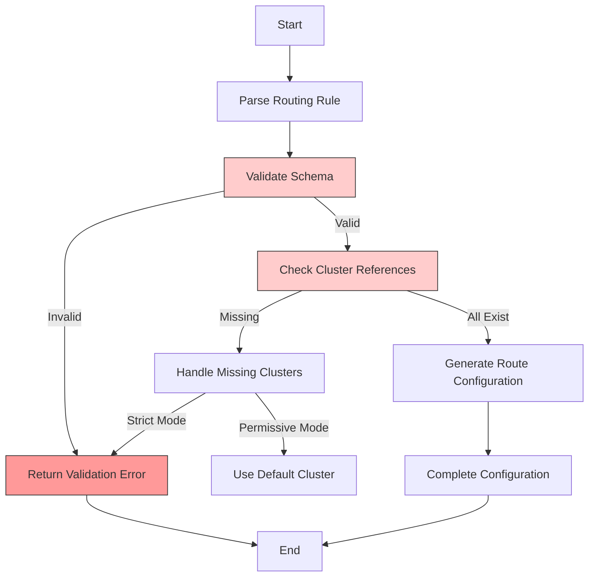
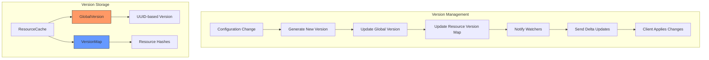

# RDS (Route Discovery Service)

<cite>
**Referenced Files in This Document**   
- [rds.go](file://plugin/apiserver/xdsserverv3/rds.go)
- [router_rule.go](file://apis/pkg/types/rules/router_rule.go)
- [resource/help.go](file://plugin/apiserver/xdsserverv3/resource/help.go)
- [cache/cache.go](file://plugin/apiserver/xdsserverv3/cache/cache.go)
- [generate.go](file://plugin/apiserver/xdsserverv3/generate.go)
- [ratelimit_query.go](file://pkg/cache/rules/ratelimit_query.go)
- [pole_server.sql](file://plugin/store/mysql/scripts/pole_server.sql)
</cite>

## Table of Contents
1. [Introduction](#introduction)
2. [RDS Request/Response Flow](#rds-requestresponse-flow)
3. [Route Configuration Translation](#route-configuration-translation)
4. [Virtual Host Organization](#virtual-host-organization)
5. [Rate Limiting Integration](#rate-limiting-integration)
6. [Traffic Splitting Policies](#traffic-splitting-policies)
7. [Common Use Case Examples](#common-use-case-examples)
8. [RDS and LDS Dependency](#rds-and-lds-dependency)
9. [Configuration Validation and Error Handling](#configuration-validation-and-error-handling)
10. [Versioning Mechanism](#versioning-mechanism)

## Introduction
The Route Discovery Service (RDS) in pole-server is responsible for translating governance model routing rules into Envoy-compatible route configurations. This service enables dynamic routing decisions based on various match criteria and route actions, supporting advanced traffic management patterns such as canary releases, A/B testing, and fault injection. The RDS implementation processes routing rules from the governance model and generates corresponding Envoy route configurations that include match criteria, route actions, and weighted clusters.

**Section sources**
- [rds.go](file://plugin/apiserver/xdsserverv3/rds.go#L1-L342)
- [router_rule.go](file://apis/pkg/types/rules/router_rule.go#L1-L609)

## RDS Request/Response Flow
The RDS request/response flow begins when an Envoy proxy sends a DiscoveryRequest for route configurations. The XDSServer receives this request and delegates to the RDSBuilder to generate appropriate RouteConfiguration resources. The flow differs based on the client's run type (gateway or sidecar) and traffic direction (inbound or outbound).

For sidecar proxies, the system generates separate route configurations for inbound and outbound traffic. Inbound configurations are created for the service's own traffic, while outbound configurations handle calls to other services. Gateway scenarios only require inbound processing, as they primarily handle incoming external traffic.

The response contains RouteConfiguration resources with virtual hosts and routes that correspond to the governance rules defined in the system. Each response is versioned to enable proper delta updates and cache validation.



**Diagram sources**
- [rds.go](file://plugin/apiserver/xdsserverv3/rds.go#L50-L75)
- [generate.go](file://plugin/apiserver/xdsserverv3/generate.go#L135-L175)

**Section sources**
- [rds.go](file://plugin/apiserver/xdsserverv3/rds.go#L50-L75)
- [generate.go](file://plugin/apiserver/xdsserverv3/generate.go#L135-L175)

## Route Configuration Translation
The RDS implementation translates pole-server's governance model routing rules into Envoy route configurations through the RDSBuilder component. This translation process involves converting high-level routing policies into specific Envoy route match criteria and route actions.

Routing rules are stored in the system as RouterConfig objects that contain JSON or binary serialized RuleRoutingConfig messages. These configurations are retrieved from the cache layer and parsed into structured data that can be translated into Envoy-compatible formats.

The translation process handles various match criteria including path prefixes, exact paths, regular expressions, HTTP methods, headers, query parameters, and caller IP addresses. Route actions include cluster routing, weighted clusters for traffic splitting, request/response header manipulation, and redirect rules.



**Diagram sources**
- [rds.go](file://plugin/apiserver/xdsserverv3/rds.go#L150-L302)
- [router_rule.go](file://apis/pkg/types/rules/router_rule.go#L445-L488)

**Section sources**
- [rds.go](file://plugin/apiserver/xdsserverv3/rds.go#L150-L302)
- [router_rule.go](file://apis/pkg/types/rules/router_rule.go#L445-L488)

## Virtual Host Organization
Virtual hosts in the RDS implementation are organized based on service boundaries and traffic direction. Each virtual host represents a logical service endpoint and contains routes that define how traffic should be handled.

For outbound traffic, each service dependency gets its own virtual host with domains derived from the service name and namespace. The system generates service-specific domains that Envoy can match against incoming requests. For inbound traffic, the virtual host represents the service itself and handles requests destined for that service.

The organization follows a consistent naming convention where virtual hosts are named using the service name and traffic direction. This enables clear separation of routing concerns and prevents routing conflicts between different services.

In gateway scenarios, a special virtual host named "gateway-virtualhost" is created to handle external traffic routing based on path prefixes. This virtual host contains routes that map URL paths to backend services, enabling simple API gateway functionality.



**Diagram sources**
- [rds.go](file://plugin/apiserver/xdsserverv3/rds.go#L100-L149)
- [resource/help.go](file://plugin/apiserver/xdsserverv3/resource/help.go#L375-L425)

**Section sources**
- [rds.go](file://plugin/apiserver/xdsserverv3/rds.go#L100-L149)
- [resource/help.go](file://plugin/apiserver/xdsserverv3/resource/help.go#L375-L425)

## Rate Limiting Integration
Rate limiting rules are integrated into RDS responses through the TypedPerFilterConfig and RateLimits fields in route configurations. When a routing rule matches a rate limiting policy, the RDSBuilder adds appropriate rate limiting configuration to the generated route.

The system supports both local and distributed rate limiting. For local rate limiting, the MakeSidecarLocalRateLimit and MakeGatewayLocalRateLimit functions generate the necessary configuration that includes rate limit actions and descriptors. These descriptors define the rate limiting keys such as service name, namespace, method, and custom labels.

Rate limiting rules are stored in the database with priority-based evaluation. When multiple rate limiting rules apply to a route, they are processed according to their priority, with lower numerical values indicating higher priority. The system converts these rules into Envoy rate limit actions that can be evaluated at the proxy level.



**Diagram sources**
- [rds.go](file://plugin/apiserver/xdsserverv3/rds.go#L266-L302)
- [resource/help.go](file://plugin/apiserver/xdsserverv3/resource/help.go#L375-L425)
- [ratelimit_query.go](file://pkg/cache/rules/ratelimit_query.go#L37-L79)

**Section sources**
- [rds.go](file://plugin/apiserver/xdsserverv3/rds.go#L266-L302)
- [resource/help.go](file://plugin/apiserver/xdsserverv3/resource/help.go#L375-L425)
- [ratelimit_query.go](file://pkg/cache/rules/ratelimit_query.go#L37-L79)

## Traffic Splitting Policies
Traffic splitting policies are implemented through weighted clusters in the route actions. When a routing rule defines multiple destinations with different weights, the RDSBuilder converts these into a WeightedCluster configuration in the Envoy route action.

The weight distribution is calculated based on the sum of all destination weights, with each cluster receiving a proportional percentage of traffic. This enables gradual rollouts, canary deployments, and A/B testing scenarios where traffic can be directed to different service versions based on predefined ratios.

The system supports both simple weighted routing and advanced traffic splitting with metadata-based routing. In metadata-based routing, traffic is split based on request metadata such as headers, query parameters, or cookies, allowing for more sophisticated routing decisions beyond simple percentage-based splitting.

```mermaid
classDiagram
class RouteAction {
+ClusterSpecifier
+WeightedClusters
+Timeout
+RetryPolicy
}
class WeightedCluster {
+Clusters[ClusterWeight]
+TotalWeight
}
class ClusterWeight {
+Name
+Weight
+MetadataMatch
}
class RouteMatch {
+PathSpecifier
+Headers[HeaderMatcher]
+QueryParameters[QueryParameterMatcher]
+RuntimeFraction
}
RouteAction --> WeightedCluster : "contains"
WeightedCluster --> ClusterWeight : "contains"
RouteAction --> RouteMatch : "matches"
note right of WeightedCluster
Represents traffic splitting
policy with multiple clusters
and their relative weights
end
note right of ClusterWeight
Individual cluster in
weighted distribution
with optional metadata
matching rules
end
```

**Diagram sources**
- [router_rule.go](file://apis/pkg/types/rules/router_rule.go#L445-L488)
- [rds.go](file://plugin/apiserver/xdsserverv3/rds.go#L150-L302)

**Section sources**
- [router_rule.go](file://apis/pkg/types/rules/router_rule.go#L445-L488)
- [rds.go](file://plugin/apiserver/xdsserverv3/rds.go#L150-L302)

## Common Use Case Examples

### Canary Release Configuration
For canary releases, the RDS configuration routes a small percentage of traffic to the new service version while maintaining most traffic on the stable version. This is achieved through weighted clusters with appropriate weight distribution.



### A/B Testing Configuration
A/B testing configurations use header-based routing to direct traffic to different service versions based on user segments or experimental groups. The route match criteria include specific header values that determine which version receives the request.



### Fault Injection Configuration
Fault injection rules are translated into route actions that introduce delays or abort requests under specific conditions. These configurations enable resilience testing by simulating various failure scenarios in production-like environments.



**Diagram sources**
- [rds.go](file://plugin/apiserver/xdsserverv3/rds.go#L150-L302)
- [router_rule.go](file://apis/pkg/types/rules/router_rule.go#L445-L488)

**Section sources**
- [rds.go](file://plugin/apiserver/xdsserverv3/rds.go#L150-L302)
- [router_rule.go](file://apis/pkg/types/rules/router_rule.go#L445-L488)

## RDS and LDS Dependency
The RDS and Listener Discovery Service (LDS) have a hierarchical dependency relationship where LDS resources must be available before RDS can be properly configured. This dependency exists because route configurations reference listener names and ports, requiring the listener configuration to be established first.

The XDSServer manages this dependency through the ResourceCache, which maintains separate containers for different xDS resource types. When generating configurations, the system ensures that LDS resources are updated before RDS resources, maintaining proper ordering in the configuration delivery.

In the cache layer, LDS resources are stored in a separate map from other xDS resources, allowing for independent versioning and update cycles. However, the generation process coordinates these updates to ensure consistency across the configuration set.

```mermaid
graph TD
A["Configuration Update"] --> B["Update LDS Resources"]
B --> C["Update RDS Resources"]
C --> D["Update CDS Resources"]
D --> E["Update EDS Resources"]
style B fill:#f96,stroke:#333
style C fill:#69f,stroke:#333
classDef lds fill:#f96,stroke:#333;
classDef rds fill:#69f,stroke:#333;
class B lds
class C rds
note right of B
LDS must be updated
first as RDS references
listener configurations
end
note right of C
RDS depends on LDS
for listener names
and port information
end
```

**Diagram sources**
- [cache/cache.go](file://plugin/apiserver/xdsserverv3/cache/cache.go#L262-L303)
- [generate.go](file://plugin/apiserver/xdsserverv3/generate.go#L62-L85)

**Section sources**
- [cache/cache.go](file://plugin/apiserver/xdsserverv3/cache/cache.go#L262-L303)
- [generate.go](file://plugin/apiserver/xdsserverv3/generate.go#L62-L85)

## Configuration Validation and Error Handling
Configuration validation occurs at multiple levels in the RDS implementation. When route rules are received, they undergo schema validation to ensure all required fields are present and properly formatted. Malformed rules are rejected with appropriate error codes that indicate the nature of the validation failure.

The system validates references to non-existent clusters during the route generation process. If a routing rule references a cluster that cannot be resolved, the rule is either skipped or a default error response is generated, depending on the configuration. This prevents invalid configurations from being propagated to Envoy proxies.

Error handling includes comprehensive logging of validation failures and configuration issues. The system also provides detailed error responses that can be used for troubleshooting and debugging routing issues. Validation occurs both at rule creation time and during route generation to catch issues early in the process.



**Diagram sources**
- [router_rule.go](file://apis/pkg/types/rules/router_rule.go#L156-L197)
- [rds.go](file://plugin/apiserver/xdsserverv3/rds.go#L150-L302)

**Section sources**
- [router_rule.go](file://apis/pkg/types/rules/router_rule.go#L156-L197)
- [rds.go](file://plugin/apiserver/xdsserverv3/rds.go#L150-L302)

## Versioning Mechanism
The RDS implementation uses a versioning mechanism to manage configuration updates and enable efficient delta delivery. Each RouteConfiguration resource is assigned a unique version string that changes whenever the configuration is modified.

The versioning system supports both full and delta updates. For full updates, the entire configuration set is sent with a new version number. For delta updates, only the changed resources are sent, along with their individual version hashes. This reduces bandwidth usage and improves update efficiency.

Version numbers are generated using UUIDs to ensure global uniqueness and prevent version conflicts. The ResourceCache maintains version maps for each resource type, allowing the system to track the current version of all configurations and determine what has changed between updates.

The versioning mechanism also supports on-demand (demand) configurations, where clients can request specific subsets of routes as needed. These on-demand configurations have their own versioning space, separate from the full configuration set.



**Diagram sources**
- [cache/cache.go](file://plugin/apiserver/xdsserverv3/cache/cache.go#L191-L216)
- [rds.go](file://plugin/apiserver/xdsserverv3/rds.go#L50-L75)

**Section sources**
- [cache/cache.go](file://plugin/apiserver/xdsserverv3/cache/cache.go#L191-L216)
- [rds.go](file://plugin/apiserver/xdsserverv3/rds.go#L50-L75)