# XDS v3 API Reference

<cite>
**Referenced Files in This Document**   
- [server.go](file://plugin/apiserver/xdsserverv3/server.go)
- [generate.go](file://plugin/apiserver/xdsserverv3/generate.go)
- [resource/model.go](file://plugin/apiserver/xdsserverv3/resource/model.go)
- [resource/node.go](file://plugin/apiserver/xdsserverv3/resource/node.go)
- [cache/cache.go](file://plugin/apiserver/xdsserverv3/cache/cache.go)
- [cds.go](file://plugin/apiserver/xdsserverv3/cds.go)
- [eds.go](file://plugin/apiserver/xdsserverv3/eds.go)
- [lds.go](file://plugin/apiserver/xdsserverv3/lds.go)
- [rds.go](file://plugin/apiserver/xdsserverv3/rds.go)
- [vhds.go](file://plugin/apiserver/xdsserverv3/vhds.go)
</cite>

## Table of Contents
1. [Introduction](#introduction)
2. [XDS Service Architecture](#xds-service-architecture)
3. [Resource Discovery Flow](#resource-discovery-flow)
4. [gRPC Service Definition](#grpc-service-definition)
5. [Request/Response Message Structures](#requestresponse-message-structures)
6. [Streaming Update Mechanisms](#streaming-update-mechanisms)
7. [ACK/NACK Handling](#acknack-handling)
8. [Versioning Strategy](#versioning-strategy)
9. [Client Configuration for Envoy Proxies](#client-configuration-for-envoy-proxies)
10. [Resource Model Mapping](#resource-model-mapping)
11. [Rate Limiting on Discovery Requests](#rate-limiting-on-discovery-requests)
12. [Security Considerations](#security-considerations)
13. [Service-Specific Implementations](#service-specific-implementations)

## Introduction
The XDS v3 implementation in pole-server provides a comprehensive control plane for service mesh data plane configuration through the xDS APIs. This documentation details the implementation of Cluster Discovery Service (CDS), Endpoint Discovery Service (EDS), Listener Discovery Service (LDS), Route Discovery Service (RDS), and Aggregated Discovery Service (ADS) as defined by the Envoy proxy control plane interface. The system enables dynamic configuration of service mesh proxies, supporting both sidecar and gateway deployment patterns with comprehensive traffic management, security, and observability features.

## XDS Service Architecture
The XDS v3 implementation in pole-server follows a modular architecture with clear separation of concerns between service orchestration, resource generation, and caching layers. The core components work together to provide a scalable and efficient control plane for service mesh configuration.

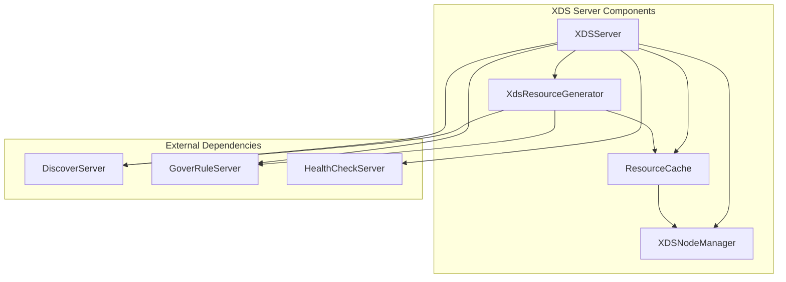

**Diagram sources**
- [server.go](file://plugin/apiserver/xdsserverv3/server.go#L1-L484)
- [generate.go](file://plugin/apiserver/xdsserverv3/generate.go#L1-L246)

**Section sources**
- [server.go](file://plugin/apiserver/xdsserverv3/server.go#L1-L484)
- [generate.go](file://plugin/apiserver/xdsserverv3/generate.go#L1-L246)

## Resource Discovery Flow
The resource discovery flow in pole-server's XDS v3 implementation follows a systematic process to ensure consistent and up-to-date configuration delivery to connected Envoy proxies. The flow begins with initialization and continues with periodic synchronization and on-demand updates.

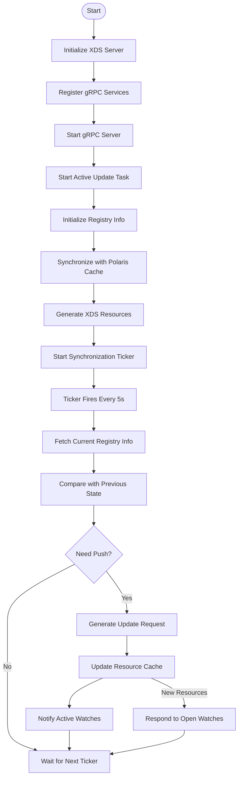

**Diagram sources**
- [server.go](file://plugin/apiserver/xdsserverv3/server.go#L200-L350)
- [generate.go](file://plugin/apiserver/xdsserverv3/generate.go#L50-L100)

**Section sources**
- [server.go](file://plugin/apiserver/xdsserverv3/server.go#L200-L350)
- [generate.go](file://plugin/apiserver/xdsserverv3/generate.go#L50-L100)

## gRPC Service Definition
The XDS v3 implementation exposes multiple gRPC services as defined by the Envoy control plane API specification. These services are registered with the gRPC server to handle discovery requests from Envoy proxies.

```mermaid
classDiagram
class AggregatedDiscoveryService {
+StreamAggregatedResources(stream DiscoveryRequest) stream DiscoveryResponse
}
class ClusterDiscoveryService {
+StreamClusters(stream DiscoveryRequest) stream DiscoveryResponse
+DeltaClusters(stream DeltaDiscoveryRequest) stream DeltaDiscoveryResponse
+FetchClusters(DiscoveryRequest) DiscoveryResponse
}
class EndpointDiscoveryService {
+StreamEndpoints(stream DiscoveryRequest) stream DiscoveryResponse
+DeltaEndpoints(stream DeltaDiscoveryRequest) stream DeltaDiscoveryResponse
+FetchEndpoints(DiscoveryRequest) DiscoveryResponse
}
class ListenerDiscoveryService {
+StreamListeners(stream DiscoveryRequest) stream DiscoveryResponse
+DeltaListeners(stream DeltaDiscoveryRequest) stream DeltaDiscoveryResponse
+FetchListeners(DiscoveryRequest) DiscoveryResponse
}
class RouteDiscoveryService {
+StreamRoutes(stream DiscoveryRequest) stream DiscoveryResponse
+DeltaRoutes(stream DeltaDiscoveryRequest) stream DeltaDiscoveryResponse
+FetchRoutes(DiscoveryRequest) DiscoveryResponse
}
class VirtualHostDiscoveryService {
+StreamVirtualHosts(stream DiscoveryRequest) stream DiscoveryResponse
+DeltaVirtualHosts(stream DeltaDiscoveryRequest) stream DeltaDiscoveryResponse
+FetchVirtualHosts(DiscoveryRequest) DiscoveryResponse
}
class HealthDiscoveryService {
+StreamHealthCheck(stream HealthCheckRequest) stream HealthCheckResponse
}
AggregatedDiscoveryService <|-- XDSServer
ClusterDiscoveryService <|-- XDSServer
EndpointDiscoveryService <|-- XDSServer
ListenerDiscoveryService <|-- XDSServer
RouteDiscoveryService <|-- XDSServer
VirtualHostDiscoveryService <|-- XDSServer
HealthDiscoveryService <|-- XDSServer
```

**Diagram sources**
- [server.go](file://plugin/apiserver/xdsserverv3/server.go#L150-L180)
- [server.go](file://plugin/apiserver/xdsserverv3/server.go#L100-L120)

**Section sources**
- [server.go](file://plugin/apiserver/xdsserverv3/server.go#L100-L180)

## Request/Response Message Structures
The XDS v3 implementation uses standardized request and response message structures that conform to the Envoy control plane API specification. These structures define the format of discovery requests and responses for all xDS services.

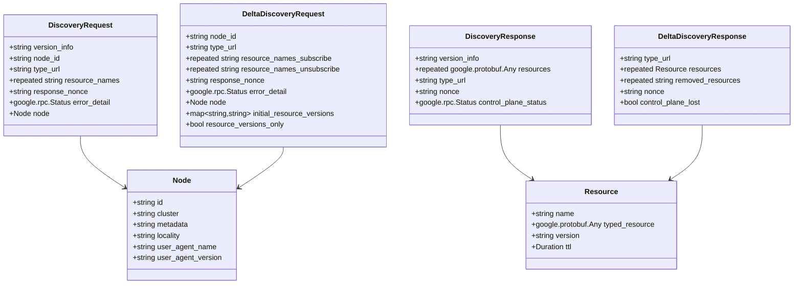

**Diagram sources**
- [server.go](file://plugin/apiserver/xdsserverv3/server.go#L250-L300)
- [cache/cache.go](file://plugin/apiserver/xdsserverv3/cache/cache.go#L300-L400)

**Section sources**
- [server.go](file://plugin/apiserver/xdsserverv3/server.go#L250-L300)
- [cache/cache.go](file://plugin/apiserver/xdsserverv3/cache/cache.go#L300-L400)

## Streaming Update Mechanisms
The XDS v3 implementation supports both streaming and delta streaming update mechanisms to efficiently deliver configuration updates to Envoy proxies. The system maintains open watches for connected clients and pushes updates when configuration changes occur.

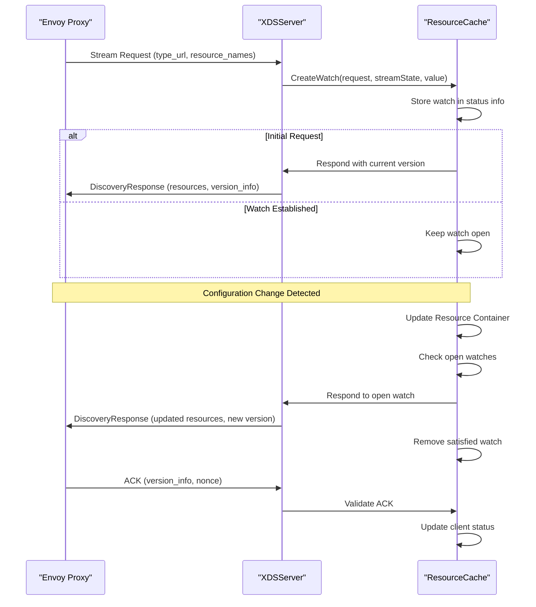

**Diagram sources**
- [cache/cache.go](file://plugin/apiserver/xdsserverv3/cache/cache.go#L500-L800)
- [server.go](file://plugin/apiserver/xdsserverv3/server.go#L200-L250)

**Section sources**
- [cache/cache.go](file://plugin/apiserver/xdsserverv3/cache/cache.go#L500-L800)
- [server.go](file://plugin/apiserver/xdsserverv3/server.go#L200-L250)

## ACK/NACK Handling
The XDS v3 implementation includes robust ACK/NACK handling to ensure configuration consistency between the control plane and data plane. The system validates client acknowledgments and handles negative acknowledgments appropriately.

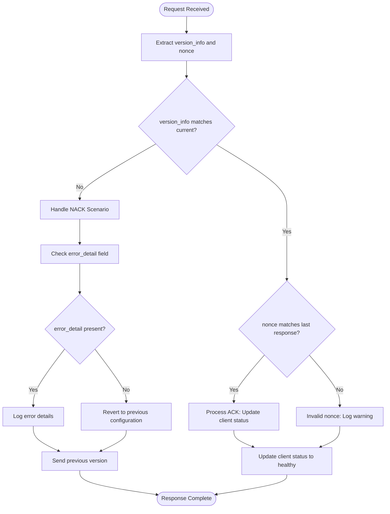

**Diagram sources**
- [cache/cache.go](file://plugin/apiserver/xdsserverv3/cache/cache.go#L600-L700)
- [server.go](file://plugin/apiserver/xdsserverv3/server.go#L300-L350)

**Section sources**
- [cache/cache.go](file://plugin/apiserver/xdsserverv3/cache/cache.go#L600-L700)
- [server.go](file://plugin/apiserver/xdsserverv3/server.go#L300-L350)

## Versioning Strategy
The XDS v3 implementation employs a comprehensive versioning strategy to ensure consistent configuration delivery and proper handling of updates. Versioning occurs at multiple levels, including global, per-resource, and per-namespace.

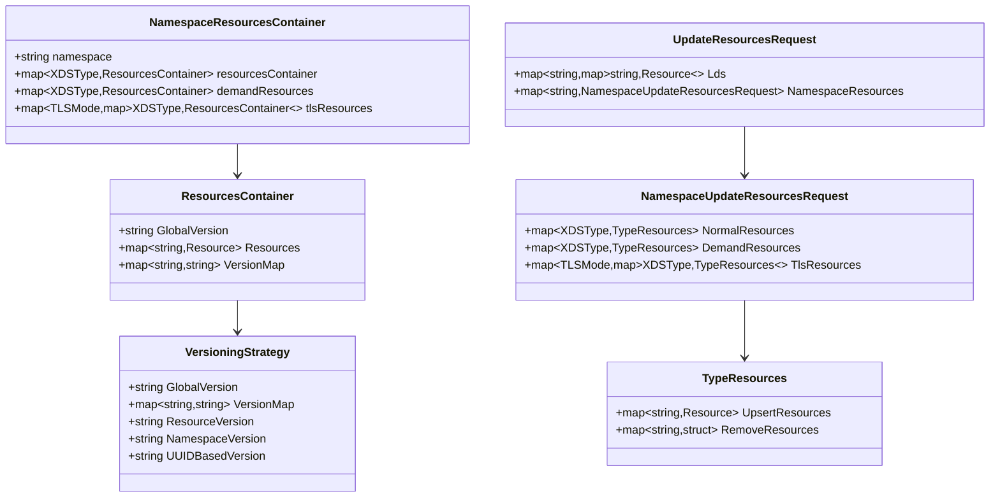

**Diagram sources**
- [cache/cache.go](file://plugin/apiserver/xdsserverv3/cache/cache.go#L200-L300)
- [generate.go](file://plugin/apiserver/xdsserverv3/generate.go#L100-L150)

**Section sources**
- [cache/cache.go](file://plugin/apiserver/xdsserverv3/cache/cache.go#L200-L300)
- [generate.go](file://plugin/apiserver/xdsserverv3/generate.go#L100-L150)

## Client Configuration for Envoy Proxies
The XDS v3 implementation supports configuration of Envoy proxies in both plaintext and mTLS scenarios. Client configuration is determined by metadata provided in the Envoy node identifier and metadata fields.

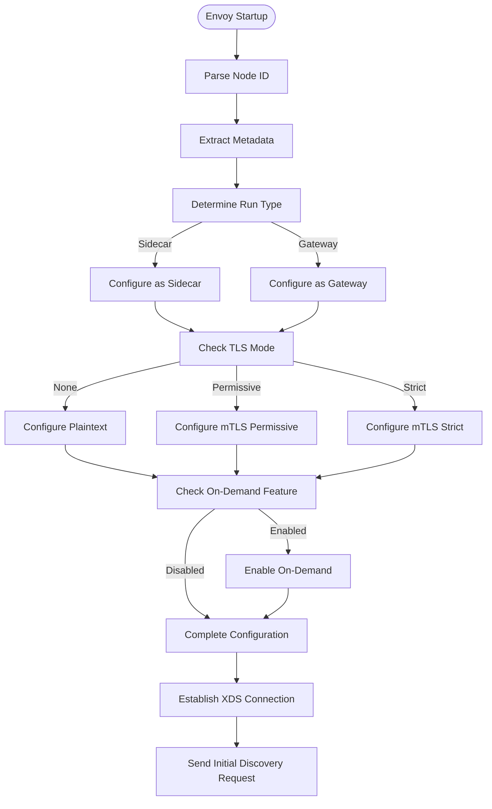

**Diagram sources**
- [resource/node.go](file://plugin/apiserver/xdsserverv3/resource/node.go#L100-L200)
- [resource/model.go](file://plugin/apiserver/xdsserverv3/resource/model.go#L50-L100)

**Section sources**
- [resource/node.go](file://plugin/apiserver/xdsserverv3/resource/node.go#L100-L200)
- [resource/model.go](file://plugin/apiserver/xdsserverv3/resource/model.go#L50-L100)

## Resource Model Mapping
The XDS v3 implementation maps pole-server's service registry to XDS resources through a comprehensive transformation process. This mapping converts service, instance, and routing information into the appropriate xDS resource types.

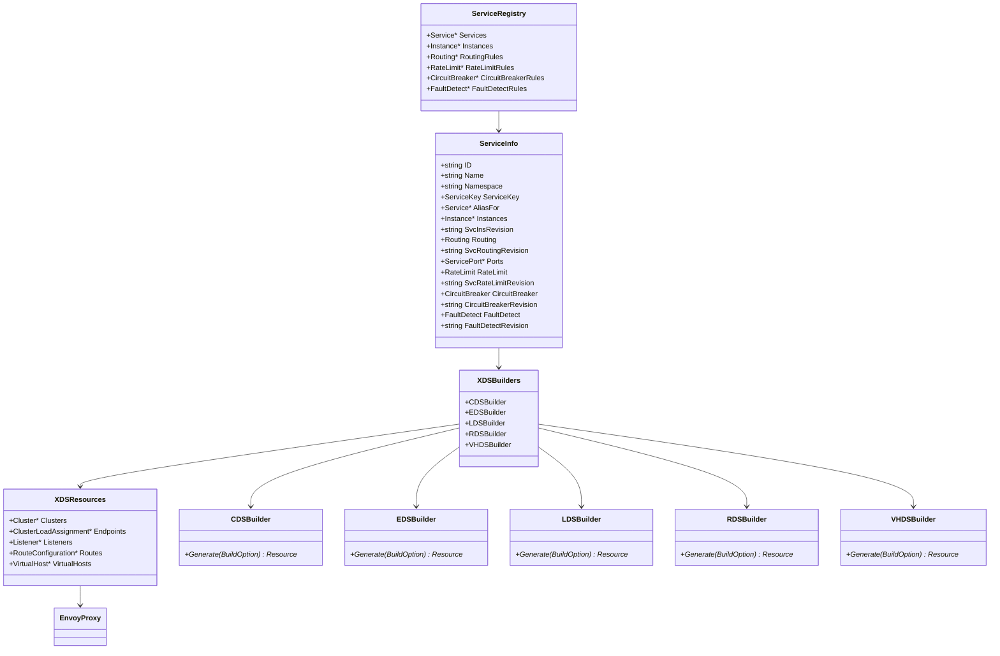

**Diagram sources**
- [resource/model.go](file://plugin/apiserver/xdsserverv3/resource/model.go#L150-L250)
- [generate.go](file://plugin/apiserver/xdsserverv3/generate.go#L150-L200)

**Section sources**
- [resource/model.go](file://plugin/apiserver/xdsserverv3/resource/model.go#L150-L250)
- [generate.go](file://plugin/apiserver/xdsserverv3/generate.go#L150-L200)

## Rate Limiting on Discovery Requests
The XDS v3 implementation includes rate limiting capabilities for discovery requests to protect the control plane from excessive load. Rate limiting is configured at the server level and applied to incoming connections.

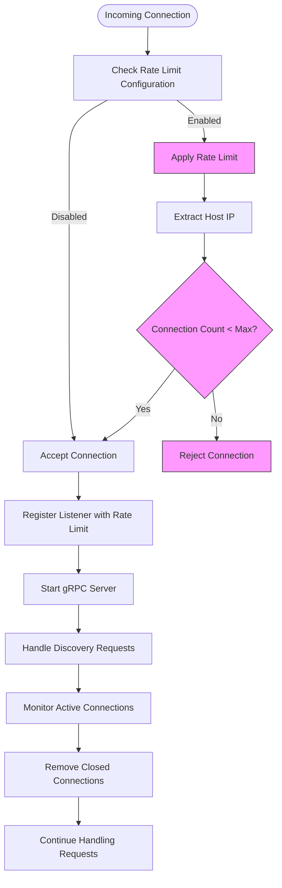

**Diagram sources**
- [server.go](file://plugin/apiserver/xdsserverv3/server.go#L80-L100)
- [server.go](file://plugin/apiserver/xdsserverv3/server.go#L130-L150)

**Section sources**
- [server.go](file://plugin/apiserver/xdsserverv3/server.go#L80-L150)

## Security Considerations
The XDS v3 implementation addresses security considerations for control plane communication through multiple mechanisms, including TLS mode configuration, metadata validation, and secure transport options.

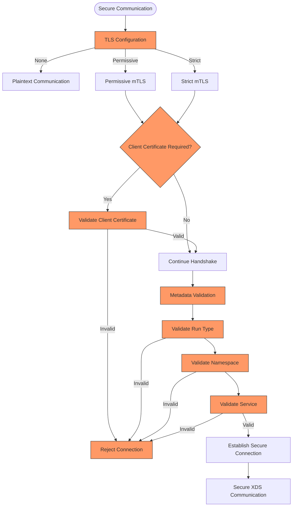

**Diagram sources**
- [resource/model.go](file://plugin/apiserver/xdsserverv3/resource/model.go#L100-L150)
- [resource/node.go](file://plugin/apiserver/xdsserverv3/resource/node.go#L200-L250)

**Section sources**
- [resource/model.go](file://plugin/apiserver/xdsserverv3/resource/model.go#L100-L150)
- [resource/node.go](file://plugin/apiserver/xdsserverv3/resource/node.go#L200-L250)

## Service-Specific Implementations

### Cluster Discovery Service (CDS)
The Cluster Discovery Service implementation generates cluster configurations for Envoy proxies based on service registry information. It supports both plaintext and mTLS configurations with appropriate transport socket settings.

```mermaid
classDiagram
class CDSBuilder {
+DiscoverServer svr
+Init(DiscoverServer)
+Generate(BuildOption) (interface{}, error)
+GenerateByDirection(BuildOption, TrafficDirection) ([]Resource, error)
+makeCluster(ServiceInfo, TrafficDirection, BuildOption) *Cluster
}
class Cluster {
+string Name
+Duration ConnectTimeout
+ClusterDiscoveryType ClusterDiscoveryType
+EdsClusterConfig EdsClusterConfig
+LbSubsetConfig LbSubsetConfig
+OutlierDetection OutlierDetection
+HealthChecks HealthCheck*
+TransportSocketMatches TransportSocketMatch*
}
class TransportSocketMatch {
+string Name
+Struct Match
+TransportSocket TransportSocket
}
class TransportSocket {
+string Name
+TypedConfig TypedConfig
}
CDSBuilder --> Cluster
CDSBuilder --> TransportSocketMatch
TransportSocketMatch --> TransportSocket
Cluster --> LbSubsetConfig
Cluster --> OutlierDetection
Cluster --> HealthCheck
```

**Diagram sources**
- [cds.go](file://plugin/apiserver/xdsserverv3/cds.go#L1-L150)
- [resource/model.go](file://plugin/apiserver/xdsserverv3/resource/model.go#L200-L250)

**Section sources**
- [cds.go](file://plugin/apiserver/xdsserverv3/cds.go#L1-L150)

### Endpoint Discovery Service (EDS)
The Endpoint Discovery Service implementation generates endpoint assignments for clusters based on service instance information. It handles both inbound and outbound traffic scenarios with appropriate locality-based load balancing.

```mermaid
classDiagram
class EDSBuilder {
+Init(DiscoverServer)
+Generate(BuildOption) (interface{}, error)
+makeBoundEndpoints(BuildOption, TrafficDirection) []Resource
+buildServiceEndpoint(ServiceInfo) []*LocalityLbEndpoints
+makeSelfEndpoint(BuildOption) []Resource
}
class ClusterLoadAssignment {
+string ClusterName
+LocalityLbEndpoints* Endpoints
}
class LocalityLbEndpoints {
+Locality Locality
+LbEndpoint* LbEndpoints
+uint32 LoadBalancingWeight
+uint32 Priority
}
class LbEndpoint {
+Endpoint HostIdentifier
+HealthStatus HealthStatus
+uint32 LoadBalancingWeight
+Metadata Metadata
}
class Endpoint {
+Address Address
+HealthCheckConfig HealthCheckConfig
}
class Address {
+SocketAddress SocketAddress
}
class SocketAddress {
+string Address
+uint32 PortValue
+Protocol Protocol
}
EDSBuilder --> ClusterLoadAssignment
ClusterLoadAssignment --> LocalityLbEndpoints
LocalityLbEndpoints --> LbEndpoint
LbEndpoint --> Endpoint
Endpoint --> Address
Address --> SocketAddress
```

**Diagram sources**
- [eds.go](file://plugin/apiserver/xdsserverv3/eds.go#L1-L204)
- [resource/model.go](file://plugin/apiserver/xdsserverv3/resource/model.go#L150-L200)

**Section sources**
- [eds.go](file://plugin/apiserver/xdsserverv3/eds.go#L1-L204)

### Listener Discovery Service (LDS)
The Listener Discovery Service implementation generates listener configurations for Envoy proxies, supporting both sidecar and gateway deployment patterns with appropriate filter chains and listener filters.

```mermaid
classDiagram
class LDSBuilder {
+DiscoverServer svr
+Init(DiscoverServer)
+Generate(BuildOption) (interface{}, error)
+makeListener(BuildOption, TrafficDirection) ([]Resource, error)
+makeDefaultListener(TrafficDirection, HttpConnectionManager, BuildOption, []uint32) *Listener
+makeListenersMatchDestinationPorts(BuildOption) []uint32
+makeDefaultListenerFilterChain(TrafficDirection, HttpConnectionManager, []uint32) []*FilterChain
}
class Listener {
+string Name
+TrafficDirection TrafficDirection
+Address Address
+FilterChain* FilterChains
+FilterChain DefaultFilterChain
+ListenerFilter* ListenerFilters
}
class FilterChain {
+FilterChainMatch FilterChainMatch
+TransportSocket TransportSocket
+Filter* Filters
+string Name
}
class Filter {
+string Name
+TypedConfig TypedConfig
}
class ListenerFilter {
+string Name
+TypedConfig TypedConfig
}
class HttpConnectionManager {
+string RouteSpecifier
+Rds Rds
+HttpFilter* HttpFilters
+bool UseRemoteAddress
+Tracing Tracing
}
LDSBuilder --> Listener
Listener --> FilterChain
Listener --> ListenerFilter
FilterChain --> Filter
Filter --> HttpConnectionManager
```

**Diagram sources**
- [lds.go](file://plugin/apiserver/xdsserverv3/lds.go#L1-L246)
- [resource/model.go](file://plugin/apiserver/xdsserverv3/resource/model.go#L100-L150)

**Section sources**
- [lds.go](file://plugin/apiserver/xdsserverv3/lds.go#L1-L246)

### Route Discovery Service (RDS)
The Route Discovery Service implementation generates route configurations for Envoy proxies based on routing rules defined in the service registry. It supports both standard and on-demand route discovery.

```mermaid
classDiagram
class RDSBuilder {
+DiscoverServer svr
+Init(DiscoverServer)
+Generate(BuildOption) (interface{}, error)
+makeRouteConfiguration(BuildOption, TrafficDirection) *RouteConfiguration
+makeVirtualHosts(ServiceInfo, TrafficDirection) []*VirtualHost
+makeRoutes(ServiceInfo) []*Route
+makeRouteMatch(ServiceInfo) *RouteMatch
+makeRouteAction(ServiceInfo) *RouteAction
}
class RouteConfiguration {
+string Name
+VirtualHost* VirtualHosts
+bool ValidateClusters
}
class VirtualHost {
+string Name
+string* Domains
+Route* Routes
+uint32 RetryPolicy
}
class Route {
+RouteMatch Match
+RouteAction Action
+Route* DirectResponse
+string Metadata
+uint32 Priority
+uint32 Timeout
+RetryPolicy RetryPolicy
}
class RouteMatch {
+string Path
+string Prefix
+string SafeRegex
+string* Headers
+string* QueryParameters
+uint32 RuntimeFraction
}
class RouteAction {
+Cluster Cluster
+WeightedCluster WeightedCluster
+ClusterNotFoundAction ClusterNotFoundAction
+uint32 Timeout
+RetryPolicy RetryPolicy
}
RDSBuilder --> RouteConfiguration
RouteConfiguration --> VirtualHost
VirtualHost --> Route
Route --> RouteMatch
Route --> RouteAction
```

**Diagram sources**
- [rds.go](file://plugin/apiserver/xdsserverv3/rds.go#L1-L200)
- [resource/model.go](file://plugin/apiserver/xdsserverv3/resource/model.go#L50-L100)

**Section sources**
- [rds.go](file://plugin/apiserver/xdsserverv3/rds.go#L1-L200)

### Aggregated Discovery Service (ADS)
The Aggregated Discovery Service implementation provides a single multiplexed stream for all xDS resources, reducing connection overhead and improving configuration consistency across resource types.

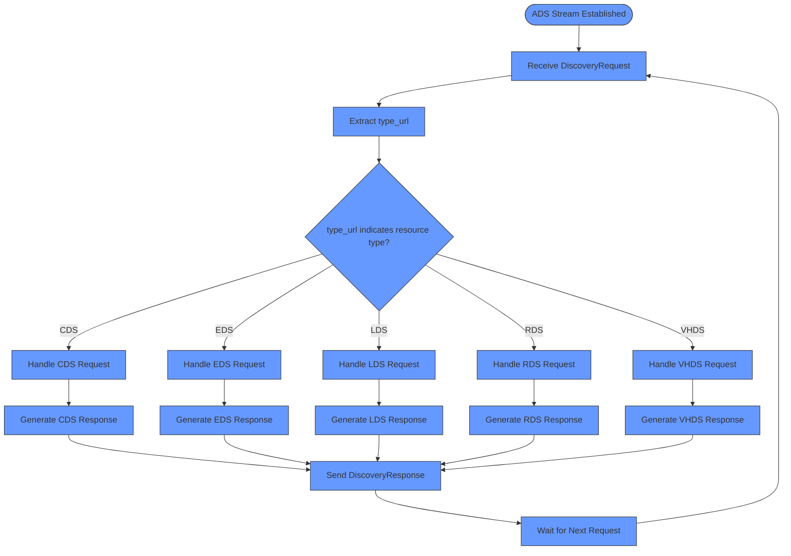

**Diagram sources**
- [server.go](file://plugin/apiserver/xdsserverv3/server.go#L150-L180)
- [cache/cache.go](file://plugin/apiserver/xdsserverv3/cache/cache.go#L500-L800)

**Section sources**
- [server.go](file://plugin/apiserver/xdsserverv3/server.go#L150-L180)
- [cache/cache.go](file://plugin/apiserver/xdsserverv3/cache/cache.go#L500-L800)