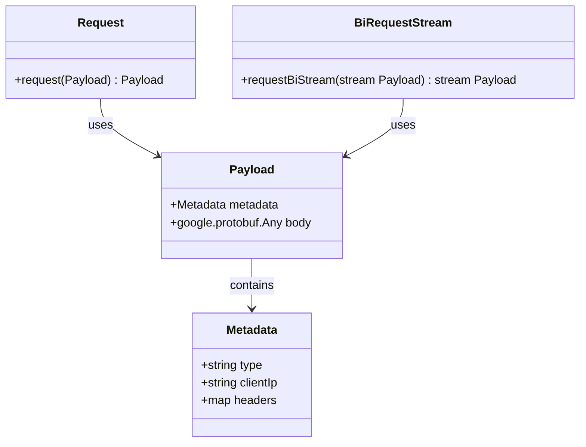
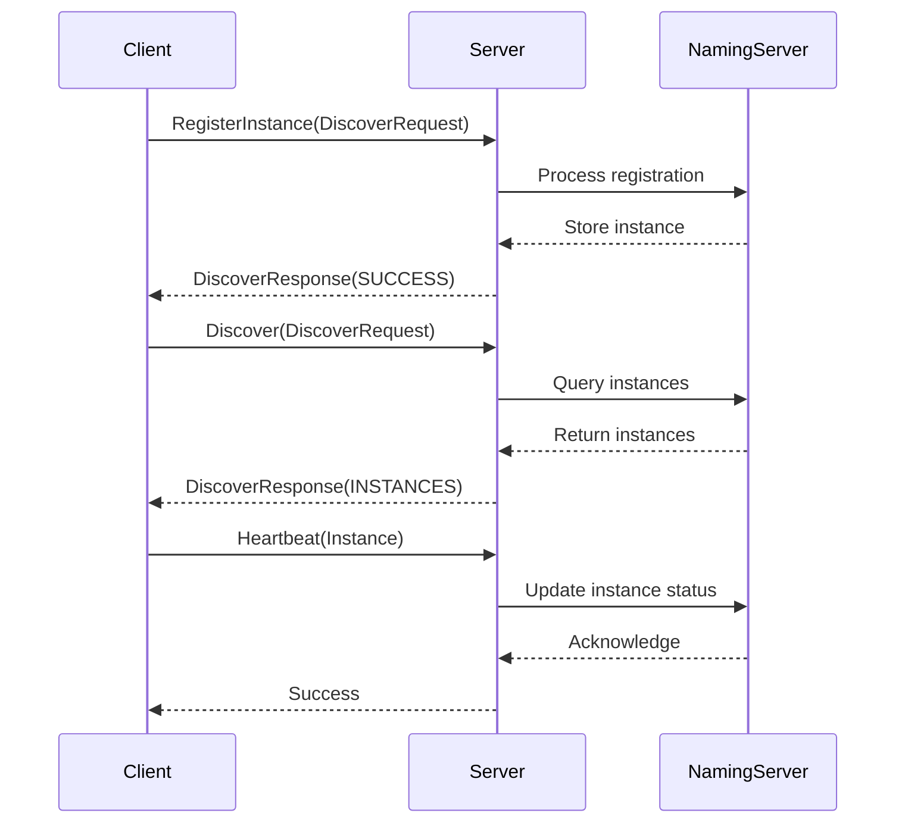
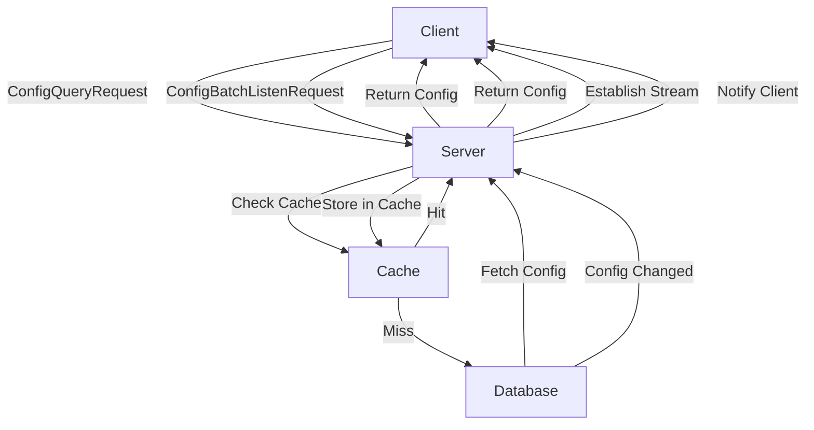
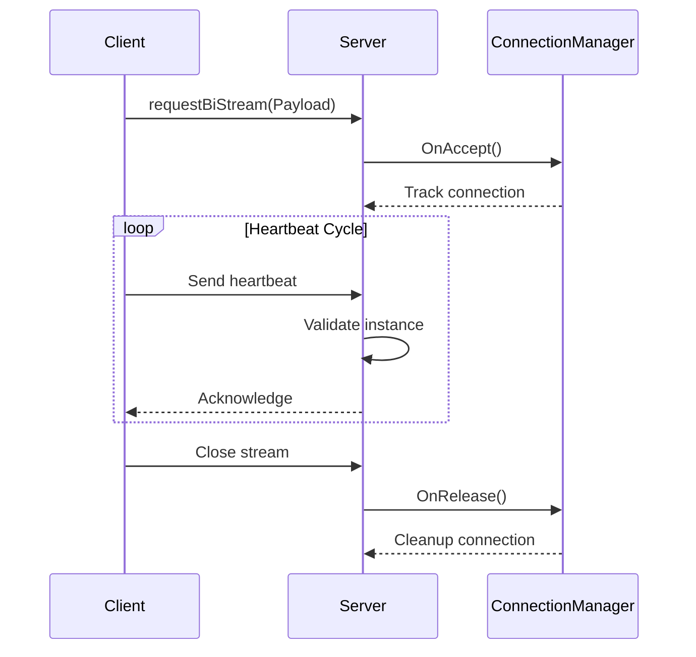
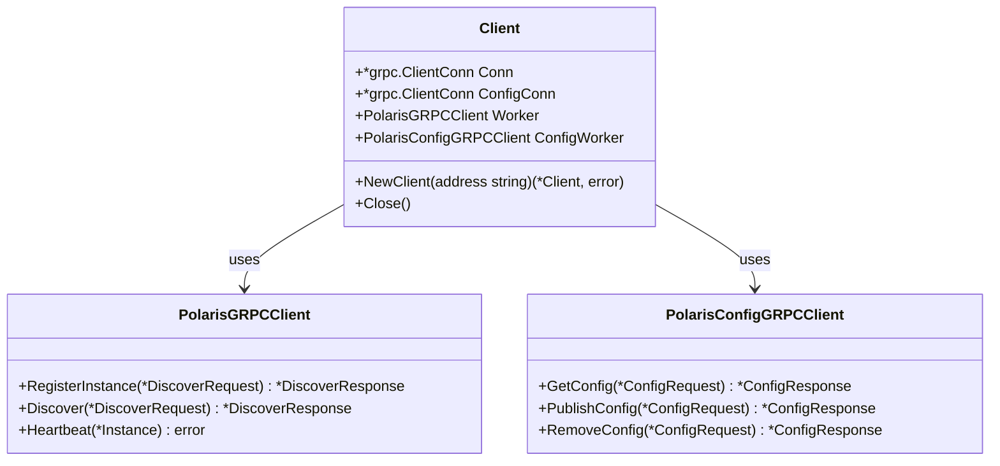
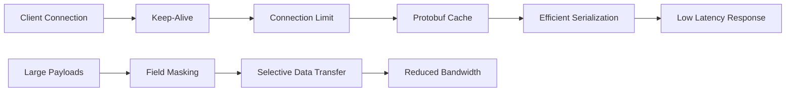

# gRPC API Reference

<cite>
**Referenced Files in This Document**   
- [nacos_grpc_service.proto](file://plugin/apiserver/nacosserver/v2/pb/nacos_grpc_service.proto)
- [server.go](file://plugin/apiserver/grpcserver/discover/server.go)
- [client.go](file://test/integrate/grpc/client.go)
- [base.go](file://plugin/apiserver/grpcserver/base.go)
- [keepalive.go](file://pkg/common/conn/keepalive/keepalive.go)
- [config_response.go](file://pkg/common/api/v1/config_response.go)
- [client_access.go](file://plugin/apiserver/grpcserver/config/client_access.go)
</cite>

## Table of Contents
1. [Introduction](#introduction)
2. [Service Definitions](#service-definitions)
3. [Discovery API](#discovery-api)
4. [Configuration API](#configuration-api)
5. [Streaming Patterns](#streaming-patterns)
6. [Error Handling](#error-handling)
7. [Authentication Integration](#authentication-integration)
8. [Rate Limiting Enforcement](#rate-limiting-enforcement)
9. [Client Implementation in Go](#client-implementation-in-go)
10. [Versioning Strategy](#versioning-strategy)
11. [Performance Considerations](#performance-considerations)

## Introduction
The pole-server exposes gRPC APIs for service discovery and configuration management, enabling clients to register services, discover instances, and retrieve configuration files. The APIs follow the Nacos v2 gRPC protocol specification and provide both unary and streaming endpoints for efficient communication. This document details the API contracts, message structures, and implementation patterns used throughout the system.

**Section sources**
- [nacos_grpc_service.proto](file://plugin/apiserver/nacosserver/v2/pb/nacos_grpc_service.proto)

## Service Definitions
The gRPC services are defined using Protocol Buffers, with the core interface defined in the `nacos_grpc_service.proto` file. Two primary services are exposed: `Request` for unary operations and `BiRequestStream` for bidirectional streaming. The payload structure uses a generic envelope pattern with metadata and an Any-wrapped body, allowing flexible extension of request/response types without breaking compatibility.

**Diagram sources**
- [nacos_grpc_service.proto](file://plugin/apiserver/nacosserver/v2/pb/nacos_grpc_service.proto)

**Section sources**
- [nacos_grpc_service.proto](file://plugin/apiserver/nacosserver/v2/pb/nacos_grpc_service.proto)

## Discovery API
The Discovery API enables service registration, instance heartbeat, and service discovery operations. It supports both unary requests for one-time operations and streaming for long-lived connections. The API handles various discovery request types including instance registration, service queries, batch operations, and subscription management. The server maintains connection state and handles client lifecycle events through dedicated interceptors.

**Diagram sources**
- [server.go](file://plugin/apiserver/grpcserver/discover/server.go)
- [client.go](file://test/integrate/grpc/client.go)

**Section sources**
- [server.go](file://plugin/apiserver/grpcserver/discover/server.go)
- [client.go](file://test/integrate/grpc/client.go)

## Configuration API
The Configuration API provides operations for managing configuration files, including publishing, querying, removing, and watching configurations. The API supports both direct operations and change notification streams. Clients can listen for configuration changes using the `ConfigBatchListenRequest` which establishes a streaming connection for real-time updates. The server implements caching mechanisms to reduce database load and improve response times.

**Diagram sources**
- [client_access.go](file://plugin/apiserver/grpcserver/config/client_access.go)
- [config_response.go](file://pkg/common/api/v1/config_response.go)

**Section sources**
- [client_access.go](file://plugin/apiserver/grpcserver/config/client_access.go)
- [config_response.go](file://pkg/common/api/v1/config_response.go)

## Streaming Patterns
The gRPC API implements several streaming patterns to support real-time communication between clients and server. The primary streaming pattern is the heartbeat stream, which allows clients to maintain a persistent connection for sending periodic heartbeats and receiving service updates. The server uses bidirectional streaming to manage connection setup, keep-alive messages, and service instance updates. Connection state is tracked using connection hooks that monitor accept, release, and close events.

**Diagram sources**
- [base.go](file://plugin/apiserver/grpcserver/base.go)
- [server.go](file://plugin/apiserver/nacosserver/v2/server.go)

**Section sources**
- [base.go](file://plugin/apiserver/grpcserver/base.go)
- [server.go](file://plugin/apiserver/nacosserver/v2/server.go)

## Error Handling
Error handling in the gRPC API follows standard gRPC status codes, with additional application-specific error codes defined in the response messages. The server returns appropriate gRPC status codes for transport-level errors (e.g., UNAVAILABLE, DEADLINE_EXCEEDED) and uses the `Code` field in response messages for application-level errors. Common error codes include `ExecuteSuccess` for successful operations, `DataNoChange` for unchanged data during discovery, and various validation error codes for invalid requests.

**Section sources**
- [config_response.go](file://pkg/common/api/v1/config_response.go)
- [server.go](file://plugin/apiserver/grpcserver/discover/server.go)

## Authentication Integration
Authentication is integrated through metadata headers in gRPC requests, allowing clients to pass authentication tokens and other credentials. The server implements unary and stream interceptors to validate authentication information before processing requests. Access control is enforced based on configured policies, with support for role-based access control and IP whitelisting. Authentication metadata is extracted from the request context and validated against configured authentication providers.

**Section sources**
- [base.go](file://plugin/apiserver/grpcserver/base.go)
- [server.go](file://plugin/apiserver/grpcserver/discover/server.go)

## Rate Limiting Enforcement
Rate limiting is enforced at the server level using configurable rate limiting rules. The server integrates with the ratelimit plugin to control the number of requests per client IP and method. Rate limiting configuration is applied during server initialization and can be dynamically updated. The rate limiter tracks request counts and returns appropriate responses when limits are exceeded, helping to protect the server from abuse and ensure fair resource usage.

**Section sources**
- [base.go](file://plugin/apiserver/grpcserver/base.go)
- [server.go](file://plugin/apiserver/grpcserver/discover/server.go)

## Client Implementation in Go
Go clients interact with the gRPC API using generated stubs from the service definitions. The client implementation establishes separate connections for discovery and configuration services, using standard gRPC dial options. Connection setup includes configuring insecure transport (for development) or TLS (for production). The client provides methods for service registration, discovery, heartbeat, and configuration operations, with proper error handling and retry logic.

**Diagram sources**
- [client.go](file://test/integrate/grpc/client.go)

**Section sources**
- [client.go](file://test/integrate/grpc/client.go)

## Versioning Strategy
The API follows a backward compatibility strategy with versioned endpoints and message structures. The server supports multiple API versions simultaneously, allowing gradual migration of clients. Message fields are designed to be backward compatible, with optional fields and default values to ensure older clients can work with newer server versions. The revision mechanism in discovery responses enables clients to implement efficient caching and change detection without requiring full data transfers.

**Section sources**
- [server.go](file://plugin/apiserver/grpcserver/discover/server.go)
- [config_response.go](file://pkg/common/api/v1/config_response.go)

## Performance Considerations
The gRPC API includes several performance optimizations to handle high loads and maintain responsiveness. Keep-alive configurations prevent connection timeouts and ensure timely detection of disconnected clients. Connection limits are enforced to prevent resource exhaustion, with configurable maximum connections per host. The server implements protobuf caching for frequently accessed data, reducing serialization overhead. Payload size is optimized through selective field inclusion and efficient encoding.

**Diagram sources**
- [keepalive.go](file://pkg/common/conn/keepalive/keepalive.go)
- [base.go](file://plugin/apiserver/grpcserver/base.go)

**Section sources**
- [keepalive.go](file://pkg/common/conn/keepalive/keepalive.go)
- [base.go](file://plugin/apiserver/grpcserver/base.go)