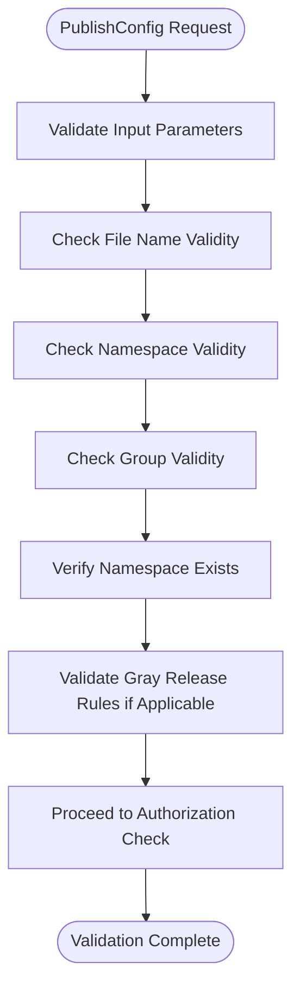
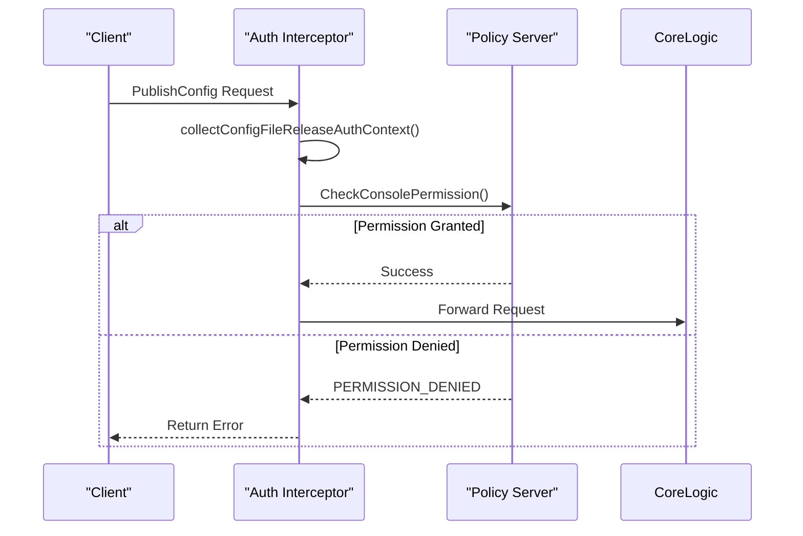
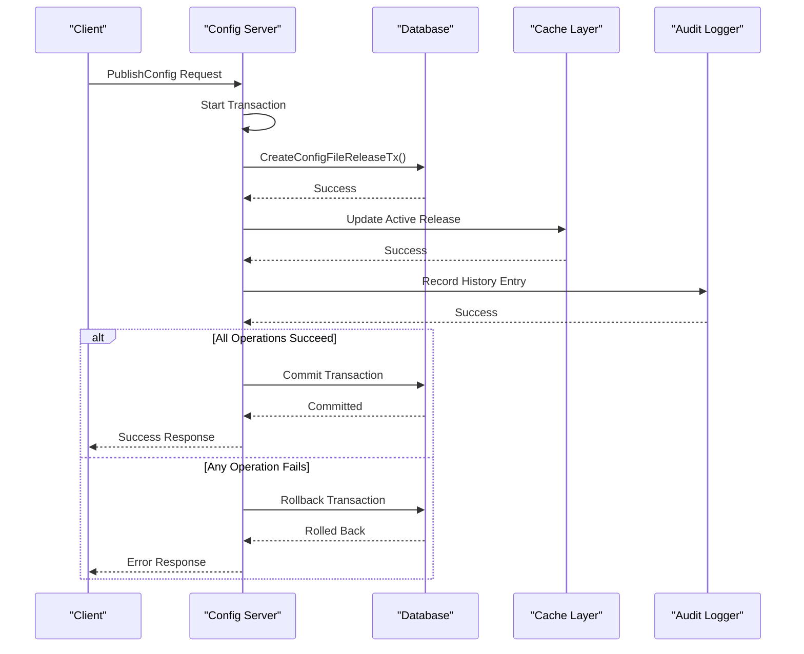
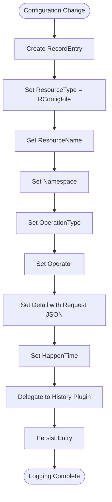
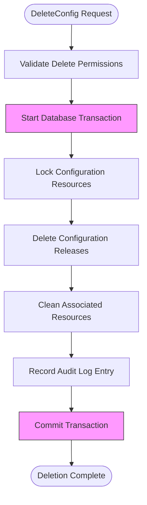
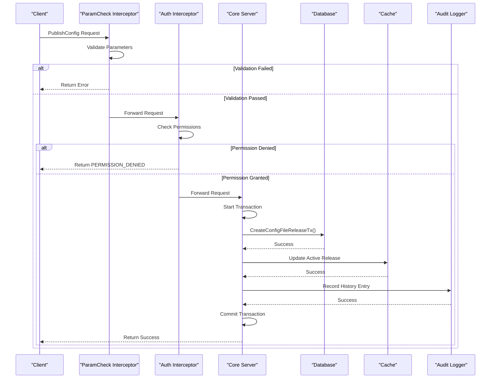
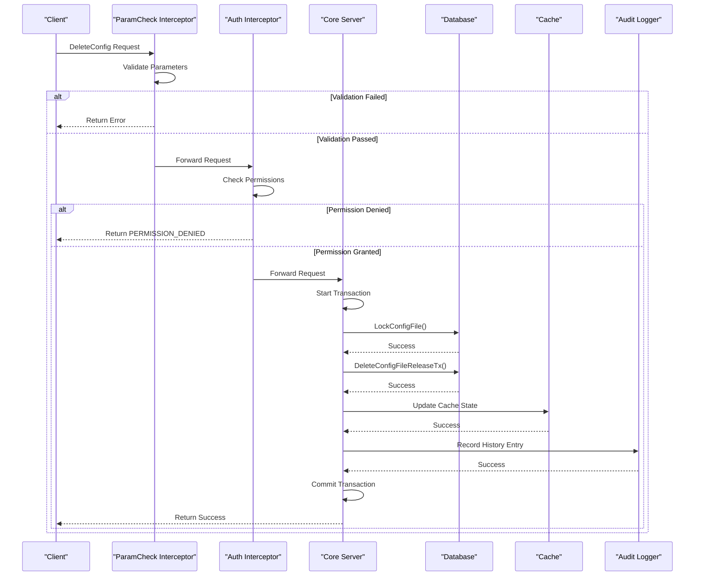

# Configuration Publishing

<cite>
**Referenced Files in This Document**   
- [server.go](file://pkg/config/server.go)
- [config_file_release.go](file://pkg/config/config_file_release.go)
- [config_file.go](file://pkg/config/config_file.go)
- [config_file_release_check.go](file://pkg/config/interceptor/paramcheck/config_file_release_check.go)
- [config_file_release.go](file://pkg/config/interceptor/auth/config_file_release.go)
- [utils.go](file://pkg/config/utils.go)
- [config_file_test.go](file://pkg/config/config_file_test.go)
- [config_file_release_test.go](file://pkg/config/config_file_release_test.go)
</cite>

## Table of Contents
1. [Introduction](#introduction)
2. [Core RPC Methods](#core-rpc-methods)
3. [Request Validation Process](#request-validation-process)
4. [Authorization Checks](#authorization-checks)
5. [Transactional Updates](#transactional-updates)
6. [Client Implementation Examples](#client-implementation-examples)
7. [Audit Logging Mechanism](#audit-logging-mechanism)
8. [Configuration Template Validation](#configuration-template-validation)
9. [Rate Limiting Considerations](#rate-limiting-considerations)
10. [Safeguards Against Mass Deletions](#safeguards-against-mass-deletions)
11. [Sequence Diagrams](#sequence-diagrams)

## Introduction
The Configuration Publishing functionality in pole-server provides a robust mechanism for managing configuration state through gRPC interfaces. This document details the PublishConfig and DeleteConfig RPC methods, which enable atomic and consistent modifications to configuration data. The implementation ensures data integrity through transactional updates across both database and cache layers, while incorporating comprehensive validation, authorization, and audit logging mechanisms. The system supports configuration templates, rate limiting, and safeguards against accidental mass deletions, providing a secure and reliable configuration management solution.

## Core RPC Methods
The gRPC Configuration Publishing functionality centers around two primary RPC methods: PublishConfig and DeleteConfig. These methods are implemented in the ConfigCenterServer interface and provide the foundation for configuration state management. The PublishConfig method creates or updates a configuration file release, while the DeleteConfig method removes configuration file releases. Both methods operate within a transactional context to ensure atomicity and consistency of configuration changes.

**Section sources**
- [server.go](file://pkg/config/server.go#L1-L327)
- [config_file_release.go](file://pkg/config/config_file_release.go#L1-L789)

## Request Validation Process
The request validation process for configuration publishing operations is implemented through a chain of responsibility pattern. The paramcheck interceptor performs comprehensive validation of incoming requests before they reach the core business logic. For the PublishConfig method, validation includes checking the namespace, group, and file name for validity, ensuring the namespace exists, and validating gray release rules when applicable. The DeleteConfig method inherits the same validation chain, ensuring consistent validation across configuration operations.

**Diagram sources**
- [config_file_release_check.go](file://pkg/config/interceptor/paramcheck/config_file_release_check.go#L1-L158)

**Section sources**
- [config_file_release_check.go](file://pkg/config/interceptor/paramcheck/config_file_release_check.go#L1-L158)
- [utils.go](file://pkg/config/utils.go#L1-L154)

## Authorization Checks
Authorization checks are implemented through the auth interceptor, which enforces access control policies for configuration publishing operations. The PublishConfig method requires Modify permission, while the DeleteConfig method requires Delete permission. The authorization process collects the necessary context from the request and delegates to the policy server's CheckConsolePermission method. If authorization fails, the request is rejected with an appropriate error code. This interceptor-based approach allows for flexible and extensible authorization policies.

**Diagram sources**
- [config_file_release.go](file://pkg/config/interceptor/auth/config_file_release.go#L1-L147)

**Section sources**
- [config_file_release.go](file://pkg/config/interceptor/auth/config_file_release.go#L1-L147)

## Transactional Updates
The implementation in server.go ensures atomicity and consistency during configuration changes through a comprehensive transactional model. Both PublishConfig and DeleteConfig operations are wrapped in database transactions that span both the database and cache layers. For PublishConfig, the transaction includes creating the configuration file release, updating the active release status, and recording the operation in the audit log. For DeleteConfig, the transaction includes removing the configuration file release, cleaning up associated resources, and recording the deletion in the audit log. The transaction is only committed if all operations succeed, ensuring data consistency.

**Diagram sources**
- [server.go](file://pkg/config/server.go#L1-L327)
- [config_file_release.go](file://pkg/config/config_file_release.go#L1-L789)

**Section sources**
- [server.go](file://pkg/config/server.go#L1-L327)
- [config_file_release.go](file://pkg/config/config_file_release.go#L1-L789)

## Client Implementation Examples
Client implementations must handle various error conditions when interacting with the Configuration Publishing functionality. For the PublishConfig method, clients should handle ALREADY_EXISTS when attempting to publish a release that already exists, INVALID_ARGUMENT when providing invalid parameters, and PERMISSION_DENIED when lacking the necessary permissions. For the DeleteConfig method, clients should handle NOT_FOUND when attempting to delete a non-existent configuration, INVALID_ARGUMENT for invalid parameters, and PERMISSION_DENIED for insufficient permissions. Proper error handling ensures robust client behavior and provides meaningful feedback to users.

**Section sources**
- [config_file_test.go](file://pkg/config/config_file_test.go#L1-L565)
- [config_file_release_test.go](file://pkg/config/config_file_release_test.go#L1-L789)

## Audit Logging Mechanism
The audit logging mechanism integrates with operational history tracking to provide a complete record of configuration changes. Each successful PublishConfig or DeleteConfig operation generates a RecordEntry that captures the resource type, resource name, namespace, operation type, operator, and detailed operation information. The RecordHistory method in the Server struct delegates to the history plugin, which persists these entries for auditing and troubleshooting purposes. This comprehensive logging enables traceability of configuration changes and supports compliance requirements.

**Diagram sources**
- [server.go](file://pkg/config/server.go#L1-L327)
- [config_file_release.go](file://pkg/config/config_file_release.go#L1-L789)

**Section sources**
- [server.go](file://pkg/config/server.go#L1-L327)
- [config_file_release.go](file://pkg/config/config_file_release.go#L1-L789)

## Configuration Template Validation
Configuration template validation is integrated into the publishing workflow to ensure configurations adhere to predefined schemas and constraints. While the core implementation focuses on structural validation of configuration parameters, the system is designed to support template-based validation through extensible interceptor chains. The validation process checks file names, namespaces, groups, and content length against defined limits and patterns. This validation framework can be extended to incorporate template-specific rules, ensuring configurations meet organizational standards and requirements.

**Section sources**
- [config_file_release_check.go](file://pkg/config/interceptor/paramcheck/config_file_release_check.go#L1-L158)
- [utils.go](file://pkg/config/utils.go#L1-L154)

## Rate Limiting Considerations
Rate limiting considerations are addressed through the interceptor architecture, which allows for the integration of rate limiting policies. While the core configuration publishing implementation does not include rate limiting logic, the system is designed to support rate limiting through the interceptor chain. The paramcheck and auth interceptors provide extension points where rate limiting policies can be enforced based on client identity, namespace, or operation type. This modular design enables flexible rate limiting strategies without modifying the core business logic.

**Section sources**
- [config_file_release_check.go](file://pkg/config/interceptor/paramcheck/config_file_release_check.go#L1-L158)
- [config_file_release.go](file://pkg/config/interceptor/auth/config_file_release.go#L1-L147)

## Safeguards Against Mass Deletions
Safeguards against accidental mass deletions are implemented through transactional integrity and audit logging. The DeleteConfig method processes deletions within a transaction, ensuring that either all requested deletions succeed or none do, preventing partial deletion states. The audit logging mechanism records each deletion operation, providing a complete history that can be used to restore accidentally deleted configurations. Additionally, the system requires explicit permissions for deletion operations, preventing unauthorized mass deletions. These safeguards ensure configuration stability and data protection.

**Diagram sources**
- [config_file.go](file://pkg/config/config_file.go#L1-L565)
- [config_file_release.go](file://pkg/config/config_file_release.go#L1-L789)

**Section sources**
- [config_file.go](file://pkg/config/config_file.go#L1-L565)
- [config_file_release.go](file://pkg/config/config_file_release.go#L1-L789)

## Sequence Diagrams

### PublishConfig Sequence

**Diagram sources**
- [config_file_release_check.go](file://pkg/config/interceptor/paramcheck/config_file_release_check.go#L1-L158)
- [config_file_release.go](file://pkg/config/interceptor/auth/config_file_release.go#L1-L147)
- [config_file_release.go](file://pkg/config/config_file_release.go#L1-L789)

### DeleteConfig Sequence

**Diagram sources**
- [config_file_release_check.go](file://pkg/config/interceptor/paramcheck/config_file_release_check.go#L1-L158)
- [config_file_release.go](file://pkg/config/interceptor/auth/config_file_release.go#L1-L147)
- [config_file_release.go](file://pkg/config/config_file_release.go#L1-L789)