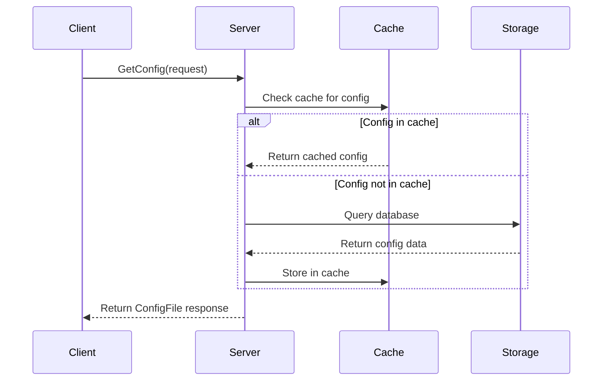
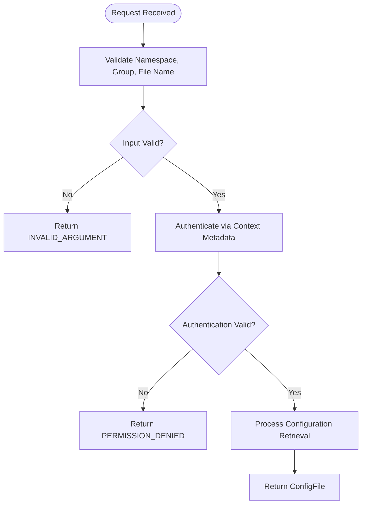
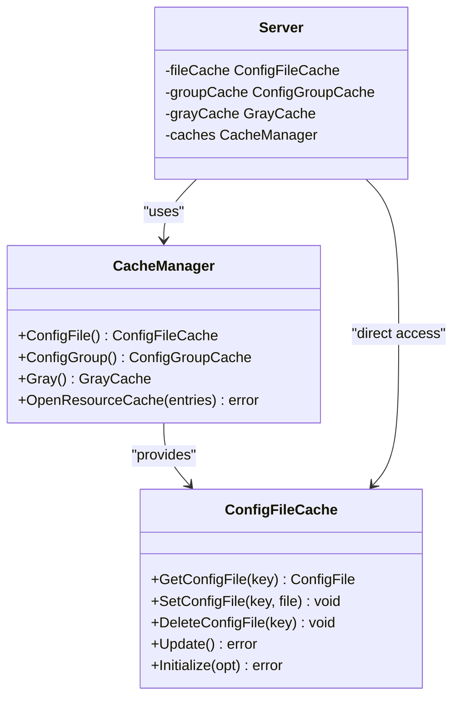
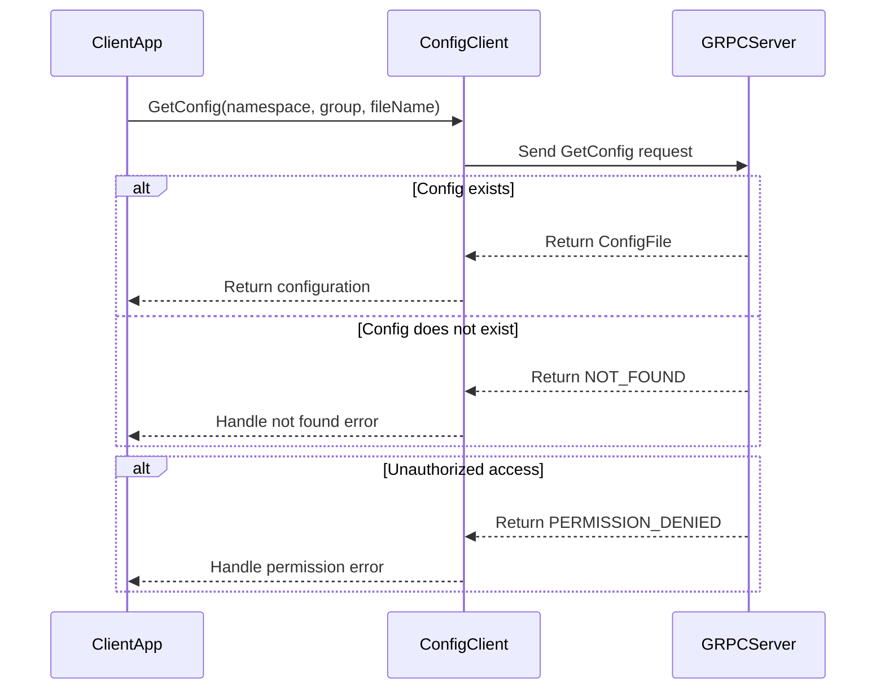
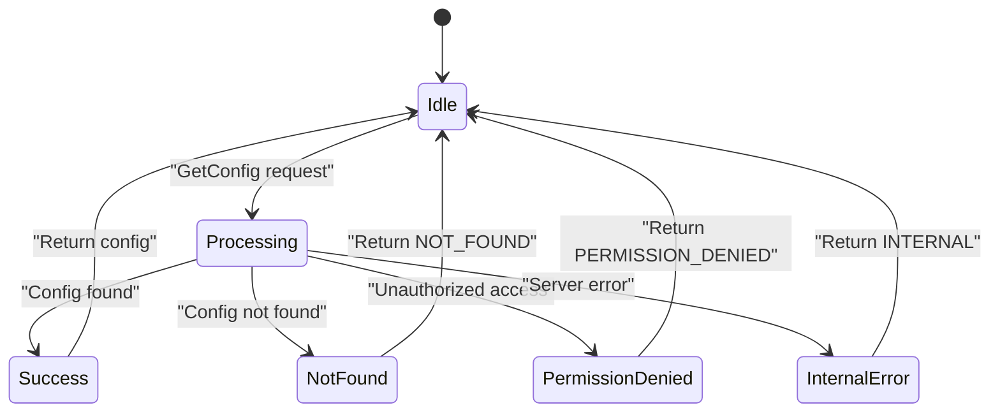
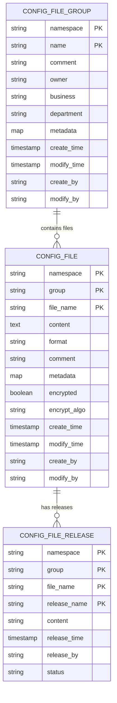

# Configuration Retrieval

<cite>
**Referenced Files in This Document**   
- [server.go](file://pkg/config/server.go)
- [config_file.go](file://pkg/config/config_file.go)
- [client_access.go](file://plugin/apiserver/grpcserver/config/client_access.go)
- [config_response.go](file://pkg/common/api/v1/config_response.go)
- [config_file.go](file://apis/pkg/types/config/config_file.go)
- [config_file.go](file://plugin/store/mysql/config_file.go)
</cite>

## Table of Contents
1. [Introduction](#introduction)
2. [GetConfig RPC Method](#getconfig-rpc-method)
3. [Request Validation and Authentication](#request-validation-and-authentication)
4. [Caching Layer Integration](#caching-layer-integration)
5. [Client Implementation Examples](#client-implementation-examples)
6. [Consistency and Error Handling](#consistency-and-error-handling)
7. [Performance Optimization](#performance-optimization)
8. [Best Practices](#best-practices)

## Introduction
The Configuration Retrieval functionality in pole-server provides a gRPC-based interface for clients to fetch configuration files from a centralized configuration management system. This document details the GetConfig unary RPC method, its implementation, and integration with caching and authentication systems. The system is designed to handle high-concurrency scenarios while maintaining consistency and security.

## GetConfig RPC Method
The GetConfig method is a unary RPC that retrieves configuration files based on namespace, group, and file name parameters. The method returns a ConfigFile protobuf message containing the configuration content and metadata.

**Diagram sources**
- [server.go](file://pkg/config/server.go#L1-L327)
- [config_file.go](file://pkg/config/config_file.go#L129-L564)

**Section sources**
- [server.go](file://pkg/config/server.go#L1-L327)
- [config_file.go](file://pkg/config/config_file.go#L129-L564)

## Request Validation and Authentication
The GetConfig method implements comprehensive request validation and authentication through context metadata. The server validates the namespace, group, and file name parameters before processing the request. Authentication is performed using metadata from the gRPC context, ensuring that only authorized clients can access configuration data.

**Diagram sources**
- [client_access.go](file://plugin/apiserver/grpcserver/config/client_access.go#L210-L237)
- [server.go](file://pkg/config/server.go#L1-L327)

**Section sources**
- [client_access.go](file://plugin/apiserver/grpcserver/config/client_access.go#L210-L237)
- [server.go](file://pkg/config/server.go#L1-L327)

## Caching Layer Integration
The configuration retrieval system integrates with a multi-level caching layer to optimize read performance and reduce database load. The cache stores configuration files with appropriate TTL (Time To Live) values and supports cache invalidation on configuration updates.

**Diagram sources**
- [config_file.go](file://pkg/cache/config/config_file.go#L70-L99)
- [server.go](file://pkg/config/server.go#L1-L327)

**Section sources**
- [config_file.go](file://pkg/cache/config/config_file.go#L70-L99)
- [server.go](file://pkg/config/server.go#L1-L327)

## Client Implementation Examples
Client implementations should handle the GetConfig method with proper error handling for NOT_FOUND and PERMISSION_DENIED status codes. The following example demonstrates a Go client implementation:

**Diagram sources**
- [config_response.go](file://pkg/common/api/v1/config_response.go#L60-L96)
- [client_access.go](file://plugin/apiserver/grpcserver/config/client_access.go#L210-L237)

**Section sources**
- [config_response.go](file://pkg/common/api/v1/config_response.go#L60-L96)
- [client_access.go](file://plugin/apiserver/grpcserver/config/client_access.go#L210-L237)

## Consistency and Error Handling
The system ensures consistency through proper transaction management and error handling. The GetConfig method handles various error conditions including NOT_FOUND, PERMISSION_DENIED, and internal server errors. The response structure includes appropriate status codes and error messages.

**Diagram sources**
- [config_response.go](file://pkg/common/api/v1/config_response.go#L60-L96)
- [config_file.go](file://pkg/config/config_file.go#L129-L564)

**Section sources**
- [config_response.go](file://pkg/common/api/v1/config_response.go#L60-L96)
- [config_file.go](file://pkg/config/config_file.go#L129-L564)

## Performance Optimization
The configuration retrieval system implements several performance optimizations for high-concurrency scenarios. These include connection pooling, efficient caching strategies, and optimized database queries. The system is designed to handle thousands of concurrent requests with low latency.

**Diagram sources**
- [config_file.go](file://apis/pkg/types/config/config_file.go#L32-L97)
- [config_file.go](file://plugin/store/mysql/config_file.go#L182-L217)

**Section sources**
- [config_file.go](file://apis/pkg/types/config/config_file.go#L32-L97)
- [config_file.go](file://plugin/store/mysql/config_file.go#L182-L217)

## Best Practices
For efficient configuration fetching in high-concurrency scenarios, clients should implement connection pooling, proper error handling, and caching strategies. The server-side implements rate limiting and resource management to prevent abuse and ensure system stability.

**Section sources**
- [server.go](file://pkg/config/server.go#L1-L327)
- [config_file.go](file://pkg/config/config_file.go#L129-L564)