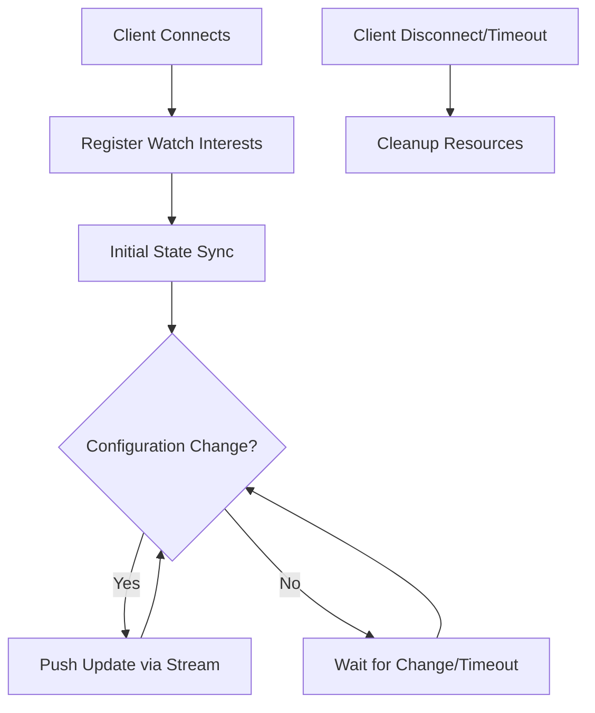
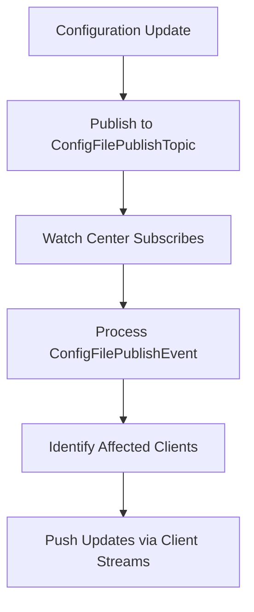
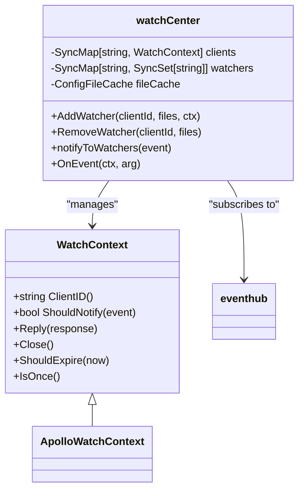
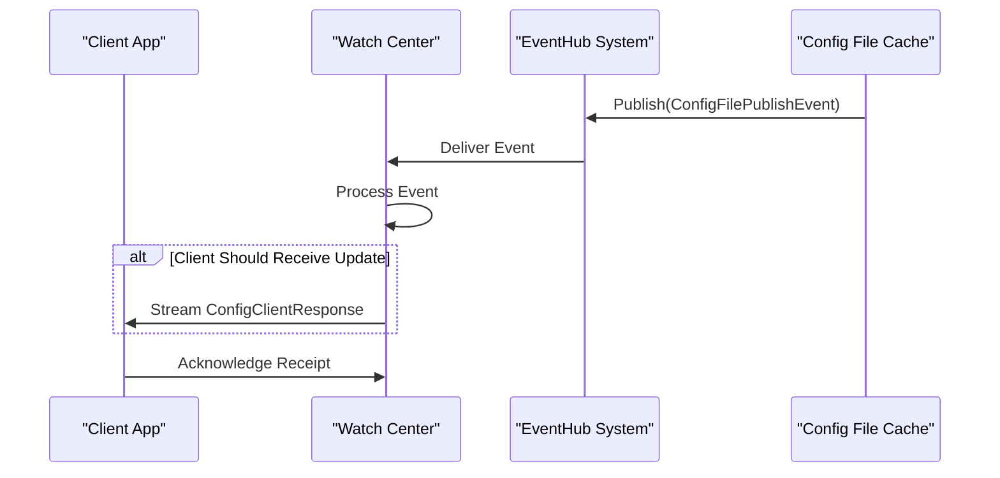

# Configuration Watching

<cite>
**Referenced Files in This Document**   
- [watcher.go](file://pkg/config/watcher.go)
- [config_file.go](file://pkg/cache/config/config_file.go)
- [eventhub.go](file://pkg/common/eventhub/eventhub.go)
- [topic.go](file://pkg/common/eventhub/topic.go)
- [subscription.go](file://pkg/common/eventhub/subscription.go)
- [server.go](file://plugin/apiserver/nacosserver/v2/config/server.go)
- [watch.go](file://plugin/apiserver/apolloserver/watch.go)
- [client_test.go](file://pkg/config/client_test.go)
- [auth/server.go](file://pkg/config/interceptor/auth/server.go)
</cite>

## Table of Contents
1. [Introduction](#introduction)
2. [WatchConfig RPC Method Overview](#watchconfig-rpc-method-overview)
3. [Stream Lifecycle Management](#stream-lifecycle-management)
4. [Event-Driven Architecture Implementation](#event-driven-architecture-implementation)
5. [Client-Side Handling and Reconnection](#client-side-handling-and-reconnection)
6. [Flow Control and Resource Management](#flow-control-and-resource-management)
7. [Integration with EventHub System](#integration-with-eventhub-system)
8. [Security and Access Control](#security-and-access-control)
9. [Performance and Scalability Considerations](#performance-and-scalability-considerations)
10. [Troubleshooting Guide](#troubleshooting-guide)

## Introduction
The Configuration Watching functionality in pole-server enables real-time synchronization of configuration changes to connected clients through a server-streaming gRPC interface. This document details the implementation of the WatchConfig method, which allows clients to establish long-lived connections for receiving incremental configuration updates. The system employs an event-driven architecture with revision tracking to efficiently deliver only changed configurations, minimizing network overhead and ensuring clients maintain up-to-date state. The design incorporates robust mechanisms for connection management, flow control, and delivery guarantees through integration with the eventhub messaging system.

## WatchConfig RPC Method Overview
The WatchConfig server-streaming RPC method enables clients to receive real-time configuration updates from the server. Clients initiate a stream by sending a ClientWatchConfigFileRequest containing their configuration file interests, including namespace, group, and filename identifiers. The server responds with a continuous stream of ConfigClientResponse messages whenever watched configurations change. Each response includes the updated configuration content, metadata, and version information. The streaming nature of this RPC allows for efficient push-based delivery rather than client polling, reducing latency and server load. The method supports both initial state synchronization and incremental updates through revision tracking mechanisms.

**Section sources**
- [watcher.go](file://pkg/config/watcher.go#L204-L239)
- [client_test.go](file://pkg/config/client_test.go#L447-L483)

## Stream Lifecycle Management
The stream lifecycle begins when a client establishes a connection and registers its configuration interests through the AddWatcher method. The watch center creates a WatchContext that maintains the client's subscription details and timeout parameters. During the active phase, the server synchronizes the initial configuration state and monitors for changes. The system implements revision tracking by comparing version numbers in the ShouldNotify method, ensuring clients only receive updates when their watched configurations have changed. When a configuration update occurs, the server pushes the change notification through the established stream. The lifecycle ends when the client disconnects, times out, or explicitly cancels the watch, triggering resource cleanup through the Close method.

**Diagram sources**
- [watcher.go](file://pkg/config/watcher.go#L322-L368)
- [watch.go](file://plugin/apiserver/apolloserver/watch.go#L149-L201)

**Section sources**
- [watcher.go](file://pkg/config/watcher.go#L322-L368)
- [watch.go](file://plugin/apiserver/apolloserver/watch.go#L149-L201)

## Event-Driven Architecture Implementation
The server implements an event-driven architecture using the eventhub system to decouple configuration change detection from client notification. When a configuration update occurs, the file cache publishes a ConfigFilePublishTopic event containing the changed configuration details. The watch center subscribes to this topic and processes events through its OnEvent handler. This handler extracts the changed configuration and notifies all interested clients by calling their Reply method. The architecture uses a publish-subscribe pattern where multiple components can react to configuration changes without tight coupling. The eventhub system ensures reliable message delivery and provides buffering to handle temporary spikes in change events.

**Diagram sources**
- [config_file.go](file://pkg/cache/config/config_file.go#L195-L214)
- [watcher.go](file://pkg/config/watcher.go#L204-L239)

**Section sources**
- [config_file.go](file://pkg/cache/config/config_file.go#L195-L214)
- [watcher.go](file://pkg/config/watcher.go#L204-L239)

## Client-Side Handling and Reconnection
Clients implement proper stream handling by establishing the WatchConfig stream and processing incoming ConfigClientResponse messages. The client should maintain a local cache of received configurations and update it upon each notification. For network resilience, clients implement reconnection logic that detects stream termination and re-establishes the connection with the latest known revision numbers. This allows clients to resume watching from their last known state rather than starting over. The reconnection process includes exponential backoff to prevent overwhelming the server during network instability. Clients should also handle partial updates and validate configuration integrity upon receipt.

**Section sources**
- [client_test.go](file://pkg/config/client_test.go#L552-L581)
- [watch.go](file://plugin/apiserver/apolloserver/watch.go#L107-L147)

## Flow Control and Resource Management
The system implements flow control through configurable queue sizes in the eventhub subscriptions and client notification buffers. Each watcher maintains a bounded buffer to prevent memory exhaustion during high-change periods. The watch center manages resources by tracking active clients in a SyncMap and cleaning up disconnected clients through the RemoveWatcher method. Long-lived connections are monitored for inactivity, and idle watchers are expired based on their ShouldExpire timestamp. The system limits the number of concurrent watchers per client and implements graceful shutdown procedures that drain pending notifications before closing streams. Buffer management includes overflow protection to maintain system stability under load.

**Diagram sources**
- [watcher.go](file://pkg/config/watcher.go#L204-L239)
- [watcher.go](file://pkg/config/watcher.go#L322-L368)

**Section sources**
- [watcher.go](file://pkg/config/watcher.go#L204-L239)
- [watcher.go](file://pkg/config/watcher.go#L322-L368)

## Integration with EventHub System
The Configuration Watching functionality integrates with the eventhub system for reliable change detection and delivery. The watch center subscribes to the ConfigFilePublishTopic during initialization, establishing a persistent connection to receive configuration change events. The eventhub system provides message queuing with configurable buffer sizes to handle bursts of configuration updates. Each event contains a PublishConfigFileEvent with the changed configuration details. The integration ensures at-least-once delivery semantics, with the watch center acknowledging processed events. The system handles backpressure by buffering events and implements retry mechanisms for failed deliveries. Topic-based routing allows selective subscription to relevant configuration changes.

**Diagram sources**
- [eventhub.go](file://pkg/common/eventhub/eventhub.go#L107-L152)
- [topic.go](file://pkg/common/eventhub/topic.go#L0-L54)
- [subscription.go](file://pkg/common/eventhub/subscription.go#L53-L105)

**Section sources**
- [eventhub.go](file://pkg/common/eventhub/eventhub.go#L107-L152)
- [topic.go](file://pkg/common/eventhub/topic.go#L0-L54)

## Security and Access Control
Access to configuration watching is controlled through the authentication interceptor system. When a client requests to watch configurations, the collectClientWatchConfigFiles method creates an AcquireContext with the appropriate permissions check. The system verifies that the client has read access to the requested configuration files based on namespace, group, and file-level permissions. Authentication context is extracted from the request metadata and validated against the access control policies. The security model ensures that clients can only watch configurations they are authorized to access, preventing information leakage. All watch operations are logged for audit purposes.

**Section sources**
- [auth/server.go](file://pkg/config/interceptor/auth/server.go#L70-L92)
- [watch.go](file://plugin/apiserver/apolloserver/watch.go#L107-L147)

## Performance and Scalability Considerations
The Configuration Watching system is designed for high scalability, supporting thousands of concurrent clients as demonstrated in the TestManyClientWatchConfigFile test case. The watch center uses concurrent maps for efficient client and watcher lookups, enabling O(1) operations for registration and notification. Memory usage is optimized by sharing configuration data across clients rather than duplicating content. The event-driven architecture minimizes CPU overhead by eliminating polling. Performance bottlenecks are mitigated through goroutine pooling for event processing and connection handling. The system can be scaled horizontally by deploying multiple server instances behind a load balancer, with clients maintaining connections to individual nodes.

**Section sources**
- [client_test.go](file://pkg/config/client_test.go#L552-L581)
- [watcher.go](file://pkg/config/watcher.go#L204-L239)

## Troubleshooting Guide
Common issues include clients not receiving updates, which may indicate improper watcher registration or network connectivity problems. Verify that the client's WatchContext is properly added to the watch center and that the eventhub subscription is active. For high memory usage, check the number of active watchers and ensure disconnected clients are properly cleaned up through RemoveWatcher calls. Stream interruptions can be diagnosed by examining the client's reconnection logic and backoff strategy. If clients receive duplicate updates, verify the revision comparison logic in ShouldNotify. Monitor eventhub queue depths to detect processing bottlenecks, and check logs for subscription errors or event delivery failures.

**Section sources**
- [watcher.go](file://pkg/config/watcher.go#L322-L368)
- [eventhub.go](file://pkg/common/eventhub/eventhub.go#L107-L152)
- [watch.go](file://plugin/apiserver/apolloserver/watch.go#L149-L201)