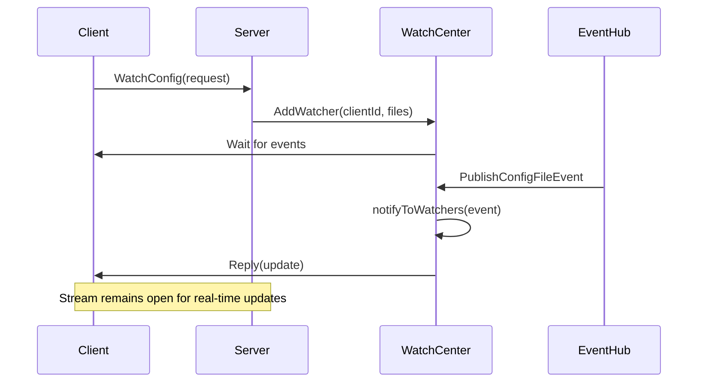
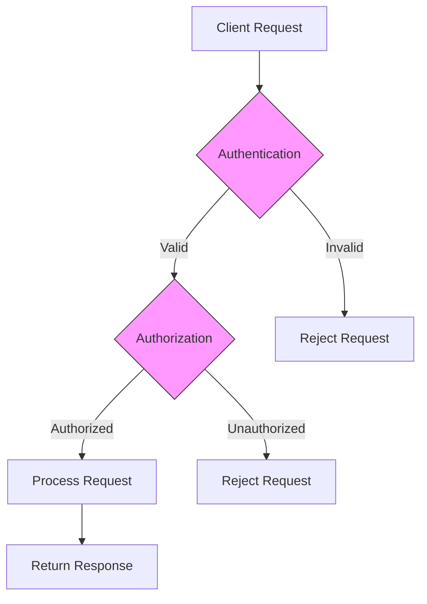
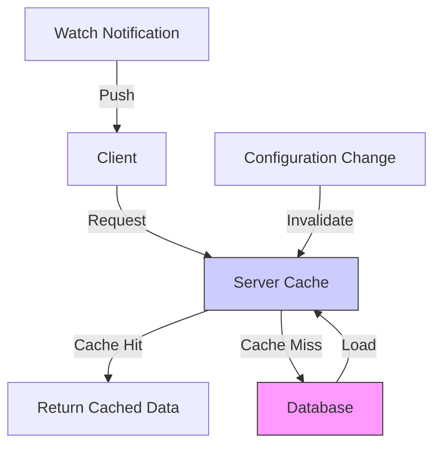

# gRPC Configuration API

<cite>
**Referenced Files in This Document**   
- [server.go](file://pkg/config/server.go)
- [config_file.go](file://pkg/config/config_file.go)
- [config_file_release.go](file://pkg/config/config_file_release.go)
- [watcher.go](file://pkg/config/watcher.go)
- [types.go](file://apis/pkg/types/config/types.go)
- [config_file.go](file://apis/pkg/types/config/config_file.go)
</cite>

## Table of Contents
1. [Introduction](#introduction)
2. [Core Service Methods](#core-service-methods)
3. [Protobuf Message Schemas](#protobuf-message-schemas)
4. [Unary and Server-Streaming Patterns](#unary-and-server-streaming-patterns)
5. [Authentication and Authorization Integration](#authentication-and-authorization-integration)
6. [Go Client Implementation Examples](#go-client-implementation-examples)
7. [Error Handling and Retry Policies](#error-handling-and-retry-policies)
8. [Performance Considerations](#performance-considerations)
9. [Versioning and Backward Compatibility](#versioning-and-backward-compatibility)

## Introduction
The gRPC Configuration API in pole-server provides a robust interface for managing configuration files in distributed systems. This API enables clients to retrieve, watch, publish, and manage configuration data with strong consistency guarantees. The system supports both unary operations for direct configuration retrieval and server-streaming patterns for real-time configuration updates. It integrates with authentication and authorization systems through request metadata and provides comprehensive error handling using gRPC status codes.

**Section sources**
- [server.go](file://pkg/config/server.go#L1-L327)

## Core Service Methods
The gRPC Configuration API exposes several key service methods for configuration management:

- **GetConfig**: Retrieves the current active configuration for a specified file. This unary RPC returns the latest published configuration content along with metadata.
- **WatchConfig**: Establishes a server-streaming connection that pushes configuration updates to clients when changes occur. Clients receive real-time notifications for configuration changes they are interested in.
- **PublishConfig**: Publishes a new version of a configuration file. This operation creates a new release entry and triggers notifications to all watching clients.
- **DeleteConfig**: Removes a configuration file and all its associated releases from the system. This operation also notifies watching clients of the deletion.

These methods are implemented in the Server struct and follow a transactional pattern to ensure data consistency during configuration operations.

**Section sources**
- [config_file.go](file://pkg/config/config_file.go#L1-L565)
- [config_file_release.go](file://pkg/config/config_file_release.go#L1-L789)

## Protobuf Message Schemas
The API uses well-defined protobuf message schemas for configuration data exchange:

### ConfigFile
Represents a configuration file entity with the following fields:
- **namespace**: String identifier for the configuration namespace
- **group**: String identifier for the configuration group
- **name**: String identifier for the configuration file name
- **content**: String containing the actual configuration content
- **format**: Enum indicating the file format (text, yaml, json, etc.)
- **metadata**: Map of string key-value pairs for additional configuration attributes
- **comment**: String description of the configuration file

### ConfigGroup
Represents a logical grouping of configuration files with:
- **namespace**: Parent namespace identifier
- **name**: Group name within the namespace
- **metadata**: Additional group-level metadata
- **comment**: Group description

### Release Payload
The release payload contains information about a specific configuration version:
- **name**: Unique identifier for the release
- **namespace/group/file_name**: Identifiers for the target configuration
- **release_type**: Enum indicating release type (normal, gray, delete)
- **beta_labels**: Map of labels for gray release targeting
- **release_description**: Description of the release changes
- **version**: Monotonically increasing version number
- **active**: Boolean indicating if this release is currently active

**Section sources**
- [types.go](file://apis/pkg/types/config/types.go#L1-L85)
- [config_file.go](file://pkg/config/config_file.go#L1-L565)

## Unary and Server-Streaming Patterns
The API implements both unary and server-streaming patterns for different use cases:

### Unary Pattern (GetConfig)
The GetConfig method follows a standard unary RPC pattern:
1. Client sends a request with configuration identifiers
2. Server validates authentication and authorization
3. Server retrieves the latest active configuration from storage
4. Server returns the configuration data in a single response

This pattern is used for initial configuration fetching and on-demand retrieval.

### Server-Streaming Pattern (WatchConfig)
The WatchConfig method implements a server-streaming pattern:
1. Client establishes a long-lived stream with initial configuration interests
2. Server registers the client in the watch center with timeout handling
3. When configuration changes occur, the server pushes update notifications
4. Clients receive incremental updates without polling
5. Streams automatically expire after timeout and can be re-established

The watch center uses an event-driven architecture with the eventhub system to efficiently distribute configuration change notifications to all interested clients.



**Diagram sources**
- [watcher.go](file://pkg/config/watcher.go#L1-L412)
- [config_file_release.go](file://pkg/config/config_file_release.go#L1-L789)

**Section sources**
- [watcher.go](file://pkg/config/watcher.go#L1-L412)

## Authentication and Authorization Integration
The API integrates with authentication and authorization systems through request metadata:

### Request Metadata Processing
Authentication information is extracted from request metadata and processed through interceptor chains:
1. Client includes authentication tokens in request metadata
2. Authentication interceptors validate the tokens and extract user context
3. Authorization interceptors check permissions for the requested operation
4. Operation proceeds only if both authentication and authorization succeed

### Interceptor Chain Architecture
The system uses a configurable interceptor chain for security processing:
- **Auth Interceptor**: Validates authentication tokens and extracts user identity
- **ParamCheck Interceptor**: Validates request parameters and enforces business rules
- **Permission Interceptor**: Checks user permissions for configuration operations

The interceptor order is configurable through the server configuration, allowing flexible security policy implementation.



**Diagram sources**
- [server.go](file://pkg/config/server.go#L1-L327)
- [config_file.go](file://pkg/config/config_file.go#L1-L565)

**Section sources**
- [server.go](file://pkg/config/server.go#L1-L327)

## Go Client Implementation Examples
### Synchronous Config Fetching
```go
// Example of synchronous configuration retrieval
func fetchConfig(client ConfigClient, ctx context.Context) (*ConfigFile, error) {
    req := &ConfigFile{
        Namespace: &wrapperspb.StringValue{Value: "default"},
        Group:     &wrapperspb.StringValue{Value: "app"},
        Name:      &wrapperspb.StringValue{Value: "application.yaml"},
    }
    
    resp, err := client.GetConfig(ctx, req)
    if err != nil {
        return nil, fmt.Errorf("failed to get config: %w", err)
    }
    
    if resp.GetCode().GetValue() != uint32(model.Code_ExecuteSuccess) {
        return nil, fmt.Errorf("config not found: %s", resp.GetInfo().GetValue())
    }
    
    return resp.GetConfigFile(), nil
}
```

### Long-Lived Watch Streams with Reconnection
```go
// Example of watching configuration with reconnection logic
func watchConfigWithRetry(client ConfigClient, ctx context.Context) {
    const maxRetries = 5
    var retryCount int
    
    for retryCount < maxRetries {
        if err := watchConfigOnce(client, ctx); err != nil {
            retryCount++
            log.Printf("Watch failed, retry %d/%d: %v", retryCount, maxRetries, err)
            
            // Exponential backoff
            time.Sleep(time.Second * time.Duration(1<<retryCount))
            continue
        }
        
        // Successful watch, reset retry count
        retryCount = 0
    }
}

func watchConfigOnce(client ConfigClient, ctx context.Context) error {
    req := &ClientConfigFileInfo{
        Namespace: &wrapperspb.StringValue{Value: "default"},
        Group:     &wrapperspb.StringValue{Value: "app"},
        FileName:  &wrapperspb.StringValue{Value: "application.yaml"},
        Version:   &wrapperspb.UInt64Value{Value: 0},
    }
    
    stream, err := client.WatchConfig(ctx)
    if err != nil {
        return fmt.Errorf("failed to create watch stream: %w", err)
    }
    
    // Send initial watch request
    if err := stream.Send(req); err != nil {
        return fmt.Errorf("failed to send watch request: %w", err)
    }
    
    // Process updates
    for {
        resp, err := stream.Recv()
        if err != nil {
            return fmt.Errorf("watch stream error: %w", err)
        }
        
        // Handle configuration update
        handleConfigUpdate(resp.GetConfigFile())
    }
}
```

**Section sources**
- [config_file.go](file://pkg/config/config_file.go#L1-L565)
- [watcher.go](file://pkg/config/watcher.go#L1-L412)

## Error Handling and Retry Policies
The API implements comprehensive error handling using gRPC status codes and provides guidance for client retry strategies:

### gRPC Status Code Mapping
- **OK (0)**: Operation completed successfully
- **NOT_FOUND (5)**: Requested configuration does not exist
- **ALREADY_EXISTS (6)**: Configuration already exists (for create operations)
- **FAILED_PRECONDITION (9)**: Operation failed due to precondition (e.g., version conflict)
- **ABORTED (10)**: Operation was aborted (e.g., CAS update conflict)
- **INTERNAL (13)**: Internal server error
- **UNAVAILABLE (14)**: Service is temporarily unavailable

### Retry Policies
Clients should implement the following retry strategies:

#### Configuration Retrieval
- Retry on UNAVAILABLE and INTERNAL errors
- Use exponential backoff with jitter
- Maximum retry attempts: 3-5
- Initial delay: 100ms, doubling each attempt

#### Watch Stream Reconnection
- Immediate reconnection on stream termination
- Exponential backoff with maximum delay (e.g., 30 seconds)
- Client-side timeout handling (default: 30 seconds)
- Graceful handling of NOT_MODIFIED responses

### Consistency Guarantees
The system provides the following consistency guarantees:
- **Strong consistency** for configuration publication: Once a publish operation succeeds, all subsequent reads will return the new version
- **Eventual consistency** for watch notifications: Clients may receive updates with minimal delay, typically within milliseconds
- **Monotonic reads**: Clients will never observe configuration versions moving backward in time

**Section sources**
- [config_file.go](file://pkg/config/config_file.go#L1-L565)
- [config_file_release.go](file://pkg/config/config_file_release.go#L1-L789)

## Performance Considerations
The API addresses several performance aspects to ensure efficient operation at scale:

### Payload Compression
- Automatic gzip compression for large configuration payloads
- Compression threshold configurable via server settings
- Client can request compression through metadata headers
- Reduces network bandwidth usage by up to 70% for text-based configurations

### Large File Handling
- File content limit: 20,000 characters per file
- Streaming upload/download support for large configurations
- Memory-efficient processing to prevent OOM errors
- Chunked transfer encoding for very large files

### Caching Implications
The system implements a multi-layer caching strategy:
- **Client-side caching**: Clients cache configurations locally and use version checking
- **Server-side caching**: Frequently accessed configurations are cached in memory
- **Cache invalidation**: Automatic invalidation on configuration changes
- **Cache warming**: Pre-loading of commonly used configurations

The watch mechanism reduces the need for polling, significantly decreasing server load while providing real-time updates.



**Diagram sources**
- [server.go](file://pkg/config/server.go#L1-L327)
- [watcher.go](file://pkg/config/watcher.go#L1-L412)

**Section sources**
- [server.go](file://pkg/config/server.go#L1-L327)

## Versioning and Backward Compatibility
The API follows strict versioning and backward compatibility practices:

### Versioning Strategy
- Semantic versioning for API releases
- Backward compatibility maintained for at least two major versions
- Deprecation warnings added before removing endpoints
- Version negotiation through client metadata

### Backward Compatibility
- New fields added as optional to avoid breaking changes
- Old fields retained with deprecation markers
- Multiple versions of the same endpoint can coexist
- Comprehensive testing for backward compatibility

### Endpoint Deprecation
When deprecating configuration endpoints:
1. Add deprecation warning in API documentation
2. Include deprecation headers in responses
3. Maintain functionality for a minimum grace period
4. Provide migration guidance to replacement endpoints
5. Monitor usage before final removal

The system ensures smooth transitions for clients during API evolution while maintaining stability and reliability.

**Section sources**
- [server.go](file://pkg/config/server.go#L1-L327)
- [config_file.go](file://pkg/config/config_file.go#L1-L565)