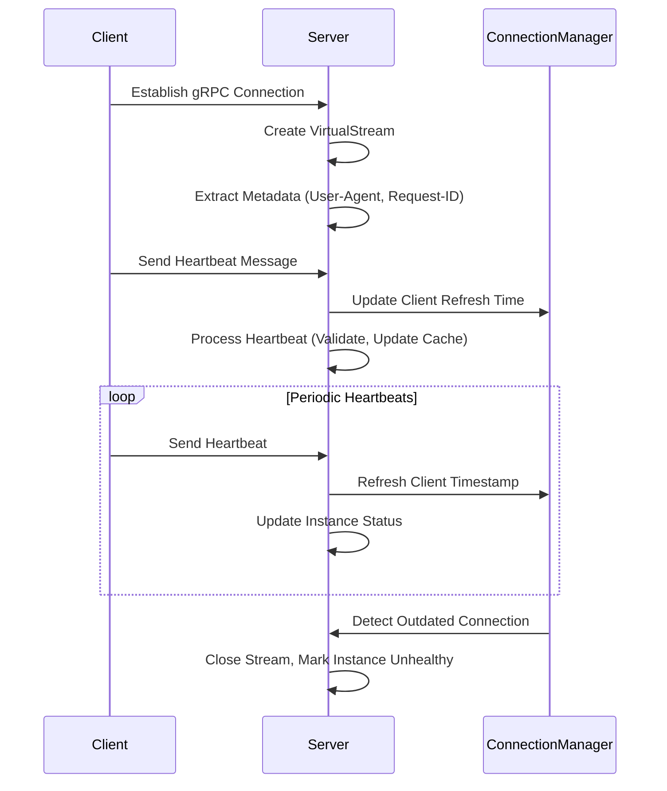
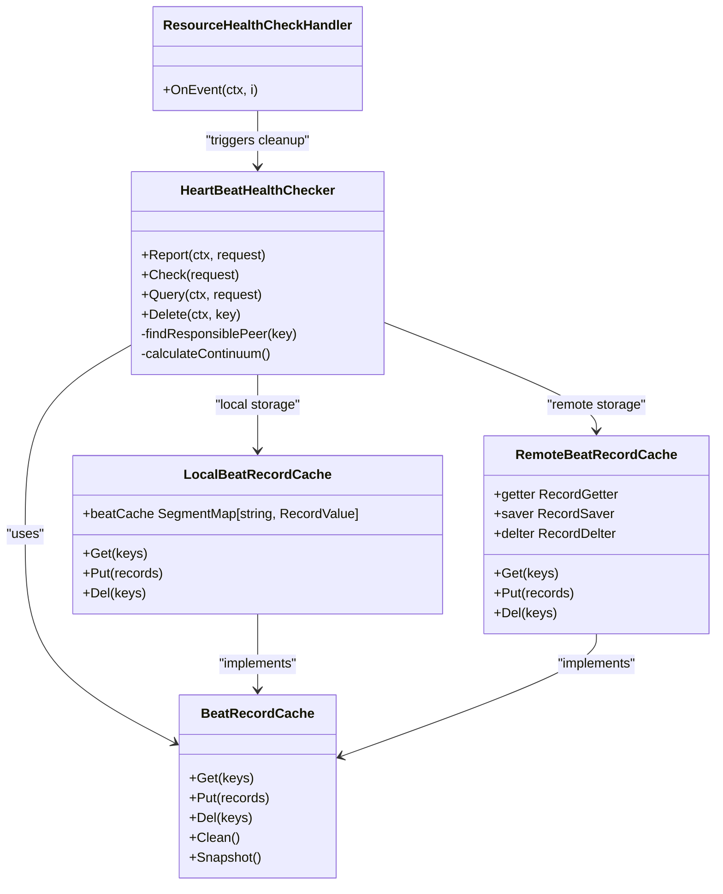
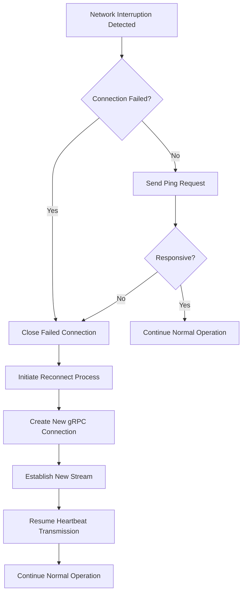
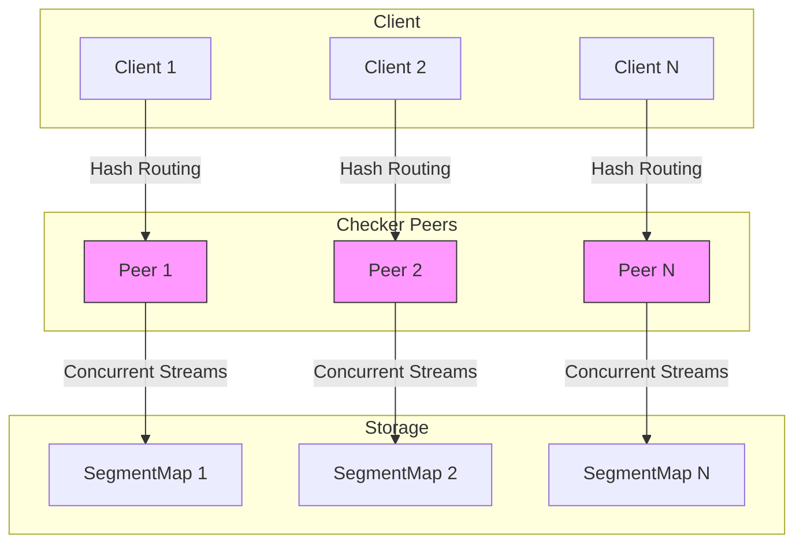
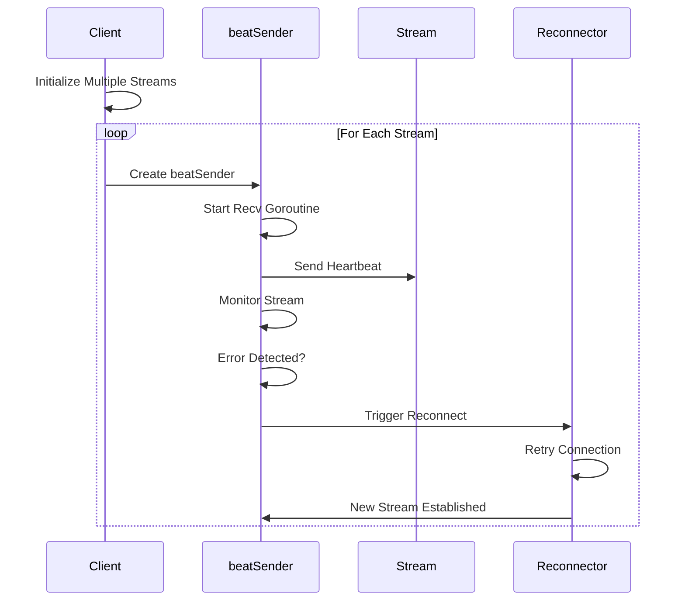
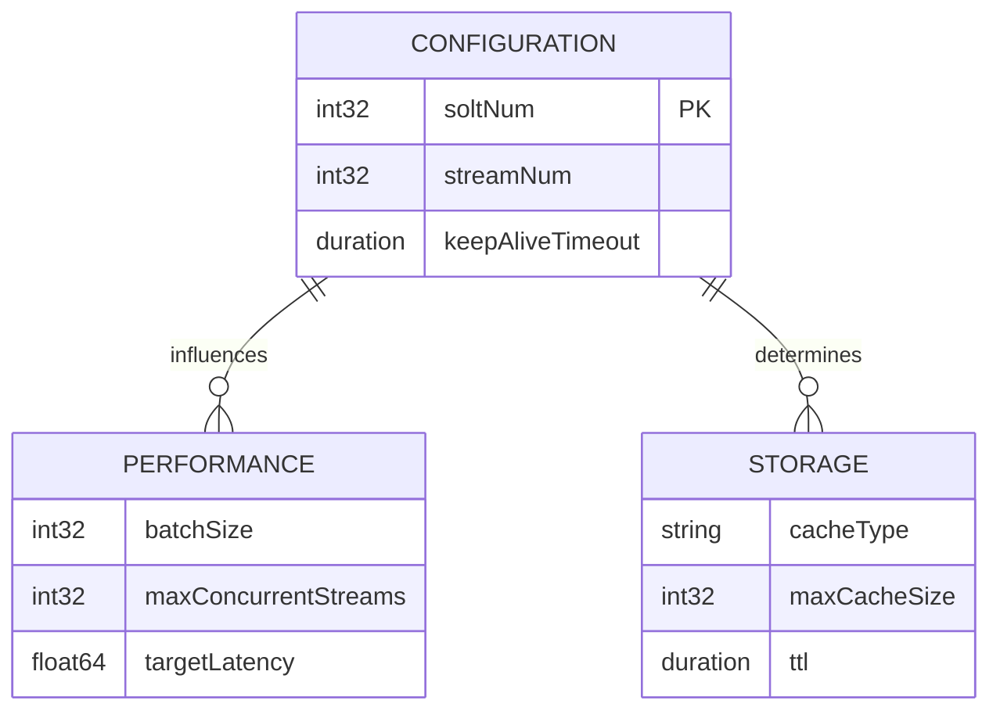

# Heartbeat Streaming

<cite>
**Referenced Files in This Document**   
- [beat_checker.go](file://plugin/service/healthchecker/heartbeat/beat_checker.go)
- [peer.go](file://plugin/service/healthchecker/heartbeat/peer.go)
- [cache.go](file://plugin/service/healthchecker/heartbeat/cache.go)
- [config.go](file://plugin/service/healthchecker/heartbeat/config.go)
- [metrics.go](file://plugin/service/healthchecker/heartbeat/metrics.go)
- [client.go](file://pkg/service/healthcheck/client.go)
- [report.go](file://pkg/service/healthcheck/report.go)
- [check.go](file://pkg/service/healthcheck/check.go)
</cite>

## Table of Contents
1. [Introduction](#introduction)
2. [Bidirectional Stream Lifecycle](#bidirectional-stream-lifecycle)
3. [Server-Side Health Check Integration](#server-side-health-check-integration)
4. [Stream Recovery and Sequence ID Management](#stream-recovery-and-sequence-id-management)
5. [Server-Side Load Balancing and Concurrency](#server-side-load-balancing-and-concurrency)
6. [Go Client Implementation](#go-client-implementation)
7. [Performance Considerations](#performance-considerations)
8. [Configuration Parameters](#configuration-parameters)
9. [Conclusion](#conclusion)

## Introduction
The gRPC heartbeat streaming mechanism in pole-server enables continuous health monitoring of service instances through bidirectional streaming. This documentation details the complete lifecycle of heartbeat streams, from client connection to server acknowledgment, including metadata exchange, periodic heartbeat messages, and server-side timeout enforcement. The system integrates with the health checking subsystem to maintain accurate instance status and trigger health probes. The architecture supports stream recovery after network interruptions, sequence ID-based missed heartbeat detection, and distributed load balancing across checker peers.

**Section sources**
- [beat_checker.go](file://plugin/service/healthchecker/heartbeat/beat_checker.go#L1-L50)
- [peer.go](file://plugin/service/healthchecker/heartbeat/peer.go#L1-L50)

## Bidirectional Stream Lifecycle
The heartbeat streaming mechanism establishes a bidirectional gRPC stream between client and server, enabling continuous health monitoring. The lifecycle begins with client connection and initial metadata exchange, followed by periodic heartbeat messages and server acknowledgment.

The stream initialization process starts when a client establishes a gRPC connection to the server. During stream creation, metadata is exchanged containing client identification, user agent information, and request identifiers. The server creates a VirtualStream object that wraps the underlying gRPC stream, providing additional functionality for preprocessing and postprocessing of messages.

Periodic heartbeat messages are sent from client to server at configured intervals. Each heartbeat contains instance identification, host information, and timestamp data. The server processes these messages through the HeartBeatHealthChecker component, which validates the heartbeat and updates the instance's last heartbeat timestamp in the distributed cache.

Server-side timeout enforcement is implemented through connection managers that track client activity. The ConnectionManager monitors client connections and automatically ejects outdated connections that haven't refreshed within the keep-alive period (4 * 5 seconds). This ensures that unresponsive clients are promptly identified and their instances marked as potentially unhealthy.

**Diagram sources**
- [peer.go](file://plugin/service/healthchecker/heartbeat/peer.go#L405-L462)
- [client_conn.go](file://plugin/apiserver/nacosserver/v2/remote/client_conn.go#L303-L359)

**Section sources**
- [beat_checker.go](file://plugin/service/healthchecker/heartbeat/beat_checker.go#L206-L228)
- [peer.go](file://plugin/service/healthchecker/heartbeat/peer.go#L116-L164)
- [client_conn.go](file://plugin/apiserver/nacosserver/v2/remote/client_conn.go#L259-L301)

## Server-Side Health Check Integration
The heartbeat streaming mechanism integrates with the health checking system in pkg/service/healthcheck to maintain accurate instance status and trigger health probes. This integration occurs through the HeartBeatHealthChecker component, which serves as the bridge between incoming heartbeat streams and the broader health monitoring infrastructure.

When a heartbeat is received, the HeartBeatHealthChecker processes it through the Report method, which validates the heartbeat and updates the instance's status in the distributed cache. The checker uses consistent hashing (via the continuum hash) to determine which peer is responsible for storing a particular instance's heartbeat data. This ensures even distribution of heartbeat records across the cluster.

The health checking system subscribes to instance events through the ResourceHealthCheckHandler. When an instance goes offline (EventInstanceOffline), the handler receives an event and removes the corresponding heartbeat information from the checker. This prevents stale heartbeat data from affecting health decisions.

**Diagram sources**
- [beat_checker.go](file://plugin/service/healthchecker/heartbeat/beat_checker.go#L206-L228)
- [cache.go](file://plugin/service/healthchecker/heartbeat/cache.go#L55-L103)
- [check.go](file://pkg/service/healthcheck/check.go#L103-L138)

**Section sources**
- [beat_checker.go](file://plugin/service/healthchecker/heartbeat/beat_checker.go#L206-L228)
- [cache.go](file://plugin/service/healthchecker/heartbeat/cache.go#L55-L103)
- [check.go](file://pkg/service/healthcheck/check.go#L103-L138)

## Stream Recovery and Sequence ID Management
The heartbeat streaming mechanism implements robust stream recovery mechanisms to handle network interruptions and ensure continuity of health monitoring. When a network interruption occurs, the system automatically attempts to reconnect and resume heartbeat transmission.

Stream recovery is managed by the RemotePeer component, which maintains multiple gRPC connections to checker peers. If a connection fails, the beatSender's Recv method detects the error and initiates recovery by calling the peer's reconnect method. This creates a new connection and stream, ensuring that heartbeat transmission can continue with minimal disruption.

Sequence ID management is implemented through the Count field in the heartbeat records. Each heartbeat message includes a count that increments with each transmission. This allows the server to detect missed heartbeats by identifying gaps in the sequence. The count is stored in the RecordValue structure along with the timestamp, enabling the health checker to make informed decisions about instance health.

The system also implements connection validation through the Ping method, which sends a lightweight request to verify that the peer is still responsive. This helps detect and recover from partial network failures where the connection appears active but the peer is unresponsive.

**Diagram sources**
- [peer.go](file://plugin/service/healthchecker/heartbeat/peer.go#L359-L483)
- [beat_checker.go](file://plugin/service/healthchecker/heartbeat/beat_checker.go#L206-L228)

**Section sources**
- [peer.go](file://plugin/service/healthchecker/heartbeat/peer.go#L359-L483)
- [beat_checker.go](file://plugin/service/healthchecker/heartbeat/beat_checker.go#L206-L228)

## Server-Side Load Balancing and Concurrency
The heartbeat streaming mechanism implements distributed load balancing across multiple checker peers to ensure scalability and reliability. The load balancing is achieved through consistent hashing using the continuum hash algorithm, which distributes heartbeat records evenly across available peers.

Each RemotePeer maintains multiple concurrent streams (determined by streamNum) to the leader node, allowing for parallel processing of heartbeat messages. The streamNum is configured based on the number of CPU cores available (runtime.GOMAXPROCS(0)), ensuring optimal utilization of system resources.

Concurrency is managed through thread-safe data structures and synchronization primitives. The LocalBeatRecordCache uses a SegmentMap with per-segment locking to allow concurrent access while minimizing contention. The BeatRecordCache interface provides thread-safe methods for Get, Put, and Del operations, ensuring data consistency across concurrent requests.

The system also implements batch processing for heartbeat operations, allowing multiple heartbeats to be processed in a single request. This reduces the overhead of individual RPC calls and improves overall throughput.

**Diagram sources**
- [beat_checker.go](file://plugin/service/healthchecker/heartbeat/beat_checker.go#L1-L50)
- [peer.go](file://plugin/service/healthchecker/heartbeat/peer.go#L1-L50)
- [cache.go](file://plugin/service/healthchecker/heartbeat/cache.go#L55-L103)

**Section sources**
- [beat_checker.go](file://plugin/service/healthchecker/heartbeat/beat_checker.go#L1-L50)
- [peer.go](file://plugin/service/healthchecker/heartbeat/peer.go#L1-L50)
- [cache.go](file://plugin/service/healthchecker/heartbeat/cache.go#L55-L103)

## Go Client Implementation
The Go client implementation for the heartbeat streaming mechanism demonstrates proper goroutine management, reconnection logic, and handling of stream cancellation. The client establishes multiple concurrent streams to the server to ensure high availability and load distribution.

Goroutine management is implemented through the beatSender struct, which runs a dedicated goroutine for receiving responses from the server. Each beatSender handles one stream and monitors for errors, automatically triggering reconnection when necessary. The client uses sync.RWMutex to protect shared resources during concurrent access.

Reconnection logic is implemented in the reconnect method, which attempts to establish a new connection when the existing one fails. The method runs in a loop, retrying at one-second intervals until successful. This ensures that transient network issues do not permanently disrupt heartbeat transmission.

Stream cancellation is handled through context cancellation and proper cleanup of resources. When a stream is closed, the client cancels the associated context and closes all connections to prevent resource leaks.

**Diagram sources**
- [peer.go](file://plugin/service/healthchecker/heartbeat/peer.go#L405-L462)
- [beat_checker.go](file://plugin/service/healthchecker/heartbeat/beat_checker.go#L206-L228)

**Section sources**
- [peer.go](file://plugin/service/healthchecker/heartbeat/peer.go#L405-L462)
- [beat_checker.go](file://plugin/service/healthchecker/heartbeat/beat_checker.go#L206-L228)

## Performance Considerations
The heartbeat streaming mechanism is designed to handle high-volume heartbeat traffic efficiently. Several performance optimizations are implemented to ensure scalability and responsiveness under heavy load.

The system uses batch processing to reduce the overhead of individual RPC calls. Multiple heartbeat messages can be sent in a single request, minimizing network round trips and improving throughput. The batch size can be configured based on the expected traffic volume and system capacity.

Connection pooling is implemented through the use of multiple concurrent streams per client. This allows for parallel processing of heartbeat messages and reduces contention on individual streams. The number of streams (streamNum) is configured based on the number of CPU cores, ensuring optimal resource utilization.

Memory efficiency is achieved through the use of segmented maps for storing heartbeat records. The LocalBeatRecordCache divides the data into multiple segments, each with its own lock, reducing contention and improving concurrent access performance. The soltNum parameter controls the number of segments and can be tuned based on the expected number of instances.

The system also implements metrics collection to monitor performance and identify bottlenecks. The beatRecordCost histogram tracks the latency of heartbeat operations, providing insights into system performance and helping to identify areas for optimization.

**Section sources**
- [metrics.go](file://plugin/service/healthchecker/heartbeat/metrics.go#L0-L41)
- [config.go](file://plugin/service/healthchecker/heartbeat/config.go#L0-L45)
- [cache.go](file://plugin/service/healthchecker/heartbeat/cache.go#L55-L103)

## Configuration Parameters
The heartbeat streaming mechanism provides several configurable parameters to tune its behavior for different deployment scenarios. These parameters control aspects such as concurrency, storage, and performance.

The soltNum parameter determines the number of segments in the heartbeat record cache. A higher value reduces contention in high-concurrency scenarios but increases memory overhead. The default value is calculated as GOMAXPROCS(0) * 16, providing a balance between performance and resource usage.

The streamNum parameter controls the number of concurrent streams established by each client. This value is set to GOMAXPROCS(0) by default, ensuring optimal utilization of available CPU resources. Increasing this value can improve throughput but may increase connection overhead.

The keep-alive timeout is set to 20 seconds (4 * 5 seconds), determining how long a connection can remain idle before being considered outdated. This value can be adjusted based on network conditions and the desired responsiveness to client failures.

**Diagram sources**
- [config.go](file://plugin/service/healthchecker/heartbeat/config.go#L0-L45)
- [metrics.go](file://plugin/service/healthchecker/heartbeat/metrics.go#L0-L41)

**Section sources**
- [config.go](file://plugin/service/healthchecker/heartbeat/config.go#L0-L45)
- [metrics.go](file://plugin/service/healthchecker/heartbeat/metrics.go#L0-L41)

## Conclusion
The gRPC heartbeat streaming mechanism in pole-server provides a robust and scalable solution for continuous health monitoring of service instances. The bidirectional streaming architecture enables real-time health status updates with minimal latency. The integration with the health checking system ensures accurate instance status tracking and timely health probe triggering.

Key features of the implementation include automatic stream recovery after network interruptions, sequence ID-based missed heartbeat detection, and distributed load balancing across checker peers. The system is designed for high performance, handling high-volume heartbeat traffic through batch processing, connection pooling, and efficient data structures.

The Go client implementation demonstrates best practices for goroutine management, reconnection logic, and stream cancellation handling. Configuration parameters allow for tuning the system to meet specific performance and reliability requirements.

Overall, the heartbeat streaming mechanism provides a reliable foundation for service health monitoring in distributed systems, ensuring high availability and rapid detection of unhealthy instances.