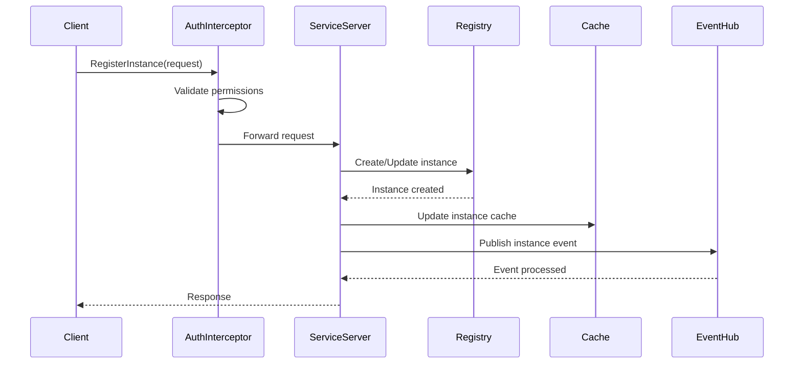
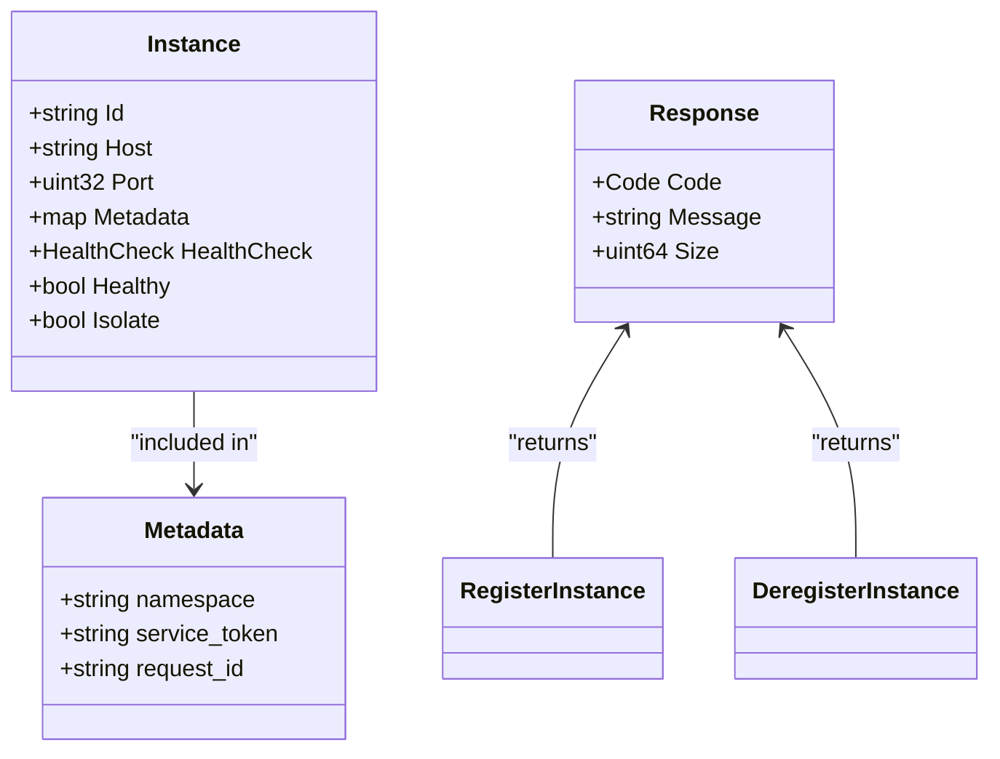
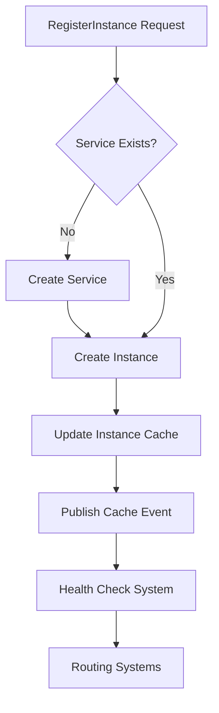
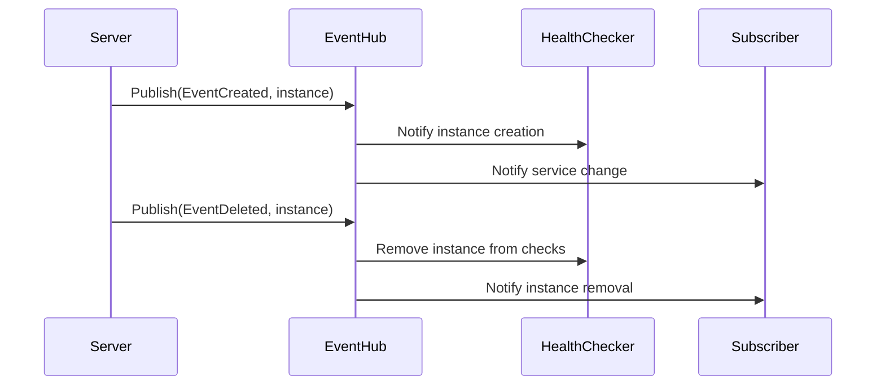

# Instance Management

<cite>
**Referenced Files in This Document**   
- [client_v1.go](file://pkg/service/client_v1.go)
- [instance.go](file://pkg/service/instance.go)
- [instance.go](file://pkg/cache/service/instance.go)
- [auth/client_v1.go](file://pkg/service/interceptor/auth/client_v1.go)
- [const.go](file://apis/pkg/types/auth/const.go)
- [register.go](file://test/integrate/grpc/register.go)
- [cache.go](file://pkg/service/healthcheck/cache.go)
- [eventhub.go](file://pkg/common/eventhub/eventhub.go)
</cite>

## Table of Contents
1. [Introduction](#introduction)
2. [Core Operations](#core-operations)
3. [Request and Response Schemas](#request-and-response-schemas)
4. [Authentication and Metadata Requirements](#authentication-and-metadata-requirements)
5. [Service Registry Interaction](#service-registry-interaction)
6. [Cache Layer Updates](#cache-layer-updates)
7. [Error Handling and Retry Strategies](#error-handling-and-retry-strategies)
8. [Transactional Behavior and Event Publishing](#transactional-behavior-and-event-publishing)
9. [Go Client Example](#go-client-example)
10. [Conclusion](#conclusion)

## Introduction
The gRPC Discovery API in pole-server provides critical instance management capabilities through the `RegisterInstance` and `DeregisterInstance` operations. These methods enable dynamic registration and removal of service instances within a distributed system, ensuring up-to-date service discovery and routing. This document details the implementation, behavior, and integration points of these operations, focusing on their interaction with the core service registry, cache layer, and event subsystem.

**Section sources**
- [client_v1.go](file://pkg/service/client_v1.go#L27-L48)

## Core Operations
The `RegisterInstance` and `DeregisterInstance` methods are exposed via the gRPC Discovery API and serve as the primary interface for managing service instance lifecycle. `RegisterInstance` creates or updates an instance in the registry, while `DeregisterInstance` removes an instance. Both operations are idempotent and support metadata-driven validation and access control.



**Diagram sources**
- [client_v1.go](file://pkg/service/client_v1.go#L41-L48)
- [instance.go](file://pkg/service/instance.go#L133-L164)

## Request and Response Schemas
The `RegisterInstance` and `DeregisterInstance` methods use the `apiservice.Instance` protobuf message as their request type. This message includes fields such as instance ID, host, port, metadata, and health check configuration. The response is a standardized `apiservice.Response` containing a code, message, and optional details. The schema enforces required fields like service ID and namespace for validation.

**Section sources**
- [client_v1.go](file://pkg/service/client_v1.go#L27-L48)

## Authentication and Metadata Requirements
Both operations require authentication via service tokens passed in metadata. The server validates the token against the namespace and service context using the authorization interceptor. Required metadata includes `namespace`, `service_token`, and `request_id`. The `RegisterInstance` operation specifically checks for `Create` permission, while `DeregisterInstance` verifies appropriate deletion rights.



**Diagram sources**
- [auth/client_v1.go](file://pkg/service/interceptor/auth/client_v1.go#L35-L64)
- [const.go](file://apis/pkg/types/auth/const.go#L32-L33)

## Service Registry Interaction
During registration, the server first ensures the target service exists by calling `createWrapServiceIfAbsent`. If the service is missing, it is created before the instance is registered. The operation supports both synchronous and asynchronous creation paths, with the latter enabling batched processing for improved throughput. Deregistration directly removes the instance from persistent storage and invalidates related cache entries.

**Section sources**
- [instance.go](file://pkg/service/instance.go#L133-L164)

## Cache Layer Updates
The instance cache in `pkg/cache/service` is updated synchronously during registration and deregistration. The `InstanceCache` component maintains mappings from instance ID to instance data and from service ID to instance collections. Upon modification, the cache updates its internal `SyncMap` structures and triggers events for downstream consumers. Cache updates are atomic and thread-safe, ensuring consistency across concurrent operations.



**Diagram sources**
- [instance.go](file://pkg/cache/service/instance.go#L439-L500)
- [instance.go](file://pkg/cache/service/instance.go#L227-L260)

## Error Handling and Retry Strategies
Common error codes include `BadRequest` for invalid input, `AlreadyExists` for duplicate instance IDs, and `InvalidToken` for authentication failures. Clients should implement exponential backoff for transient errors like `InternalError`. Idempotent retries are safe for `RegisterInstance` due to its idempotent nature. For `DeregisterInstance`, clients should handle `NotFound` gracefully as the operation is idempotent.

**Section sources**
- [client_v1.go](file://pkg/service/client_v1.go#L41-L48)
- [instance.go](file://pkg/service/instance.go#L133-L164)

## Transactional Behavior and Event Publishing
Instance registration is transactional, ensuring atomic updates to both the database and cache. Upon successful registration or deregistration, the server publishes events to the `eventhub` system. These events trigger health check cleanup for deregistered instances and notify subscribers of topology changes. The `CacheProvider` listens for `CacheInstanceEvent` and updates its internal state accordingly, ensuring health checkers reflect current instance status.



**Diagram sources**
- [cache.go](file://pkg/service/healthcheck/cache.go#L75-L105)
- [eventhub.go](file://pkg/common/eventhub/eventhub.go#L107-L152)

## Go Client Example
The following example demonstrates how to register and deregister an instance using the Go client. It shows proper construction of the `Instance` message, setting of authentication headers, and handling of responses. The client uses metadata to pass the request ID and relies on context timeouts for operation safety.

```go
func (c *Client) RegisterInstance(instance *apiservice.Instance) error {
    md := metadata.Pairs(strings.ToLower(types.HeaderRequestId), utils.NewUUID())
    ctx := metadata.NewOutgoingContext(context.Background(), md)

    ctx, cancel := context.WithTimeout(ctx, time.Second)
    defer cancel()

    rsp, err := c.Worker.RegisterInstance(ctx, instance)
    if err != nil {
        return err
    }

    return nil
}

func (c *Client) DeregisterInstance(instance *apiservice.Instance) error {
    md := metadata.Pairs(strings.ToLower(types.HeaderRequestId), utils.NewUUID())
    ctx := metadata.NewOutgoingContext(context.Background(), md)

    ctx, cancel := context.WithTimeout(ctx, 10*time.Second)
    defer cancel()

    rsp, err := c.Worker.DeregisterInstance(ctx, instance)
    if err != nil {
        return err
    }

    return nil
}
```

**Section sources**
- [register.go](file://test/integrate/grpc/register.go#L34-L73)

## Conclusion
The `RegisterInstance` and `DeregisterInstance` operations in pole-server provide robust, secure, and efficient instance management for service discovery. By integrating tightly with the service registry, cache layer, and event system, these methods ensure consistent state across the platform. Proper error handling, idempotency, and event-driven architecture make them suitable for large-scale, dynamic environments.