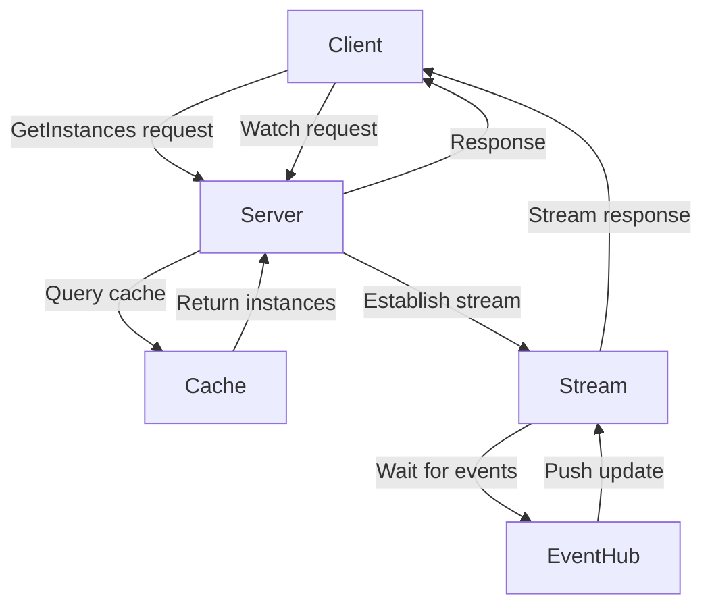
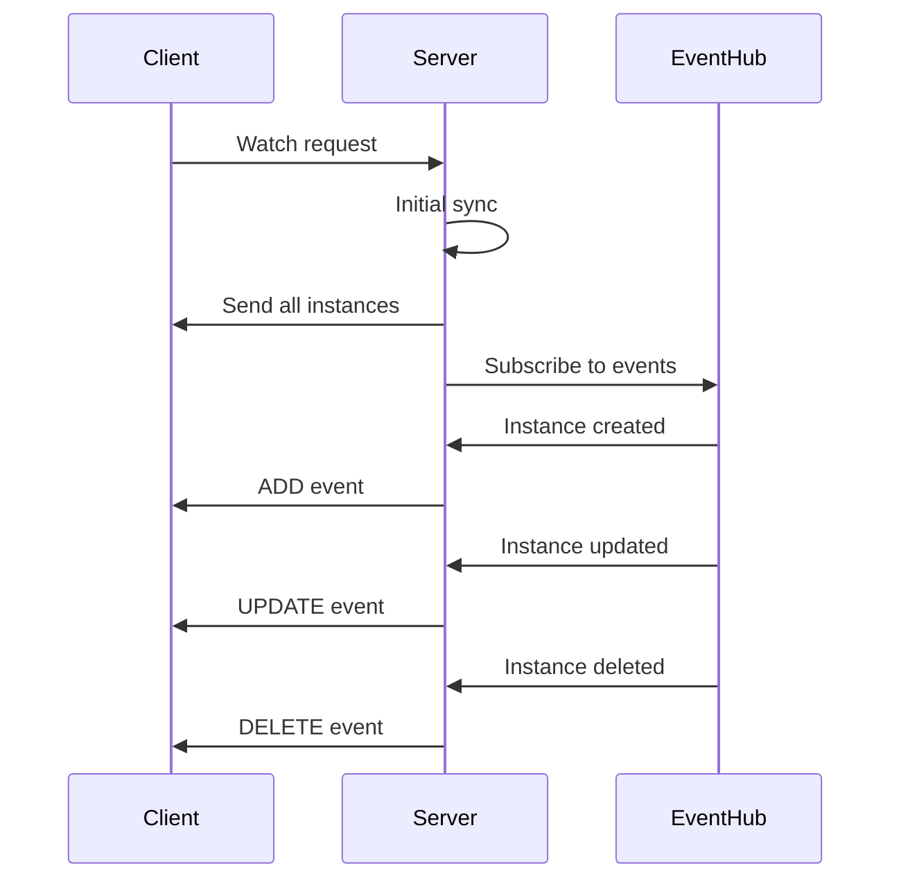
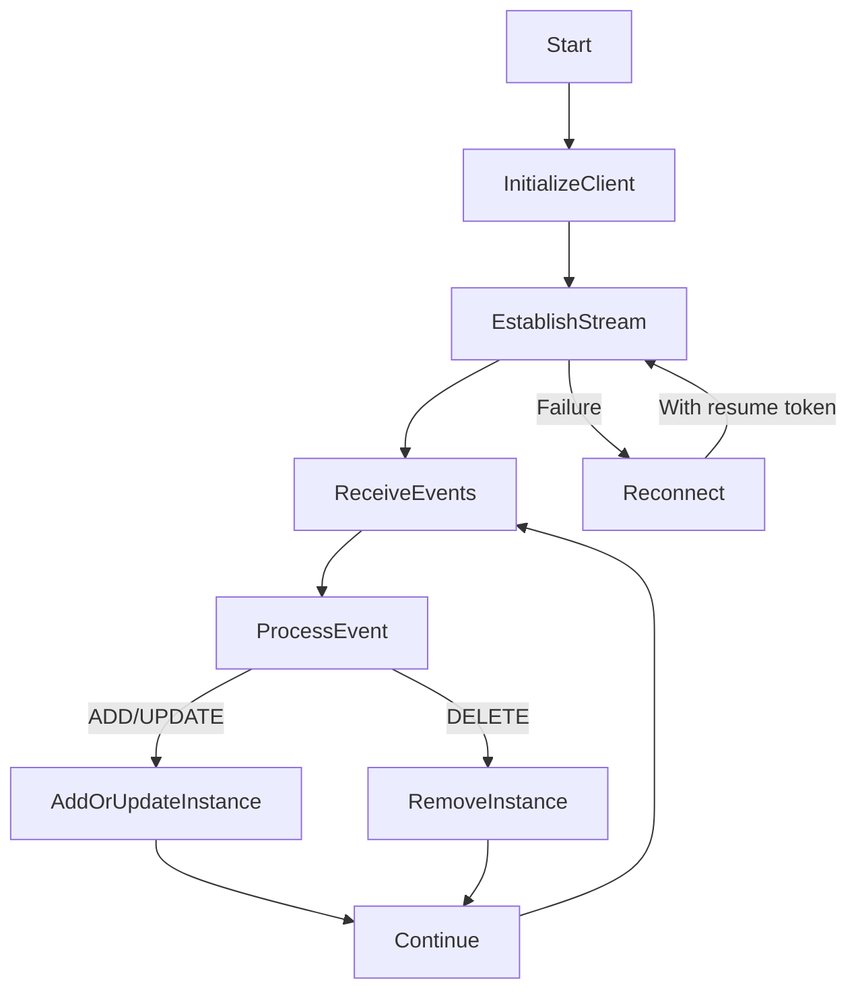

# Service Discovery

<cite>
**Referenced Files in This Document**   
- [nacos_grpc_service.proto](file://plugin/apiserver/nacosserver/v2/pb/nacos_grpc_service.proto)
- [server.go](file://plugin/apiserver/grpcserver/discover/v1/server.go)
- [server.go](file://pkg/service/server.go)
- [instance.go](file://pkg/service/instance.go)
</cite>

## Table of Contents
1. [Introduction](#introduction)
2. [Service Discovery Operations](#service-discovery-operations)
3. [Protobuf Structures](#protobuf-structures)
4. [Watch Streaming Endpoint](#watch-streaming-endpoint)
5. [EventHub System Integration](#eventhub-system-integration)
6. [Go Client Example](#go-client-example)
7. [Scalability Considerations](#scalability-considerations)

## Introduction
The pole-server provides a comprehensive service discovery mechanism through its gRPC API, enabling clients to dynamically discover and monitor service instances in a distributed environment. This documentation details the GetInstances and Watch methods, which support pull and push-based discovery patterns respectively. The system leverages efficient caching, event broadcasting, and revision-based change detection to ensure reliable and performant service discovery operations.

**Section sources**
- [server.go](file://pkg/service/server.go#L0-L132)
- [instance.go](file://pkg/service/instance.go#L0-L799)

## Service Discovery Operations

The service discovery operations in pole-server are implemented through two primary methods: GetInstances for pull-based discovery and Watch for push-based discovery. The GetInstances method allows clients to query service instances based on various filtering criteria including service name, namespace, host, port, protocol, version, health status, isolation status, weight, logic set, CMDB region, zone, IDC, priority, and metadata. The method supports pagination through offset and limit parameters and can optionally include the last heartbeat timestamp in the response.

The Watch method establishes a streaming connection that pushes incremental updates to clients whenever service instances change, eliminating the need for periodic polling. This push-based approach reduces network overhead and ensures clients receive updates with minimal latency. The server maintains client subscriptions efficiently using the eventhub system, which broadcasts changes to all interested subscribers.

**Diagram sources**
- [server.go](file://pkg/service/server.go#L0-L132)
- [instance.go](file://pkg/service/instance.go#L0-L799)

**Section sources**
- [instance.go](file://pkg/service/instance.go#L0-L799)

## Protobuf Structures

The service discovery operations use protobuf structures to define the Service and Instance responses. The Instance structure includes fields for ID, service name, namespace, VPC ID, host, port, protocol, version, priority, weight, enable health check flag, health check configuration, healthy status, isolation status, location, logic set, creation time, modification time, revision, and metadata. The metadata field supports filtering and can be used to store additional service instance attributes.

The GetInstances method supports metadata filtering through the "keys" and "values" query parameters, allowing clients to filter instances based on specific metadata key-value pairs. Subset selection is achieved through various filtering attributes such as service name, namespace, host, port, protocol, version, and health status. Revision-based change detection is implemented using the revision field in the Instance structure, which is updated whenever an instance's attributes change.

**Section sources**
- [nacos_grpc_service.proto](file://plugin/apiserver/nacosserver/v2/pb/nacos_grpc_service.proto)

## Watch Streaming Endpoint

The Watch streaming endpoint provides a persistent connection for receiving real-time updates about service instance changes. When a client establishes a watch stream, the server first performs an initial synchronization by sending all current instances that match the client's filter criteria. After the initial sync, the server pushes incremental updates (ADD, UPDATE, DELETE events) whenever service instances are created, modified, or removed.

The server implements error recovery using resume tokens, which are unique identifiers assigned to each update. If a client's connection is interrupted, it can reconnect and provide the last received resume token to resume the stream from that point, ensuring no updates are missed. This mechanism provides at-least-once delivery semantics for service discovery events.

**Diagram sources**
- [server.go](file://plugin/apiserver/grpcserver/discover/v1/server.go#L0-L68)
- [instance.go](file://pkg/service/instance.go#L0-L799)

**Section sources**
- [server.go](file://plugin/apiserver/grpcserver/discover/v1/server.go#L0-L68)
- [instance.go](file://pkg/service/instance.go#L0-L799)

## EventHub System Integration

The server leverages the eventhub system to efficiently broadcast service instance changes to all subscribed clients. When a service instance is created, updated, or deleted, the server publishes an event to the appropriate eventhub topic. The eventhub system then delivers this event to all clients that have active watch streams for the affected service.

Client subscriptions are managed efficiently using subscription contexts that track each client's filter criteria and resume token. The eventhub system uses a publish-subscribe pattern to decouple event producers from consumers, allowing for horizontal scaling of both the server and client components. This architecture ensures that service instance changes are propagated to all interested clients with minimal latency and resource overhead.

**Section sources**
- [server.go](file://pkg/service/server.go#L0-L132)
- [instance.go](file://pkg/service/instance.go#L0-L799)

## Go Client Example

The following Go client example demonstrates how to initialize a watch stream, handle ADD/UPDATE/DELETE events, and implement graceful reconnection after stream failures:

**Diagram sources**
- [server.go](file://plugin/apiserver/grpcserver/discover/v1/server.go#L0-L68)
- [instance.go](file://pkg/service/instance.go#L0-L799)

**Section sources**
- [server.go](file://plugin/apiserver/grpcserver/discover/v1/server.go#L0-L68)
- [instance.go](file://pkg/service/instance.go#L0-L799)

## Scalability Considerations

The service discovery system is designed to handle large service instance sets efficiently. The server implements watch timeout policies to prevent idle streams from consuming resources indefinitely. Streams that are inactive for a configurable period are automatically closed, and clients are expected to re-establish them if needed.

Rate limiting is applied to discovery queries to prevent abuse and ensure fair resource allocation among clients. The rate limits are configurable and can be applied at the client IP or service level. The server also employs efficient caching mechanisms to reduce database load and improve response times for frequently accessed service instances.

For very large service instance sets, the system supports pagination through the offset and limit parameters in the GetInstances method. This allows clients to retrieve instances in manageable chunks, reducing memory usage and network bandwidth. The watch stream can also be filtered to receive updates only for specific services or namespaces, further reducing the load on both server and client.

**Section sources**
- [server.go](file://pkg/service/server.go#L0-L132)
- [instance.go](file://pkg/service/instance.go#L0-L799)