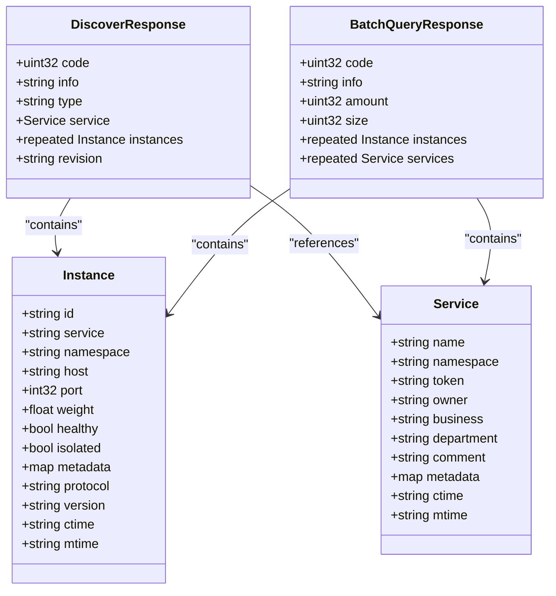
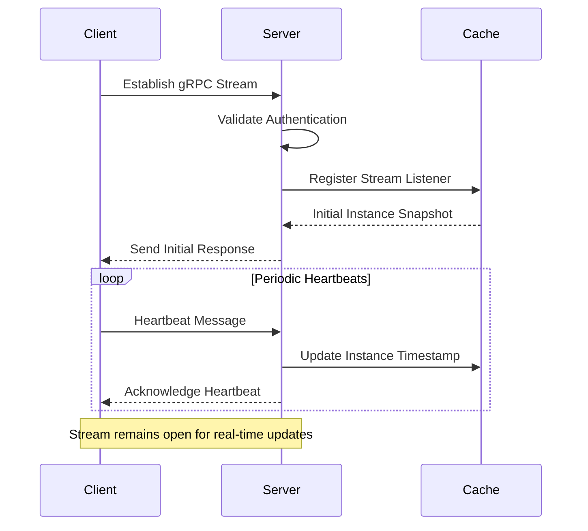
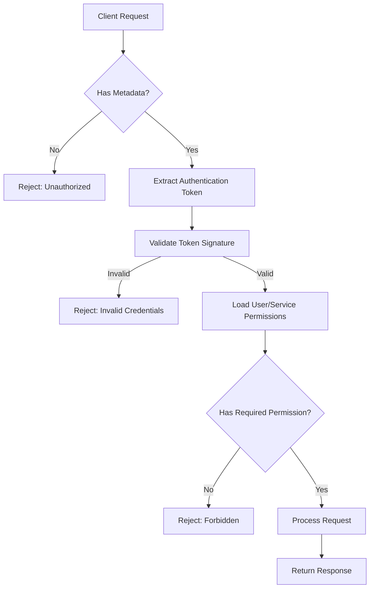
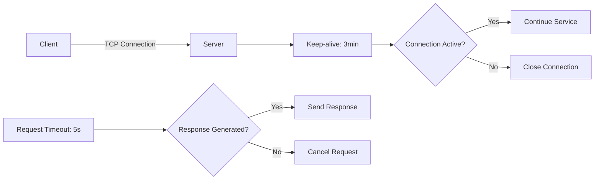

# gRPC Discovery API

<cite>
**Referenced Files in This Document**   
- [client_v1.go](file://pkg/service/client_v1.go)
- [instance.go](file://pkg/service/instance.go)
- [server.go](file://plugin/apiserver/grpcserver/discover/server.go)
- [heartbeat_access.go](file://plugin/apiserver/grpcserver/discover/v1/heartbeat_access.go)
- [auth/const.go](file://apis/pkg/types/auth/const.go)
- [paramcheck/client.go](file://pkg/service/interceptor/paramcheck/client.go)
- [auth/client_v1.go](file://pkg/service/interceptor/auth/client_v1.go)
- [config.go](file://pkg/common/conn/keepalive/keepalive.go)
- [client.go](file://test/integrate/grpc/register.go)
- [heartbeat.go](file://test/integrate/grpc/heartbeat.go)
</cite>

## Table of Contents
1. [Introduction](#introduction)
2. [Service Methods Overview](#service-methods-overview)
3. [Protobuf Message Structures](#protobuf-message-structures)
4. [Bidirectional Streaming Patterns](#bidirectional-streaming-patterns)
5. [Authentication and Access Control](#authentication-and-access-control)
6. [Client Implementation Examples](#client-implementation-examples)
7. [Rate Limiting and Performance Policies](#rate-limiting-and-performance-policies)
8. [Common Issues and Troubleshooting](#common-issues-and-troubleshooting)
9. [Conclusion](#conclusion)

## Introduction
The gRPC Discovery API in pole-server provides service registration, health monitoring, and service discovery capabilities for distributed systems. This API enables clients to register service instances, maintain liveness through heartbeat mechanisms, discover available services, and receive real-time updates via streaming watch operations. The system is designed for high availability, scalability, and secure access control.

## Service Methods Overview

The gRPC Discovery API exposes several key methods for service lifecycle management:

- **RegisterInstance**: Registers a service instance with the discovery system
- **DeregisterInstance**: Removes a registered service instance from the registry
- **Heartbeat**: Maintains instance liveness and updates health status
- **GetInstances**: Retrieves current instances for a specified service
- **Watch**: Establishes a streaming connection for real-time service updates

These methods are implemented in the gRPC server and exposed through the DiscoverServer interface.

**Section sources**
- [client_v1.go](file://pkg/service/client_v1.go#L41-L48)
- [server.go](file://plugin/apiserver/grpcserver/discover/server.go)

## Protobuf Message Structures

### Instance Message
The Instance message represents a service instance in the system, containing metadata about the service endpoint including host, port, health status, and custom metadata. The structure follows the specification defined in the service_manage API.

### Service Message
The Service message defines a logical service with attributes such as name, namespace, business context, and security token. Services act as containers for multiple instances and provide a grouping mechanism for service discovery.

### Watch Response
Watch responses are streamed to clients when service instances change. The response includes the updated service instances along with revision information to enable clients to maintain consistent state.



**Diagram sources**
- [instance.go](file://pkg/service/instance.go)
- [client_v1.go](file://pkg/service/client_v1.go)

## Bidirectional Streaming Patterns

### Heartbeat Stream Lifecycle
The heartbeat mechanism uses a bidirectional streaming pattern where clients periodically send heartbeat messages to maintain their liveness status. The server processes these heartbeats and may respond with configuration updates or service mesh instructions.

The stream lifecycle follows this pattern:
1. Client establishes gRPC stream connection
2. Client sends initial heartbeat with instance registration data
3. Server validates credentials and registers instance
4. Client sends periodic heartbeat messages (typically every 5-10 seconds)
5. Server updates instance health status and TTL
6. Stream terminates on client disconnection or error

### Watch Stream Lifecycle
The Watch service establishes a long-lived streaming connection that pushes service instance updates to clients in real-time. This enables clients to maintain an up-to-date view of available instances without polling.

Watch stream lifecycle:
1. Client initiates watch request with service identification
2. Server validates permissions and establishes stream
3. Server sends initial snapshot of current instances
4. Server pushes incremental updates when instances change
5. Stream continues until client cancellation or connection loss
6. Client should implement reconnection logic for fault tolerance



**Diagram sources**
- [heartbeat_access.go](file://plugin/apiserver/grpcserver/discover/v1/heartbeat_access.go)
- [server.go](file://plugin/apiserver/grpcserver/discover/server.go)

## Authentication and Access Control

### Metadata-Based Authentication
Authentication is enforced through metadata headers in gRPC requests. Clients must include authentication tokens in the request metadata, which are validated against the access control system before processing any discovery operations.

Key metadata headers:
- `authorization`: Contains bearer token or API key
- `request-id`: Unique identifier for request tracing
- `client-version`: Client version for compatibility checking
- `service-token`: Service-specific registration token

### Access Control Integration
The system integrates with a comprehensive access control framework that enforces permissions at the method level. Each operation is protected by specific authorization policies:

- **RegisterInstance**: Requires `RegisterInstance` permission
- **DeregisterInstance**: Requires `DeregisterInstance` permission
- **Heartbeat**: Requires service ownership or health check permission
- **GetInstances**: Requires read access to the target service namespace
- **Watch**: Requires read access and stream permission

The access control system evaluates policies based on user roles, service ownership, and resource-level permissions.



**Diagram sources**
- [auth/const.go](file://apis/pkg/types/auth/const.go)
- [auth/client_v1.go](file://pkg/service/interceptor/auth/client_v1.go)
- [paramcheck/client.go](file://pkg/service/interceptor/paramcheck/client.go)

## Client Implementation Examples

### Connection Setup
```go
// Example of establishing a gRPC connection to the discovery service
conn, err := grpc.Dial(
    serverAddress,
    grpc.WithTransportCredentials(credentials.NewTLS(&tlsConfig)),
    grpc.WithPerRPCCredentials(oauthToken),
)
if err != nil {
    log.Fatalf("failed to connect: %v", err)
}
defer conn.Close()

client := apiservice.NewDiscoverClient(conn)
```

### Stream Initialization
```go
// Initialize heartbeat stream
stream, err := client.Heartbeat(context.Background())
if err != nil {
    return err
}

// Send initial registration
if err := stream.Send(instance); err != nil {
    return err
}
```

### Handling Stream Interruptions
```go
// Robust stream handling with reconnection logic
for {
    stream, err := client.Watch(context.Background(), watchRequest)
    if err != nil {
        time.Sleep(reconnectDelay)
        continue
    }

    // Process stream messages
    for {
        resp, err := stream.Recv()
        if err != nil {
            break // Will trigger reconnection
        }
        processWatchResponse(resp)
    }
    
    time.Sleep(reconnectDelay)
}
```

**Section sources**
- [client.go](file://test/integrate/grpc/register.go)
- [heartbeat.go](file://test/integrate/grpc/heartbeat.go)

## Rate Limiting and Performance Policies

### Rate Limiting Behavior
The discovery endpoints implement rate limiting to prevent abuse and ensure system stability:

- **RegisterInstance**: Limited to 100 requests per minute per service
- **Heartbeat**: Limited to 1 request every 5 seconds per instance
- **GetInstances**: Limited to 200 requests per minute per client
- **Watch**: Limited to 10 concurrent streams per client

Rate limits are enforced at the API gateway level and integrated with the distributed rate limiting system.

### Timeout Policies
The system implements strict timeout policies to prevent resource exhaustion:

- **Request Timeout**: 5 seconds for unary RPCs
- **Stream Timeout**: 30 seconds for initial stream establishment
- **Idle Timeout**: 5 minutes for inactive streams
- **Keep-alive**: 3 minute interval for connection health checking

### Keep-alive Configurations
The server configures TCP keep-alive to maintain connection health:

- **Keep-alive Period**: 3 minutes (default)
- **Connection Timeout**: 30 seconds
- **Max Connection Age**: 30 minutes
- **Max Connection Age Grace**: 5 minutes

These settings ensure that stale connections are cleaned up efficiently while maintaining good performance for active clients.



**Diagram sources**
- [config.go](file://pkg/common/conn/keepalive/keepalive.go)
- [server.go](file://plugin/apiserver/grpcserver/discover/server.go)

## Common Issues and Troubleshooting

### Stream Resets
Stream resets can occur due to network instability, server restarts, or authentication expiration. Clients should implement exponential backoff reconnection strategies with jitter to avoid thundering herd problems.

### Large Payload Handling
When dealing with services that have many instances, responses can become large. The system supports pagination through offset and limit parameters in GetInstances requests. Clients should handle large payloads by processing instances in batches.

### Version Compatibility
The API maintains backward compatibility through proper versioning practices. Clients should include their version in metadata to allow the server to provide appropriate responses. Breaking changes are introduced only in major version increments with adequate deprecation periods.

### Best Practices for Production Use
- Implement circuit breakers for discovery operations
- Cache service instances locally with appropriate TTL
- Use connection pooling for multiple discovery operations
- Monitor stream health and implement graceful reconnection
- Handle rate limiting responses with proper retry logic
- Validate service instance health before routing traffic

**Section sources**
- [instance.go](file://pkg/service/instance.go)
- [server.go](file://plugin/apiserver/grpcserver/discover/server.go)

## Conclusion
The gRPC Discovery API in pole-server provides a robust foundation for service discovery in distributed systems. By leveraging gRPC's streaming capabilities, the API enables real-time service updates and efficient heartbeat mechanisms. The integration with authentication and rate limiting systems ensures secure and stable operation at scale. Proper client implementation with appropriate error handling and reconnection logic is essential for building resilient distributed applications.