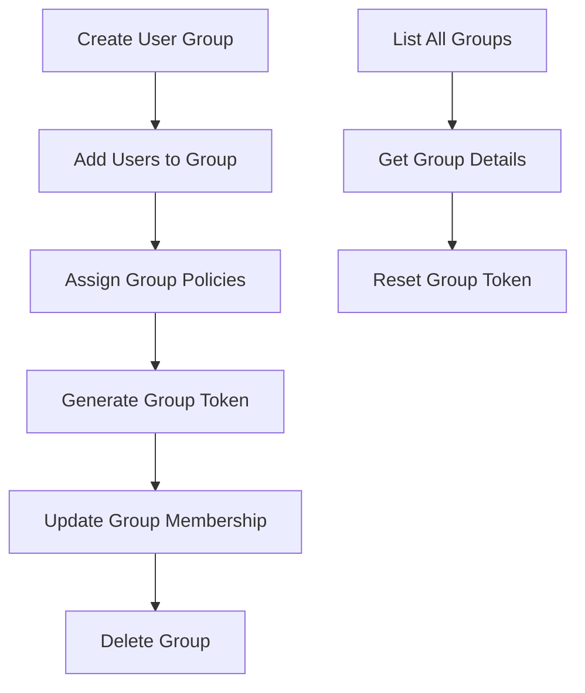
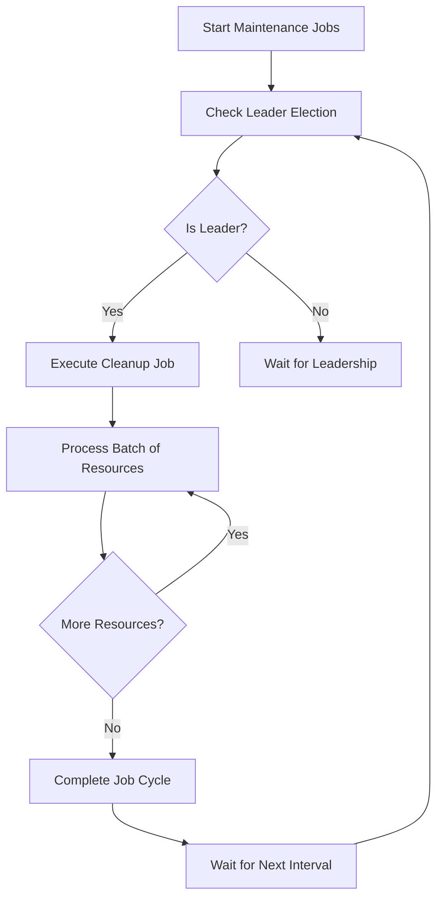
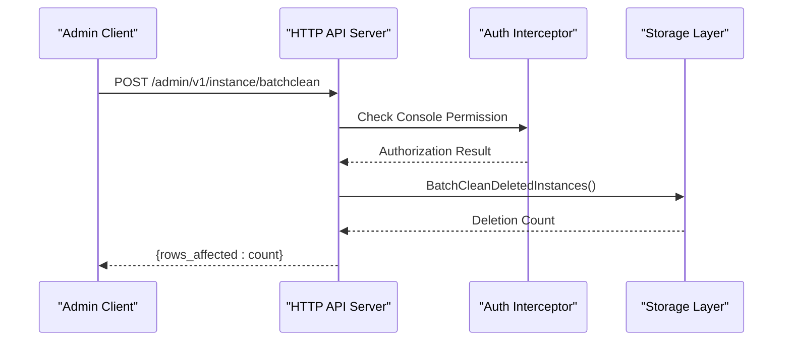

# Administration

<cite>
**Referenced Files in This Document**   
- [admin_api.go](file://apis/store/admin_api.go)
- [admin.go](file://pkg/admin/api.go)
- [default.go](file://pkg/admin/default.go)
- [server.go](file://pkg/admin/interceptor/auth/server.go)
- [register.go](file://pkg/admin/interceptor/register.go)
- [delete_unhealthy_instance.go](file://pkg/admin/job/delete_unhealthy_instance.go)
- [clean_deleted_resource.go](file://pkg/admin/job/clean_deleted_resource.go)
- [job.go](file://pkg/admin/job/job.go)
- [admin_access.go](file://plugin/apiserver/httpserver/admin_access.go)
- [group_access.go](file://plugin/apiserver/httpserver/auth/group_access.go)
- [user.go](file://plugin/access_control/auth/user/group.go)
- [self_checker.go](file://bootstrap/self_checker.go)
- [history_db.go](file://plugin/observability/history/rds/history_db.go)
</cite>

## Table of Contents
1. [Namespace Management for Multi-Tenancy and Isolation](#namespace-management-for-multi-tenancy-and-isolation)
2. [User and Group Management via Admin APIs](#user-and-group-management-via-admin-apis)
3. [System Maintenance Tasks](#system-maintenance-tasks)
4. [Background Jobs for Resource Cleanup](#background-jobs-for-resource-cleanup)
5. [Server Health Checks and Self-Diagnostics](#server-health-checks-and-self-diagnostics)
6. [Administrative Operations via HTTP API and CLI](#administrative-operations-via-http-api-and-cli)
7. [Backup, Recovery, and Disaster Recovery](#backup-recovery-and-disaster-recovery)
8. [Upgrade Considerations and Production Best Practices](#upgrade-considerations-and-production-best-practices)

## Namespace Management for Multi-Tenancy and Isolation

The system supports multi-tenancy through namespace-based isolation, allowing different teams or environments to operate independently within the same infrastructure. Namespaces provide logical separation of services, configurations, and policies, ensuring that resources in one namespace do not interfere with those in another. This isolation extends to service discovery, configuration management, and access control, enabling secure and scalable multi-tenant deployments.

Namespace management is handled through dedicated administrative interfaces that allow creation, modification, and deletion of namespaces. Each namespace can have its own set of policies, including rate limiting, circuit breaking, and routing rules, which are enforced consistently across all services within that namespace. The system ensures that cross-namespace communication is explicitly configured and authorized, maintaining strict boundaries between tenants.

**Section sources**
- [admin.go](file://pkg/admin/api.go#L30-L54)
- [default.go](file://pkg/admin/default.go#L39-L81)

## User and Group Management via Admin APIs

User and group management is provided through a comprehensive set of administrative APIs that enable creation, modification, and deletion of users and user groups. The system supports hierarchical organization of users through groups, allowing administrators to manage permissions and access control at scale. User groups can be assigned specific roles and policies, which are inherited by all members of the group.

The admin API provides endpoints for creating and managing user groups, including adding or removing users from groups, updating group metadata, and managing group tokens for programmatic access. Group operations are logged and audited through the system's history tracking mechanism, providing a complete record of changes for compliance and troubleshooting purposes.

**Diagram sources**
- [group_access.go](file://plugin/apiserver/httpserver/auth/group_access.go#L32-L63)
- [user.go](file://plugin/access_control/auth/user/group.go#L32-L64)

**Section sources**
- [group_access.go](file://plugin/apiserver/httpserver/auth/group_access.go#L32-L63)
- [user.go](file://plugin/access_control/auth/user/group.go#L32-L64)

## System Maintenance Tasks

The system provides a suite of maintenance operations accessible through the admin interface, including connection management, memory optimization, and log level control. These operations enable administrators to monitor and optimize system performance, troubleshoot issues, and maintain service health.

Key maintenance capabilities include retrieving server connection statistics, closing connections by IP address, and freeing OS memory to alleviate memory pressure. The system also provides detailed logging controls, allowing administrators to dynamically adjust log output levels for different components without restarting services. This enables fine-grained control over logging verbosity for debugging and monitoring purposes.

**Section sources**
- [admin.go](file://pkg/admin/api.go#L30-L54)
- [admin_access.go](file://plugin/apiserver/httpserver/admin_access.go#L59-L77)

## Background Jobs for Resource Cleanup

The system employs automated background jobs to maintain data integrity and optimize storage usage. These jobs run periodically to clean up various types of stale or deleted resources, preventing accumulation of obsolete data that could impact performance and storage efficiency.

The cleanup jobs include:
- **Unhealthy instance deletion**: Removes service instances that have not reported heartbeats within a configurable timeout period
- **Deleted resource cleanup**: Processes soft-deleted resources such as services, instances, clients, and configuration files in batches
- **Configuration release history cleanup**: Maintains configuration history within defined retention periods
- **Empty service deletion**: Removes services that no longer have any instances registered

These jobs are designed to run efficiently with minimal impact on system performance, processing resources in configurable batch sizes and respecting transaction boundaries to ensure data consistency.

**Diagram sources**
- [job.go](file://pkg/admin/job/job.go#L42-L66)
- [delete_unhealthy_instance.go](file://pkg/admin/job/delete_unhealthy_instance.go#L42-L84)
- [clean_deleted_resource.go](file://pkg/admin/job/clean_deleted_resource.go#L194-L238)

**Section sources**
- [job.go](file://pkg/admin/job/job.go#L42-L66)
- [delete_unhealthy_instance.go](file://pkg/admin/job/delete_unhealthy_instance.go#L42-L84)
- [clean_deleted_resource.go](file://pkg/admin/job/clean_deleted_resource.go#L194-L238)

## Server Health Checks and Self-Diagnostics

The system includes comprehensive health checking and self-diagnostic capabilities to ensure service reliability and availability. Health checks are performed on service instances to verify their operational status, with configurable check types and intervals. The system distinguishes between client-reported heartbeats and active health probes, providing multiple mechanisms for monitoring service health.

Self-diagnostics are implemented through a leader election mechanism where one server instance assumes responsibility for monitoring the health of self-managed service instances. The leader performs periodic health checks and updates instance status in the database, ensuring that unhealthy instances are promptly identified and handled. The system also provides diagnostic endpoints for checking server connections, retrieving heartbeat information, and examining leader election status.

**Section sources**
- [delete_unhealthy_instance.go](file://pkg/admin/job/delete_unhealthy_instance.go#L81-L108)
- [self_checker.go](file://bootstrap/self_checker.go#L41-L77)

## Administrative Operations via HTTP API and CLI

Administrative functions are exposed through a RESTful HTTP API that supports a wide range of operations for system management. The API follows consistent patterns for request/response handling and error reporting, making it easy to integrate with automation tools and custom scripts.

Key administrative endpoints include:
- `/admin/v1/apiserver/conn` - Retrieve server connection statistics
- `/admin/v1/instance/clean` - Clean deleted instances
- `/admin/v1/instance/batchclean` - Batch clean deleted instances
- `/admin/v1/log/outputlevel` - Get or set log output levels
- `/admin/v1/leaders` - List leader election results
- `/admin/v1/mainuser/create` - Initialize the main user account

The API supports both individual operations and batch processing, allowing efficient management of large numbers of resources. Authentication and authorization are enforced for all administrative endpoints, ensuring that only authorized users can perform sensitive operations.

**Diagram sources**
- [admin_access.go](file://plugin/apiserver/httpserver/admin_access.go#L162-L202)
- [server.go](file://pkg/admin/interceptor/auth/server.go#L34-L76)

**Section sources**
- [admin_access.go](file://plugin/apiserver/httpserver/admin_access.go#L162-L202)
- [server.go](file://pkg/admin/interceptor/auth/server.go#L34-L76)

## Backup, Recovery, and Disaster Recovery

The system provides mechanisms for operation history tracking and data consistency that support backup and recovery scenarios. Operation history is stored in a partitioned database table that records all administrative actions, including resource creation, modification, and deletion. This audit trail enables reconstruction of system state at any point in time and supports compliance requirements.

The history storage system automatically manages table partitions by month, ensuring efficient querying and maintenance of historical data. A background process updates monthly partitions to prevent write failures and maintain optimal performance. While the current implementation focuses on operation auditing, this foundation can be extended to support comprehensive backup and recovery procedures.

For disaster recovery, the system's distributed architecture and leader election mechanisms ensure high availability. In the event of node failures, leadership can be transferred to healthy instances, maintaining service continuity. Configuration and service data are stored in a durable database, allowing recovery of system state after outages.

**Section sources**
- [history_db.go](file://plugin/observability/history/rds/history_db.go#L85-L180)

## Upgrade Considerations and Production Best Practices

When upgrading the system, administrators should consider the impact on running background jobs and ensure compatibility between different versions. The job scheduling system supports configuration of job intervals and enables/disables jobs independently, allowing controlled rollout of changes.

Production best practices include:
- Monitoring the execution of background cleanup jobs to ensure they complete within expected timeframes
- Regularly reviewing log output levels to balance diagnostic information with storage requirements
- Ensuring sufficient resources for leader election and health checking operations
- Configuring appropriate timeouts for unhealthy instance detection based on service characteristics
- Implementing monitoring for maintenance job execution and resource cleanup progress

The system's modular architecture allows components to be updated independently, minimizing downtime during upgrades. The use of feature flags and gradual rollout strategies is recommended when introducing changes to production environments.

**Section sources**
- [job.go](file://pkg/admin/job/job.go#L68-L117)
- [default.go](file://pkg/admin/default.go#L39-L81)