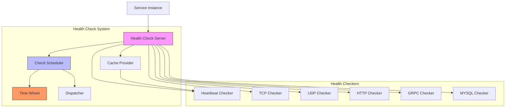
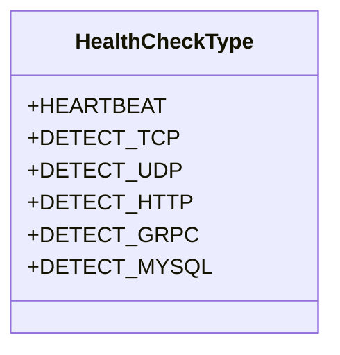
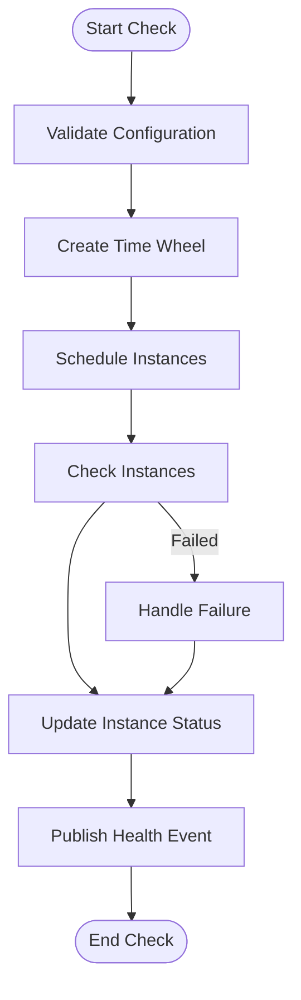
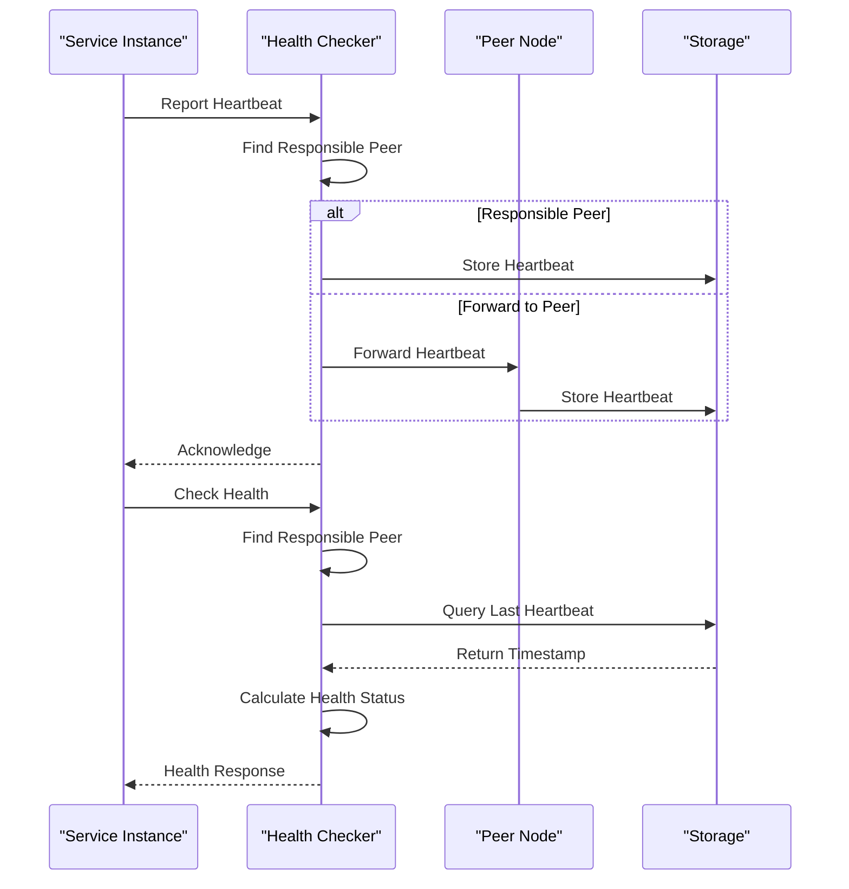
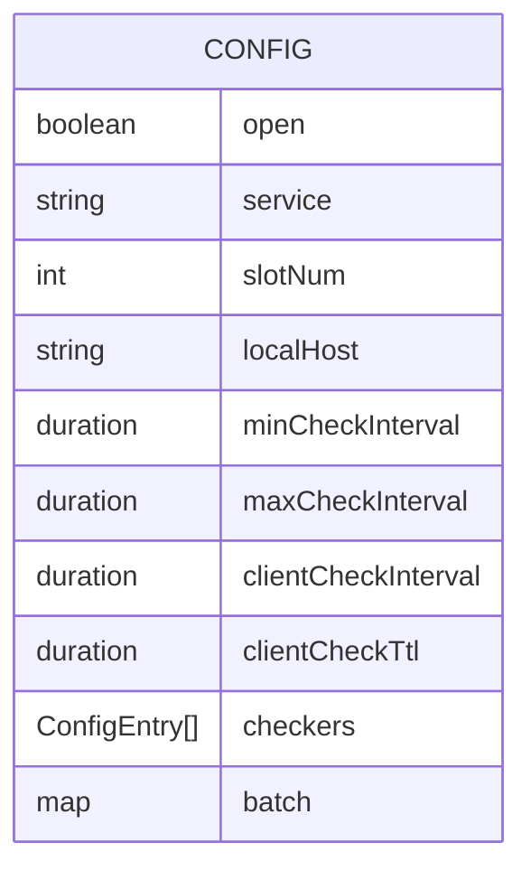
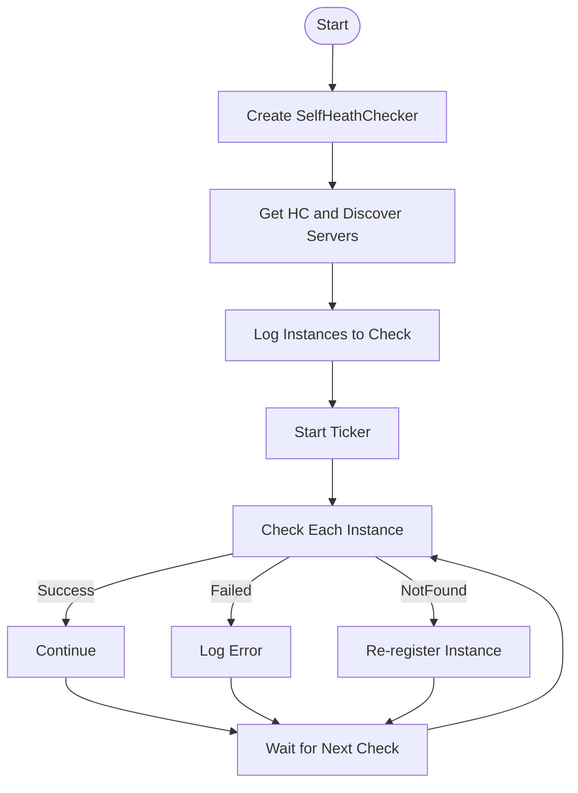
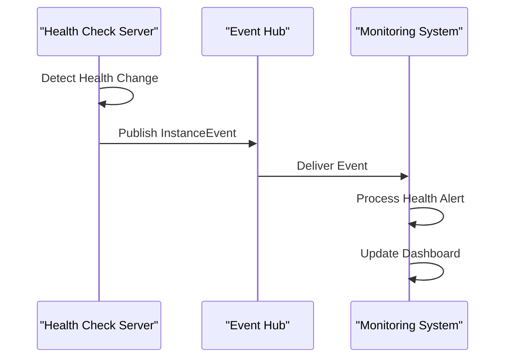
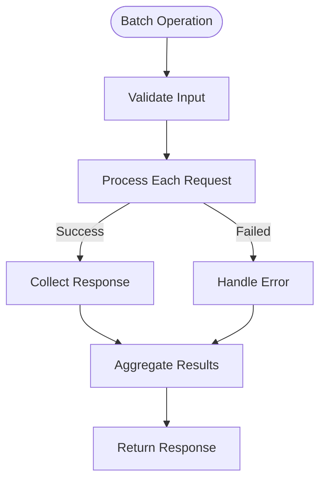

# Health Checks and Self-Diagnostics

<cite>
**Referenced Files in This Document**   
- [healthchecker.go](file://apis/service/healthcheck/healthchecker.go)
- [server.go](file://pkg/service/healthcheck/server.go)
- [check.go](file://pkg/service/healthcheck/check.go)
- [config.go](file://pkg/service/healthcheck/config.go)
- [beat_checker.go](file://plugin/service/healthchecker/heartbeat/beat_checker.go)
- [self_checker.go](file://bootstrap/self_checker.go)
- [server.go](file://bootstrap/server.go)
</cite>

## Table of Contents
1. [Introduction](#introduction)
2. [Health Check Architecture](#health-check-architecture)
3. [Core Components](#core-components)
4. [Liveness, Readiness, and Startup Probes](#liveness-readiness-and-startup-probes)
5. [Health Check Implementation](#health-check-implementation)
6. [Probe Configuration and Thresholds](#probe-configuration-and-thresholds)
7. [Self-Diagnostics and System Health](#self-diagnostics-and-system-health)
8. [Monitoring Integration](#monitoring-integration)
9. [Troubleshooting Guide](#troubleshooting-guide)

## Introduction
The health check and self-diagnostics system in the Pole server provides comprehensive monitoring capabilities for service availability, instance health, and system integrity. This document details the implementation of health checks, including built-in endpoints, probe types, configuration options, and integration with orchestration systems. The system ensures high availability by continuously monitoring service instances and automatically handling unhealthy states.

## Health Check Architecture

**Diagram sources**
- [server.go](file://pkg/service/healthcheck/server.go#L20-L50)
- [check.go](file://pkg/service/healthcheck/check.go#L50-L80)

**Section sources**
- [server.go](file://pkg/service/healthcheck/server.go#L1-L100)
- [check.go](file://pkg/service/healthcheck/check.go#L1-L100)

## Core Components

The health check system consists of several core components that work together to monitor service health:

- **HealthChecker Interface**: Defines the contract for health check plugins with methods for reporting, checking, and querying health status
- **CheckScheduler**: Manages the scheduling of health checks using a time wheel algorithm
- **Server**: Central health check server that coordinates all health check operations
- **HeartBeatHealthChecker**: Implementation for heartbeat-based health checks
- **SelfHeathChecker**: Monitors the health of the server itself

These components work together to provide a robust health monitoring system that can handle various health check types and scale to large deployments.

**Section sources**
- [healthchecker.go](file://apis/service/healthcheck/healthchecker.go#L1-L144)
- [server.go](file://pkg/service/healthcheck/server.go#L1-L100)
- [check.go](file://pkg/service/healthcheck/check.go#L1-L100)

## Liveness, Readiness, and Startup Probes

The system implements three types of health probes to ensure proper service lifecycle management:

### Liveness Probes
Liveness probes determine if the application is running correctly. If a liveness probe fails, the system will restart the container. The heartbeat checker implements liveness checks by verifying that instances are sending regular heartbeat signals.

### Readiness Probes
Readiness probes determine if the application is ready to accept traffic. An instance is considered ready when it has passed initial health checks and is able to serve requests. The system uses the Check method to verify instance readiness.

### Startup Probes
Startup probes determine if the application has started successfully. During startup, the system temporarily suspends health checks to allow the application to initialize. The Suspend method in the HealthChecker interface supports this functionality.

The differentiation between these probe types allows for proper handling of application states during startup, normal operation, and failure scenarios.

**Section sources**
- [healthchecker.go](file://apis/service/healthcheck/healthchecker.go#L50-L100)
- [beat_checker.go](file://plugin/service/healthchecker/heartbeat/beat_checker.go#L200-L250)

## Health Check Implementation

### Health Check Types
The system supports multiple health check types through the HealthCheckType enum:

**Diagram sources**
- [healthchecker.go](file://apis/service/healthcheck/healthchecker.go#L40-L50)

### Check Scheduling
The CheckScheduler uses a time wheel algorithm to efficiently manage health check scheduling:

**Diagram sources**
- [check.go](file://pkg/service/healthcheck/check.go#L100-L200)

### Heartbeat Implementation
The HeartBeatHealthChecker implements distributed health checking using a consistent hashing algorithm to distribute responsibility among checker nodes:

**Diagram sources**
- [beat_checker.go](file://plugin/service/healthchecker/heartbeat/beat_checker.go#L150-L300)

**Section sources**
- [beat_checker.go](file://plugin/service/healthchecker/heartbeat/beat_checker.go#L1-L420)
- [check.go](file://pkg/service/healthcheck/check.go#L1-L100)

## Probe Configuration and Thresholds

### Configuration Options
The health check system is configured through the Config struct, which provides various parameters for tuning health check behavior:

**Diagram sources**
- [config.go](file://pkg/service/healthcheck/config.go#L10-L50)

### Default Values
The system provides sensible defaults for health check parameters:

- **Open**: true (health checks enabled by default)
- **Service**: "pole.checker" (default service name)
- **SlotNum**: 30 (time wheel slots)
- **MinCheckInterval**: 1 second (minimum check interval)
- **MaxCheckInterval**: 30 seconds (maximum check interval)
- **ClientCheckInterval**: 120 seconds (client check interval)
- **ClientCheckTtl**: 120 seconds (client time-to-live)

These defaults can be overridden in the configuration file to suit specific deployment requirements.

### Timeout and Threshold Configuration
The system allows configuration of various timeouts and thresholds:

- **MinCheckInterval**: Minimum time between health checks for healthy instances
- **MaxCheckInterval**: Maximum time between health checks for unhealthy instances
- **ClientCheckInterval**: Interval for checking client health
- **ClientCheckTtl**: Time-to-live for client health status

These parameters can be adjusted based on the specific requirements of different deployment scenarios, such as development, staging, and production environments.

**Section sources**
- [config.go](file://pkg/service/healthcheck/config.go#L1-L84)
- [server.go](file://pkg/service/healthcheck/server.go#L1-L50)

## Self-Diagnostics and System Health

### Self-Health Checker
The SelfHeathChecker monitors the health of the server itself by periodically reporting heartbeats for its own instances:

**Diagram sources**
- [self_checker.go](file://bootstrap/self_checker.go#L30-L80)

### Server Bootstrap Health
During server startup, the system performs self-diagnostics as part of the bootstrap process:

1. Load configuration from file
2. Initialize logging system
3. Acquire local IP address
4. Set default port information
5. Initialize metrics and event hub
6. Set plugin configuration
7. Initialize storage layer
8. Start components (cache, auth, namespace, etc.)
9. Register server instances
10. Start health checker

This comprehensive startup sequence ensures that all system components are properly initialized before the server begins accepting requests.

**Section sources**
- [self_checker.go](file://bootstrap/self_checker.go#L1-L107)
- [server.go](file://bootstrap/server.go#L1-L100)

## Monitoring Integration

### Event Publishing
The health check system integrates with the event hub to publish health events:

**Diagram sources**
- [server.go](file://pkg/service/healthcheck/server.go#L200-L220)

### Batch Operations
The system supports batch operations for efficient handling of multiple instances:

**Diagram sources**
- [check.go](file://pkg/service/healthcheck/check.go#L300-L350)

The integration with monitoring systems allows for real-time visibility into service health and enables automated responses to health issues.

**Section sources**
- [server.go](file://pkg/service/healthcheck/server.go#L150-L200)
- [check.go](file://pkg/service/healthcheck/check.go#L250-L300)

## Troubleshooting Guide

### Common Issues and Solutions

**Issue**: Health checks failing for valid instances
- **Cause**: Network connectivity issues or incorrect configuration
- **Solution**: Verify network connectivity and check configuration parameters

**Issue**: High CPU usage during health checks
- **Cause**: Too frequent health checks or large number of instances
- **Solution**: Adjust MinCheckInterval and MaxCheckInterval parameters

**Issue**: Instances being marked as unhealthy incorrectly
- **Cause**: Clock drift between nodes or network latency
- **Solution**: Ensure time synchronization across nodes and adjust TTL values

**Issue**: Self-health checker not functioning
- **Cause**: Server registration failed or configuration error
- **Solution**: Verify server registration and check SelfServiceInstance configuration

### Diagnostic Commands
The system provides several diagnostic capabilities:

- **GetLastHeartbeat**: Retrieve the last heartbeat timestamp for an instance
- **ListCheckerServer**: List all checker server instances
- **CacheProvider**: Access cache provider for debugging

These commands can be used to diagnose health check issues and verify system status.

**Section sources**
- [server.go](file://pkg/service/healthcheck/server.go#L250-L300)
- [self_checker.go](file://bootstrap/self_checker.go#L50-L100)